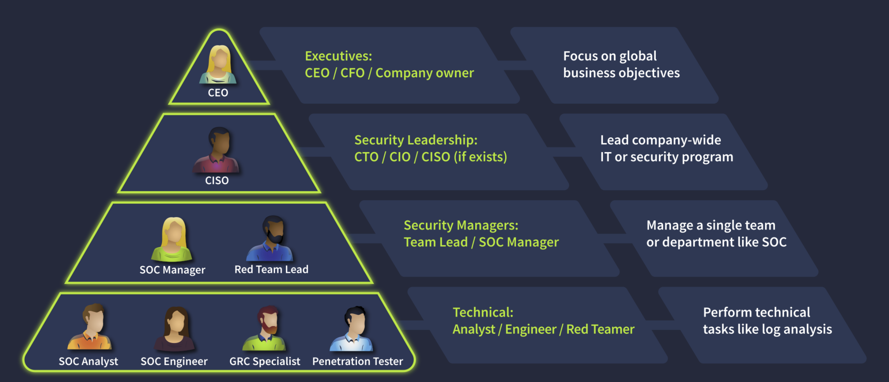
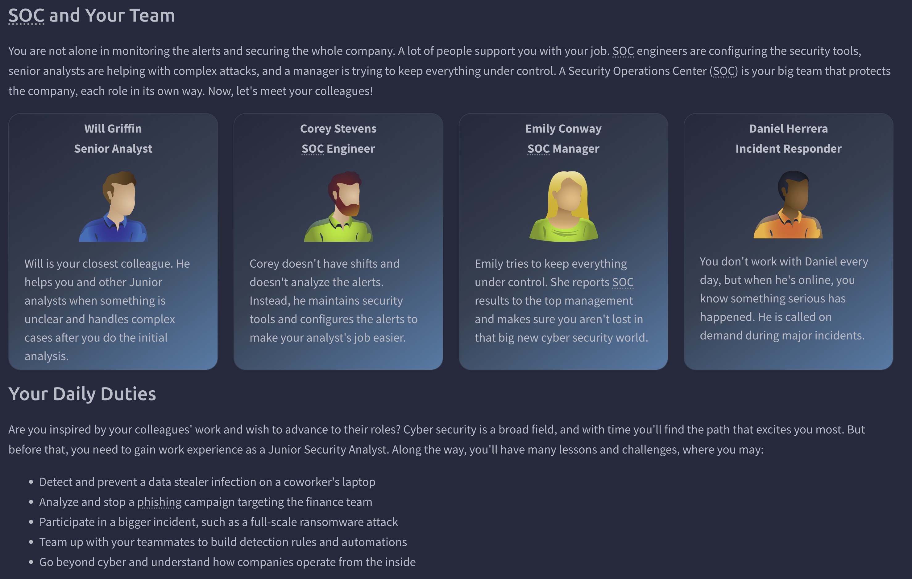
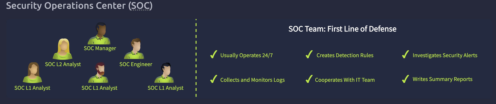

# Room 02 — SOC Role in Blue Team

## Objective
This room focuses on the structure of a security team, the roles within a SOC, and how different teams interact to defend an organization.

---

## Key Concepts
- Purpose of the Blue Team (defensive security)
- How SOC fits into the overall company structure
- Different SOC roles and responsibilities (Tier 1, 2, 3)
- How security teams collaborate (SOC, GRC, Red Team)

---

## Blue Team Structure
- Blue Team — Defensive security: analysts, engineers, and incident responders
- GRC Team — Manages policies and ensures regulatory compliance
- Red Team — Offensive security experts who simulate attacks

---

## SOC Roles Breakdown

### Tier 1 Analyst (Junior)
- Monitor and triage alerts
- Escalate suspicious activity to Tier 2

### Tier 2 Analyst
- Perform a deeper investigation of confirmed threats
- Analyze logs, systems, and attack behavior.

### Tier 3 / Threat Hunter
- Proactively search for hidden threats
- Research attacker techniques and patterns

### SOC Engineer
- Build and maintain detection tools (SIEM, EDR)
- Tune alerts and improve detection rules

### CERT Lead
- Leads immediate response during active incidents (ransomware, breaches)
- Coordinates containment and recovery actions

### GRC Auditor
- Manages compliance with regulations such as PCI DSS
- Ensures security policies are documented and followed

---

## Investigation Mindset (Team Perspective)
- Understand my role and when to escalate
- Do not try to solve everything myself - collaborate
- Trust the process > Tier 1 > Tier 2 > Tier 3
- Focus on accurate triage, not deep investigation at Tier 1
- Clear communication is critical between teams

---

## SOC Workflow (Team Flow)
1. Alert is generated (SIEM/EDR)
2. Tier 1 analyst triages the alert
3. If suspicious > Escalate to Tier 2
4. Tier 2 performs deeper investigation
5. If confirmed threat > escalate to Tier 3 / Incident Response Team
   

---

## Commands & Tools

| Command / Tool | What It Did |
|----------------|-------------|

---

## Screenshots
<!--  -->

---

## Flags

| Task | Flag |
|------|------|
| Seven security tasks — assign the right people | THM{trysecureme_is_secured!} |

---

## What Stood Out
- Not every organization runs its own SOC — many rely on an MSSP (Managed Security Services Provider) for outsourced security. Working at an MSSP is high-pressure but a strong career accelerator.

---

## Detection Takeaways
- Tier 1 identifies suspicious patterns
- Tier 2 validates and investigates confirmed threats 
- Detection relies on correct escalation between roles

---

## What Confused Me & How I Resolved It
I initially struggled to distinguish between CERT Lead, SOC Engineer, and GRC Auditor. Here is how I resolved it:
<!-- Fill in your resolution here -->
SOC Engineer builds and maintains the tools. CERT Lead activates 
during an active incident. GRC Auditor ensures the organization 
stays compliant with regulations. Different lanes, different triggers.
---

## What I Learned
<!-- Deeper than your raw notes — what did this room change about how you see the SOC? -->
This room showed me how a SOC operates as a team, where each role has a specific responsibility. Effective security depends on clear escalation, communication, and division of tasks.

---

## Skills Practiced
- Identifying correct escalation paths
- Understand SOC role responsibilities
- Recognizing team-based investigation workflow

---

*Write-up by [Miyu7x](https://github.com/Miyu7x) | TryHackMe: Miyu7*
