# Room — SOC L1 Alert Triage

## Objective

<!-- What is this room teaching about handling and investigating alerts? -->
Alert triage is a core function of a Security Operations Center (SOC). It enables analysts to efficiently identify, investigate, and respond to potential security incidents, reducing organizational risk and preventing security breaches.

---

## Task 1 — Introduction

<!-- Room context, scope, and what you are expected to learn -->
- Explore alerts: alert fields, severity, status and classification
- How to properly triage an alert as a L1 analyst
- Use the Security Information and Event Management(SIEM) tryhackme's Dashboard.

---

## Task 2 — Events and Alerts

### Key Concepts

<!-- Core distinction between events and alerts in a SOC context -->
- An event is any process launched by the user, the users OS, firewall or cloud provider logs the event. These events are then sent to a security solution such as : Security Information and Event Management(SIEM) or Endpoint Detection and Response(EDR).

**Alert Management Platforms**
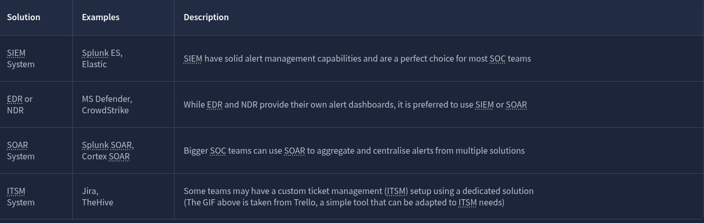

### Events vs Alerts

| Term  | Definition                                                                                          | SOC Relevance                                                                                        |
| ----- | --------------------------------------------------------------------------------------------------- | ---------------------------------------------------------------------------------------------------- |
| Event | Any task performed by a user on their device, such as login, open an app or a download.             | There can be thousands of events happening at once, if you work at a company when everybody logs in. |
| Alert | A Notification triggered by a certain suspicious event generated by a security management platform. | Helps SOC not to have to manually scan through logs for every event.                                 |

### Task Questions
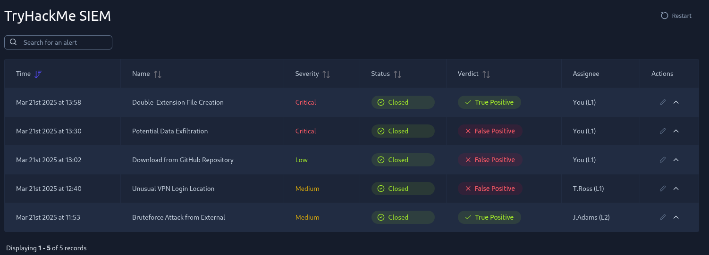

<!-- Q: -->
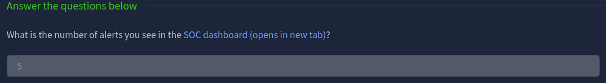

Answer: 5

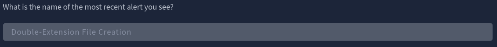

Answer: Double-Extension File Creation
<!-- A: -->

---

## Task 3 — Alert Properties

### Key Concepts

<!-- What fields and metadata define an alert? -->
Alert Properties is how SOC analysts read the alerts coming in from their SIEM or designated security solution. 

### Alert Properties Reference
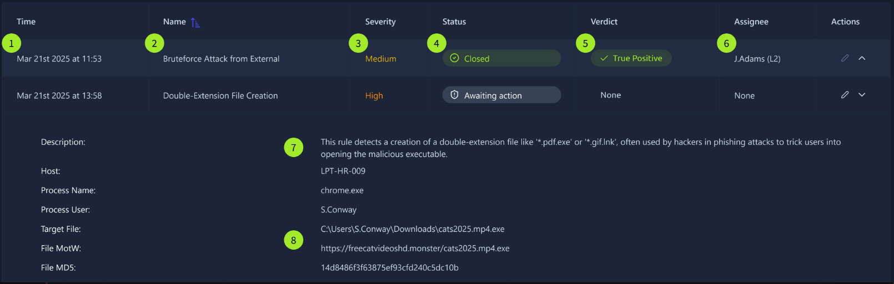

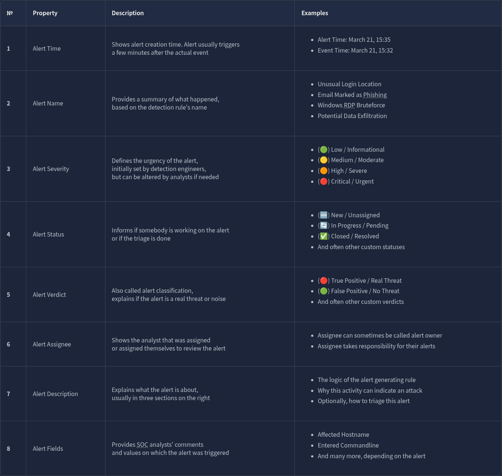
### Task Questions

**Unusual VPN Login Location**
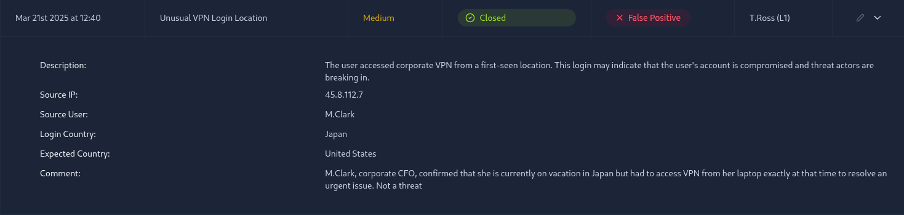

<!-- Q: -->
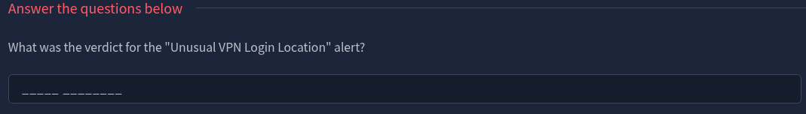
Answer: False Positive

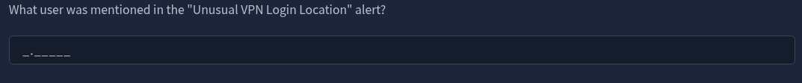
Answer:  M.Clark
<!-- A: -->

---

## Task 4 — Alert Prioritisation

### Key Concepts

<!-- How does an L1 analyst decide what to work first? -->
SOC analysts must filter the alerts in order to work on the most important ones first, they do so by sorting them by severity followed by time.

### Prioritisation Framework

<!-- Document the framework or model introduced in this task -->
Filter alerts by unassigned first, then severity followed by time. Escalation decisions are based on severity, confidence, and potential business impact.

### Task Questions

<!-- Q: -->
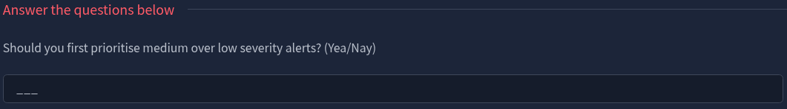
Answer: Yea

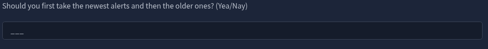
Answer: Nay

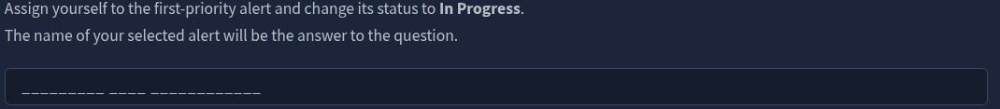

On the list of Alerts selected the Critical severity alert and assigned it to In Progress
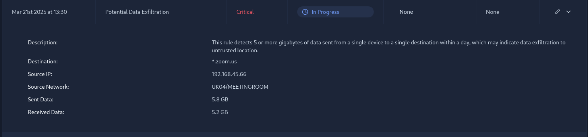
Answer: Potential Data Exfiltration
<!-- A: -->

---

## Task 5 — Alert Triage

### Key Concepts

<!-- The structured process for working through an alert -->
As an SOC analyst we must first first prioritize the alerts by sorting them then assigning ourselves the alert that we are prepared to triage. That keeps other SOC analysts from working on the same task. 
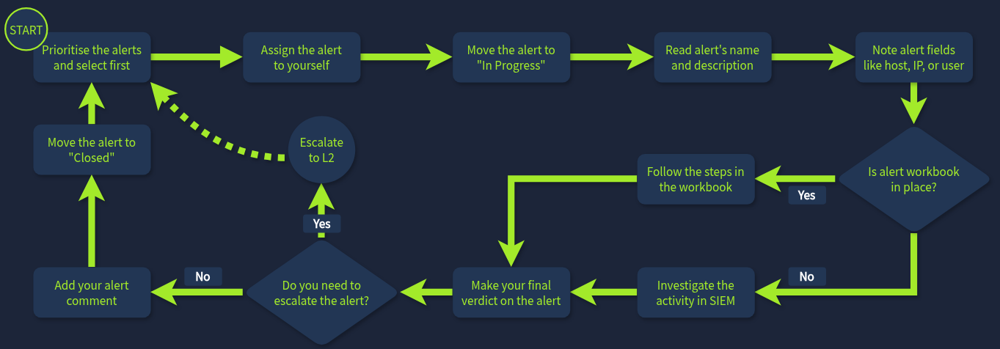
### Triage Workflow

1. Sort the alerts
2. Assign yourself an alert to work on
3. Move alert to "In Progress"
4. Investigate the alert
5. Determine whether the alert just needs a comment or an escalation to L2

### Task Questions

<!-- Q: -->
**Which flag did you receive after you correctly triaged the first-priority alert?**

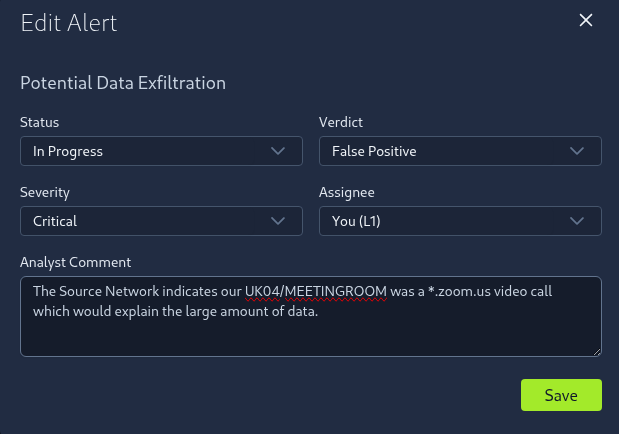

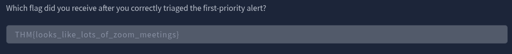
Answer: THM{looks_like_lots_of_zoom_meetings}

**Which flag did you receive after you correctly triaged the second-priority alert?**
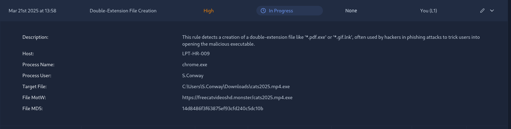

Provided with MD5 hash I investigated it through www.virustotal.com
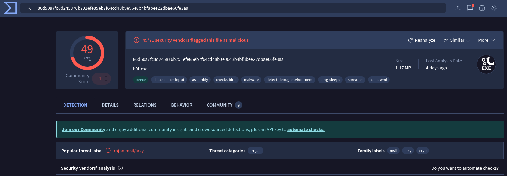

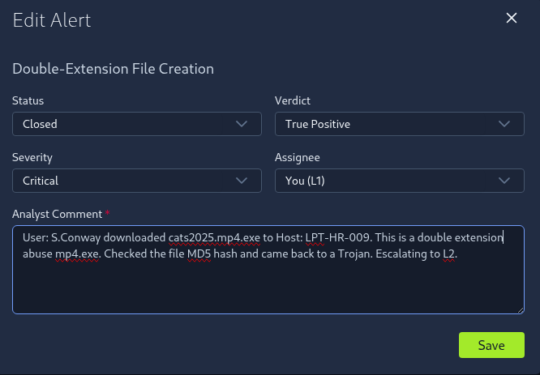

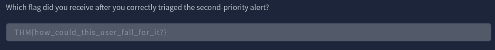
Answer: THM{how_could_this_user_fall_for_it?}

**Which flag did you receive after you correctly triaged the third-priority alert?**
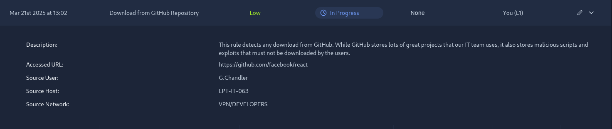

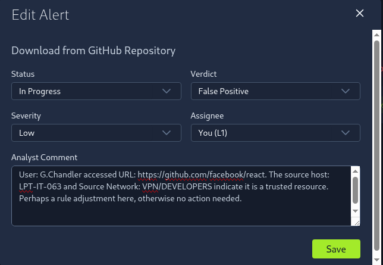

Answer: THM{should_we_allow_github_for_devs?}
<!-- A: -->

---

## Task 6 — Conclusion

<!-- Room summary, final notes, anything flagged for follow-up -->
The room provided basic knowledge to close or escalate False Positives and True Positives. 

---

## What Stood Out

- Task 5 question 2 has a double-extension abuse, but my eyes went straight to the .EXE and kinda completely glossed over the .mp4. The REAL TRICK is that Windows hides the .exe by default, so the victim only sees a video or .mp4 file. That should have rang alert bells straight away before even having to check virustotal.
- Task 5 question 3 presented us with a scenario where developers are accessing their official repo, I made a note that the rule could use adjustment so it would stop generating an Alert. Devs should be allowed to access their GIt repos.

---

## What Confused Me and How I Resolved It
- When i came across the alert with the MD5 hash I knew there was a way to check its integrity, I had just forgot it was virustotal, but a quick google search where to verify hashes brought me there!

---

## Skills Practiced

- Alert analysis
- Prioritisation
- True positive vs false positive assessment
- Severity justification
- Basic triage reasoning
- SOC workflow understanding

---

*Write-up by [Miyu7x](https://github.com/Miyu7x) | TryHackMe: Miyu7*
