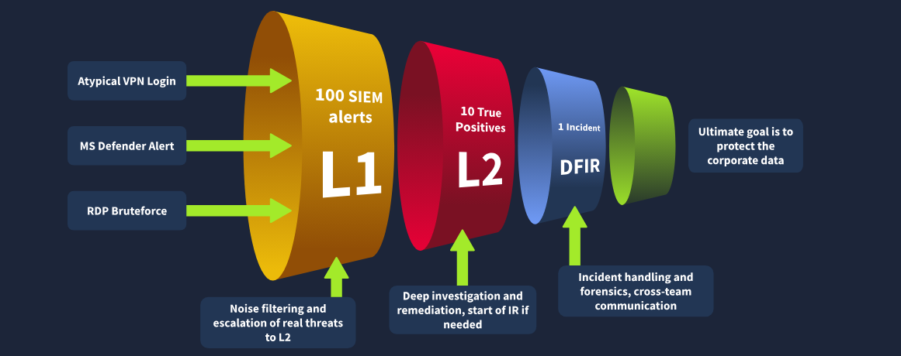
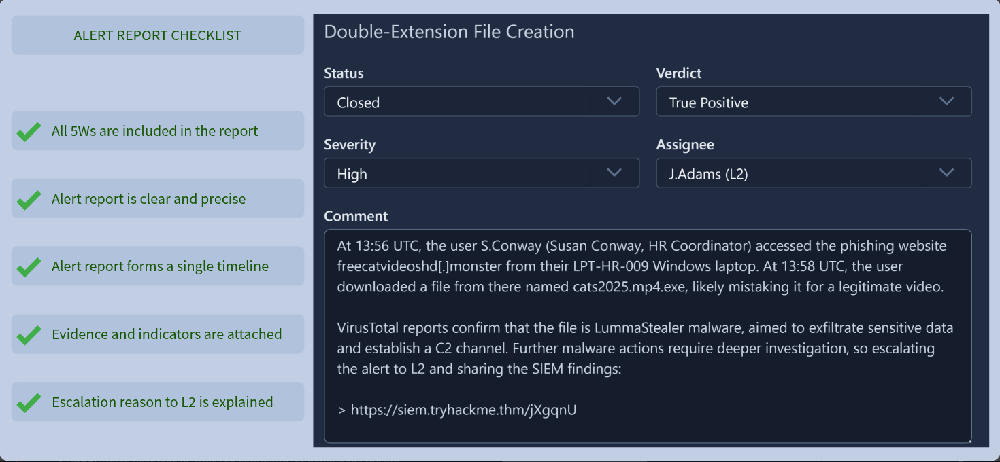
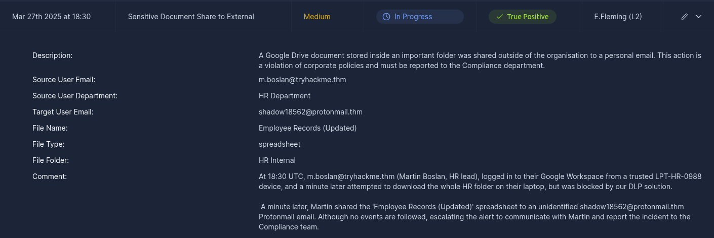
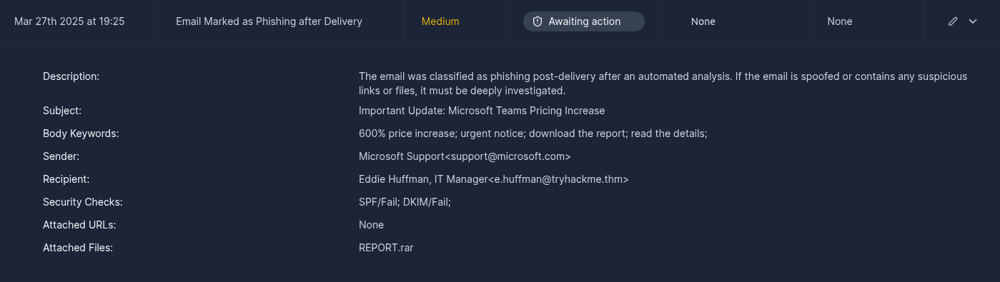
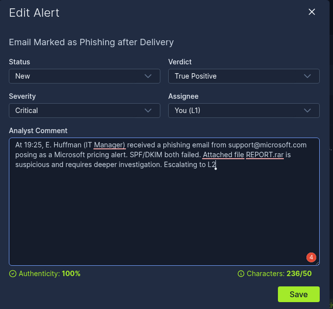
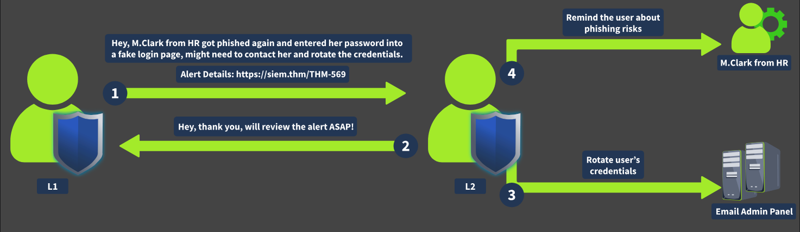
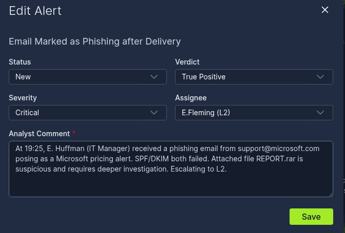
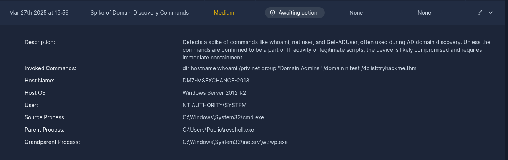
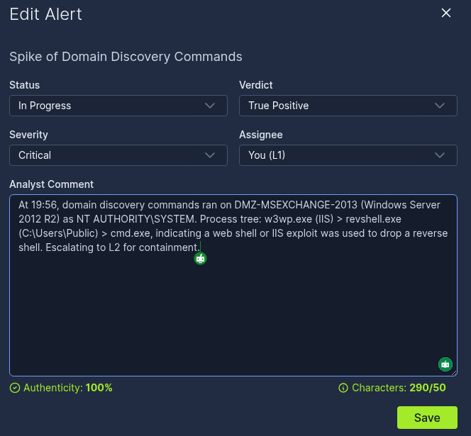
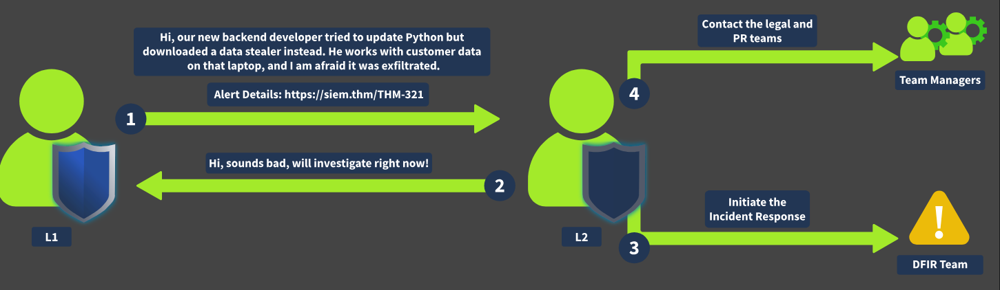

# Room — SOC L1 Alert Reporting

## Objective

- SOC alert reporting and escalation
- Proper alert comments and case reports
- Escalation methods and communication best practices

---

## Task 1 — Introduction

Proper alert commenting and reporting. Best practices for communication and escalation.

---

## Task 2 — Alert Funnel

### Key Concepts

- SOC L1 analysts are in charge of filtering the noise -- the brunt of the alerts.
- Alerts range from: Atypical VPN login, MS Defender alert, RDP Bruteforce.
- L2 receives escalations and handles remediation. At this level the L2 analyst is involved with deep investigation and incident reporting.

### Task Questions

**Q1: What is the process of passing suspicious alerts to an L2 analyst for review?**
A: Alert Escalation

**Q2: What is the process of formally describing alert details and findings?**
A: Alert Reporting

---

## Task 3 — Reporting Guide

### Key Concepts

Proper reporting is an essential skill for an L1 analyst, as it provides key information for the L2 receiving the report. It also allows the company to maintain detailed logs as evidence if needed, and builds important investigative skills.
- "If you can't explain it simply, you don't understand it well enough."

### Five Ws Reference

| W     | What to include                                            |
| ----- | ---------------------------------------------------------- |
| Who   | Which user performs an action: login, command, download... |
| What  | What action or event sequence was performed                |
| When  | When did the activity start and end                        |
| Where | Which device, IP, or website was involved in the alert     |
| Why   | **Most important W** -- the reason for your final verdict  |

**Report Format**

### Task Questions

**Q1: According to the SOC dashboard, which user email leaked the sensitive document?**

A: m.boslan@tryhackme.thm

**Q2: Looking at the new alerts, who is the "sender" of the suspicious, likely phishing email?**

A: support@microsoft.com

**Q3: Using the Five Ws template, what flag did you receive after writing a good report?**

A: THM{nice_attempt_faking_microsoft_support}

---

## Task 4 — Escalation Guide

### Key Concepts

When should you escalate an alert?

### Escalation Criteria

- Does it require deeper investigation?
- Is there a sign of a major cyberattack?
- Does it require remediation: malware removal, host isolation, or password reset?

### Task Questions

**Q1: Who is your current L2 in the SOC dashboard that you can assign (escalate) the alerts to?**
A: E.Fleming

**Q2: What flag did you receive after correctly escalating the alert from the previous task to L2?**

A: THM{good_job_escalating_your_first_alert}

**Q3: After triaging the second new alert, what flag did you receive?**

A: THM{looks_like_webshell_via_old_exchange}

---

## Task 5 — SOC Communication

### Key Concepts

A Crisis Communication Procedure is in place for when things go awry. What happens if an incident occurs and your L2 is unavailable?
- Having an emergency contact playbook is critical in the analyst role.
- Never make direct contact through a potentially compromised platform -- always use an alternative method like a phone call.
- Alert prioritization is key: filter first by severity.
- If you think you missed an alert, be diligent -- go back, check, and escalate right away if needed.
- If the SIEM is not functioning as expected, reach out to the L2 on shift or an available SOC engineer.

### Communication by L2

### Task Questions

**Q1: Should you first try to contact your manager in case of a critical threat (Yea/Nay)?**
A: Nay

**Q2: Should you immediately contact your L2 if you think you missed the attack (Yea/Nay)?**
A: Yea

---

## Task 6 — Conclusion

Communication and proper alert commenting are vital skills for an L1 SOC analyst. We must be sharp with our instincts as well as our wording -- that makes the L2's job easier and ensures our logs are a reliable reference for anyone reviewing them.

---

## What I Learned

`C:\Users\Public\revshell.exe` is not a normal process, especially when paired with reconnaissance commands such as `whoami`.

---

## What Confused Me and How I Resolved It

The red herring in the invoked commands threw me off when I read "Admin" -- I missed the critical indicator right below it: `C:\Users\Public\`.

---

*Write-up by [Miyu7x](https://github.com/Miyu7x) | TryHackMe: Miyu7*