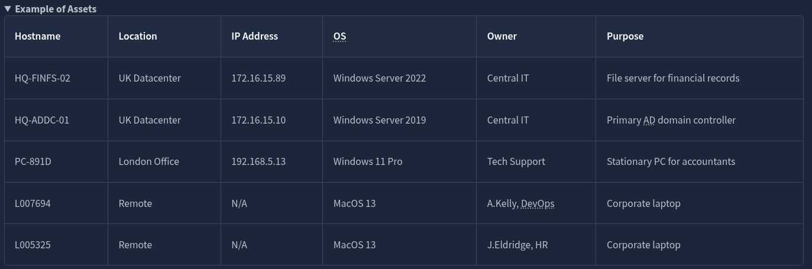
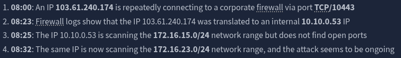
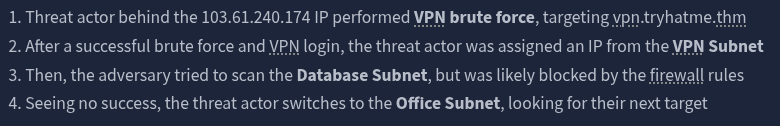
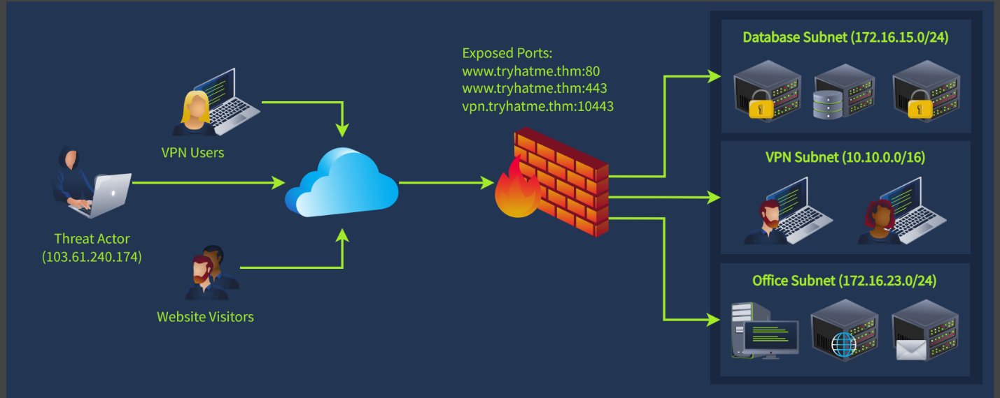
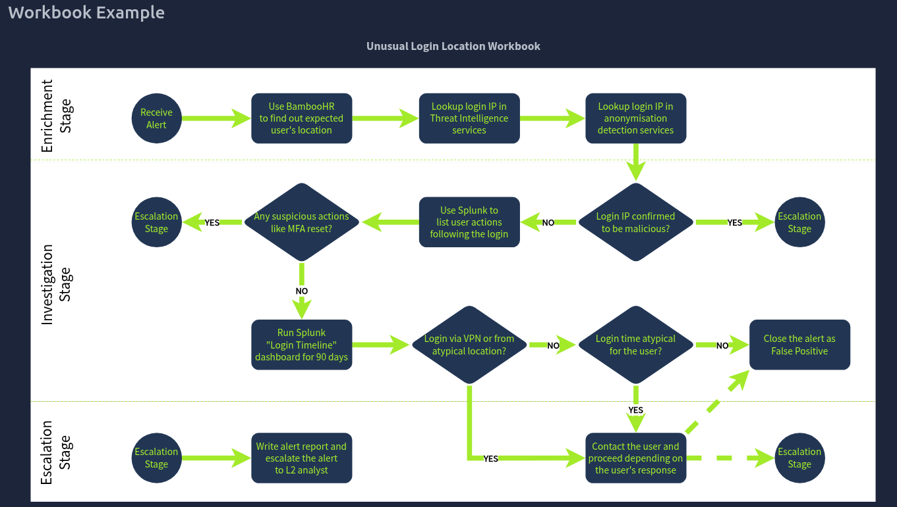
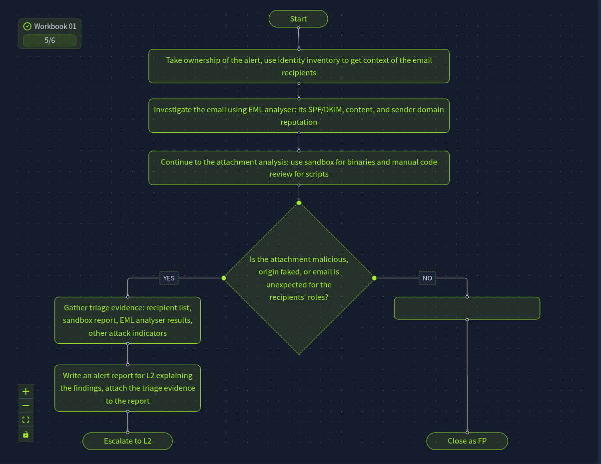
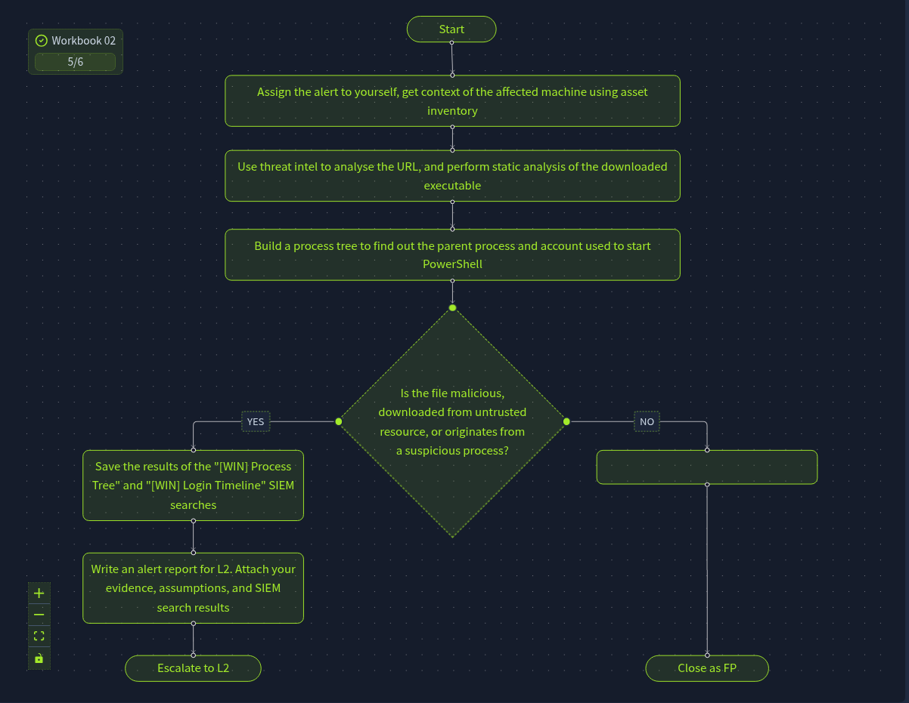
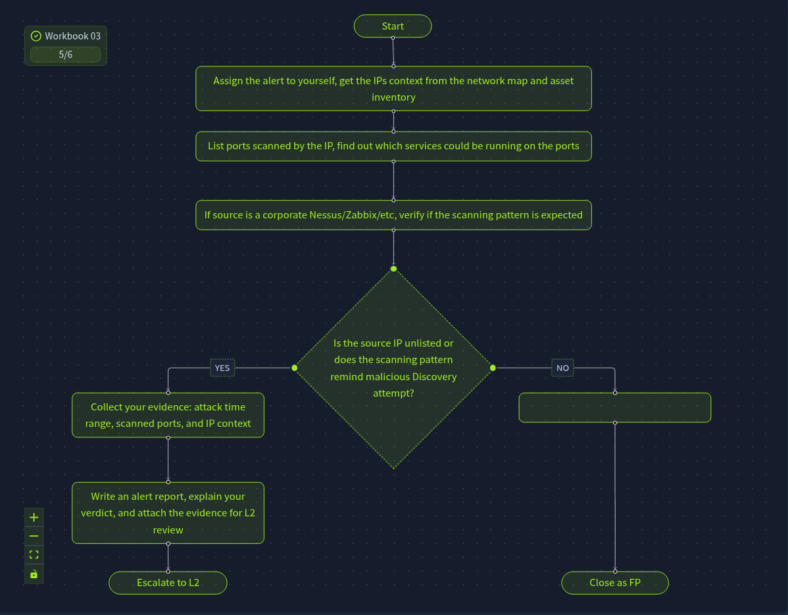

# SOC Workbooks and Lookups

---

## Task 1 - Introduction

### Key Concepts

Alert triage is a complex process by nature. SOC teams have developed workbooks to help analysts quickly look up methods and retrieve user and system context efficiently.

### Task Questions

**Q1:** I am ready to start!
**A:** No answer needed

---

## Task 2 - Assets & Identities

### Key Concepts

As an L1 analyst you might encounter an alert that says:
- M. Scott logged into the HQ-FIN-02 server
- M. Scott downloaded Financial Report 2026.xlsx
- M. Scott shared the xlsx file with D. Howard

In order to properly triage the alert we must know who these users are and whether this activity is expected between them.

**Identity inventory** is a catalogue of corporate employees, service accounts, and their details like privileges, contacts, and roles. It helps answer: who is this person and is their behavior expected?

**Asset inventory** (also called asset lookup) lists all computing resources within an organization's IT environment, focused on servers and workstations specifically.

#### Identity Inventory - Sources

| Solution | Examples | Description |
|---|---|---|
| Active Directory | On-prem AD, Entra ID | Physical users and hardware on premises; Entra ID is Microsoft's cloud-hosted AD |
| SSO Providers | Okta, Google Workspace | Cloud alternative for AD, easy way to manage and search users |
| HR Systems | BambooHR, SAP, HiBob | Provides full employee data but limited to employees only |
| Custom Solution | CSV or Excel Sheets | IT and security teams maintaining their own tracking solutions |

#### Asset Inventory - Sources

| Solution | Examples | Description |
|---|---|---|
| Active Directory | On-prem AD, Entra ID | AD tracks computer objects alongside user objects, making it a dual-purpose inventory |
| SIEM or EDR | Elastic, CrowdStrike | Some SIEM and EDR agents collect information about monitored hosts |
| MDM Solution | MS Intune, Jamf MDM | Built specifically to track and manage devices -- this is its dedicated purpose |
| Custom Solution | CSV or Excel Sheets | IT and security teams maintaining their own tracking solutions |

### Task Questions

**Q1:** Looking at the identity inventory, what is the role of R.Lund at the company?

**A:** US Financial Adviser

**Q2:** Checking the asset inventory, what data does the HQ-FINFS-02 server store?

**A:** Financial Records

**Q3:** Does the file sharing from the scenario look legitimate and expected? (Yea/Nay)
**A:** Yea

---

## Task 3 - Network Diagrams

### Key Concepts

A network diagram is a visual schema presenting a company's locations, subnets, and their connections. It is a separate resource from AD, where AD tells you who users and machines are, a network diagram tells you where they live on the network and how they connect to each other.

As an analyst, a network diagram helps you answer:
- What service is running on a given port?
- What subnet does an IP belong to?
- Why would one subnet be trying to reach another?

This makes it essential for making sense of firewall logs and reconstructing attack paths.

### Attack Path Reconstruction (Scenario Practice)

| Step | Observation | Interpretation |
|---|---|---|
| 1 | 103.61.240.174 repeatedly connects to firewall on TCP/10443 | VPN brute force against vpn.tryhatme.thm |
| 2 | IP translated to internal 10.10.0.53 | Successful VPN login, attacker assigned VPN subnet IP |
| 3 | 10.10.0.53 scans 172.16.15.0/24, no open ports found | Attempted Database Subnet enumeration, blocked by firewall |
| 4 | Same IP scans 172.16.23.0/24 | Pivoting to Office Subnet, attack ongoing |

### Task Questions

**Q1:** According to the network diagram, which service is exposed on the TCP/10443 port?
**A:** VPN

**Q2:** Which subnet would the server behind 172.16.15.99 IP belong to?
**A:** Database Subnet

**Q3:** Does the scenario look like a True Positive (TP) or False Positive (FP)?
**A:** TP

---

## Task 4 - Workbooks Theory

### Key Concepts

Having asset inventory and network diagrams gives you context about users, hosts, and IP addresses. Some alerts are straightforward but others may require dozens of steps, and that is where the **SOC Workbook** comes in.

A SOC workbook (also called a playbook or runbook) is a structured document that defines the steps required to investigate and remediate specific threats efficiently and consistently. L1 analysts are often required to follow workbooks precisely to avoid missing critical steps.

#### Workbook Phases

| Phase | Purpose | Example Actions |
|---|---|---|
| Enrichment | Gather context about the affected user, host, or IP | Use BambooHR to verify the user's expected location; check TI for the IP |
| Investigation | Use gathered data and SIEM logs to reach a verdict | Check if the user attempted an MFA reset; review login timestamps |
| Escalation | Communicate findings and escalate if necessary | Write a report and escalate to L2; contact the user directly if needed |

### Task Questions

**Q1:** Which SOC role would use workbooks the most?
**A:** SOC L1 Analyst

**Q2:** What is the process of gathering user, host, or IP context using TI and lookups?
**A:** Enrichment

**Q3:** Looking at the workbook example, what platform is used as an identity inventory source?
**A:** BambooHR

---

## Task 5 - Workbooks Practice

### Key Concepts

Not every team has a standardized workbook approach. Some teams maintain hundreds of complex workbooks for every possible detection rule. Others keep just a few high-level workbooks for the most common attack vectors and rely more on analyst experience.

As an L1 analyst, the skill to develop is the ability to divide an investigation into modular blocks and build workbooks around them, so the process is repeatable and nothing gets missed.

### Flags

| Workbook | Flag |
|---|---|
| Workbook 1 - Email Analysis | THM{the_most_common_soc_workbook} |
| Workbook 2 - PowerShell Analysis | THM{be_vigilant_with_powershell} |
| Workbook 3 - Network Analysis | |

### Task Questions

**Q1:** What flag did you receive after completing the first workbook?

**A:** THM{the_most_common_soc_workbook}

**Q2:** What flag did you receive after completing the second workbook?

**A:** THM{be_vigilant_with_powershell}

**Q3:** What flag did you receive after completing the third workbook?

**A:** THM{asset_inventory_is_essential}

---

## Task 6 - Conclusion

### Key Concepts

Building personal playbooks on the job is a valuable skill. Every company has its own users, assets, and network topology,  so custom workbooks tailored to the environment are critical. A well-maintained workbook is also a gift to the next analyst who picks up the alert.

### Task Questions

**Q1:** I am ready to move on!
**A:** No answer needed

---

## What I Learned

Workbooks are valuable not just as a company resource but as a personal habit. Detailed structured notes and alert reporting are useful to the next team member and to the L2 receiving an escalated alert. The enrichment phase especially stands out,  context about a user or asset can turn an ambiguous alert into a clear verdict fast.

---

*Write-up by [Miyu7x](https://github.com/Miyu7x) | TryHackMe: [Miyu7](https://tryhackme.com/p/Miyu7)*