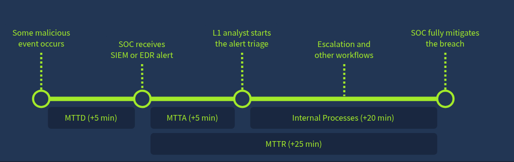
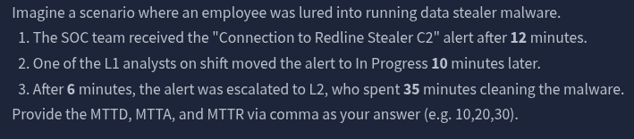
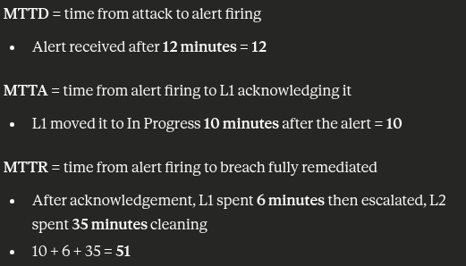
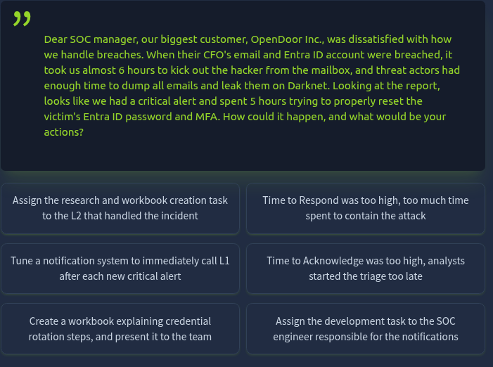
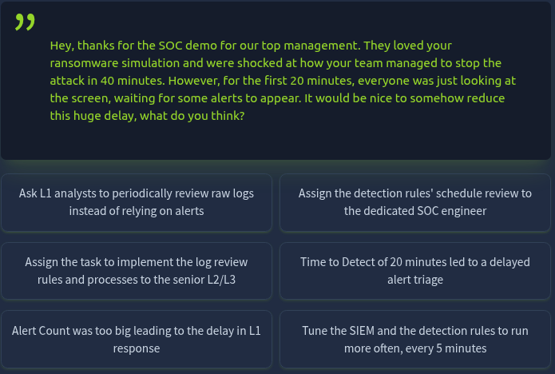
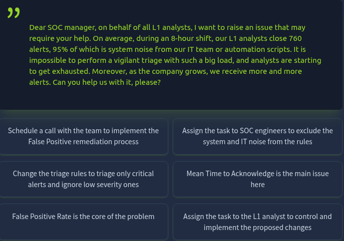

# SOC Metrics and Objectives

> Explore key metrics driving SOC effectiveness and discover ways to improve them.

---

## Task 1 - Introduction

### Key Concepts

The efficiency of a SOC team can be measured in several ways.
- Mean Time to Detect (MTTD) -- the average time it takes to identify a threat, incident, or technical problem
- Mean Time to Respond (MTTR) -- the average time between the initial alert and its remediation

### Task Questions

**Q1:** Let's begin!
**A:** No answer needed

---

## Task 2 - Core Metrics

### Key Concepts

**Alerts Count**
- Ideal alert volume depends on company size -- 5 to 30 alerts per day per L1 analyst is a healthy benchmark
- A low alert count can be just as concerning as a high one -- it may indicate a SIEM misconfiguration or a visibility gap

**False Positive Rate**
- If 75 out of 80 alerts are system noise or routine IT activity, that is a problem -- all that FP noise makes it easy to miss an actual threat
- A 0% False Positive rate is unrealistic, but 80% or higher is a serious issue
- The fix is tuning detection rules to filter out known benign activity

**Alert Escalation Rate**
- L1 is responsible for filtering out noise and only escalating actionable threats
- Do NOT attempt to triage alerts you do not fully understand -- escalate them
- This metric reflects how experienced and independent L1 analysts are

**Threat Detection Rate**
- Threat detection should always be at 100%
- Missing a threat due to misclassification or a broken detection rule is unacceptable
- Every missed threat is a potential ransomware infection or data breach waiting to happen

### Metrics Reference

| Metric | Formula | Measures | Healthy Range |
|--------|---------|----------|---------------|
| Alerts Count (AC) | Total Count of Alerts Received | Overall analyst load | 5-30/day per L1 |
| False Positive Rate (FPR) | FP / Total Alerts | Alert noise level | Below 80% |
| Alert Escalation Rate (AER) | Escalated / Total Alerts | L1 experience/independence | Below 20-50% |
| Threat Detection Rate (TDR) | Detected Threats / Total Threats | SOC reliability | Always 100% |

### Task Questions

**Q1:** Is zero alerts for one month a good sign for your SOC team? (Yea/Nay)
**A:** Nay

**Q2:** What is the False Positive Rate if only 10 out of 50 alerts appear to be real threats?
**A:** 80%

---

## Task 3 - Triage Metrics

### Key Concepts

SOC teams and their stakeholders operate under a Service Level Agreement (SLA) -- a formal commitment that defines response time expectations.
- Quick threat detection -- measured by MTTD
- Timely alert acknowledgement by L1 analysts -- measured by MTTA
- Adequate response to contain the threat, such as isolating a device -- measured by MTTR

### SLA Metrics Reference

| Metric | Common SLA | Description | Clock Starts | Clock Stops |
|--------|-----------|-------------|--------------|-------------|
| MTTD | 5 min | Mean Time to Detect | Attack occurs | Alert fires in SIEM |
| MTTA | 10 min | Mean Time to Acknowledge | Alert fires | L1 moves to In Progress |
| MTTR | 60 min | Mean Time to Respond | Alert fires | Breach contained/remediated |

### Task Questions

**Q1:** If the team works 8/5, on which day of the week will they acknowledge a critical alert received on Saturday?
**A:** Monday

**Q2:** MTTD, MTTA, and MTTR for the Redline Stealer scenario (format: MTTD,MTTA,MTTR):

**A:** 12,10,51

---

## Task 4 - Improving Metrics

### Key Concepts

- Metrics exist to make the SOC more efficient and reduce the window attackers have to operate
- Metrics are also used to evaluate analyst performance -- consistently strong results are a direct pathway to L2 and career growth

### Improvement Reference Table

| Issue | Threshold | Recommended Actions |
|-------|-----------|---------------------|
| High FPR | Over 80% | Exclude trusted activity from EDR/SIEM rules; automate triage via SOAR or custom scripts |
| High MTTD | Over 30 min | Ask SOC engineers to optimize detection rules; verify SIEM logs are collected in real time |
| High MTTA | Over 30 min | Ensure analysts receive real-time alert notifications; distribute the queue evenly across on-shift analysts |
| High MTTR | Over 4 hours | Escalate confirmed threats to L2 as fast as possible; ensure documented runbooks exist for common attack scenarios |

### Task Questions

**Q1:** What is the highest acceptable False Positive Rate for SOC teams?
**A:** 80%

**Q2:** Should all SOC roles work together to keep metrics improving? (Yea/Nay)
**A:** Yea

---

## Task 5 - Practice Scenarios

### Key Concepts

As an L1 analyst, recognizing which metric is degraded and knowing the correct remediation is a core operational skill -- not just a manager responsibility.

### Task Questions

**Q1:** Flag from Scenario 1

**A:** THM{mttr:quick_start_but_slow_response}

**Q2:** Flag from Scenario 2

**A:** THM{mttd:time_between_attack_and_alert}

**Q3:** Flag from Scenario 3

**A:** THM{fpr:the_main_cause_of_l1_burnout}

---

## Task 6 - Conclusion

### Key Concepts

Fine-tuning detection rules to reduce noise is one of the most impactful things a SOC team can do. If the system is generating 98% False Positives, an attacker can slip through unnoticed simply by blending into the noise. Signal quality is a core security control.

### Task Questions

**Q1:** Well done on completing the room!
**A:** No answer needed

---

## What I Learned

As a SOC analyst you have to be both fast and deliberate. Moving too quickly risks misclassifying a real threat as noise. But triaging an alert you do not fully understand is just as dangerous -- it can lead to missing an active attack entirely. The metrics in this room put numbers to that balance.

---

*Write-up by [Miyu7x](https://github.com/Miyu7x) | TryHackMe: [Miyu7](https://tryhackme.com/p/Miyu7)*