# Introduction to EDR

---

## Task 1 - Introduction

### Key Concepts

Endpoint Detection and Response is a security tool that continuously monitors endpoints.

EDR solutions: Identify, Analyze and Respond to cyber threats.

What can EDR do? How does it detect? How does it respond to threats?

### Task Questions

1. I am all set!
   **A:** No answer needed

---

## Task 2 - What is an EDR?

### Key Concepts

Since the rise of remote work, company hardware and information is no longer safe and contained, it's out and about in the world. That's where EDR comes in, so these devices no matter their endpoint can stay protected.

Perimeter-based security means inside an area, contained, within the company's walls or within its range. Outside that perimeter is the world, and that's where EDR comes in. These devices that are out of perimeter are monitored constantly by EDR.

**The 3 Pillars of EDR**

**Visibility**

EDR collects detailed information from its endpoints and presents it to SOC analysts in a very detailed format. It shows the entire **process tree** with a complete timeline and sequence of events.

- Process modifications
- Registry modifications
- File and folder modifications
- User actions and much more

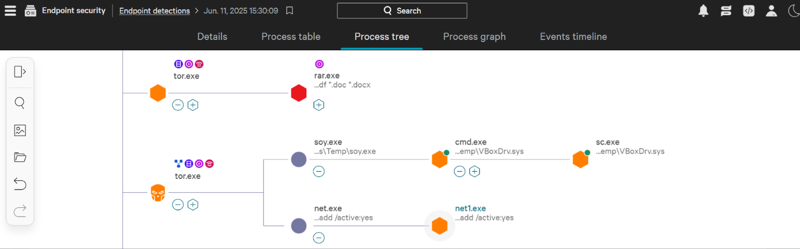

**Detection**

One of the key features of EDR is its ability to detect any anomaly in baseline behavior and instantly alert to it. In other words: is this normal behavior for this user and this machine?

- Allows SOC to input custom **indicators of compromise** (IOCs) to improve threat detection
- **Tactic via Technique** provides rich details of the detection following the MITRE framework
- **MITRE framework** is a structured knowledge base of **known attacker behaviors**, including tactics, techniques, and procedures used in cyber attacks

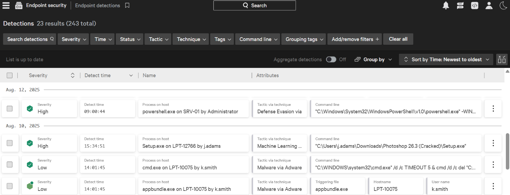

**Response**

EDR not only serves to detect threats but also remediate them. SOCs have the ability to control the endpoint:

- Isolate it
- Terminate a process
- Quarantine files

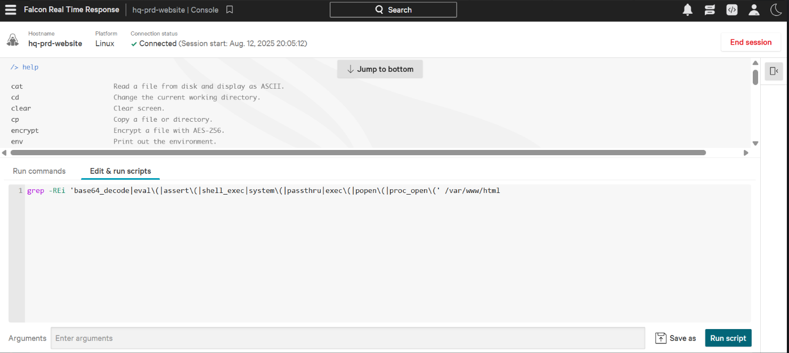

It is **important** to know that EDR is a host-only security tool and does **not** detect network-level threats.

- **EDR** = host-based security
- **Firewall** = network-based security

### Task Questions

1. Which feature of EDR provides a complete context for all the detections?
   **A: Visibility**

2. Which process spawned sc.exe?
   **A: cmd.exe**

---

## Task 3 - Beyond the Antivirus

### Key Concepts

**The EDR and AV airport concept**

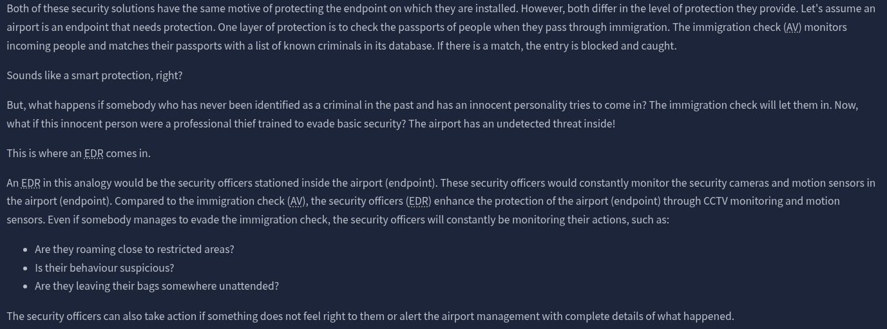

EDR and Antivirus -- why we need both:

- If the threat has no signature it may bypass the antivirus easily
- Because EDR is 24/7 monitoring and behavior-based, anything that bypassed the AV but is abnormal will get flagged by the EDR

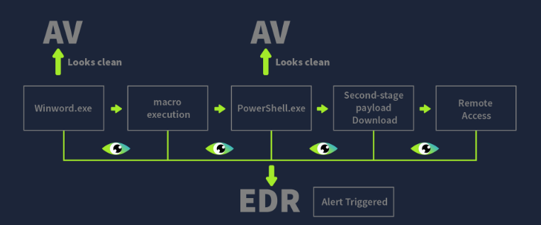

| Attack Step | What Happened | AV Response | EDR Response |
|---|---|---|---|
| Step 1 | Phishing email with malicious Word doc received | Does the downloaded file have a previous signature in the database? Yes: Alert / No: Nothing | Logs the downloaded file and monitors its activity |
| Step 2 | User opens the document | Does **nothing** since winword.exe is a legitimate utility process | Records the process execution of winword.exe and **continues** monitoring it |
| Step 3 | Macro silently spawns PowerShell | Does **nothing** if the executed macro has no previous signature | **Detects and flags** the macro execution due to the unusual parent-child relationship of **winword.exe → PowerShell.exe** |
| Step 4 | Obfuscated PowerShell downloads second-stage payload | AV does **not** usually detect obfuscated PowerShell scripts | **Flags** the obfuscated script execution |
| Step 5 | Payload injected into legitimate svchost.exe | Does **not** monitor memory injections | **Detects Process Injection** in svchost.exe |
| Step 6 | Attacker gains remote access | **No** network visibility | **Flags unexpected behavior** of svchost.exe making an outbound connection |
| Final | Alert generated or missed | May be marked as clean | **Full alert** generated with the entire **attack chain**, enabling the SOC analyst to take immediate action |

### Task Questions

1. In the given analogy, what represents an AV?
   **A: Immigration Check**

2. Which legitimate process was hijacked by the attacker in the scenario?
   **A: svchost.exe**

3. Which security solution might mark this activity as clean?
   **A: Antivirus**

---

## Task 4 - How an EDR Works

### Key Concepts

Multiple endpoints can be managed through a centralized console.

- Agents ("sensors") are deployed inside those endpoints and monitor all activity
- Information about these activities is sent to the EDR central console in real-time
- EDR agents can perform basic signature-based and behavior-based detection

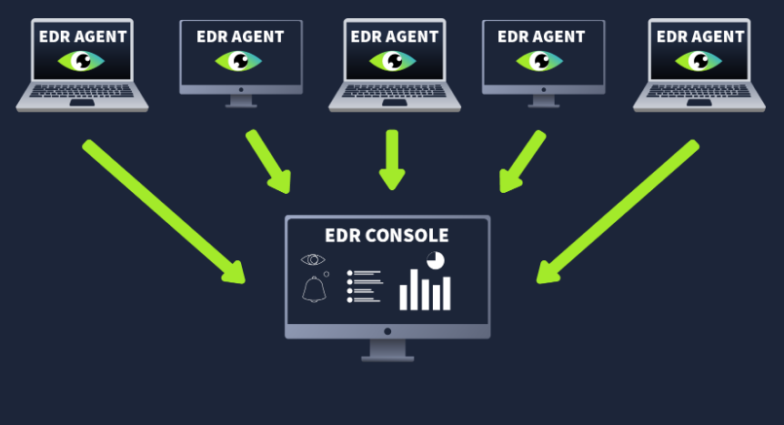

**Console:**

All data is sent to the EDR console, which analyzes it through **complex logic and machine learning algorithms**.

- EDR is much like a brain connecting all the information together like dots
- When these dots connect they form a **detection that becomes an alert**
- **EDR agents** collect different data from their endpoints and push it to the **EDR console**

A SOC analyst's first job is to **acknowledge and prioritize the alert**.

- The EDR console makes this easier by sorting alerts by **severity**
- The alert contains **all** the details of the detection

The EDR is one of many security tools that form a larger **security ecosystem**, which includes:

- Firewalls
- DLPs
- Email Security Gateways
- IAMs
- EDRs

All these security tools come together in the **Security Information and Event Management** (SIEM) system.

### Task Questions

1. Which component of the EDR is responsible for collecting telemetry from the endpoints?
   **A: Agent**

2. An EDR agent is also known as a?
   **A: Sensor**

---

## Task 5 - EDR Telemetry

### Key Concepts

The agents collect data and send it to the EDR central console. This data is called **telemetry**.

- Telemetry is the **black box** of an endpoint

| Telemetry Type | What It Monitors | Why It Matters for Detection |
|---|---|---|
| Process Executions and Terminations | All running and idle **processes** | Key for identifying **child-parent process** relationships |
| Network Connections | All endpoint **network connections** | Connection to a C2 server, unusual port usage, data exfiltration, lateral movement |
| Command Line Activity | All **executed commands** on the endpoints | Identify malicious command execution and obfuscated PowerShell script executions |
| Files and Folders Modifications | Malicious file movements | Data staging, malicious file dropping, ransomware executions |
| Registry Modifications | Windows system registry | Contains vital configuration information |

### Task Questions

1. Which telemetry data helps in detecting C2 communications?
   **A: Network Connections**

2. Where are the configuration settings of a Windows system primarily stored?
   **A: Registry**

---

## Task 6 - Detection and Response Capabilities

### Key Concepts

Once **telemetry data** is gathered, the EDR applies advanced techniques to analyze it.

**Behavioral Detection:**
EDR does not just observe file signatures -- it completely analyzes the behavior of a file. If something is acting outside the norm, for example a Word document spawning a PowerShell:

winword.exe → PowerShell.exe

**Anomaly Detection:**
With use, EDR learns a device's baseline behavior. Any activity that is outside **normal or expected** usage will be flagged.

- It can pick up "noise" or false positives, but since it offers the analyst the **full context** of the detection, analysts are able to rule them out
- An anomaly example: a process modifies an auto-registry key

**IOC Matching:**
EDR flags any activity matching a known **Indicator of Compromise** (IOC).

- EDR uses threat intelligence feed integration, which uses indicators published in threat intelligence feeds
- Example: a downloaded file contains a hash of a file commonly used in attacks -- the EDR will flag it immediately
- If it were a **zero-day attack**, the EDR would not have any intelligence on it

**MITRE ATT&CK Mapping:**
EDR not only detects malicious activity, it also maps it to its corresponding **MITRE ATT&CK tactic and technique**, providing the analyst with the **stage** of the attack.

Example: if an EDR detects the creation of a scheduled task, it may map the activity as:
- **Tactic:** Persistence
- **Technique:** Scheduled Task/Job

**Machine Learning:**
Modern EDRs have machine learning models trained on large datasets of normal and malicious behavior.

- Fileless attacks and multi-stage intrusions that may appear harmless can be detected through machine learning

### MITRE ATT&CK Mapping

| Technique Observed | Tactic | Technique ID | Notes |
|---|---|---|---|
| Scheduled task creation | Persistence | T1053 | Example from room |

### Task Questions

1. Which feature of the EDR helps you identify threats based on known malicious behaviours?
   **A: IOC Matching**

---

## Task 7 - Investigate an Alert on EDR

### Key Concepts

Triage alerts of varying severity on the EDR console.

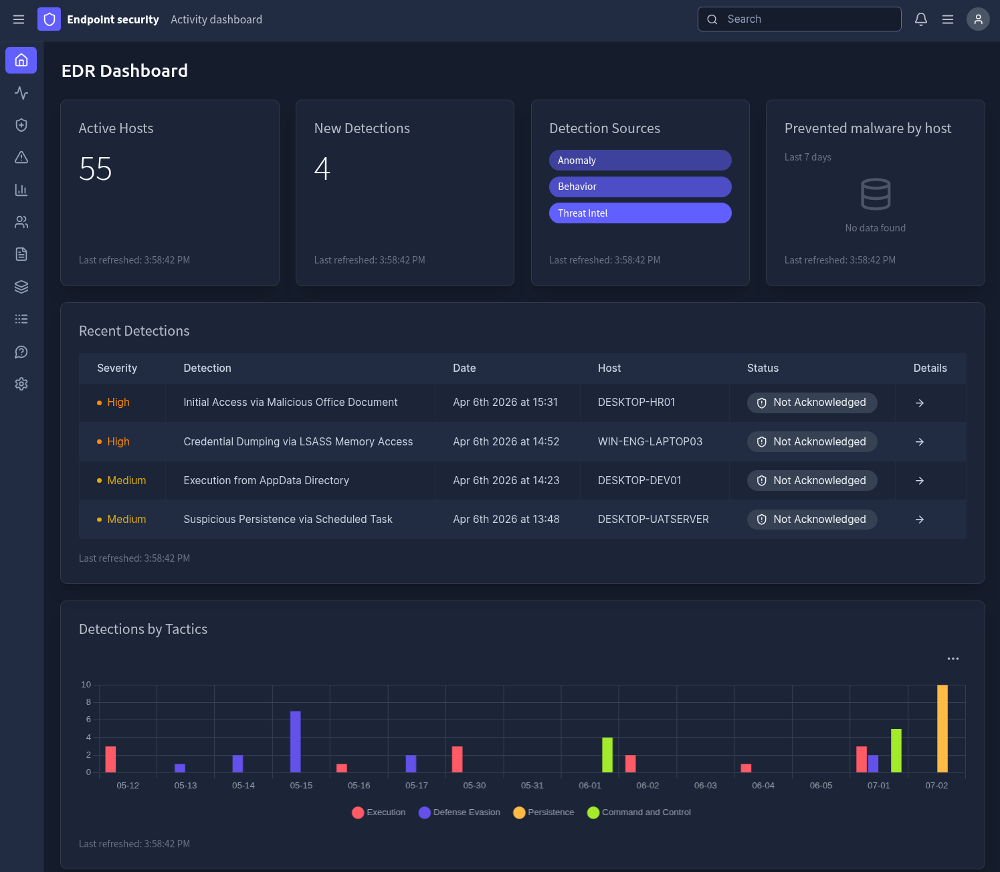

### Task Questions

1. Which tool was launched by CMD.exe to download the payload on DESKTOP-HR01?

   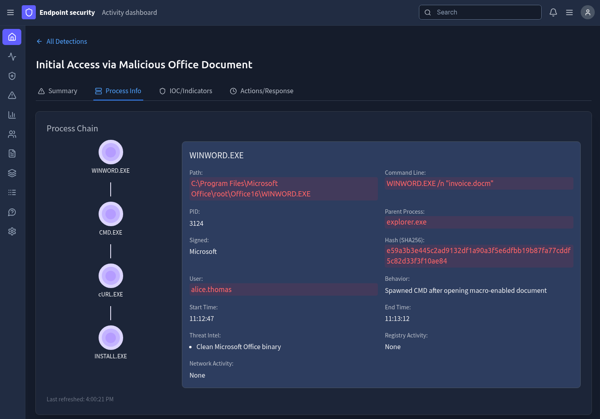

   **A: cURL.EXE**

2. What is the absolute path to the downloaded malware on the DESKTOP-HR01 machine?

   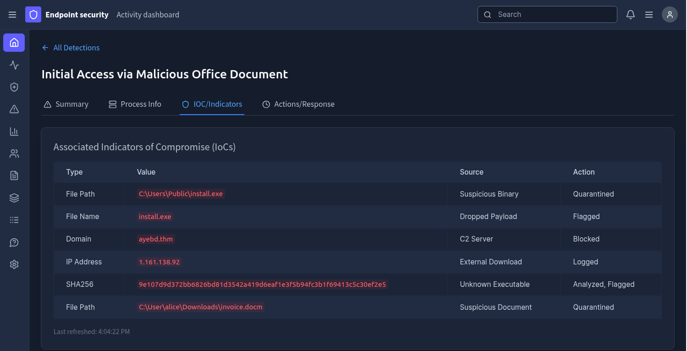

   **A: C:\Users\Public\install.exe**

3. What is the absolute path to the suspicious syncsvc.exe on the WIN-ENG-LAPTOP03 machine?

   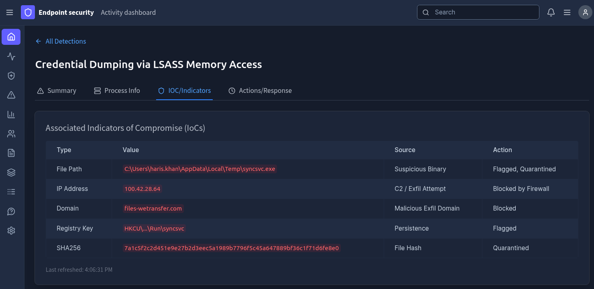

   **A: C:\Users\haris.khan\AppData\Local\Temp\syncsvc.exe**

4. On which URL was the exfiltration attempt being made on WIN-ENG-LAPTOP03?

   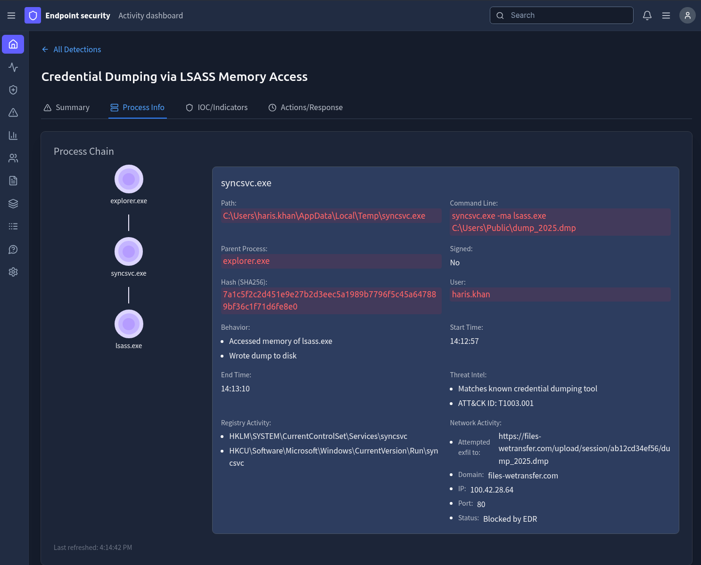

   **A: https://files-wetransfer.com/upload/session/ab12cd34ef56/dump_2025.dmp**

5. What was UpdateAgent.exe labelled by Threat Intel on DESKTOP-DEV01?

   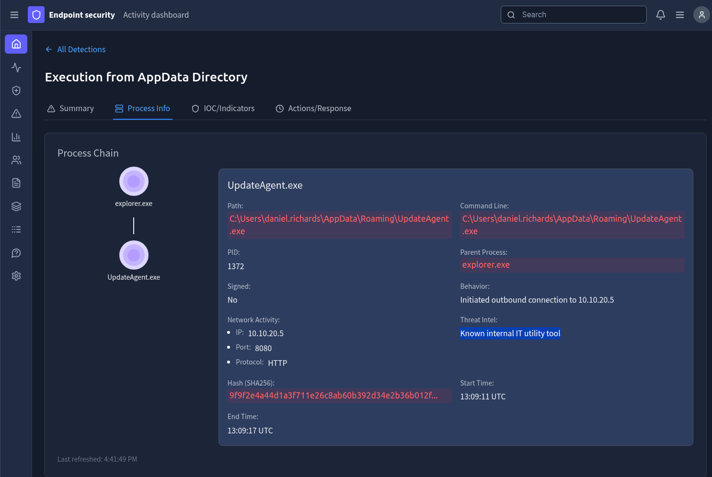

   **A: Known internal IT utility tool**

---

## What I Learned

I learned how EDR makes up just one part of a large security ecosystem, and that various tools used together are needed to keep attackers out.

---

## What Confused Me and How I Resolved It

That EDR is host-based, meaning machine or device based. A firewall is network-based -- it's watching traffic coming and going. EDR won't know that an attacker might be scanning for open ports.

---

*Write-up by [Miyu7x](https://github.com/Miyu7x) | TryHackMe: [Miyu7](https://tryhackme.com/p/Miyu7)*
