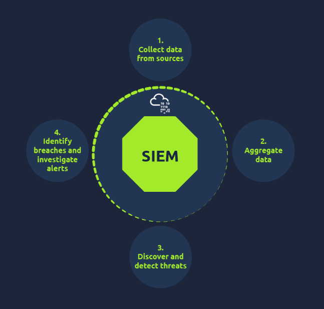
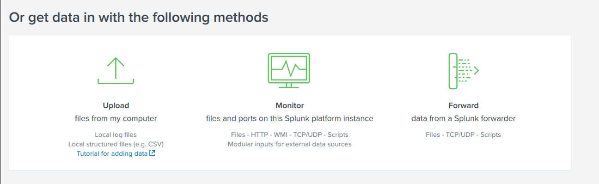
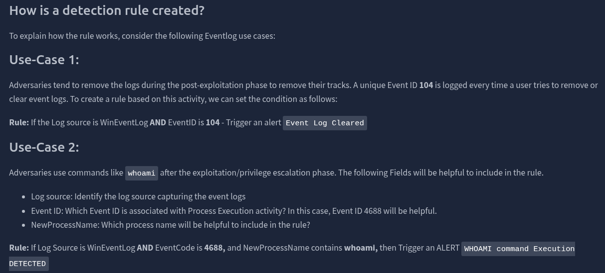
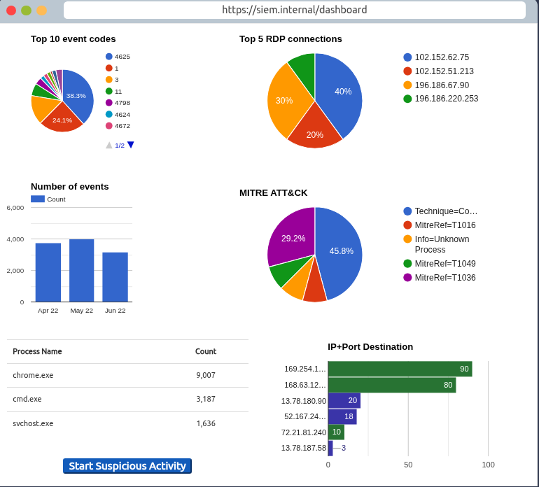
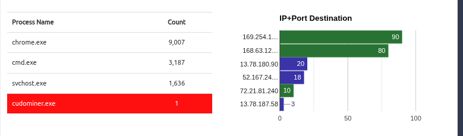
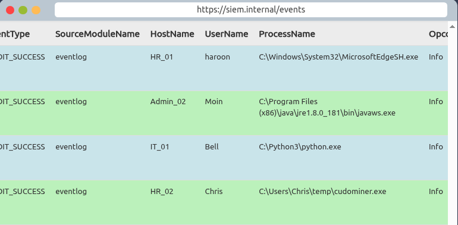
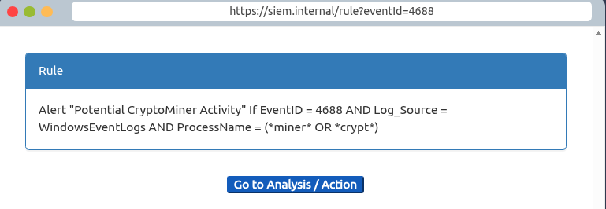
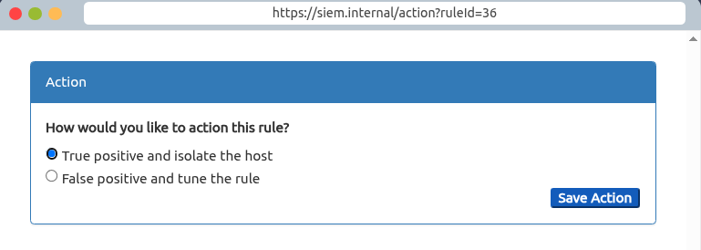

# Introduction to SIEM

## Task 1 - Introduction

### Key Concepts

<!-- What is SIEM at a high level? What is its role in a SOC environment? -->
**SIEM** Security Information and Event Management system
- Main security solution for SOC analysts
- Centralized security solution that collects, normalizes and correlates logs

**Learning Objectives**
- Different types of logs and where they come from
- Limitations of only looking at isolated logs
- Discover various sources that produce logs
### Task Questions

1. What does SIEM stand for?

   **Answer: Security Information and Event Management**

---

## Task 2 - Logs Everywhere, Answers Nowhere

### Key Concepts

Imagine your home, your desktop, your laptop, all your devices connect to a router which connects to the internet. These devices continuously generate logs of the activities that happen within them
- Who logged in
- What websites were visited
- Which Apps were used
- What files were downloaded

<!-- What are the two main categories of log sources? What distinguishes one from the other? -->
There are 2 main categories of logs
- **Host-Centric Log Sources** 
	- Linux - Windows - Servers
	- User accessing a file
	- User attempting to authenticate
	- Process execution, adding, adding, deleting
	- PowerShell execution
- **Network-Centric Log Sources**
	- SSH connection
	- FTP file access
	- Web traffic
	- A user accessing company's resources through VPN
	- Network file sharing  activity

| Log Source Category | Example Devices                                                     | Example Log Events         |
| ------------------- | ------------------------------------------------------------------- | -------------------------- |
| Host-Centric        | Windows laptop                                                      | running the whoami command |
| Network-Centric     | Using your home laptop to connect thru SSH to your company's laptop |                            |

<!-- What are the five challenges of working with raw, decentralized logs? Think about volume, format, context, efficiency, and correlation. -->

| Challenge            | Why It Matters to a SOC Analyst                                                                                 |
| -------------------- | --------------------------------------------------------------------------------------------------------------- |
| Numerous Log Sources | Logs come from many different sources which are generating hundreds of events per second                        |
| No Centralization    | Logs reside in the device they are generated in, to access them we may need to connect via RDP, SSH, etc...     |
| Limited Context      | Attackers use lateral movement, a single log might not reveal the whole story                                   |
| Limited Analysis     | Numerous logs are generated per second, impossible for humans to analyze them all                               |
| Format Issues        | Different log sources generate in different formats, knowing how to read all different formats can be difficult |

### Task Questions

1. Is Registry-related activity host-centric or network-centric?

   **Answer: Host-Centric**

2. Is VPN-related activity host-centric or network-centric?

   **Answer: Network-Centric**

---

## Task 3 - Why SIEM?

### Key Concepts

**SIEM is the solution** for all the different log types and sources from firewalls, endpoints, servers etc. It collects all these different types of logs
- Standardizes them
- Correlates them 
- Detects malicious activities using detection rules

<!-- Walk through the correlation example (Haris/VPN/PowerShell/outbound connection). What does each event look like in isolation vs. correlated? What does this tell you about why correlation is the core value of SIEM? -->

<!-- What are the core SIEM features? For each one, write what problem it solves and how a SOC analyst actually uses it. -->

| SIEM Feature               | Problem It Solves                                                                      |                       How an Analyst Uses It                       |
| -------------------------- | -------------------------------------------------------------------------------------- | :----------------------------------------------------------------: |
| Centralized Log Collection | Collects all different types of logs in one place                                      |                                                                    |
| Normalization              | Logs come in different shapes and sizes, normalization standardizes them into one type |                                                                    |
| Correlation                | Individual logs are not useful specially when modern attacks involve lateral movement  |                                                                    |
| Real-time Alerting         | Analysts set rules on the SIEM to broaden their detection scope                        |                                                                    |
| Dashboards and Reporting   | Provides an in depth dashboard                                                         | - Alert highlights - System Notifications - Health Alert  |
|                            |                                                                                        |                                 -                                  |

<!-- What kinds of information live on a SIEM dashboard? Why would each matter during an investigation? -->

### Task Questions

1. Read the task above.

   **Answer:** No answer needed.

---

## Task 4 - Log Sources and Ingestion

### Key Concepts

<!-- Windows logs: how are they structured? What is the role of Event IDs? Where do analysts view them? -->

<!-- Linux logs: what are the key log file locations and what does each one capture? -->

| Linux Log Path    | What It Captures                                            |
| ----------------- | ----------------------------------------------------------- |
| /var/log/httpd    | HTTP Requests, Responses and Error logs                     |
| /var/log/cron     | Scheduled jobs logs Cron Logs (System Updates)              |
| /var/log/auth.log | Authentication logs, user login and logoffs, MFA challenges |
| /var/log/secure   |                                                             |
| /var/log/kern     | boot sequences and driver interactions                      |

| Ingestion Method  | How It Works                                        | When You Would Use It                                 |
| ----------------- | --------------------------------------------------- | ----------------------------------------------------- |
| Agent / Forwarder | AGENT (forwader by Splunk) installed on an endpoint | Configured to capture and send important logs to SIEM |
| Syslog            | Used to collect data from servers and databases     | send real time data to the centralized destination    |
| Manual Upload     | Ingest offline data for quick analysis              | When you need to quickly analyze data                 |
| Port-Forwarding   | SIEM solution is configured to listen on a port     | Forwards endpoint data on the port to the SIEM        |

### Task Questions

1. In which location within a Linux environment are HTTP logs stored?

   **Answer: /var/log/httpd**

---

## Task 5 - Alerting Process and Analysis

### Key Concepts

| Use Case                   | Threat Behavior                     | Key Log Fields  | Rule Logic |
| -------------------------- | ----------------------------------- | --------------- | ---------- |
| Event Log Cleared (ID 104) | User trying to remove or clear logs | WinEventLog 104 |            |
| whoami Execution (ID 4688) | Attacker uses whoami                | 4688            |            |

Analysts spend most of their time on the SIEM Dashboard

| Alert Outcome  | What It Means                 | Follow-up Actions                 |
| -------------- | ----------------------------- | --------------------------------- |
| False Positive | Is it Frequent?               | Rules need Tuning                 |
| True Positive  | Perform further investigation | isolate host, block suspicious IP |

### Task Questions

1. Which Event ID is generated when event logs are removed?

   **Answer: 104**

2. What type of alert may require tuning?

   **Answer: False Positive**

---

## Task 6 - Lab Work

### Key Concepts

### Task Questions

1. After clicking on the Start Suspicious Activity button, which process caused the alert?

   **Answer: cudominer.exe**

2. Find the event that caused the alert and identify the user responsible for the process execution.

   **Answer: Chris**

3. What is the hostname of the suspect user?

   **Answer: HR_02**

4. Examine the rule and the suspicious process; which term matched the rule that caused the alert?

   **Answer: Miner**

5. Which option best represents the event? (False Positive / True Positive)

   **Answer: True Positive**

6. Selecting the right ACTION will display the FLAG. What is the FLAG?

   **Answer: THM{000_SIEM_INTRO}**

---

## Task 7 - Conclusion

### Key Concepts

Upon finishing this lab i truly understand the importance of the **SIEM** up until now i had a vague idea that it was a dashboard that it received alerts, but now i understand as;
- Centralized security solution
- Collects all types of logs in one place
- Standardizes them as different logs come in different formats and sizes
- Analysts can set rules inside the SIEM to adjust False Positive noise

### Task Questions

1. Complete this room.

   **Answer:** No answer needed.

---

*Write-up by [Miyu7x](https://github.com/Miyu7x) | TryHackMe: [Miyu7](https://tryhackme.com/p/Miyu7)*