# Splunk: The Basics

## Task 1 - Introduction

### Key Concepts

Last lab we just learned about **SIEM**: There are various SIEM solutions on the market but Splunk is the one of the leading SIEM security solutions
- Splunk provides better visibility to network activities

### Task Questions

1. Continue with the next task.

---

## Task 2 - Connect with the Lab

### Key Concepts

- Splunk is web based as we interact with it entirely on the browser
- For this scenario we open Splunk by going to http://10.64.175.216
- I did this by connecting my Kali thru THMs VPN

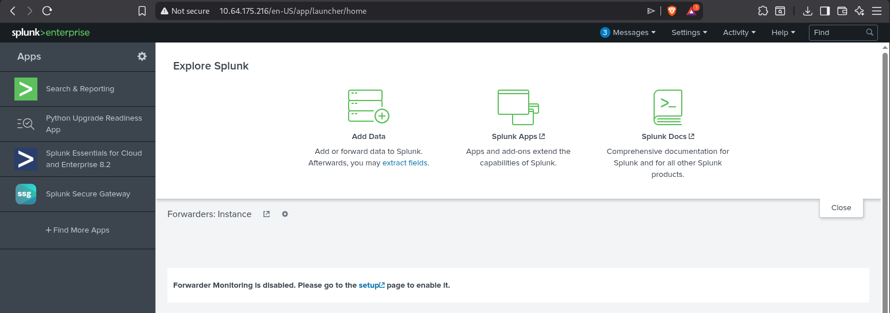

My Kali machine connects to the THM network infrastructure through an encrypted tunnel or VPN.
The internet address for Splunk that we connect to does not exist in the public internet it only exists inside the THM network.

In a real SOC environment Splunk sits inside an internal corporate network, accessible through a on-site workstation or a corporate VPN when we work remotely.

### Task Questions

1. Connect with the lab.

---

## Task 3 - Splunk Components

### Key Concepts

Splunk has 3 mains components:

- **Indexer** - Responsible for processing the data received from the forwarders.
	- Parses and ormalizes data into field-value pairs
	- Categorizes it
	- Stores the results as **events**
	
	
- **Search Head** - SOC's place to search for logs
	- Searches are done using SPL(Search processing Language)
	- When the user performs a search the request is sent to the **indexer** which then returns the found events as field-value pairs
	- **Field-value pairs:** when the forwarder sends a log to the indexer it arrives as a raw string 
	2024-01-15 10:23:44 user=jsmith src_ip=192.168.1.5 action=login status=failed
	That raw text is not searchable, so the indexer normalizes the search result by breaking it into labeled containers
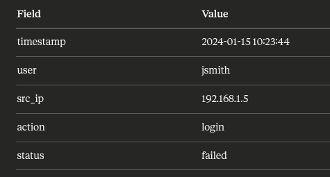
The **Search Head** also allows you to transform results 
- Tables
- Pie charts
- Bar charts
- Column charts
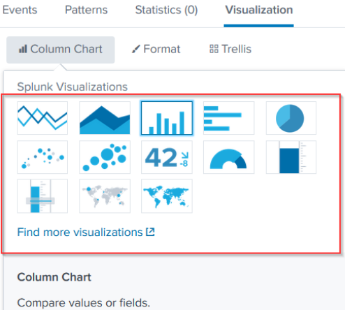

The **Forwarder** is a lightweight agent on endpoints that collects data and sends it to Splunk
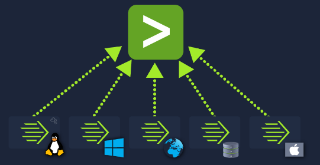
**Key data sources the Forwarder can collect from:**

| Source Type     | Examples                                           |
| --------------- | -------------------------------------------------- |
| Web server      | Web Traffic                                        |
| Windows machine | Event Logs, PowerShell and Sysmon data             |
| Linux host      | host-centric logs                                  |
| Database        | Database connection requests, responses and errors |

### Task Questions

1. Which component is used to collect and send data over the Splunk instance?

   **Answer: Forwarder**

---

## Task 4 - Navigating Splunk

### Key Concepts
 Splunks Dashboard offers some navigating options, on the Splunk bar you can also find the Splunk Apps

| Splunk Bar Option | Purpose                                                   |
| ----------------- | --------------------------------------------------------- |
| Messages          | System-level messages and notifications                   |
| Settings          | Configure this specific Splunk instance                   |
| Activity          | Progress of jobs that are still running in the background |
| Help              | View tutorials and documentation                          |
| Find              | Search across the app                                     |
the 
### Task Questions

1. In the Add Data tab, which option is used to collect data from files and ports?
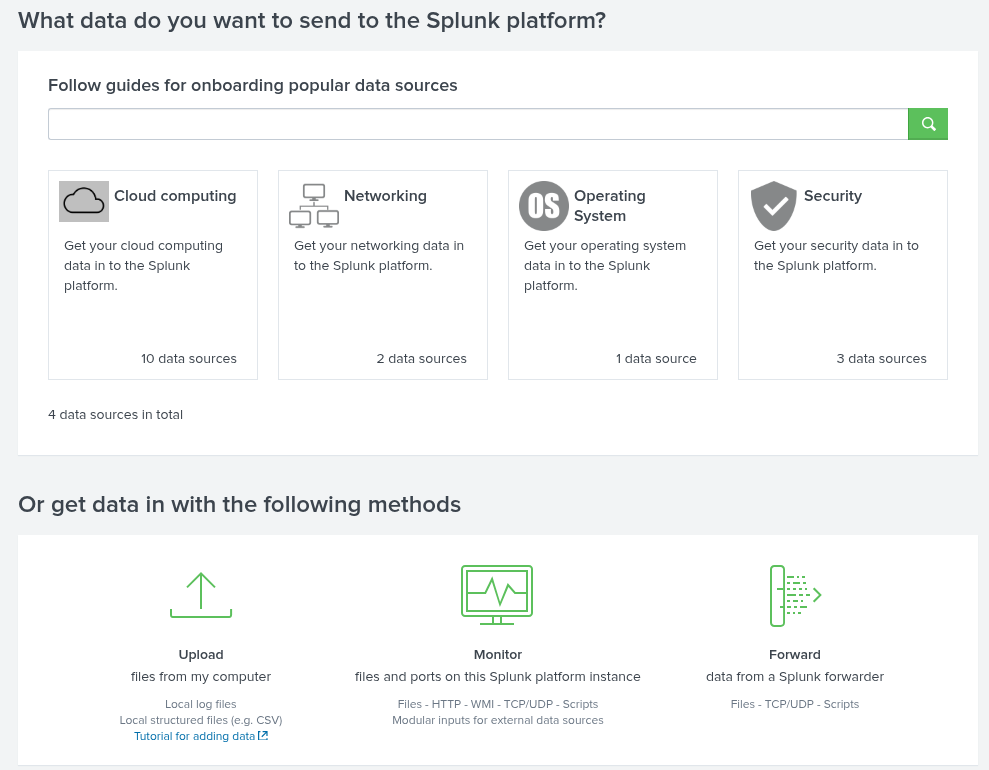

   **Answer: Monitor**

---

## Task 5 - Adding Data

### Key Concepts

The magic of Splunk is that it can ingest virtually any type of data and turn it into a series of events. Inside Splunks documentation we can see the types of data it can normalize:
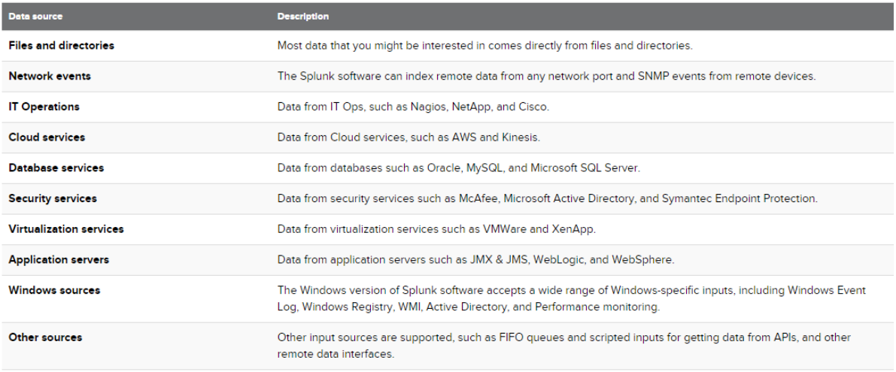

**Five-step ingestion process:**

| Step | Name               | What you configure                                                 |
| ---- | ------------------ | ------------------------------------------------------------------ |
| 1    | Select Source      | Which log file do we upload to Splunk                              |
| 2    | Select Source Type | The log type, JSON, syslog, etc...                                 |
| 3    | Input Settings     | Where does Splunk save the events of the logs you submitted, Index |
| 4    | Review             | Review all the configurations                                      |
| 5    | Done               | This completes the upload, data is ready to be analyzed by Splunk  |

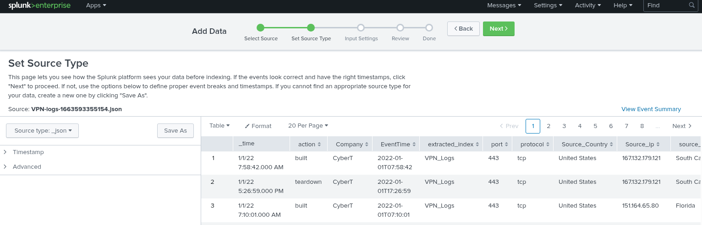
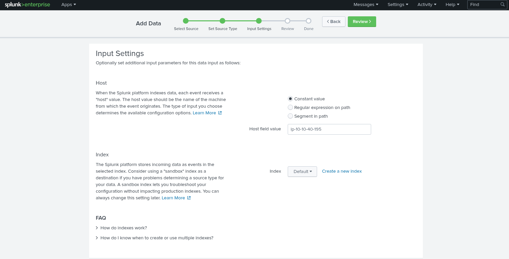
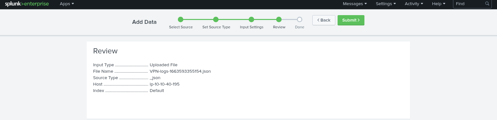

| Question                      | SPL Query Used            |
| ----------------------------- | ------------------------- |
| Total event count             |  index="VPN_Logs    |
| Events by user Maleena        | UserName="Maleena"        |
| Username for IP 107.14.182.38 | Source_ip="107.14.182.38" |
| Events excluding France       | Source_Country!="France"  |
| Events for IP 107.3.206.58    |                           |
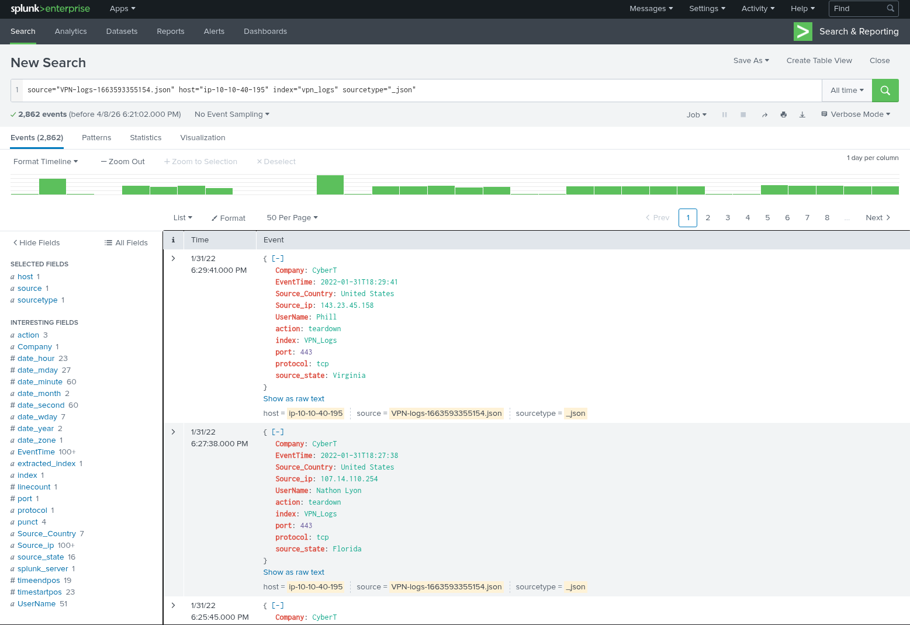
### Task Questions

1. Upload the data attached to this task and create an index "VPN_Logs". How many events are present in the log file?

   **Answer:**

2. How many log events are captured by the user Maleena?
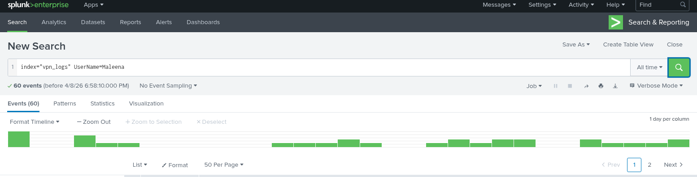

   **Answer: 60**

3. What is the username associated with IP 107.14.182.38?
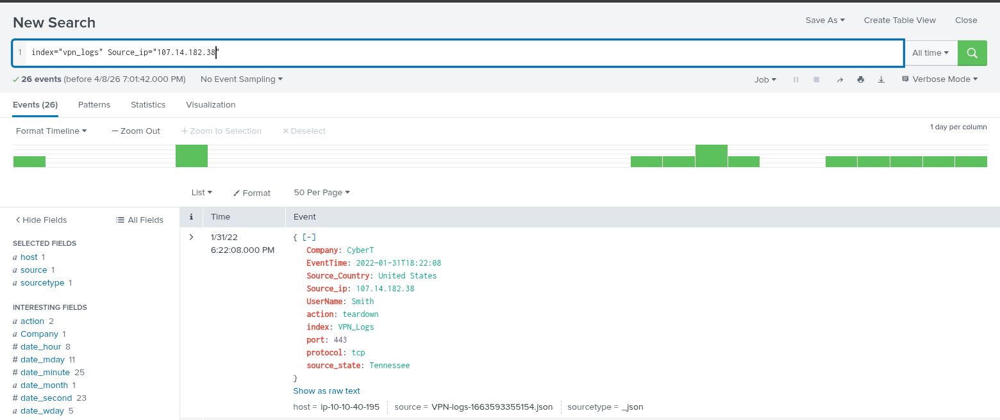

   **Answer: Smith**

4. What is the number of events that originated from all countries except France?

   **Answer: 2,814**

5. How many VPN events were associated with the IP 107.3.206.58?
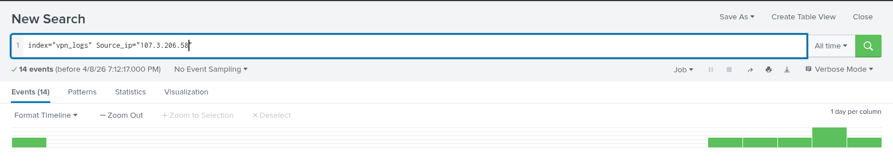

   **Answer: 14**

---

## Task 6 - Conclusion

### Key Concepts

Things i realized i could now do in Splunk is upload multiple logs and analyze them. Having to manually scroll or use Find Me is not time efficient and honestly confuses your eyes when you are looking at unbroken hundreds of thousands of lines. Everything is broken down here or better yet something i learned it turns the information into pretty to look at field-pairs!

### Task Questions

1. Join the next room.

---

*Write-up by [Miyu7x](https://github.com/Miyu7x) | TryHackMe: [Miyu7](https://tryhackme.com/p/Miyu7)*