# Elastic Stack: The Basics

---

## Task 1 - Introduction

### Key Concepts

The **Elastic Stack (ELK)** stands for Elasticsearch, Logstash, and Kibana. Together these open-source tools handle the full data lifecycle:

- Collect
- Store
- Analyze
- Visualize

### Task Questions

1. I am all set!
   - **Answer:**

---

## Task 2 - Elastic Stack Overview

### Key Concepts

ELK combines open-source tools to collect data from any source, store it, search it, and visualize it in real time.
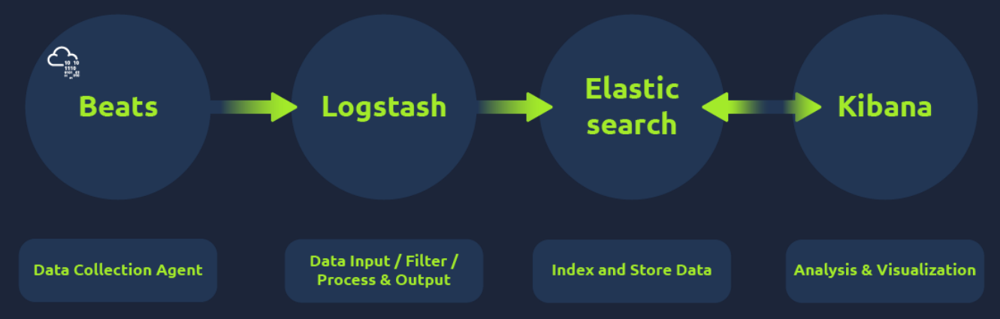

**Elasticsearch** is a full-text search and analytics engine designed for JSON-based documents.
- Stores
- Analyzes
- Correlates data

**Logstash** is responsible for data processing. It filters and normalizes data, then sends it to a destination such as Kibana or a listening port. It has three sections:
- **Input** - where the user defines the data source
- **Filter** - where normalization rules are applied to the ingested data
- **Output** - where the filtered data is sent: Kibana, a listening port, an Elasticsearch database, or a file

**Beats** are data shippers that transfer data from endpoints to Elasticsearch.
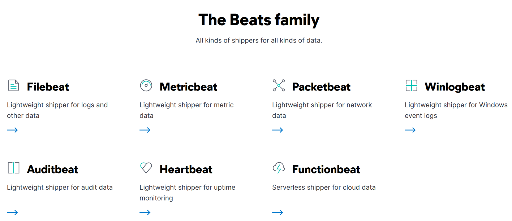

| Component     | Role in ELK                                      | SOC Relevance                                          |
| ------------- | ------------------------------------------------ | ------------------------------------------------------ |
| Elasticsearch | Full-text search and analytics database          | Stores and searches all ingested log data              |
| Logstash      | Data processing pipeline (input, filter, output) | Normalizes raw logs into structured fields             |
| Beats         | Lightweight endpoint data shippers               | Collects logs from hosts and forwards to Elasticsearch |
| Kibana        | Web-based visualization and analysis interface   | Primary interface for SOC analysts during triage       |

### Task Questions

1. Logstash is used to visualize the data. (yay / nay)
   - **Answer: Nay**

2. Elasticsearch supports all data formats apart from JSON. (yay / nay)
   - **Answer: Nay**

---

## Task 3 - Lab Connection

### Key Concepts

<!-- Note the machine IP, credentials, and access method used. -->

### Task Questions

1. Move to the next task!
   - **Answer:**

---

## Task 4 - Discover Tab

### Key Concepts

The **Discover Tab** is where SOC analysts spend most of their time. It surfaces all ingested logs and provides the tools needed to search, filter, and investigate them.

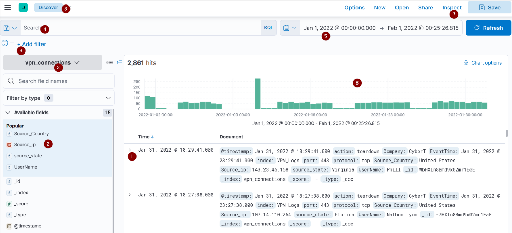

| UI Element       | What It Does                                                        |
| ---------------- | ------------------------------------------------------------------- |
| 1. Logs          | Each row represents a single event with its fields and values       |
| 2. Fields Pane   | Shows parsed fields; use + to include and - to exclude values       |
| 3. Index Pattern | Selects which log source to query (e.g., vpn_connections)           |
| 4. Search Bar    | Accepts KQL queries and filters to narrow down results              |
| 5. Time Filter   | Restricts results to a specific time range                          |
| 6. Time Interval | Bar chart showing event count over time; useful for spotting spikes |
| 7. Top Bar       | Save, open, and share searches                                      |
| 8. Discover Tab  | The main log analysis workspace                                     |
| 9. Add Filter    | Apply field-based filters without typing a full query               |

**Index patterns** are required by Kibana to know which Elasticsearch data to query. Each log source has its own structure, so each gets its own index pattern with normalized fields. One index pattern can point to multiple indices.

**Creating a table view** by selecting specific fields from the Fields Pane reduces noise and makes logs easier to read. You can save the table layout so it persists across sessions.

### Task Questions

1. Select the index vpn_connections and filter from 31st December 2021 to 2nd Feb 2022. How many hits are returned?
   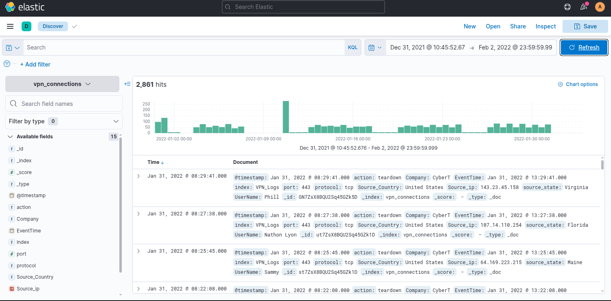
   - **Answer: 2861**

2. Which IP address has the maximum number of connections?
   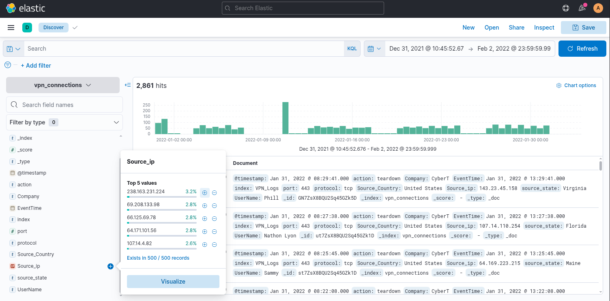
   - **Answer: 238.163.231.224**

3. Which user is responsible for the overall maximum traffic?
   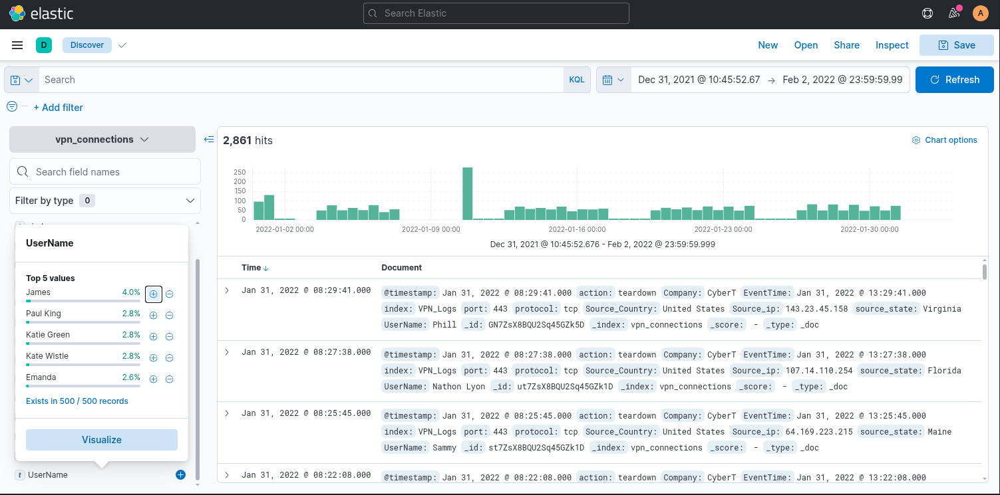
   - **Answer: James**

4. Apply Filter on UserName Emanda; which SourceIP has max hits?
   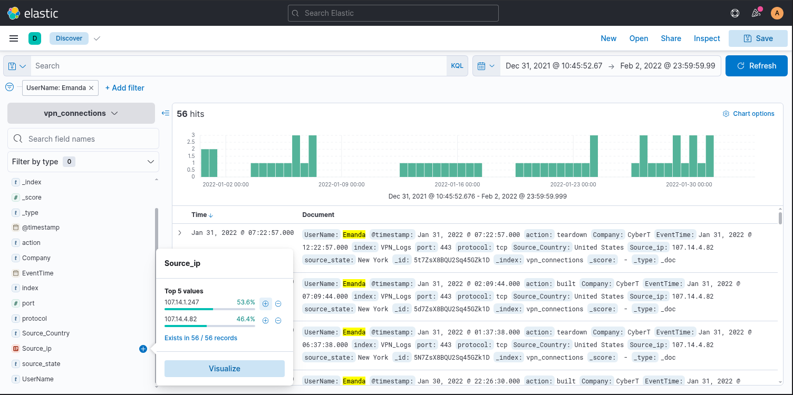
   - **Answer: 107.14.1.247**

5. On 11th Jan, which IP caused the spike observed in the time chart?
   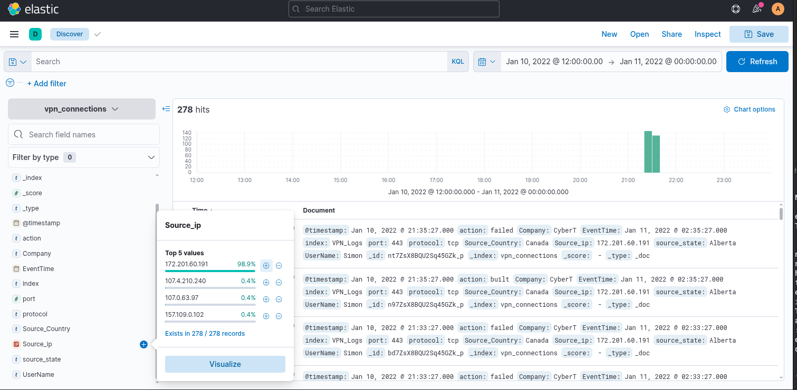
   - **Answer: 172.201.60.191**

6. How many connections were observed from IP 238.163.231.224, excluding the New York state?
    
   - **Answer: 48**

7. Create a table with the fields IP, UserName, Source_Country and save.
   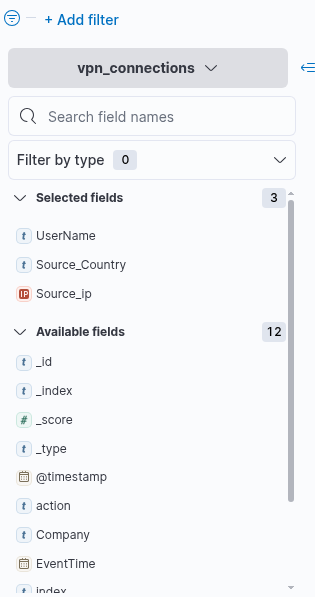
   - **Answer: UserName, Source_Country, Source_ip**

---

## Task 5 - KQL Overview

### Key Concepts

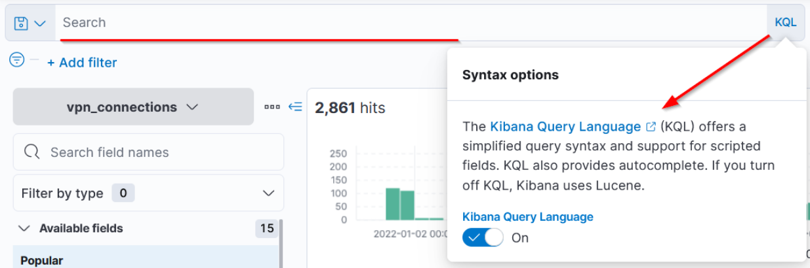

**Kibana Query Language (KQL)** is the search language used inside the Discover tab to query ingested logs. There are two search methods:

**Free text search** - type a term directly into the search bar. KQL matches whole terms only. Searching `United` returns no results, but `"United States"` returns all logs containing that exact phrase.
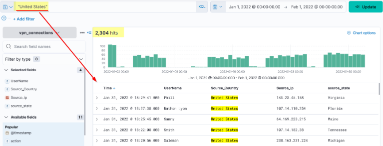
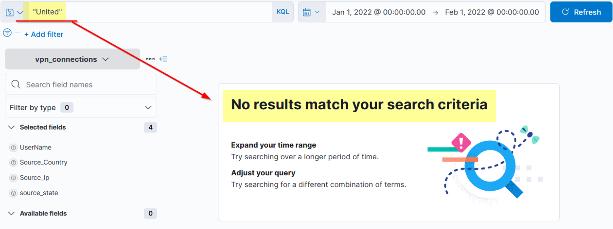

**Wildcard search** - append `*` to match partial terms. Searching `United*` returns logs containing United States, United Kingdom, or any term starting with United.
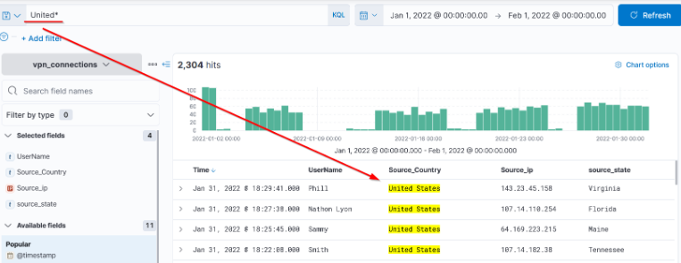

**Field-based search** uses the syntax `Field: Value` with a colon as the separator. This targets a specific field rather than searching across all fields. Example: `Source_ip: 238.163.231.224 AND UserName: Suleman`

| Operator    | Syntax Example                          | When to Use                                        |
| ----------- | --------------------------------------- | -------------------------------------------------- |
| AND         | `"United States" AND "Virginia"`        | Both conditions must be true                       |
| OR          | `"United States" OR "England"`          | Either condition can be true                       |
| NOT         | `"United States" AND NOT ("Florida")`   | Exclude a specific term from results               |
| Wildcard *  | `United*`                               | Match partial terms or unknown trailing characters |
| Field-based | `UserName: Kat`                         | Target a specific field rather than all fields     |

### Task Questions

1. Create a search query to filter the logs where Source_Country is the United States and show logs from User James or Albert. How many records were returned?
   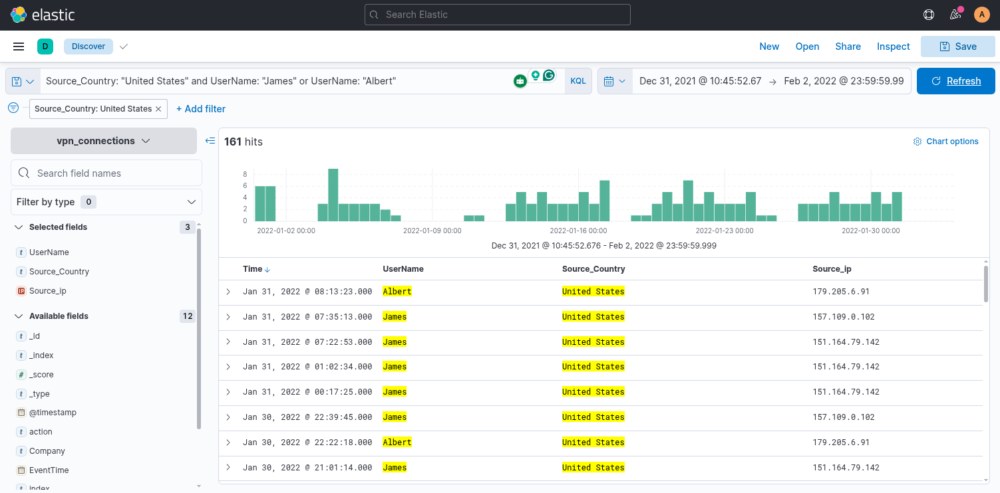
   - **Answer: 161**

2. A user Johny Brown was terminated on the 1st of January, 2022. Create a search query to determine how many times a VPN connection was observed after his termination.
   
   - **Answer: 1**

---

## Task 6 - Creating Visualizations

### Key Concepts

The **Visualize tab** allows you to represent log data in formats like tables, pie charts, and bar charts. Rather than navigating to the Visualize tab from scratch, the fastest path is to click any field in the Fields Pane and hit the **Visualize** button at the bottom of the popover. This launches the Visualize tab with that field already loaded.

**Correlations** can be created by dragging a second field into the visualization to cross-reference two fields, such as Source_Country against Source_ip.

When saving a visualization, check **Add to library** so it is available when building dashboards in Task 7.

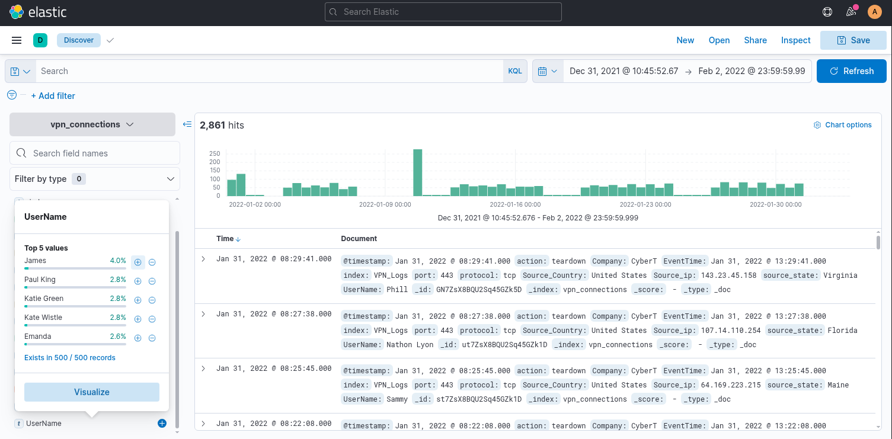

### Task Questions

1. Which user was observed with the greatest number of failed attempts?
   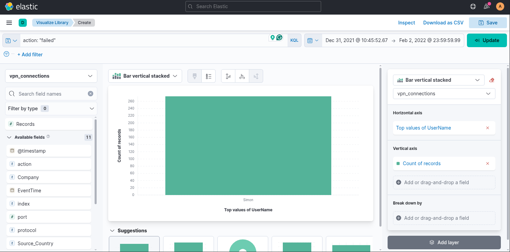
   - **Answer: Simon**

2. How many wrong VPN connection attempts were observed in January?
   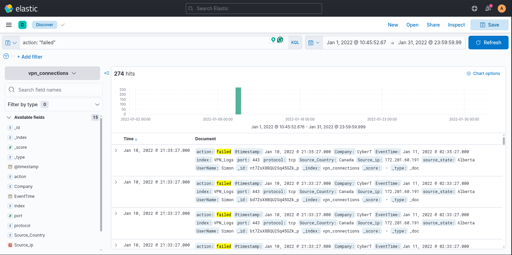
   - **Answer: 274**

---

## Task 7 - Creating Dashboards

### Key Concepts

A **dashboard** combines saved searches and saved visualizations into a single view, giving you a consolidated picture of log activity without having to run individual queries repeatedly.

To build one: go to the Dashboard tab, click **Create dashboard**, then **Add from Library**. Any searches or visualizations saved with **Add to library** checked will appear here. Adjust the layout and save the dashboard when done.

Note: the room expects you to have been saving searches and visualizations throughout previous tasks. It does not explicitly tell you this until Task 7. If anything is missing, go back to the Discover or Visualize tab, rerun the relevant query, and save it to the library before returning here.

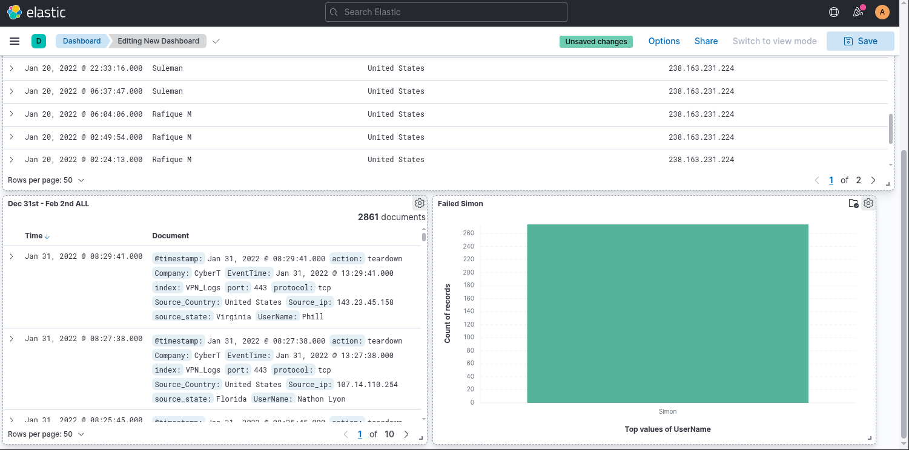

### Task Questions

1. Create the dashboard containing the available visualizations.
   - **Answer: No answer needed**

---

## Task 8 - Conclusion

### Key Concepts

ELK is a powerful log analysis platform that many SOC teams use as a SIEM-adjacent tool. It is not a traditional SIEM, but its search depth, visualization flexibility, and real-time data handling make it genuinely useful for triage and investigation work.

The workflow this room covered maps directly to real SOC tasks: ingest logs, search and filter with KQL, surface patterns through visualizations, and consolidate visibility into dashboards. The Discover tab is where most of the investigative work happens, and KQL is the skill that makes it efficient.

One honest note on the room itself: the save prompts were inconsistent throughout. Task 4 mentions saving a table at the very end, and saving is not mentioned again until Task 7 assumes you have already saved everything. When building your own workflow, save searches and visualizations as you go, not after the fact.

### Task Questions

1. Complete the room.
   - **Answer: No answer needed**

---

*Write-up by [Miyu7x](https://github.com/Miyu7x) | TryHackMe: [Miyu7](https://tryhackme.com/p/Miyu7)*
