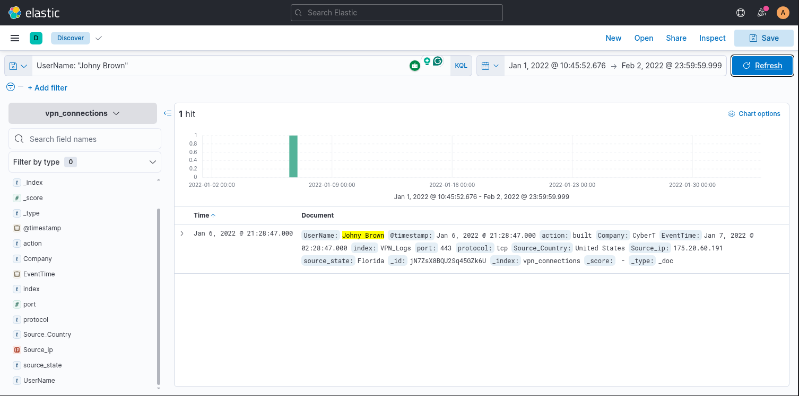

# Elastic Stack: The Basics

---

## Task 1 - Introduction

### Key Concepts

The **Elastic Stack or ELK** is Elasticsearch, Logstash, and Kibana, in combination open source security tools that are used together, they handle data:
- Collect 
- Store
- Analyze
- Visualize

### Task Questions

1. I am all set!
   - Answer:

---

## Task 2 - Elastic Stack Overview

### Key Concepts

The ELK combines open source security tools to to collect data from ANY source, store, search it and visualize it in real time.

**ElasticSearch** is a full text-search and analytics tool designed for JSON based documents. 
	- Stores
	- Analyzes
	- Correlates data

**Logstash** is reposnsible for data processing. It filters and normalizes the data and sends it to a destination, which could be Kibana or a listening port!
	- **Input** where the user chooses where the data is coming from
	- **Filter** the user uses the filter options to be applied to the data that was input
	- **Output** is where the user chooses the filtered data to be sent to: Kibana, listening port, Elasticsearch database, or file.

**Beats** are data shippers, they transfer data from the endpoint to Elasticsearch

### Task Questions

1. Logstash is used to visualize the data. (yay / nay)
   - **Answer: Nay

2. Elasticsearch supports all data formats apart from JSON. (yay / nay)
   - **Answer: Nay**

---

## Task 3 - Lab Connection

### Key Concepts

<!-- No content to analyze here. Note the machine IP, credentials, and access method you used. -->

### Task Questions

1. Move to the next task!
   - Answer:

---

## Task 4 - Discover Tab

### Key Concepts

The **Discover Tab** is where SOC's  spend most of our time, there are a lot of tools here:
- Ingested Logs
- Search Bar
- Normalized Fields 
- Investigate anomalies
- Apply filters

| UI Element       |                                                                |
| ---------------- | -------------------------------------------------------------- |
| 1. Logs          | Each row shows information about a single event                |
| 2. Fields Pane   | Add/remove filters, shows which filters have been applied      |
| 3. Index Pattern | Each log that we upload gets saved under a name we choose here |
| 4. Search Bar    | Search queries and apply filters to narrow down results        |
| 5. Time Filter   | Narrow down a specific time in the log                         |
| 6. Time Interval | Shows the events count over time                               |
| 7. Top Bar       | Save the search, open saved searches, share...                 |
| 8. Discover Tab  | This is the main workspace we are currently in                 |
| 9. Add Filter    | apply filters rather then typing them in the search            |

### Task Questions

1. Select the index vpn_connections and filter from 31st December 2021 to 2nd Feb 2022. How many hits are returned?
   
   - **Answer: 2861**

1. Which IP address has the maximum number of connections?
   
   - **Answer: 238.163.231.224**

1. Which user is responsible for the overall maximum traffic?
   
   - **Answer: James**

1. Apply Filter on UserName Emanda; which SourceIP has max hits?
   
   - **Answer: 107.14.1.247**

1. On 11th Jan, which IP caused the spike observed in the time chart?
   
   - **Answer: 172.201.60.191**

1. How many connections were observed from IP 238.163.231.224, excluding the New York state?
   
   - **Answer: 48**

1. Create a table with the fields IP, UserName, Source_Country and save.
   
   - **Answer: UserName, Source_Country, Source_ip**

---

## Task 5 - KQL Overview

### Key Concepts

**Kibana Query Langage or KQL** is a special lanaguage we can use in the search for our search queries inside our ingested logs. 2 methods for searching:
	- **Free text search** we type in the search bar in plain terms, if we are searching for a country we simply use "United States" in the search bar. However if we were to only search the single word "United" it would return 0 searches. It has to be the whole term when we search.
	  
	  
  
	
- **KQL search** allows to search any term to match even just a part of the word. We would simply search United* and that would search for all terms containing that
  

| Operator    | Syntax Example                     | When to Use                                   |
| ----------- | ---------------------------------- | --------------------------------------------- |
| AND         | "United States" AND "Virginia"     | When you want to search for both items        |
| OR          | "United States" OR "England"       | When you want either one or the other         |
| NOT         | "United States" AND NOT("Florida") | All results for United States and NOT Florida |
| Wildcard *  |                                    |                                               |
| Field-based | Username: Kat                      | Field: Name                                   |

<!-- What is the field-based search syntax? What separator does it use? -->

### Task Questions

1. Create a search query to filter the logs where Source_Country is the United States and show logs from User James or Albert. How many records were returned?
   
   - **Answer: 161**

1. A user Johny Brown was terminated on the 1st of January, 2022. Create a search query to determine how many times a VPN connection was observed after his termination.

   - **Answer: 1**

---

## Task 6 - Creating Visualizations

### Key Concepts

Sometimes we need to view data in a different format, we can do this this by going to the **Visualize** tab, here we can create tables, all kinds of charts from our logs.

Under the filters if we click on a value we can **Visualize** directly from here 

### Task Questions

1. Which user was observed with the greatest number of failed attempts?
   
   - **Answer: Simon**

1. How many wrong VPN connection attempts were observed in January?

   - **Answer: 274**

---

## Task 7 - Creating Dashboards

### Key Concepts

### Task Questions

1. Create the dashboard containing the available visualizations.
   - **Answer: Check**

---

## Task 8 - Conclusion

### Key Concepts

I learned a lot today, I can see how ELK is an amazing tool for SOC analysts. The Visulization part really gives you a different view on the "normal" event logs we typically see.

On the other hand i must say the THM directions for the room really left a lot to be desired. This is one where they could go back and do some updates. It only tells you to save on TASK 4 at the very last question and the word save is not seen again until TASK 7 where they have expected you to save all your prior searches.

### Task Questions

1. Complete the room.

---

*Write-up by [Miyu7x](https://github.com/Miyu7x) | TryHackMe: [Miyu7](https://tryhackme.com/p/Miyu7)*