# Introduction to SOAR

---

## Task 1 - Introduction

### Key Concepts

An SOC analyst job can be tiring, with loads of manual processing and far too many disconnected tools along with difficulties in communication across teams.

**SOAR** Security Orchestration, Automation, and Response; is the tool SOC analysts use to overcome those challenges.

### Task Questions

1. Let's get started!
   - **Answer: Check**

---

## Task 2 - Traditional SOC and Challenges

### Key Concepts

SOC analysts job revolves around monitoring and protecting digital assets. The effectiveness of an SOC team is measured by their ability to continuously monitor, analyze and how they handle security incidents.

Challenges faced by SOCs
- Alert Fatigue
- Too many disconnected tools
- Manual Processes
- Talent Shortage

- **Monitoring and Detection** 24/7 around the clock scanning and flagging suspicious activities within a network environment. Tool: SIEM

- **Recovery and Remediation** Once a threat has been discovered the SOC team are the first-responders. Tools: EDRs, firewalls, IAM (Identity and Access management)
	- isolating environments
	- shutting down infected endpoints 
	- removing malware 
	- stopping malicious processes 
	
- **Threat Intelligence** Hackers are alwauys finding new exploiuts and SOC analysts need to keep by studying these new threats. Tools: latest threat data which includes, domains, IP addresses, hashes and others.

- **Communication** is vital skill for any SOC analyst to have, as you have to coordinate your work with others as well as IT teams and management effectively.
	- How to properly communicate an escalated event to your L2

### Task Questions

1. How would you describe the experience of an overload of security events being triggered within a SOC?
   - **Answer: Alert Fatigue**

---

## Task 3 - Overcoming SOC Challenges with SOAR

### Key Concepts

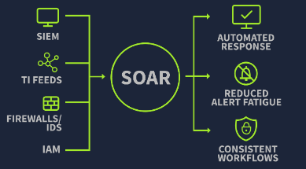

**SOAR was designed to combat the issues faced daily by SOC teams**
- Alert Fatigue
- Too many disconnected tools
- Manual Processes
- Talent Shortage

**Security Orchestration Automation and Response**
- **UNIFIES** all the security tools SOC use
	- This means all the tools in one interface, without having top switch between EDR, SIEM, Firewall and other individual tools
	- SOAR uses **playbooks** which are predefined steps on how SOAR investigates an alert

The playbook may come predefined by the system but the best security is a playbook that's has been crafted based on the company's needs and traffic
- **Automation** means if SOAR has a predefined playbook on how to handle VPN brute force attacks it follows those steps in remediating the threat
- **Response** SOAR automatically responds to threat or attack
	- SOAR receives alert form SIEM
	- Automatically pulls a search for the users history of logins
	- Automatically verify the IP legality through the TI platform?
	- If malicious IP, it **automatically** disables the user  in the Identity and Access Management
	- Automatically opens a ticket with all the information about the alert and investigation
	

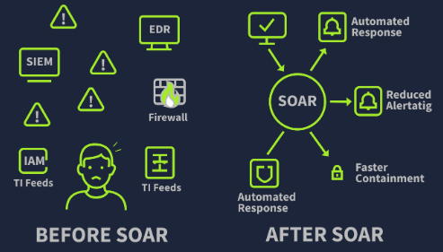

**SOAR** is an amazing tool that may seem that it can work byitself. However we sill need SOC analysts inorder to;
- Make a judgment call on a critical point
- Understand threats in a business context
- the SOAR **playbook** is crafted by SOC analysts, so your SOAR automation is only as good as the analyst who crafted it

### Task Questions

1. The act of connecting and integrating security tools and systems into seamless workflows is known as?
   - **Answer: Orchestration**

2. What do we call a predefined list of actions to handle an incident?
   - **Answer: Playbook**

---

## Task 4 - Building SOAR Playbooks

### Key Concepts

A good playbook is one that works, one of the msot common causes of attacks is due to **PHISHING** so analysts need to craft and update their playbook regularly

**Phishing Playbook Example**
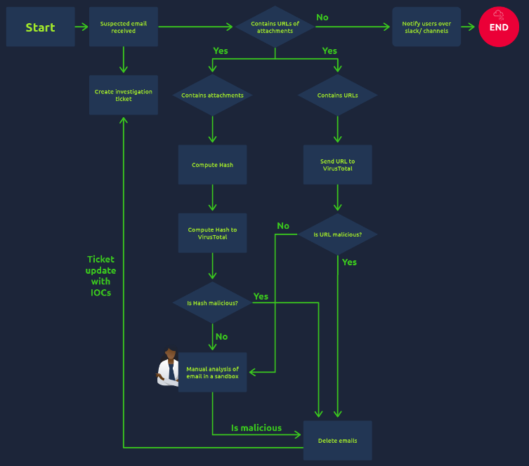

A **CVE Playbook** involves crafting a playbook for a known vulnerability. If you follow Exploit-DB you will see that new vulnerabilities arise everyday, so it is important that SOC analysts keep these playbooks updated!

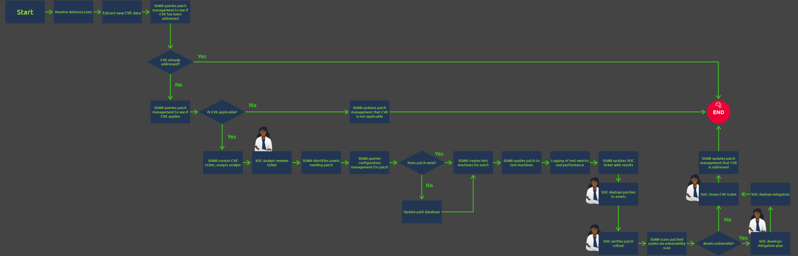
<!-- Trace the phishing playbook flow in your own words. What are the decision points - the "if this, then that" branches? Why do branching paths matter more than a linear checklist? -->

<!-- What is a CVE and why does patching management become overwhelming without automation? -->

<!-- In the CVE patching playbook, where does a SOC analyst appear? What decision is only a human making there? -->

<!-- Both playbooks are shown as flow diagrams. What does that format tell you about how SOAR thinks about investigations - as structured logic, not open-ended judgment? -->

### Phishing Playbook - Key Decision Points

| Step | Condition | Path A | Path B |
|---|---|---|---|
| Initial check | Contains URL or attachment? | | |
| | | | |

### Task Questions

1. Is manual analysis vital within a SOAR workflow? Yay or Nay?
   - **Answer: Yay**

2. From where is the CVE Patching playbook fetching the new CVEs?
   - **Answer: Advisory Lists**

3. In the CVE Patching playbook, if the assets are found vulnerable even after the patch is deployed, what does the SOC develop next?
   - **Answer: Mitigation Plan**

---

## Task 5 - Threat Intel Workflow Practical

### Key Concepts

The challenge is to adopt the SOAR tool in our teams investigation. This challenge we set up a SOAR playbook and automation workflow

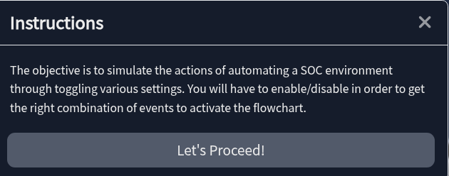

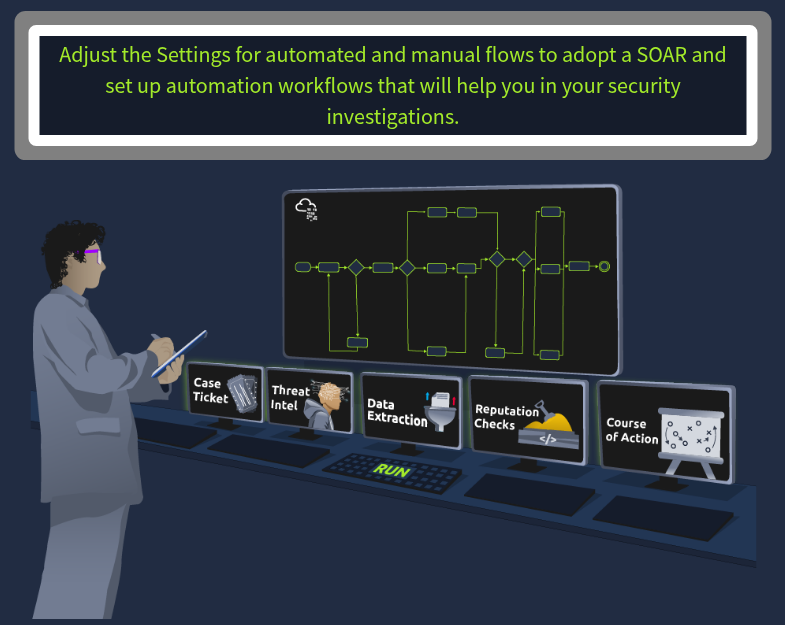

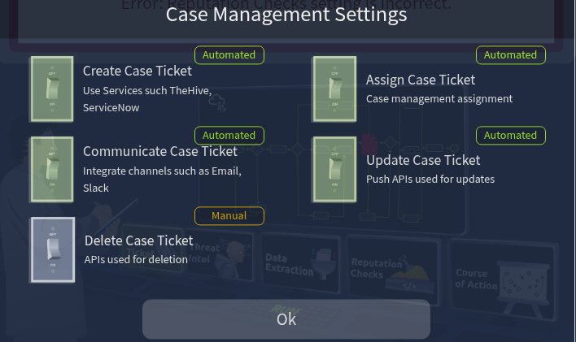

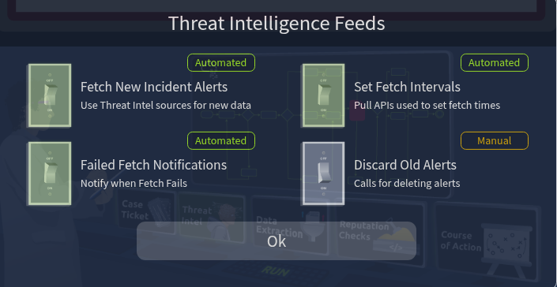

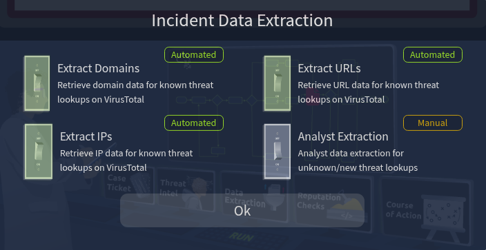

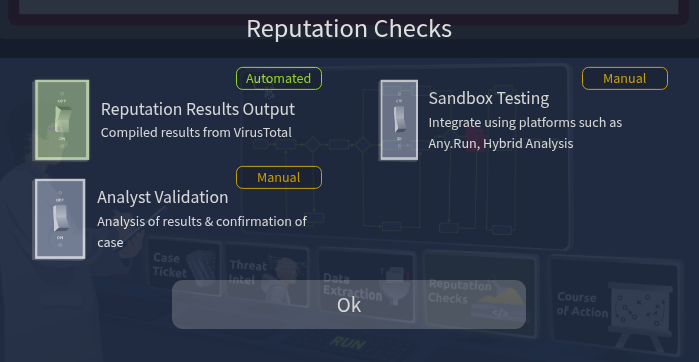

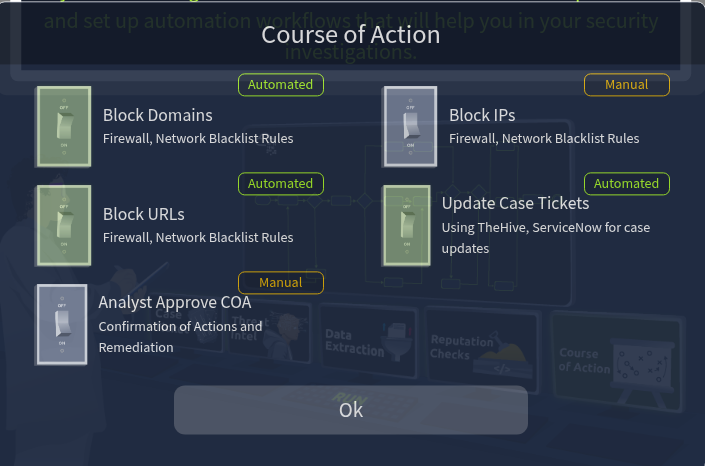
### Task Questions

1. What is the flag received?
   - **Answer: THM{AUT0M@T1N6_S3CUR1T¥}**

---

## Task 6 - Conclusion

### Key Concepts

This room has taught me that SOAR was invented to easy the load on SOC analysts but also how VITAL SOC analysts are to SOAR.
One does not work without the other its a symbiotic relationship.

### Task Questions

1. Power to Security Orchestration and Automation.
   - **Answer: Check**

---

*Write-up by [Miyu7x](https://github.com/Miyu7x) | TryHackMe: [Miyu7](https://tryhackme.com/p/Miyu7)*