## Task 1 - Introduction

**Pyramid of Pain**

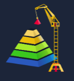

### Key Concepts

**IOCs** or Indicators of Compromise are compilations of threat intelligence collected by SOCs. This threat intelligence is categorized by severity, high impact at the top, low at the bottom.

When a threat arises, a SOC can determine what to hunt. The goal is big game, not low-hanging fruit like changed hashes and IP addresses, the real prize is high-impact detections like **Tactics, Techniques, and Procedures**.

Security platforms that have adopted the Pyramid of Pain:
- Cisco Security
- SentinelOne
- SOCRadar

The Pyramid of Pain is essential knowledge for:
- SOC Analysts
- Threat Hunters
- Incident Responders

### Task Questions

1. Read the above.
   - **Answer:** Check

---

## Task 2 - Hash Values (Trivial)

### Key Concepts

**Hash Value**
- Fixed length
- Unique to its own data
- Result of a hashing algorithm

A **hash** is not considered cryptographically secure if two files share the same hash value.

SOC analysts use hash values to:
- Gain insight into a malware sample
- Understand a malicious or suspicious file
- Uniquely identify and reference a malicious artifact

| Algorithm | Hash Size | Status |
|-----------|-----------|--------|
| MD5 | 128-bit | Not cryptographically secure |
| SHA-1 | 160-bit | Deprecated (NIST, 2011) |
| SHA-256 | 256-bit | Current standard |

**Attackers** can modify a single bit of a file and produce a completely different hash value.
- Malware has many variations and instances
- **Threat hunting** using hashes as your **Indicator of Compromise (IOC)** can become difficult

### Task Questions

1. Analyse the report associated with the hash `b8ef959a9176aef07fdca8705254a163b50b49a17217a4ff0107487f59d4a35d`. What is the filename of the sample?
   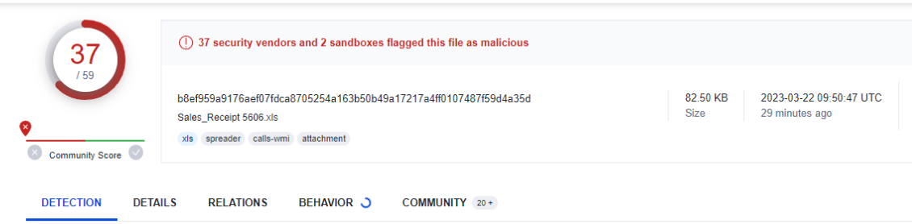
   - **Answer:** Sales_Receipt 5606.xls

---

## Task 3 - IP Address (Easy)

### Key Concepts

**IP addresses** in the Pyramid of Pain are indicated with the color green. SOC analysts can block IPs, which is great for base security, but attackers can simply obtain a new IP address -- making it a **trivial security** method.

**Fast Flux** is a DNS technique used by botnets that leverage compromised hosts acting as proxies.
- Hides phishing
- Web proxying
- Malware delivery
- Network has multiple IP addresses associated with a domain
- Constantly changing

### Task Questions

1. What is the first IP address the malicious process (PID 1632) attempts to communicate with?
   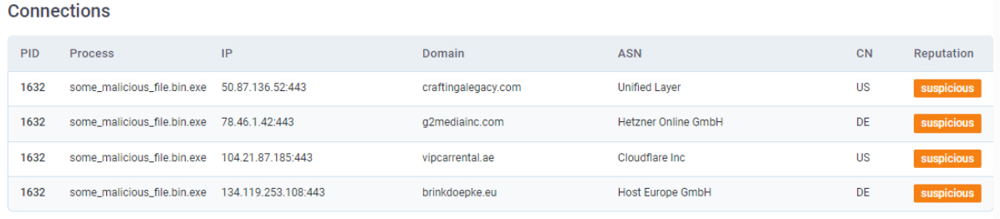
   - **Answer:** 50.87.136.52

2. What is the first domain name the malicious process (PID 1632) attempts to communicate with?
   - **Answer:** craftingalegacy.com

---

## Task 4 - Domain Names (Simple)

### Key Concepts

**Domain Name System**

Unlike IP addresses, attackers cannot simply change a **domain** name, they would have to purchase it, which makes it a more difficult and costly move.

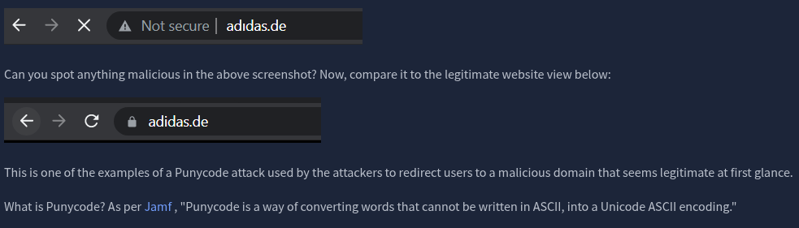

**adıdas.de** would have a Punycode of **http://xn--addas-o4a.de/**

Attackers love to hide malicious domains under shortened URLs:
- bit.ly
- goo.gl
- ow.ly
- x.co

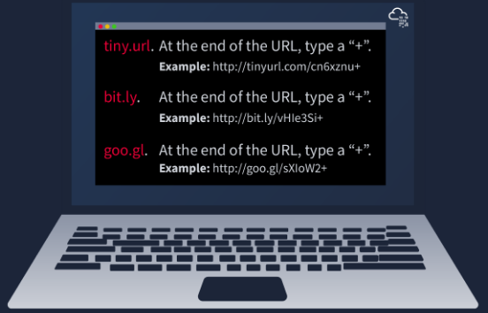

**Detecting malicious domains:**
- Proxy logs
- Web server logs

**Any.run** is a sandboxing service SOC analysts can use to review HTTP requests and DNS requests.

**HTTP Requests Tab** -- Shows recorded HTTP requests since detonation of the sample

**Connections** -- Shows any communication made since detonation of the sample

**DNS Requests** -- Shows DNS requests made since detonation of the sample

### Task Questions

1. Go to the any.run report and provide the first suspicious domain request you are seeing.
   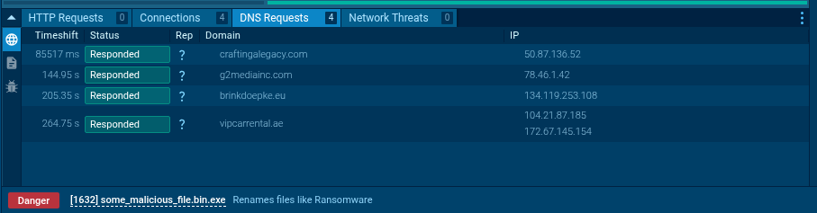
   - **Answer:** craftingalegacy.com

2. What term refers to an address used to access websites?
   - **Answer:** Domain Name

3. What type of attack uses Unicode characters in the domain name to imitate a known domain?
   - **Answer:** Punycode Attack

4. Provide the redirected website for the shortened URL using a preview: `https://tinyurl.com/bw7t8p4u`
   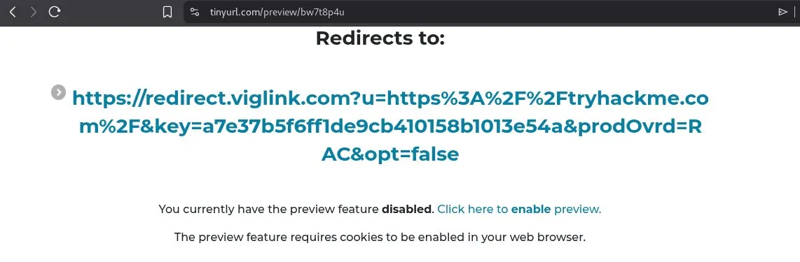
   - **Answer:** https://tryhackme.com

---

## Task 5 - Host Artifacts (Annoying)

### Key Concepts

**Host artifacts** are traces or "crumbs" left behind by an attacker on your system:
- Registry values
- Suspicious process execution
- Attack patterns
- Indicators of Compromise
- Files dropped in unexpected locations

If an attacker gets caught at this stage, they have to rebuild their entire toolkit, it is not as simple as changing a hash or grabbing a new IP address.

### Task Questions

1. A process named `regidle.exe` makes a POST request to an IP address based in the United States on port 8080. What is the IP address?
   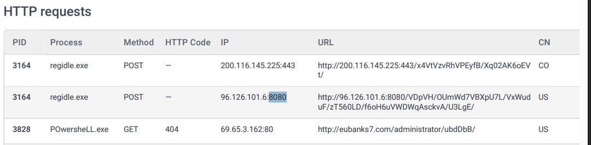
   - **Answer:** 96.126.101.6

2. The actor drops a malicious executable (EXE). What is the name of this executable?
   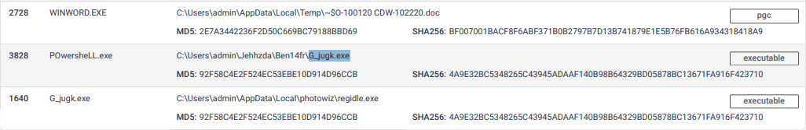
   - **Answer:** G_jugk.exe

3. Look at the Virustotal report. How many vendors determine this host to be malicious?
   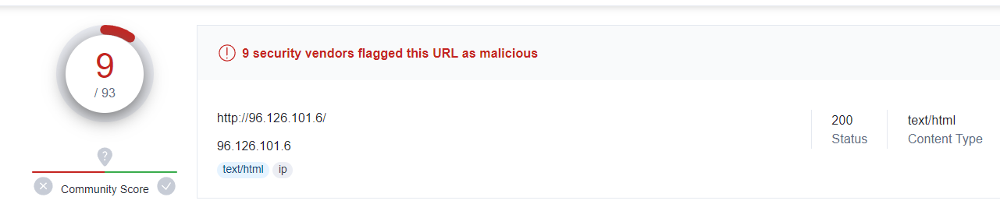
   - **Answer:** 9

---

## Task 6 - Network Artifacts (Annoying)

### Key Concepts

**Network Artifacts**

**User-Agent** strings can be found in the headers of internet traffic. They contain information about the OS and browser the attacker is using.

**C2 communication** or "phone home" is how the attacker communicates with the infected machine.

Because malware often hits specific **URIs** in a predictable pattern, for example, POSTing to `/api/v1/checkin` every 60 seconds, that behavior becomes a detectable fingerprint.

### Task Questions

1. What browser uses the User-Agent string shown in the screenshot above?
   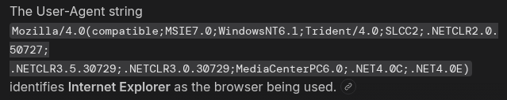
   - **Answer:** Internet Explorer

2. How many POST requests are in the screenshot from the pcap file?
   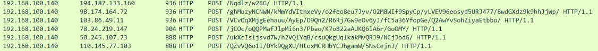
   - **Answer:** 6

---

## Task 7 - Tools (Challenging)

### Key Concepts

If an attacker gets caught here with their tool, it is essentially game over for that tool. They would have to either build a new one or learn a new one entirely, which is incredibly time-consuming.

**SOC Prime Threat Detection Marketplace** -- A platform where SOC professionals share detection rules for active threats: https://tdm.socprime.com/active-threats/

Resources for malware samples, malicious feeds, and YARA results:
- **MalwareBazaar** https://bazaar.abuse.ch/
- **Malshare** https://malshare.com/

**Fuzzy Hashing** performs similarity analysis between files to detect minor differences based on fuzzy hash values, useful for identifying malware variants that have been slightly modified.

### Task Questions

1. Provide the method used to determine similarity between the files.
   - **Answer:** Fuzzy Hashing

2. Provide the alternative name for fuzzy hashes without the abbreviation.
   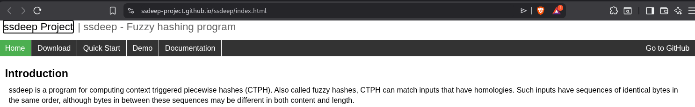
   - **Answer:** Context Triggered Piecewise Hashes

---

## Task 8 - TTPs (Tough)

### Key Concepts

**TTPs -- Tactics, Techniques, and Procedures**

TTPs represent the **entire** MITRE ATT&CK Matrix, every step of an attacker's process from phishing attempts all the way through persistence and data exfiltration.

**Example:** Detecting a Pass-the-Hash attack using Windows Event Log Monitoring allows you to locate the compromised host quickly and stop lateral movement before it spreads.

When TTPs are detected, the attacker has two options:
- Start from scratch, more research, retraining, and newly configured tools
- Give up and find another target

### Task Questions

1. Navigate to the ATT&CK Matrix webpage. How many techniques fall under the Exfiltration category?
   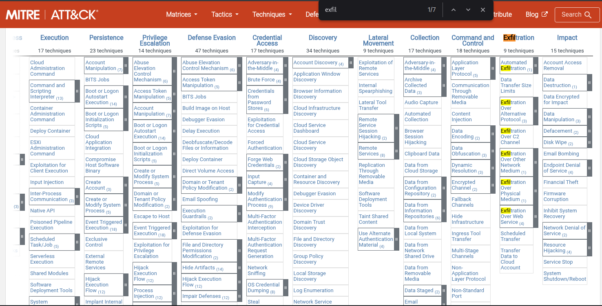
   - **Answer:** 9

2. Chimera is a China-based hacking group active since 2018. What is the name of the commercial remote access tool they use for C2 beacons and data exfiltration?
   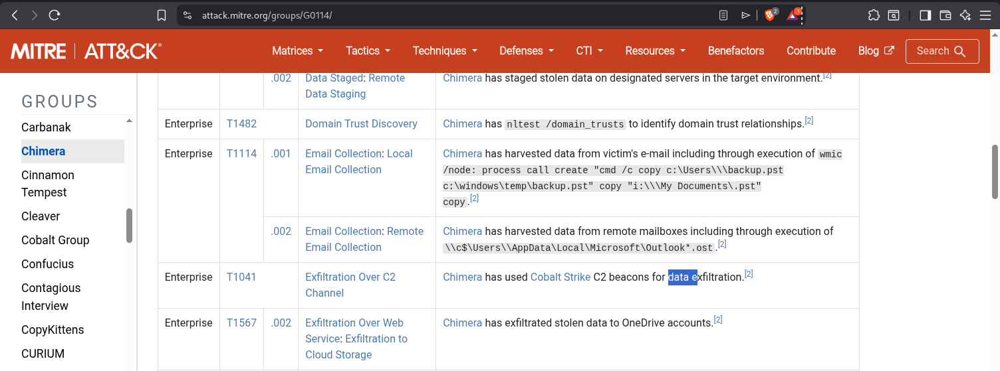
   - **Answer:** Cobalt Strike

---

## Task 9 - Practical: The Pyramid of Pain

### Key Concepts

Apply each IOC type to its correct tier on the pyramid. Review the logic behind each placement before submitting.

### Task Questions

1. Complete the static site. What is the flag?
   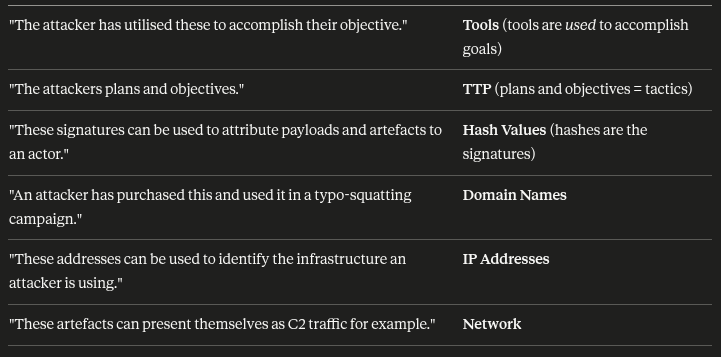
   - **Answer:** THM{PYRAMIDS_COMPLETE}

---

## Task 10 - Conclusion

### Key Concepts

The job of stopping an attacker is not easy, but the sooner we catch them the better. Every trace and crumb they leave behind becomes evidence, and once those fingerprints are burned, they cannot reuse them without being spotted immediately.

Exploring https://tdm.socprime.com/active-threats/ has to be one of the coolest takeaways from a THM room so far. The breadth of shared detection rules in one place is genuinely fascinating.

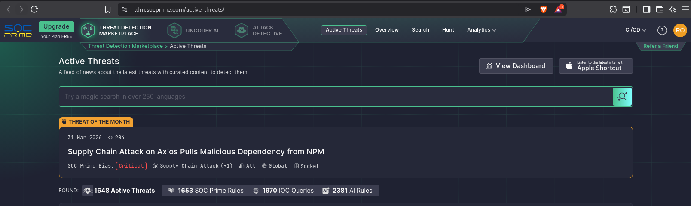

### Task Questions

1. Read the above.
   - **Answer:** Check

---

*Write-up by [Miyu7x](https://github.com/Miyu7x) | TryHackMe: [Miyu7](https://tryhackme.com/p/Miyu7)*
