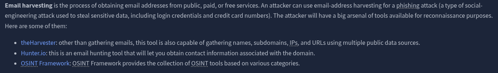
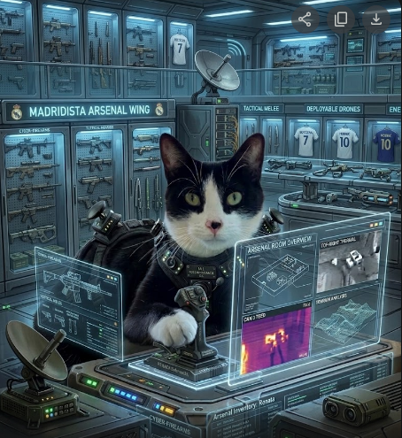
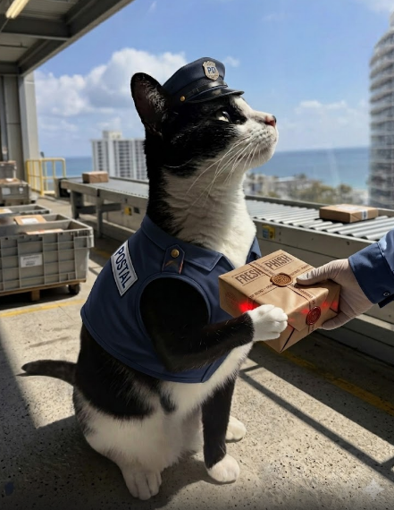
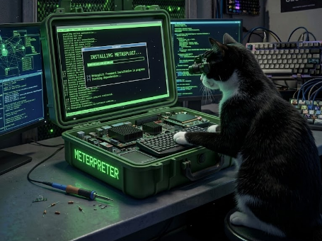
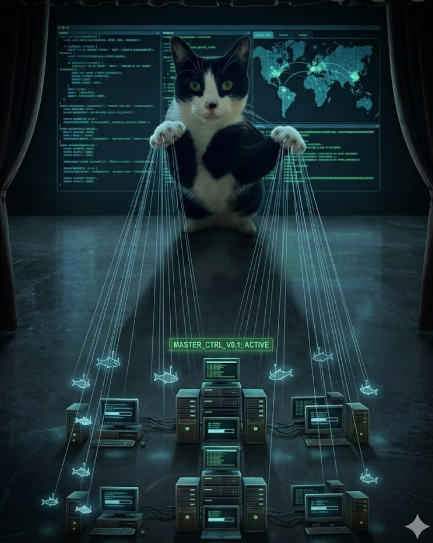
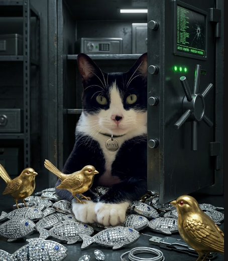

# Cyber Kill Chain

## Task 1 - Introduction

### Key Concepts

The **Cyber Kill Chain** is a military concept that defines the structure of an attack:
- Identify the target
- Decide how to proceed
- Attack the target
- Eliminate the target

In the **Cyber Kill Chain** framework the attacker must complete every phase in order to carry out a successful attack.

As a **SOC Analyst**, understanding the Cyber Kill Chain allows us to recognize intrusion attempts and understand the attacker's goals and objectives.

### Task Questions

1. Read the above.

---

## Task 2 - Reconnaissance

### Key Concepts

**Reconnaissance** is the research phase where the attacker gathers information about their target:
- Infrastructure details
- Employee data
- Business processes
- Exposed technologies

**OSINT (Open-Source Intelligence)** gives attackers publicly available details about a target using:
- Search engines
- Print and online media
- Social media accounts
- Forums and blogs
- Online public records databases
- WHOIS and technical data

**Passive Recon** involves NO direct contact with the target.
**Active Recon** involves DIRECT contact with the target:
- Social engineering
- Port scanning
- Banner grabbing

### Task Questions

1. What is the name of the Intel Gathering Tool that is a web-based interface to the common tools and resources for open-source intelligence?
   - **Answer:** OSINT Framework

2. What is the definition for the email gathering process during the stage of reconnaissance?
   - **Answer:** Email Harvesting

---

## Task 3 - Weaponization

### Key Concepts

In this phase the attacker builds or acquires their **weapon**:
- **Malware** -- a program or software designed to damage, disrupt, or gain unauthorized access to a system
- **Exploit** -- a program or code that takes advantage of a vulnerability or flaw in an application or system
- **Payload** -- the malicious code the attacker executes on the victim's system

### Task Questions

1. What is the term for automated scripts embedded in Microsoft Office documents that can be used to perform tasks or exploited by attackers for malicious purposes?
   - **Answer:** Macro

---

## Task 4 - Delivery

### Key Concepts

The **Delivery** phase is how the attacker gets their weapon to the target:
- **Phishing email** -- malicious link or attachment sent to a specific person (spear phishing) or multiple targets
- **USB drops** -- infected drives left in public places or mailed to targets disguised as gifts
- **Watering hole attacks** -- targeting a specific group by compromising a website they regularly visit, redirecting them to malicious content or triggering a drive-by download

### Task Questions

1. What do you call an attack targeting a specific group by infecting their frequently visited website?
   - **Answer:** Watering Hole Attack

---

## Task 5 - Exploitation

### Key Concepts

Exploitation is the attacker's **"I'm in"** moment -- their code executes on the victim's machine.

The victim could be compromised through:
- **Malicious macro** -- delivered via phishing email, executes on open
- **Zero-day exploits** -- leverages an unknown, undocumented vulnerability with no available patch
- **Known CVEs** -- the attacker identifies and exploits an unpatched public vulnerability

### Task Questions

1. What is the term for a cyber attack that exploits a software vulnerability that is unknown by software vendors?
   - **Answer:** Zero-Day

---

## Task 6 - Installation

### Key Concepts

Installation ensures the attacker maintains access to the victim's system even after reboots, detection, or patching:
- **Web shell** -- a malicious script (.php, .asp, .jsp) planted on a web server to maintain remote access
- **Meterpreter backdoor** -- a Metasploit payload that gives the attacker an interactive remote shell
- **Windows service modification** -- creating or hijacking a service to execute malicious scripts automatically (MITRE T1543.003)
- **Run keys / Startup Folder** -- registry entries that execute the payload every time the user logs in

**Timestomping** disguises malware as a legitimate program by modifying file timestamps -- modified, accessed, created, and changed times -- to mislead forensic investigators.

### Task Questions

1. What technique is used to modify file time attributes to hide new or changes to existing files?
   - **Answer:** Timestomping

2. What malicious script can be planted by an attacker on the web server to maintain access to the compromised system and enables the web server to be accessed remotely?
   - **Answer:** Web Shell

---

## Task 7 - Command & Control

### Key Concepts

Following installation, the attacker executes the malware and opens a **C2 (Command and Control)** channel -- giving them full remote control over the victim's system. The infected host consistently communicates back to the C2 server, a behavior known as **beaconing**.

| C2 Channel | Port(s) | Why It Blends In |
|---|---|---|
| HTTP | 80 | Blends malicious traffic with legitimate web traffic |
| HTTPS | 443 | Encrypted channel makes inspection harder |
| DNS Tunneling | 53 | Disguises communication as normal DNS requests |

### Task Questions

1. What is the C2 communication where the victim makes regular DNS requests to a DNS server and domain which belong to an attacker?
   - **Answer:** DNS Tunneling

---

## Task 8 - Actions on Objectives (Exfiltration)

### Key Concepts

After completing all six prior phases, the attacker reaches their goal:
- Collect user credentials
- Perform privilege escalation to gain elevated access
- Move laterally through the network
- Collect and exfiltrate sensitive data
- Delete backups and **Shadow Copy** -- Microsoft's technology for creating backup copies and snapshots of files or volumes

### Task Questions

1. What technology is included in Microsoft Windows that can create backup copies or snapshots of files or volumes on the computer, even when they are in use?
   - **Answer:** Shadow Copy

---

## Task 9 - Practice Analysis

### Key Concepts

The Target breach (November 2013) mapped to the Cyber Kill Chain:

| Kill Chain Phase | Target Breach Action |
|---|---|
| Weaponization | powershell |
| Delivery | spearphishing attachment |
| Exploitation | exploit public-facing application |
| Installation | dynamic linker hijacking |
| Command & Control | fallback channels |
| Actions on Objectives | data from local system |

### Task Questions

1. What is the flag after you complete the static site?
   - **Answer:** THM{7HR347_1N73L_12_4w35om3}

---

## Task 10 - Conclusion

### Key Concepts

The traditional Cyber Kill Chain has limitations. It was designed in 2011 and has not been updated since, leaving gaps against modern threats. Its focus on network perimeter and malware delivery means it cannot identify insider threats. It is best used alongside **MITRE ATT&CK** and the **Unified Kill Chain** for a more comprehensive defence approach.

### Task Questions

1. Read the above.

---

*Write-up by [Miyu7x](https://github.com/Miyu7x) | TryHackMe: [Miyu7](https://tryhackme.com/p/Miyu7)*
