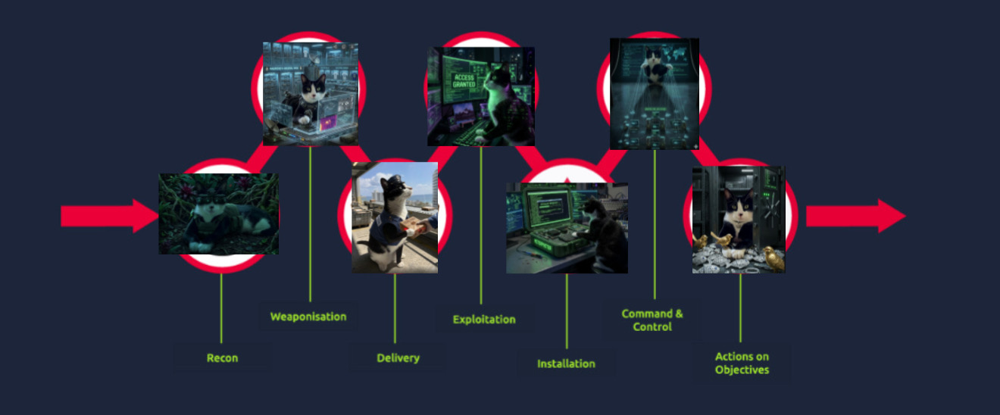
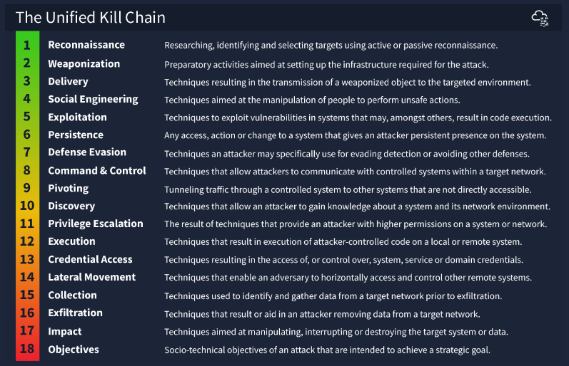

# Unified Kill Chain

---

## Task 1 - Introduction

### Key Concepts

The offense is the best defense -- if we understand what an attacker is doing or planning to do, we can anticipate and block those avenues before they become an incident.

### Task Questions
1. Let's proceed!
   - **Answer: Check**

---

## Task 2 - What is a "Kill Chain"

### Key Concepts

A Kill Chain is the full sequence of events an attacker executes from start to finish. Every step is linked -- break one link and the chain fails.

- Reconnaissance
- Weaponization
- Delivery
- Exploitation
- Installation
- Command & Control
- Actions on Objectives

### Task Questions
1. Where does the term "Kill Chain" originate from?
   - **Answer: Military**

---

## Task 3 - What is "Threat Modelling"

### Key Concepts

**Threat Modelling** in cybersecurity is a structured process to improve a system's security posture by identifying and addressing risk before an attacker does.

Four steps:
1. Identify what systems and assets need to be secured
2. Assess vulnerabilities and how they could be exploited
3. Create a plan of action to address those vulnerabilities
4. Put policies in place to prevent recurrence

Threat modelling also produces a high-level overview of an organization's IT assets -- every piece of hardware and software in the environment.

**Threat Modelling Frameworks:**

| Framework | Description |
|---|---|
| STRIDE | Spoofing, Tampering, Repudiation, Information Disclosure, Denial of Service, Elevation of Privilege |
| DREAD | Microsoft's risk assessment system for evaluating computer security threats |
| CVSS | Common Vulnerability Scoring System -- standardized severity scoring for vulnerabilities |

### Task Questions
1. What is the technical term for a piece of software or hardware in IT?
   - **Answer: Asset**

---

## Task 4 - Introducing the Unified Kill Chain

### Key Concepts

The **Unified Kill Chain** was published by Paul Pols in 2017 and updated in 2022. It aims to complement -- not compete with -- MITRE ATT&CK and Lockheed Martin's Cyber Kill Chain.

Key advantages over older frameworks:

| UKC | Other Frameworks |
|---|---|
| Modern -- released 2017, updated 2022 | MITRE ATT&CK released 2013 |
| 18 phases -- extremely detailed | Most frameworks have a handful of phases |
| Covers full attack lifecycle including attacker motivation | Many frameworks cover limited phases |
| Accounts for attackers cycling back through phases | Other frameworks treat the kill chain as linear |

### Task Questions
1. In what year was the Unified Kill Chain framework released?
   - **Answer: 2017**
2. According to the Unified Kill Chain, how many phases are there to an attack?
   - **Answer: 18**
3. What is the name of the attack phase where an attacker employs techniques to evade detection?
   - **Answer: Defense Evasion**
4. What is the name of the attack phase where an attacker employs techniques to remove data from a network?
   - **Answer: Exfiltration**
5. What is the name of the attack phase where an attacker achieves their objectives?
   - **Answer: Objectives**

---

## Task 5 - Goal: In (Initial Foothold)

### Key Concepts

The **In** phase is everything the attacker does to gain their initial foothold on the target system or network.

| Phase | MITRE Tactic | Description |
|---|---|---|
| Reconnaissance | TA0043 | Passive and active information gathering -- systems, services, employees, credentials, network topology |
| Weaponization | TA0001 | Setting up attack infrastructure -- C2 servers, payload delivery systems, reverse shell catchers |
| Social Engineering | TA0001 | Manipulating people into taking actions that aid the attack -- phishing, impersonation, credential harvesting |
| Exploitation | TA0002 | Abusing vulnerabilities to execute code -- reverse shells, script tampering, web app exploitation |
| Persistence | TA0003 | Maintaining access after the initial foothold -- backdoors, malicious services, C2 callbacks |
| Defence Evasion | TA0005 | Bypassing defensive controls -- firewalls, AV, IDS/IPS; valuable for defenders to understand gaps |
| Command & Control | TA0011 | Establishing communications between attacker and compromised system using weaponization infrastructure |
| Pivoting | TA0008 | Using a compromised system to reach other systems on the internal network not exposed to the internet |

### Task Questions
1. What is an example of a tactic to gain a foothold using emails?
   - **Answer: Phishing**
2. Impersonating an employee to request a password reset is a form of what?
   - **Answer: Social Engineering**
3. An adversary setting up the Command & Control server is what phase of the Unified Kill Chain?
   - **Answer: Weaponization**
4. Exploiting a vulnerability present on a system is what phase of the Unified Kill Chain?
   - **Answer: Exploitation**
5. Moving from one system to another is an example of?
   - **Answer: Pivoting**
6. Leaving behind a malicious service that allows the adversary to log back into the target is what?
   - **Answer: Persistence**

---

## Task 6 - Goal: Through (Network Propagation)

### Key Concepts

The **Through** phase begins once the attacker has a confirmed foothold. They now work to expand access, gather intelligence, and move deeper into the network.

**Pivoting** is the attacker's first priority -- they establish their compromised machine as a C2 staging point and distribution hub for all further malware and backdoors.

**Discovery** pulls a full picture of the environment: active user accounts, permissions, installed software, browser activity, files, network shares, and system configurations.

**Privilege Escalation** is critical -- the attacker leverages discovered misconfigurations and vulnerabilities to elevate access to one of the following levels:
- SYSTEM / ROOT
- Local Administrator
- User with admin-like access
- User with specific privileged access

**Execution** deploys the malicious payload from the pivot machine -- remote trojans, C2 scripts, malicious links, and scheduled tasks to maintain recurring presence.

**Credential Access** works hand in hand with Privilege Escalation. The attacker steals account names and passwords via keylogging and credential dumping, allowing them to blend in using legitimate credentials.

**Lateral Movement** is where the infection spreads -- using elevated privileges and stolen credentials, the attacker moves stealthily through the network to reach their primary target.

| Phase | MITRE Tactic | Description |
|---|---|---|
| Pivoting | TA0008 | Compromised machine becomes C2 staging site and malware distribution point |
| Discovery | TA0007 | Full environment enumeration -- users, permissions, configs, files, network shares |
| Privilege Escalation | TA0004 | Elevating access to SYSTEM/ROOT, Local Admin, or privileged user accounts |
| Execution | TA0002 | Deploying malicious payloads -- trojans, C2 scripts, scheduled tasks |
| Credential Access | TA0006 | Stealing credentials via keylogging and credential dumping to blend in |
| Lateral Movement | TA0008 | Moving through the network using valid credentials and elevated privileges |

### Task Questions
1. Failed logins from an administrator account -- what phase is the attacker seeking to achieve?
   - **Answer: Privilege Escalation**
2. Mimikatz detected attempting to dump OS and user secrets -- which phase does this correspond to?
   - **Answer: Credential Access**

---

## Task 7 - Goal: Out (Action on Objectives)

### Key Concepts

The **Out** phase is the endgame -- the attacker has critical asset access and executes their final objectives. At this point the CIA triad is at risk across all three pillars.

| Phase | MITRE Tactic | Description |
|---|---|---|
| Collection | TA0009 | Gathering all valuable data targeted for exfiltration -- drives, browsers, audio, video, email |
| Exfiltration | TA0010 | Packaging and stealing data using encryption and compression, routed through the C2 tunnel |
| Impact | TA0040 | Compromising integrity and availability -- ransomware, disk wipes, DoS, defacement |
| Objectives | - | Strategic endgame executed -- financial (ransom), reputational (data leak), or operational disruption |

### Task Questions
1. Big traffic spike sent to unknown suspicious IP -- what UKC phase could describe this?
   - **Answer: Exfiltration**
2. PII released publicly -- what part of the CIA triad is affected?
   - **Answer: Confidentiality**

---

## Task 8 - Practical

### Key Concepts

Matching attack scenarios to UKC phases:

- The attacker uses tools to gather information about a system: **Reconnaissance**
- The attacker installs a malicious script to allow remote access at a later date: **Persistence**
- The compromised machine is being controlled from the attacker's own server: **Command & Control**
- The attacker uses the hacked machine to access other servers on the same network: **Pivoting**
- The attacker steals a database and sells it to a third party: **Actions on Objectives**

### Task Questions
1. What is the flag?
   - **Answer: THM{UKC_SCENARIO}**

---

## Task 9 - Conclusion

### Key Concepts

A solid refresher coming off the Cyber Kill Chain room. Seeing all 18 phases laid out makes clear why the UKC is the more complete picture -- it accounts for the back-and-forth nature of real attacks rather than treating the chain as a straight line. The "Through" phase especially hits different from a SOC perspective; that's where defenders have the most opportunity to catch an attacker before the damage is done.

### Task Questions
1. Complete this task to finish the room!
   - **Answer: Check**

---

*Write-up by [Miyu7x](https://github.com/Miyu7x) | TryHackMe: [Miyu7](https://tryhackme.com/p/Miyu7)*
