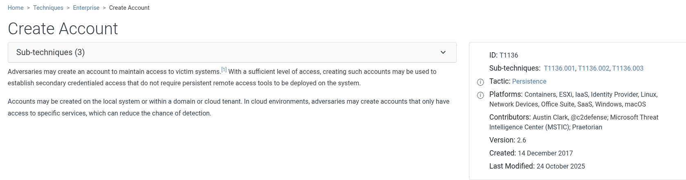
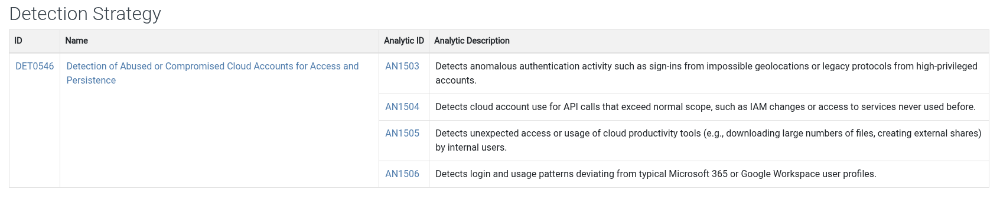
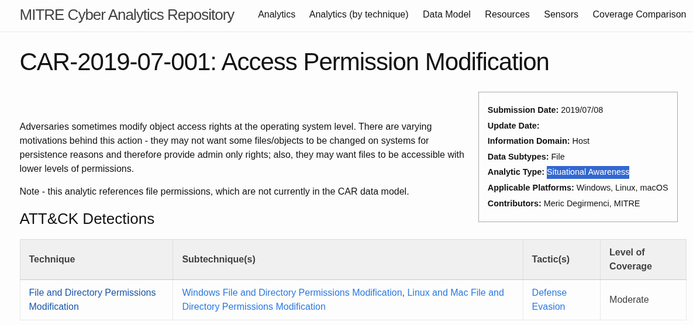

*Write-up by [Miyu7x](https://github.com/Miyu7x) | TryHackMe: [Miyu7](https://tryhackme.com/p/Miyu7)*

---

## Task 1 - Introduction

### Key Concepts

**MITRE: To solve problems for a safer world** is a security organization that conducts research across a range of domains:
- Cybersecurity
- Artificial Intelligence
- Healthcare
- Space Systems

MITRE's frameworks include:
- MITRE ATT&CK framework
- The CAR knowledge base
- D3FEND
- MITRE Engage and others

### Task Questions

1. I understand the learning objectives and am ready to learn about MITRE!
   - **Answer:**

---

## Task 2 - ATT&CK® Framework

### Key Concepts

**MITRE ATT&CK** is a public database of known adversary **tactics and techniques.**
- This information is compiled to create **threat models and methodologies** for companies, government, the cybersecurity industry, and the public.

| Term | Definition | Example |
|------|-----------|---------|
| Tactic | The attacker's goal and objective -- the "why" behind the attack | Reconnaissance |
| Technique | How the attacker achieves their goal | Active Scanning |
| Procedure | The specific method used to execute the technique | Scanning IP blocks to map the target network |

### Task Questions

1. What Tactic does the Hide Artifacts technique belong to in the ATT&CK Matrix?
   - **Answer: Defense Evasion**

2. Which ID is associated with the Create Account technique?
   
   - **Answer: T1136**

---

## Task 3 - ATT&CK in Operation

### Key Concepts

**ATT&CK** catalogs information using standard terminology and unique IDs, making it easy to compare data across any platform, job role, or incident. Defenders use it to translate threat intelligence into real detection logic, queries, and SOC playbooks.

| Role | Goal | How They Use ATT&CK |
|------|------|----------------------|
| CTI Teams | Collect and analyze threat information | Map observed threat actor behavior to ATT&CK TTPs to build actionable profiles |
| SOC Analysts | Investigate and triage security alerts | Link activity to tactics and techniques to add context and prioritize incidents |
| Detection Engineers | Design and improve detection systems | Map SIEM and EDR rules to ATT&CK to ensure better detection coverage |
| Incident Responders | Respond to and investigate security incidents | Map incident timelines to MITRE tactics and techniques to visualize the attack |
| Red & Purple Teams | Emulate adversary behavior to test defenses | Build emulation plans aligned with techniques and known group operations |

**Mustang Panda** is a threat actor group that uses phishing as their preferred attack technique. Their behavior is mapped out in MITRE ATT&CK below.

### Task Questions

1. In which country is Mustang Panda based?
   - **Answer: China**

2. Which ATT&CK technique ID maps to Mustang Panda's Reconnaissance tactics?
   
   - **Answer: T1598**

3. Which software is Mustang Panda known to use for Access Token Manipulation?
   - **Answer: Cobalt Strike**

---

## Task 4 - ATT&CK for Threat Intelligence

### Key Concepts

### Task Questions

1. Which APT group has targeted the aviation sector and has been active since at least 2013?
   
   - **Answer: APT33**

2. Which ATT&CK sub-technique used by this group is a key area of concern for companies using Office 365?
   
   - **Answer: Cloud Accounts**

3. According to ATT&CK, what tool is linked to the APT group and the sub-technique you identified?
   
   - **Answer: Ruler**

4. Which mitigation strategy advises removing inactive or unused accounts to reduce exposure to this sub-technique?
   
   - **Answer: User Access Management**

5. What Detection Strategy ID would you implement to detect abused or compromised cloud accounts?
   
   - **Answer: DET0546**

---

## Task 5 - Cyber Analytics Repository (CAR)

### Key Concepts

**ATT&CK** tells you what attackers do. **CAR** tells you how to catch them doing it.

Think of CAR as a detection recipe. For each attacker behavior it documents, CAR provides the logic for spotting it and ready-made queries you can drop into Splunk or run in EQL. Like ATT&CK, CAR uses a consistent data model with uniform terminology and standardized IDs, so analysts can find and understand detections quickly without having to reverse-engineer the reasoning behind them.

**Short version: CAR is ATT&CK with the "okay but how do I actually detect this in my SIEM" problem already solved for you.**

### Task Questions

1. Which ATT&CK Tactic is associated with CAR-2019-07-001?
   
   - **Answer: Defense Evasion**

2. What is the Analytic Type for Access Permission Modification?
   
   - **Answer: Situational Awareness**

---

## Task 6 - MITRE D3FEND Framework

### Key Concepts

Where ATT&CK maps how attackers operate, **D3FEND** maps how defenders can stop them. The two frameworks are designed to complement each other -- ATT&CK gives you the attacker's move, D3FEND gives you the countermeasure.

**D3FEND stands for:** Detection, Denial, Disruption Framework Empowering Network Defense.

| Framework | Focus | Purpose |
|-----------|-------|---------|
| ATT&CK | Adversary tactics and techniques | Understand how attackers operate and map threat behavior |
| D3FEND | Defensive techniques and controls | Understand how to detect, deny, and disrupt those attacks |

### Task Questions

1. Which sub-technique of User Behavior Analysis would you use to analyze the geolocation data of user logon attempts?
   
   - **Answer: User Geolocation Logon Pattern Analysis**

2. Which digital artifact does this sub-technique rely on analyzing?
   
   - **Answer: Network Traffic**

---

## Task 7 - Other MITRE Projects

### Key Concepts

| Project | Focus Area | Key Use Case |
|---------|-----------|--------------|
| Adversary Emulation Library | Real-world threat group emulation plans | Step-by-step guides to replicate specific threat group behavior in controlled exercises |
| CALDERA | Automated adversary emulation | Simulate attacker behavior using ATT&CK to test and improve detection and response |
| AADAPT | Digital asset and blockchain threats | Helps defenders understand adversarial tactics targeting blockchain, smart contracts, and digital wallets |
| ATLAS | AI and machine learning system threats | Documents real-world attack techniques and mitigations specific to AI technology |

### Task Questions

1. What technique ID is associated with Scrape Blockchain Data in the AADAPT framework?
   
   - **Answer: ADT3025**

2. Which tactic does LLM Prompt Obfuscation belong to in the ATLAS framework?
   
   - **Answer: Defense Evasion**

---

## Task 8 - Conclusion

### Key Concepts

MITRE feels like the backbone of any SOC playbook. Between ATT&CK, CAR, D3FEND, and the emulation tools, there is a full ecosystem built around understanding and stopping adversaries. The Adversary Emulation Library is especially interesting -- I cannot wait to get to the point in my career where I am running those exercises.

### Task Questions

1. Complete the room and continue on your cyber learning journey!
   - **Answer:**

---

## Personal Notes

<!-- Anything that surprised you, clicked hard, or you want to revisit -->
<!-- Connections to other rooms or real-world scenarios -->
<!-- Questions to research further -->
