*Write-up by [Miyu7x](https://github.com/Miyu7x) | TryHackMe: [Miyu7](https://tryhackme.com/p/Miyu7)*

---

## Task 1 - Introduction

### Key Concepts

**MITRE: To solve problems for a safer world** is a security framework developed across a range of domains 
- Cybersecurity
- Artificial Intelligence 
- Healthcare
- Space Systems

MITREs frameworks include
- MITRE ATT7CK framework
- the CAR knowledge base
- D3FEND
- MITRE Engage and others...

### Task Questions

1. I understand the learning objectives and am ready to learn about MITRE!
   - **Answer:**

---

## Task 2 - ATT&CK® Framework

### Key Concepts

**MITRE ATT&CK** Framework is a public database of known hackers **tactics and techniques**
-This information then compiles to create **threat models and information** for company's, the government, cybersecurity and the public

**Tactic:** The hackers goal and objective, the why they are exploiting
**Technique:** How the hacker achieves their goal
**Procedure:** The method carried by the hacker to execute their technique

| Term | Definition | Example |
|------|-----------|---------|
| Tactic | | |
| Technique | | |
| Procedure | | |

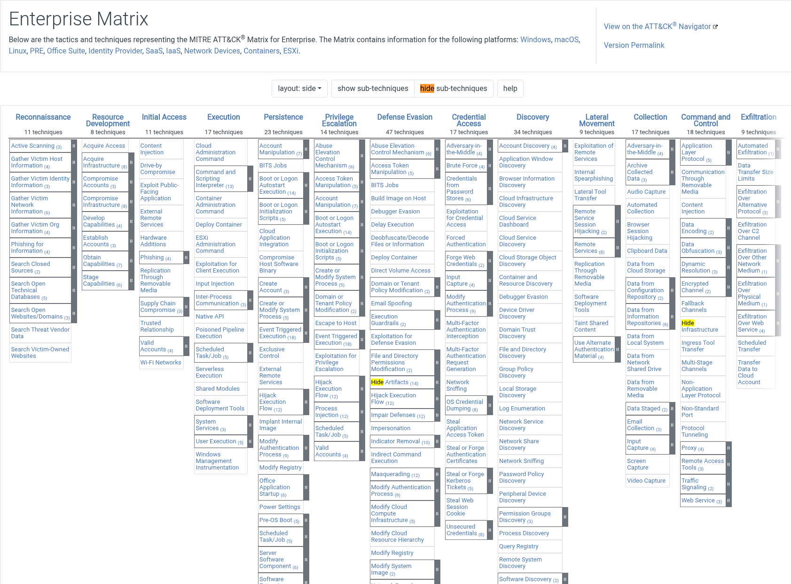

### Task Questions

1. What Tactic does the Hide Artifacts technique belong to in the ATT&CK Matrix?
   - **Answer: Defense Evasion**

1. Which ID is associated with the Create Account technique?

   - **Answer: T1136**

---

## Task 3 - ATT&CK in Operation

### Key Concepts

**ATT&Ck** catalogs their information by a standard terminilogy and unique ID
- Easily compare data accross any platform, job, incident....
- Defenders translate intelligence into real detection logic, queries and important for any SOC playbooks

| Role | Goal | How They Use ATT&CK |
|------|------|----------------------|
| CTI Teams | | |
| SOC Analysts | | |
| Detection Engineers | | |
| Incident Responders | | |
| Red & Purple Teams | | |

**Mustang Panda** a hacker uses phishing as their preferred attacking techinique below it is mapped out in MITRE ATT&CK

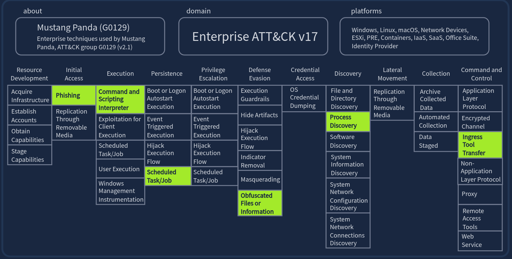

### Task Questions

1. In which country is Mustang Panda based?
   - **Answer:China**

1. Which ATT&CK technique ID maps to Mustang Panda's Reconnaissance tactics?
   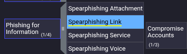
   - **Answer: T1598**

3. Which software is Mustang Panda known to use for Access Token Manipulation?
   - **Answer: Cobalt Strike**

---

## Task 4 - ATT&CK for Threat Intelligence

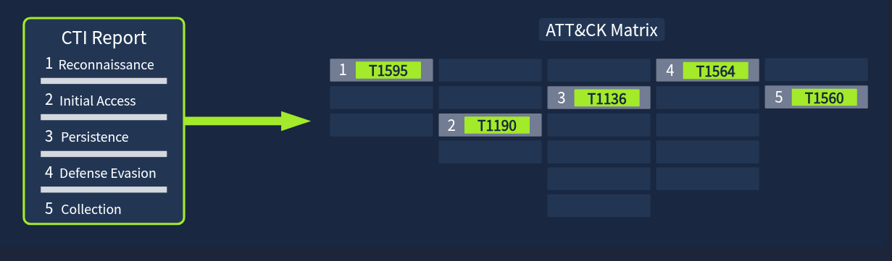

### Key Concepts

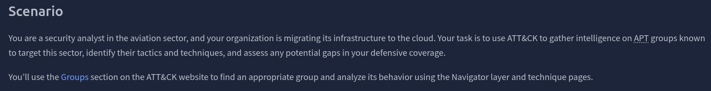

### Task Questions

1. Which APT group has targeted the aviation sector and has been active since at least 2013?
   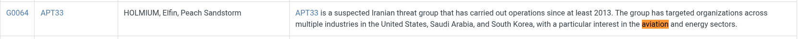
   - **Answer: APT33**

1. Which ATT&CK sub-technique used by this group is a key area of concern for companies using Office 365?
   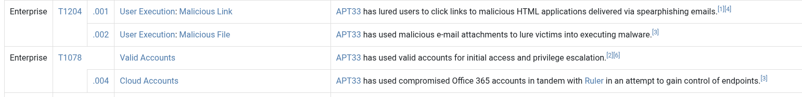
   - **Answer: Cloud Accounts**

1. According to ATT&CK, what tool is linked to the APT group and the sub-technique you identified?
   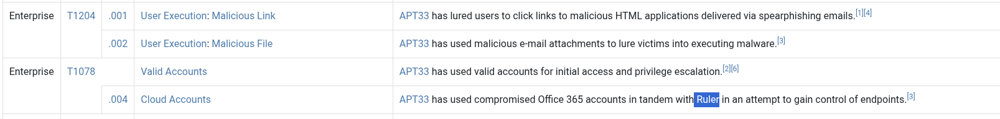
   - **Answer: Ruler **

1. Which mitigation strategy advises removing inactive or unused accounts to reduce exposure to this sub-technique?
   
   - **Answer: User Access Management**

1. What Detection Strategy ID would you implement to detect abused or compromised cloud accounts?
   
   - **Answer: DET0546**

---

## Task 5 - Cyber Analytics Repository (CAR)

### Key Concepts

**Cyber Analytics Repository** 
	**ATT&CK:** What attackers do!
	**CAR:** How an SOC catches them doing it!

Think of car as a recipe, a detection recipe
	 - Here is how an attack happened:
		 - Attacker behavior
		 - Logic for spotting it
		 - Querys an SOC can drop into Splunk(during an attack asa its happening) or EQL

Like MITRE **CAR** also has "data model"
	- Wordage 
	- ID numbers
	- Sub Tech numbers all the same througout
	- Makes it uniform so SOCs easily understand and find the information

**Short version: CAR is ATT&CK with the "okay but how do I actually detect this in my SIEM" problem already solved for you.**

### Task Questions

1. Which ATT&CK Tactic is associated with CAR-2019-07-001?
   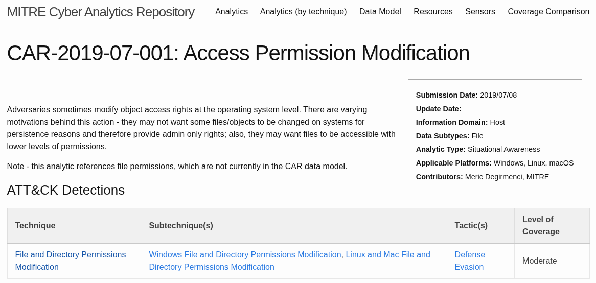
   - **Answer: Defense Evasion**

1. What is the Analytic Type for Access Permission Modification?
   
   - **Answer: Situational Awareness**

---

## Task 6 - MITRE D3FEND Framework

### Key Concepts
 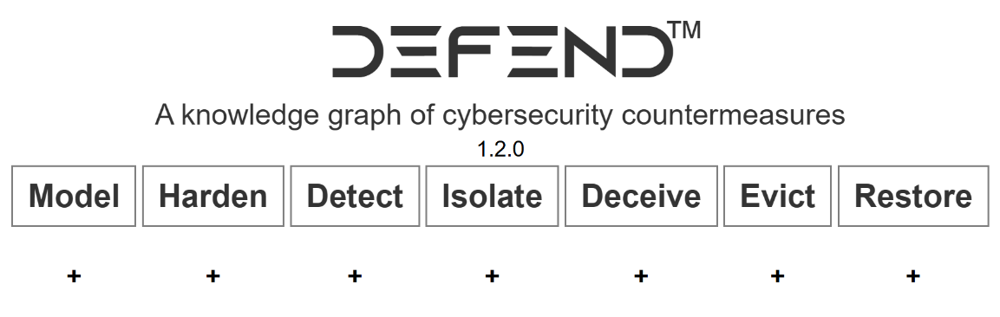
 
 **D3FEND** is exactly that, how to **discover and stop**  ATTC&K

**D3FEND**
- Detection
- Denial
- Disruption
- Framework
- Empowering
- Network
- Defense

| Framework | Focus | Purpose |
|-----------|-------|---------|
| ATT&CK | | |
| D3FEND | | |

### Task Questions

1. Which sub-technique of User Behavior Analysis would you use to analyze the geolocation data of user logon attempts?
   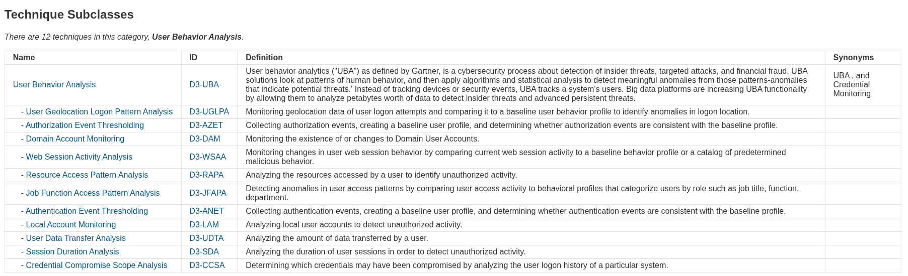
   - **Answer: User Geolocation Logon Pattern Analysis**

1. Which digital artifact does this sub-technique rely on analyzing?
   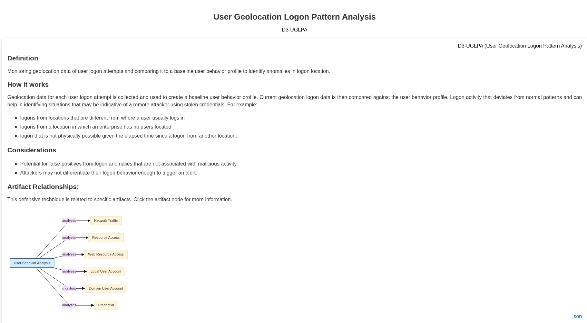
   - **Answer: Network Traffic**

---

## Task 7 - Other MITRE Projects

### Key Concepts

**Adversary Emulation Library** Free resource of emulation attacks that mimic real world attacks
- Maintained by the **Center for Threat Informed Defense**
- Step-by-step guide to mimic specific threat groups

**CALDERA** Another emulation tool used by defenders to test their own defenses and strengthen them
- mimics real world attacks utlizing MITRE ATT&CK
- supports offensive and defense emulation

**ADAPT** Adversarial Actions in Digital Asset Payment Technologies
- New
- Knowledge base
- Focuses on malicious tactics and techniques regarding digital assets management systems
- Aimed to help defenders understand threats targeting:
	- blockchain networks
	- smart contracts
	- digital wallets
	- other digital assets
- 
**ATLAS** Adversarial Threat Landscape for Artifical-Intelligence Systems
- Knowledge based
- Focuses on AI machine learning systems
- Documents real world attack techniques, vulnerabilities and mitigation
- Specific to AI
-

| Project | Focus Area | Key Use Case |
|---------|-----------|--------------|
| Adversary Emulation Library | | |
| CALDERA | | |
| AADAPT | | |
| ATLAS | | |

### Task Questions

1. What technique ID is associated with Scrape Blockchain Data in the AADAPT framework?
   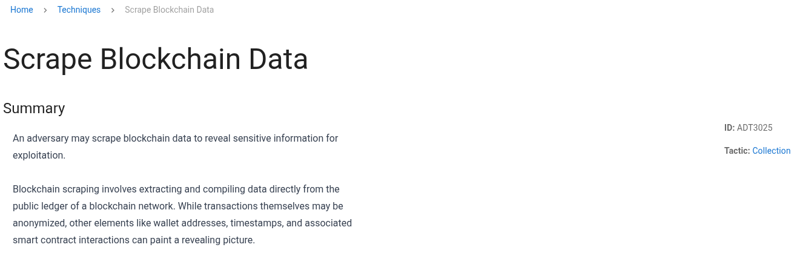
   - **Answer: ADT3025**

1. Which tactic does LLM Prompt Obfuscation belong to in the ATLAS framework?
   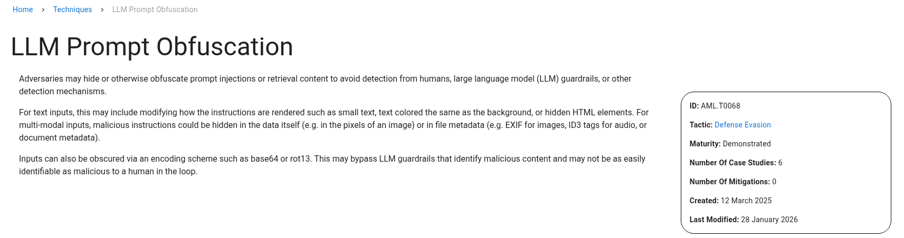
   - **Answer: Defense Evasion**

---

## Task 8 - Conclusion

### Key Concepts

It feels like MITRE is at the center of any SOC playbook, there are many tools to create a great defesnive strategy. The Adversary Emulation Library sounds really interesting and i cannot wait to keep progressing in my career to be able to use those tools!

### Task Questions

1. Complete the room and continue on your cyber learning journey!
   - **Answer:**

---

## Personal Notes

<!-- Anything that surprised you, clicked hard, or you want to revisit -->
<!-- Connections to other rooms or real-world scenarios -->
<!-- Questions to research further -->