# Summit

*Write-up by [Miyu7x](https://github.com/Miyu7x) | TryHackMe: [Miyu7](https://tryhackme.com/p/Miyu7)*

---

## Objective

PicoSecure is running a threat simulation and detection engineering engagement to strengthen malware detection. Working alongside an external penetration tester in an iterative purple-team scenario, the goal is to configure security tools to detect and block malware samples as the tester attempts to execute them on a simulated workstation.

The framework guiding the exercise is the **Pyramid of Pain** - each sample corresponds to an ascending tier of the pyramid, increasing the adversary's cost of operations with every detection.

---

## Environment Setup

- **Lab URL:** `https://LAB_WEB_URL.p.thmlabs.com`
- **Machine start time:**
- **Notes:**

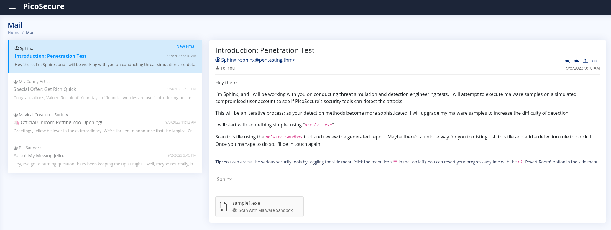

---

## Pyramid of Pain - Detection Log

| Sample | Pyramid Tier | Indicator Type | Detection Method | Flag |
|--------|-------------|----------------|-----------------|------|
| sample1.exe | Tier 1 - Hash Values | MD5 hash | Blocklist hash in malware sandbox | THM{f3cbf08151a11a6a331db9c6cf5f4fe4} |
| sample2.exe | Tier 2 - IP Addresses | Malicious IP | Firewall block rule | THM{2ff48a3421a938b388418be273f4806d} |
| sample3.exe | Tier 3 - Domain Names | Suspicious DNS | DNS rule block | THM{4eca9e2f61a19ecd5df34c788e7dce16} |
| sample4.exe | Tier 4 - Network/Host Artifacts | Registry modification | Sysmon Sigma rule - defense evasion | THM{c956f455fc076aea829799c0876ee399} |
| sample5.exe | Tier 5 - Tools | C2 beacon pattern | Sysmon Sigma rule - network connections | THM{46b21c4410e47dc5729ceadef0fc722e} |
| Sphinx (final) | Tier 6 - TTPs | Exfiltration staging commands | Sysmon Sigma rule - process creation | THM{c8951b2ad24bbcbac60c16cf2c83d92c} |

---

## Task 1 - Challenge

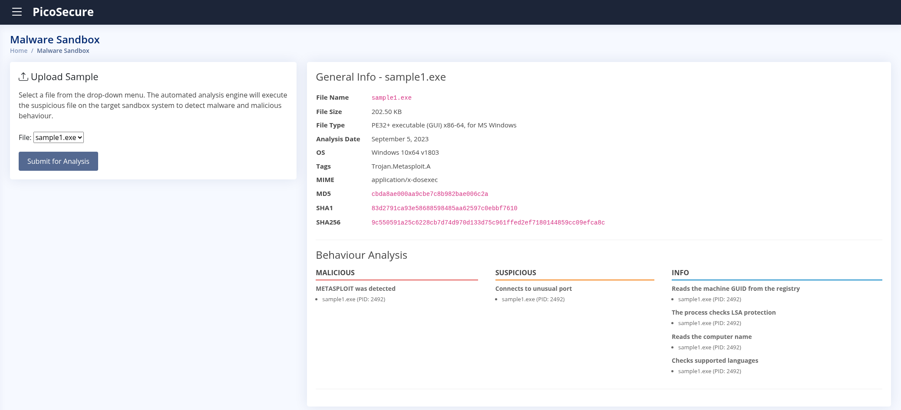

### Sample 1

**Pyramid Tier:** Tier 1 - Hash Values

**Indicator Used:** MD5 hash of sample1.exe

**Detection Approach:** Submitted sample1.exe to the malware sandbox and retrieved the MD5, SHA1, and SHA256 hashes from the analysis report. Added the MD5 hash to the blocklist.

**Notes:** Hash values sit at the base of the Pyramid of Pain - trivial for an adversary to change by recompiling, but a necessary first detection layer.

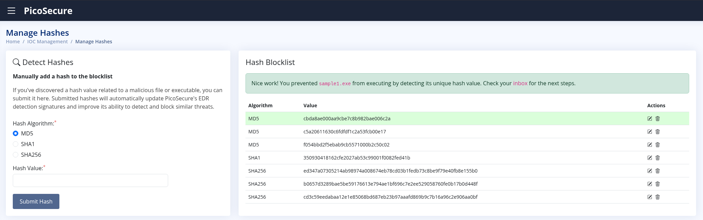

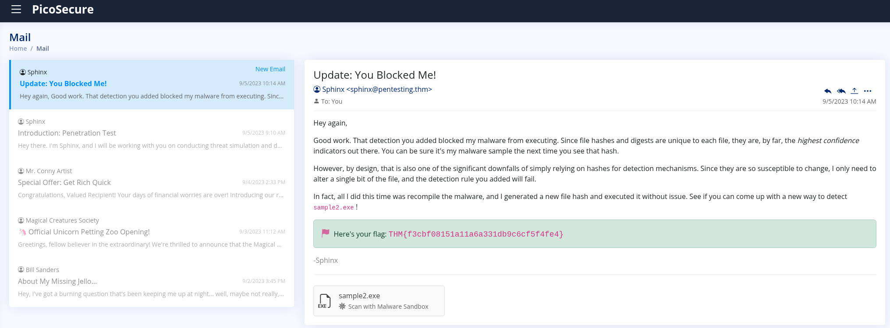

- **Flag: THM{f3cbf08151a11a6a331db9c6cf5f4fe4}**

---

### Sample 2

**Pyramid Tier:** Tier 2 - IP Addresses

**Indicator Used:** Malicious remote IP identified in sandbox network activity

**Detection Approach:** Sandboxed sample2.exe and identified a malicious outbound IP connection in the behaviour analysis. Created a firewall rule to block all traffic to that IP.

**Notes:** Blocking IPs is slightly more costly for the adversary than swapping a hash, but still relatively easy - they can rotate infrastructure. The pyramid climb continues.

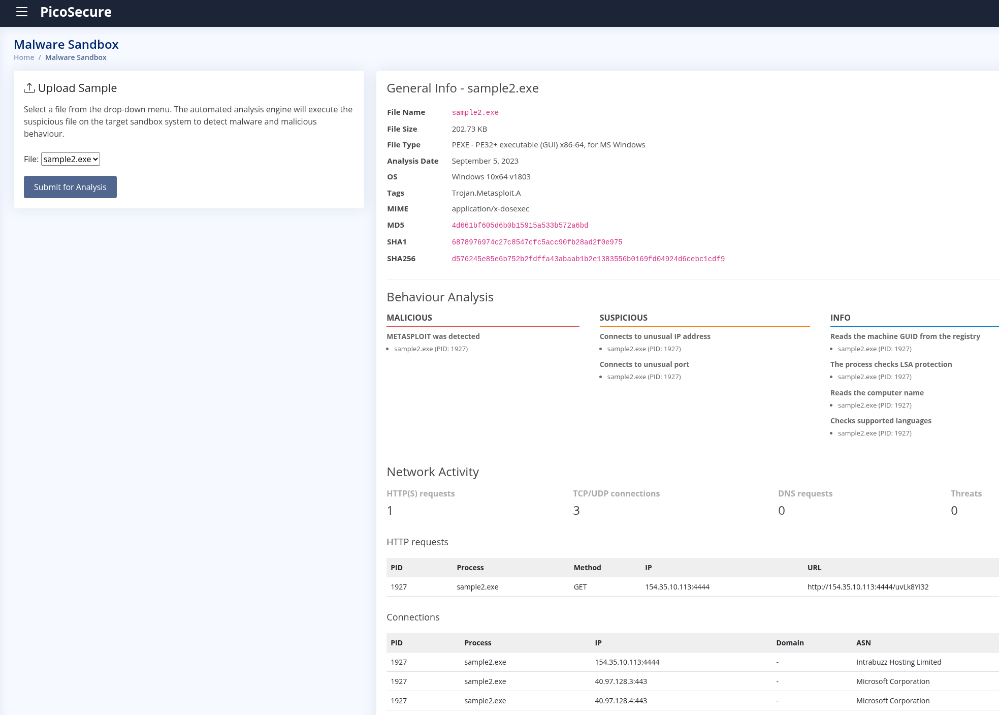

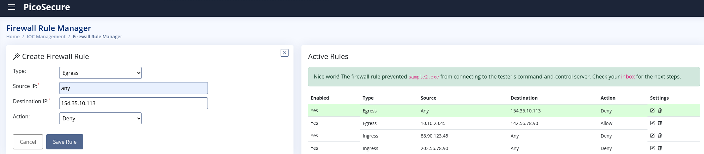

- **Flag: THM{2ff48a3421a938b388418be273f4806d}**

---

### Sample 3

**Pyramid Tier:** Tier 3 - Domain Names

**Indicator Used:** Suspicious DNS domain used for C2 communication

**Detection Approach:** Sandboxed sample3.exe and identified a persistence backdoor Trojan communicating over a suspicious DNS domain. Blocked the domain via a DNS rule.

**Notes:** Domain names cost more to replace than IPs - registering new domains takes time and money. Each tier we climb, the adversary has to work harder to adapt.

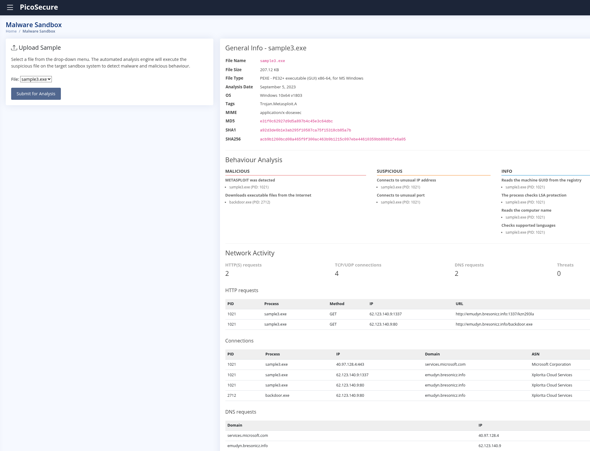

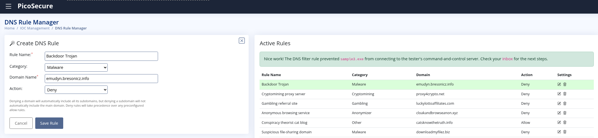

- **Flag: THM{4eca9e2f61a19ecd5df34c788e7dce16}**

---

### Sample 4

**Pyramid Tier:** Tier 4 - Network and Host Artifacts

**Indicator Used:** Malicious registry key modifications in HKEY attempting to disable security monitoring

**Detection Approach:** Sandbox analysis revealed a malicious process tree targeting registry keys associated with security tooling. Built a Sysmon Sigma rule targeting the defense evasion behavior via registry modifications.

**Notes:** At this tier the adversary is no longer just moving infrastructure - they have to change how their tool behaves. Registry-based defense evasion is a fingerprint of the tool itself, mapped to MITRE ATT&CK T1112.

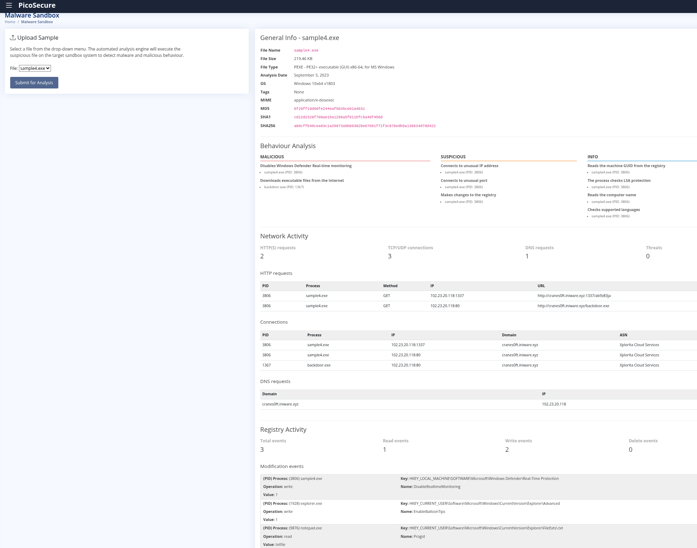

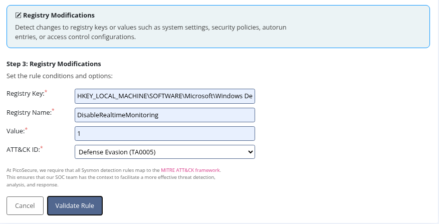

- **Flag: THM{c956f455fc076aea829799c0876ee399}**

---

### Sample 5

**Pyramid Tier:** Tier 5 - Tools

**Indicator Used:** C2 beacon behavioral pattern - consistent outbound connections at fixed intervals

**Detection Approach:** Sandbox revealed beacon.bat making repeated outbound POST requests. Reviewed outgoing_connections.log to identify the beacon interval. Built a Sysmon Sigma rule for network connections targeting the tool's behavioral fingerprint: any IP, any port, 97-byte payload, 1800-second frequency, mapped to TA0011 Command and Control.

**Notes:** At the Tools tier, blocking IPs or domains no longer works - the adversary can rotate those freely. The detection targets the tool's behavior signature. A 1800-second beacon interval means the malware checks in every 30 minutes regardless of destination. Changing that requires rebuilding the tool entirely.

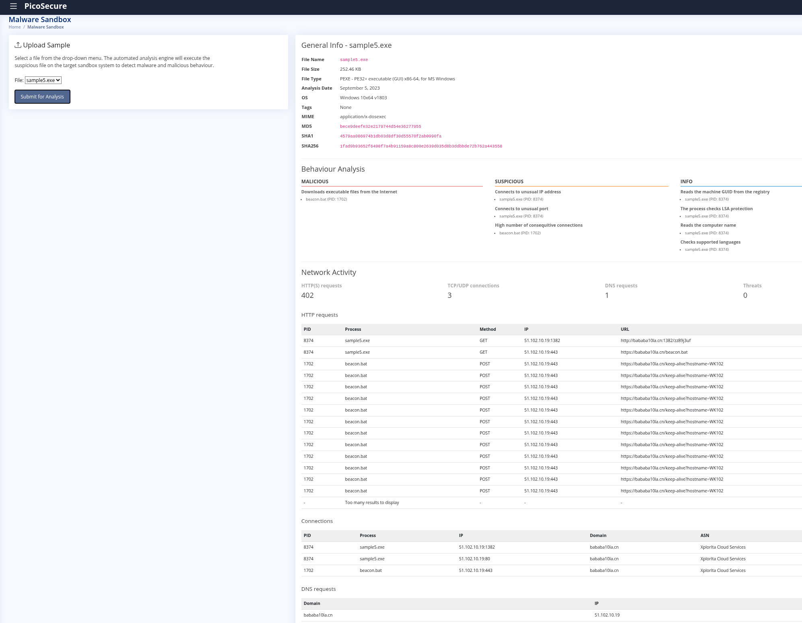

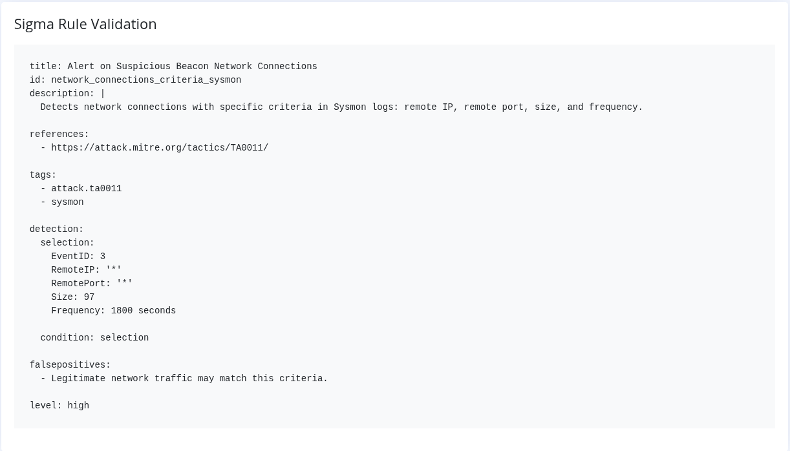

- **Flag: THM{46b21c4410e47dc5729ceadef0fc722e}**

---

### Final - Sphinx

**Pyramid Tier:** Tier 6 - TTPs (Tactics, Techniques, and Procedures)

**Indicator Used:** Adversary reconnaissance and exfiltration staging commands

**Detection Approach:** Reviewed commands.log which revealed a series of system enumeration commands piping output to `%temp%\exfiltr8.log` for staged exfiltration. Built a Sysmon Sigma rule targeting process creation events where the command line contains `%temp%\exfiltr8.log`, mapped to TA0010 Exfiltration.

**Notes:** TTPs are the summit of the pyramid and the hardest tier for an adversary to change. The specific commands - dir, systeminfo, ipconfig, netstat, net start - represent how the attacker thinks and operates. Detecting at this level means even a completely rebuilt tool using new hashes, IPs, and domains will still trigger the rule as long as the operator runs the same playbook.

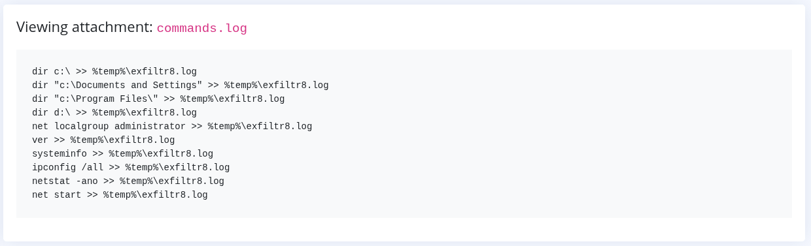

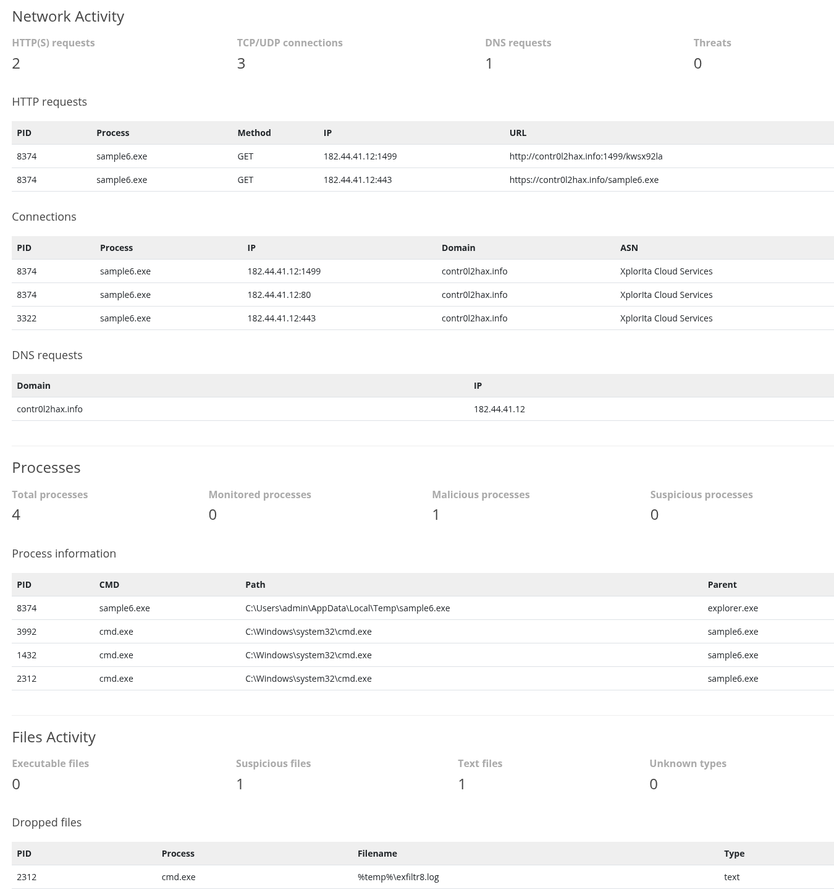

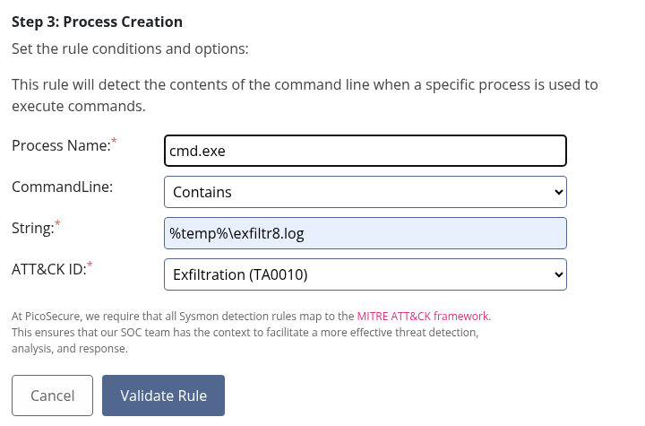

- **Flag: THM{c8951b2ad24bbcbac60c16cf2c83d92c}**

---

## Key Concepts

<!-- Pyramid of Pain tier order: Hash Values - IP Addresses - Domain Names - Network/Host Artifacts - Tools - TTPs -->
<!-- Lower tiers are easy for adversaries to change - higher tiers require rebuilding tools or changing behavior -->
<!-- Detection engineering cycle: analyze sample, identify indicator tier, build rule, validate, iterate -->
<!-- Sigma rules allow vendor-agnostic detection logic mapped to MITRE ATT&CK -->
<!-- Sysmon event types used: Network Connections (sample5), Process Creation (Sphinx), Registry (sample4) -->
<!-- C2 beaconing fingerprint: consistent payload size + fixed interval = tool signature regardless of destination -->
<!-- TTPs represent adversary methodology - the hardest and most valuable tier to detect -->

---

## Reflections

This was a very good exercise for getting into the SOC mindset. Working through each tier of the Pyramid of Pain in sequence made the concept concrete in a way that just reading about it never could. Having to actually sandbox each sample, read the behavior output, identify which tier the indicator belonged to, and then build the appropriate rule in the right tool forced the mental connections to form.

The most valuable part was sample5 and Sphinx. By the time you reach the Tools and TTPs tiers, you realize that chasing hashes and IPs is a losing game - the adversary changes those for free. Building a rule that catches a 30-minute beacon interval or a command line string piping to an exfil log means the adversary has to fundamentally change how they operate. That is the point of the pyramid.

The outgoing_connections.log moment was a good real-world lesson too - the answer was in the data the whole time. Read the logs.
