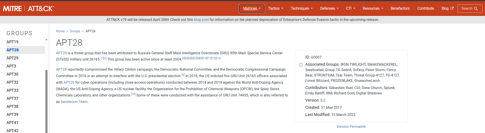
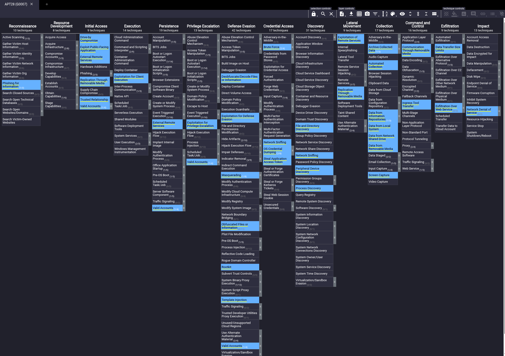
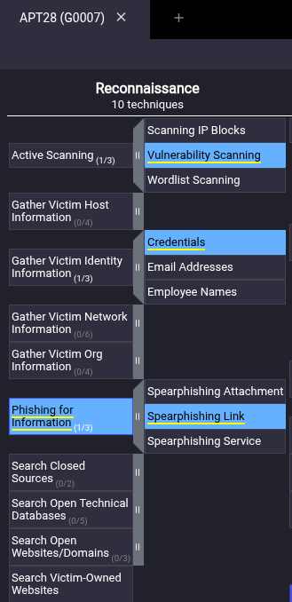
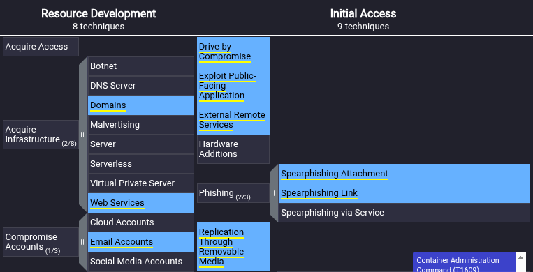
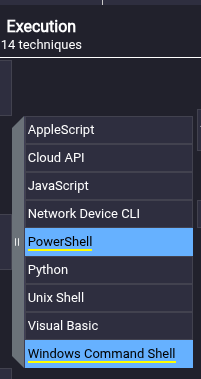
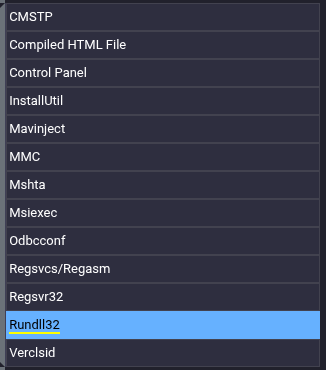
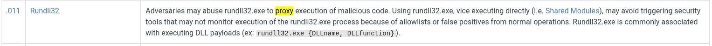
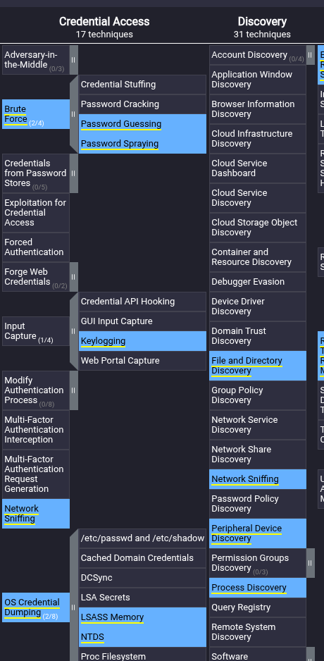
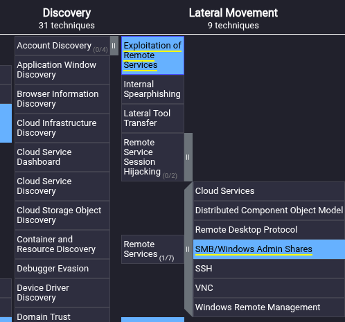
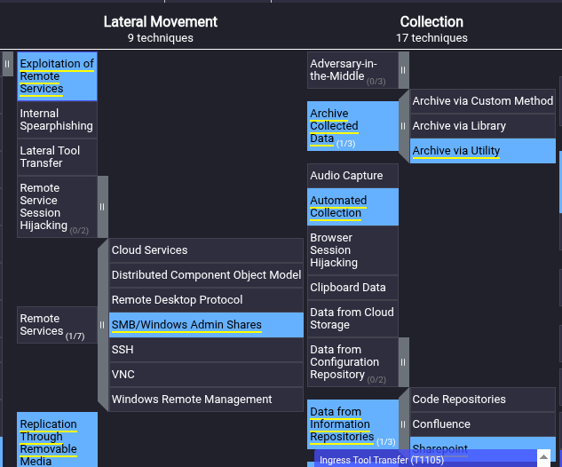

# Eviction

*Write-up by [Miyu7x](https://github.com/Miyu7x) | TryHackMe: [Miyu7](https://tryhackme.com/p/Miyu7)*

---

## Objective

Sunny is a SOC analyst at E-corp, a manufacturer of rare earth metals for government and non-government clients. She receives a classified intelligence report indicating that APT28 may be targeting organizations similar to E-corp. Using the MITRE ATT&CK Navigator, Sunny must identify the TTPs used by APT28 to determine if the network has already been compromised and stop any active intrusion.

---

## Key Concepts

<!-- APT28 - Russian state-sponsored threat actor, also known as Fancy Bear -->
<!-- MITRE ATT&CK Navigator - visual layer tool for mapping adversary TTPs to the ATT&CK matrix -->
<!-- Threat intelligence workflow: receive report, identify TTPs, hunt for indicators, respond -->
<!-- TTPs vs IOCs - TTPs describe how an adversary operates, IOCs are specific artifacts they leave behind -->
<!-- Pyramid of Pain connection - TTPs are the hardest tier for an adversary to change -->

---

## Task 1 - Understand the Adversary

### Q1. What is a technique used by the APT to both perform recon and gain initial access?

- **Answer: Spearphishing Link**

### Q2. Sunny identified that the APT might have moved forward from the recon phase. Which accounts might the APT compromise while developing resources?

- **Answer: Email Accounts**

### Q3. E-corp has found that the APT might have gained initial access using social engineering to make the user execute code for the threat actor. What two techniques of user execution should Sunny look out for?

- **Answer: Malicious File and Malicious Link**

### Q4. If the above technique was successful, which scripting interpreters should Sunny search for to identify successful execution?

- **Answer: Powershell and Windows Command Shell**

### Q5. While looking at the scripting interpreters identified in Q4, Sunny found some obfuscated scripts that changed the registry. Assuming these changes are for maintaining persistence, which registry keys should Sunny observe?

- **Answer: Registry Run Keys**

### Q6. Sunny identified that the APT executes system binaries to evade defences. Which system binary's execution should Sunny scrutinize for proxy execution?

- **Answer: Rundll32**

### Q7. Sunny identified tcpdump on one of the compromised hosts. Which technique might the APT be using here for discovery?

- **Answer: Network Sniffing**

### Q8. It looks like the APT achieved lateral movement by exploiting remote services. Which remote services should Sunny observe to identify APT activity traces?

- **Answer: SMB/Windows Admin Shares**

### Q9. The primary goal of the APT was to steal intellectual property from E-corp's information repositories. Which information repository is the likely target?

- **Answer: Sharepoint**

### Q10. The APT could not connect to the C2 for data exfiltration. What types of proxy might the APT use?

- **Answer: External Proxy and Multi-Hop Proxy**

---

## Reflections

This was great lab, as the MITRE matrix can be quite daunting your first time navigating it. After this exercise i feel more comfortable in the matrix and also looking up techniques and sub techniques, i still need to do some work on the filter tab im sure it get even easier once you can navigate the filter section correctly.