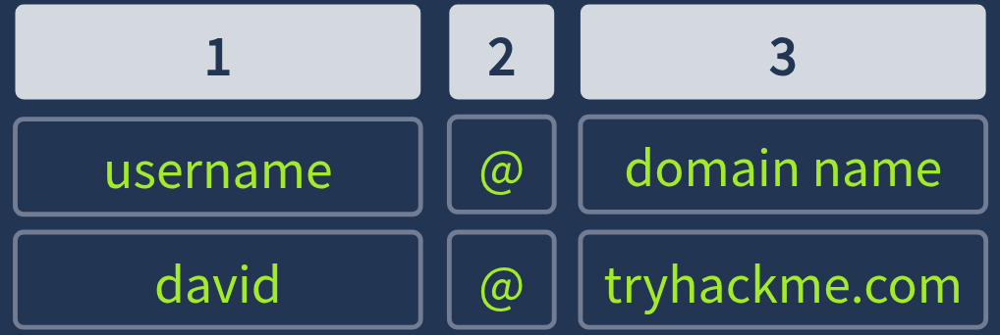

*Write-up by [Miyu7x](https://github.com/Miyu7x) | TryHackMe: [Miyu7](https://tryhackme.com/p/Miyu7)*

# Phishing Email Analysis

## Task 1 - Introduction

### Key Concepts

An **email adress** is made of:
- 1 Username
- 2 @ Separates the user from the domain, where the email is going
- 3 Domain name: server who provided the email and where the email is going(gmail, hotmail...)

### Task Questions

1. I am ready to learn about phishing analysis!
   - **Answer:**

---

## Task 2 - The Email Address

### Key Concepts

**Email** can be thought of as a home mailing address
The **domain** as a street or apt building
The **username** a specific person or mailbox number

### Task Questions

1. Identify the domain used in the following email address: `hatsalesman@tryhatme.com`
   - **Answer: tryhatme.com**

---

## Task 3 - Email Delivery

### Key Concepts

Emails can be delivered thru several different protocols
	- **SMTP** Simple Mail Transfer Protocol
	- **POP3** Downloads email to a device
		  - emails downloaded and stored on a single device
		  - sent messages are stored on the single device from which the email was sent
		  - emails can only be accessed from the single device to which the emails were sent
		  - emails are typically removed from the server after downloaded
	- **IMAP** Instant Message Protocol
		- emails are stored on the server can be downloaded to multiple devices
		- sent messages are stored on the server
		- syncs messages accross multiple devices
		- emails remain on the server unless explicitily deleted
	
	
| Feature | POP3 | IMAP |
|---------|------|------|
| Storage location | | |
| Multi-device access | | |
| Sent message storage | | |
| Server retention | | |

**Email Journey**

### Task Questions

1. Which protocol is responsible for sending an email from a client to a mail server?
   - **Answer: SMTP**

2. Which service is used to look up the recipient domain's mail server?
   - **Answer: DNS**

3. Bob wants to access his email from multiple devices, including his phone and laptop. Which protocol should he use?
   - **Answer: IMAP**

---

## Task 4 - Email Headers

### Key Concepts

**Email Headers** contain metadata about the sender along with server info
You can also view email headers by going to **Message Source** which provides a view of the **raw message** which provides more detailed informaiton

1. From
2. To
3. Reply to
4. Subject
5. Date

You can also view email headers by going to **Message Source** which provides a view of the **raw message** which provides more detailed informaiton

### Task Questions

1. What is the full subject line of `email1.eml`?
   - **Answer: Help protect your budget by protecting your home**

1. View the message source of `email1.eml` using Thunderbird in your VM. What is the IP address listed as the `X-Originating-IP`?
   
   
   - **Answer: 43.255.56.161**

---

## Task 5 - Email Body

### Key Concepts

**Emails** can be formatted two ways
	- Text
	- HTML (images, links, style)

Viewing **emails** in **raw** format allows us to see the code of the html
	- content type

<!-- Describe plain text vs HTML email bodies and what HTML enables (images, links, styling) -->
<!-- Explain how viewing HTML source reveals embedded elements not visible in the rendered view -->
<!-- Define the three key attachment headers: Content-Type, Content-Disposition, Content-Transfer-Encoding -->
<!-- Explain how base64-encoded attachments can be decoded using CyberChef or a converter to reconstruct the original file -->

### Task Questions

1. Open up the `email2.txt` file to view the source of an attachment. What is the `Content-Type` of the attachment?
   
   
   - **Answer: application/pdf**

1. What is the name of the attachment from the previous question?
   - **Answer: zmqpalgh.pdf**

1. Decode the base64 string using either a PDF converter or CyberChef. What is the hidden flag value?
   
 
   - **Answer: THM{BENIGN_PDF_ATTACHMENT}**

---

## Task 6 - Types of Phishing

### Key Concepts

Attackers use **email** as one of their preferred methods to gain access
	- common everyone uses it
	- builds social engineering to catch big targets

**Phishing email** common charaterictics
- Spofed From Address (noreply@microsf.com)
- Urgent Subject
- Brand Impersonation
- Grammar and Speeling Issues
- Generic Content
- Hidden or Shortned Links
- Malicious Attachments

| Type | Target | Vector |
|------|--------|--------|
| Spam / Malspam | | |
| Phishing | | |
| Spear Phishing | | |
| Whaling | | |
| Smishing | | |
| Vishing | | |

### Task Questions

1. Which reputable organization is being spoofed in this phishing attempt?
   
   
   - **Answer: Home Depot**

2. What is the sender's email address?
   - **Answer: support@teckbe.com**

1. Inspect the email message source. What is the defanged `X-Originating-IP`?
   
   
   - **Answer: 103[.]234[.]236[.]83**

1. Continue analyzing the email message source. Which mail server generated the `Authentication-Results` header?
   
   
   - **Answer: atlas102.free.mail.gq1.yahoo.com**

---

## Task 7 - Conclusion

### Key Concepts

<!-- Define Business Email Compromise (BEC): attacker uses a legitimate internal account to authorize fraudulent actions -->
<!-- Note the distinction between BEC and standard phishing: BEC uses a real compromised account, not a spoofed one -->
<!-- Identify the next rooms in the Phishing Analysis module -->

### Task Questions

1. What attack, signified by the acronym BEC, uses a compromised email to trick employees into fraud?
   - **Answer: Business Email Compromise**

---

