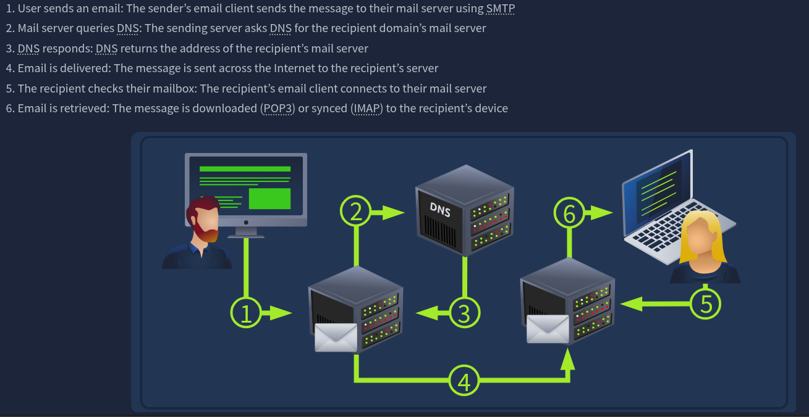
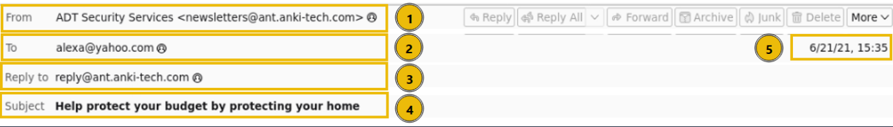
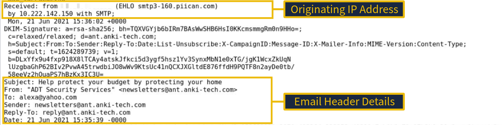
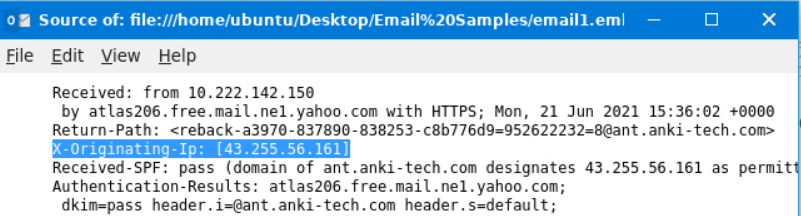
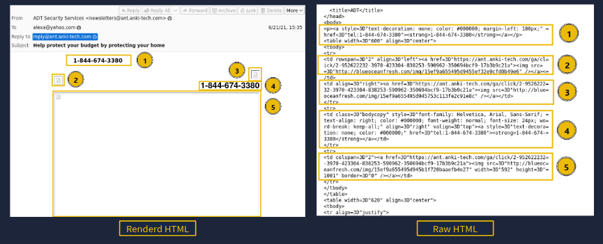
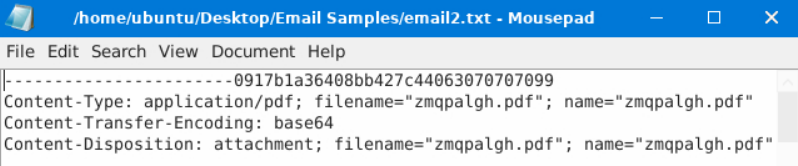
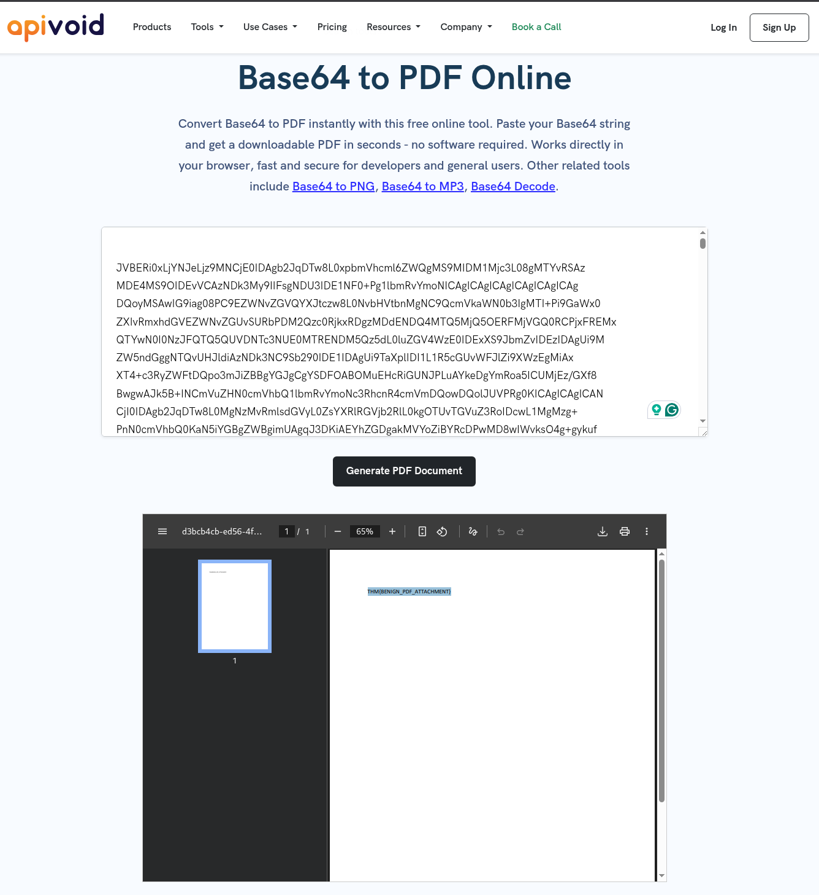
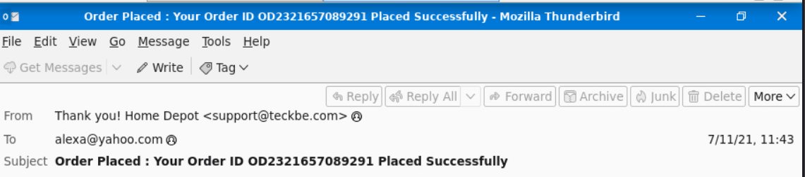
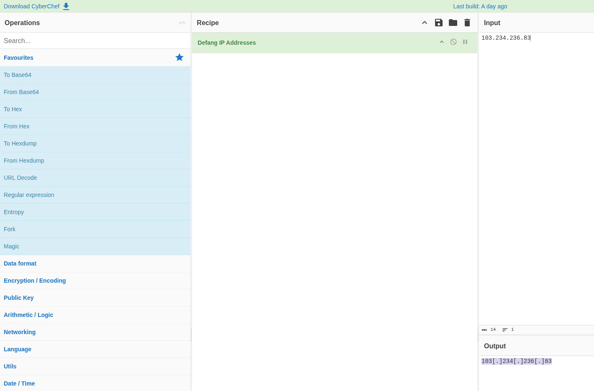
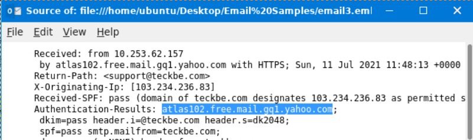

 
*Write-up by [Miyu7x](https://github.com/Miyu7x) | TryHackMe: [Miyu7](https://tryhackme.com/p/Miyu7)*
 
---
 
## Task 1 - Introduction
 
### Key Concepts
 
<!-- Room covers the fundamentals of email structure, delivery, headers, and body analysis as a foundation for phishing investigation -->
<!-- Establishes the building blocks needed before moving into Phishing Emails in Action and Phishing Analysis Tools -->
 
### Task Questions
 
1. I am ready to learn about phishing analysis!
   - **Answer:**
---
 
## Task 2 - The Email Address
 
### Key Concepts
 
An email address is made up of three components:
 
- **Username** - identifies the individual mailbox
- **@ symbol** - separates the user from the domain
- **Domain name** - the mail server that hosts the mailbox (e.g. gmail.com, hotmail.com)
An email address can be thought of like a home mailing address: the domain is the street or apartment building, and the username is the specific person or mailbox number within it.
 
### Task Questions
 
1. Identify the domain used in the following email address: `hatsalesman@tryhatme.com`
   - **Answer: tryhatme.com**
---
 
## Task 3 - Email Delivery
 
### Key Concepts
 
Emails are delivered using several protocols depending on the direction of the message and how it is accessed.
 
- **SMTP** (Simple Mail Transfer Protocol) - responsible for sending email from a client to a mail server and between mail servers
- **POP3** (Post Office Protocol 3) - downloads email to a single device; messages are typically removed from the server after download; sent messages stored locally only
- **IMAP** (Internet Message Access Protocol) - stores email on the server and syncs across multiple devices; sent messages remain on the server; emails persist until explicitly deleted
| Feature | POP3 | IMAP |
|---|---|---|
| Storage location | Local device | Server |
| Multi-device access | No | Yes |
| Sent message storage | Local device only | Server |
| Server retention | Removed after download | Retained until deleted |
 
**DNS** is used during email delivery to look up the recipient domain's mail server (MX record) so the message can be routed correctly.
 

 
### Task Questions
 
1. Which protocol is responsible for sending an email from a client to a mail server?
   - **Answer: SMTP**
2. Which service is used to look up the recipient domain's mail server?
   - **Answer: DNS**
3. Bob wants to access his email from multiple devices, including his phone and laptop. Which protocol should he use?
   - **Answer: IMAP**
---
 
## Task 4 - Email Headers
 
### Key Concepts
 
Email headers contain metadata about the message, including sender information and server routing data. Key visible header fields include:
 
1. **From** - sender's display name and email address
2. **To** - recipient's email address
3. **Reply-To** - address where replies are directed (may differ from From)
4. **Subject** - subject line of the message
5. **Date** - timestamp of when the email was sent
Viewing **Message Source** in an email client exposes the raw header, which contains additional fields not shown in the standard view - including the originating IP address, mail server hops, and authentication results.
 

 

 
### Task Questions
 
1. What is the full subject line of `email1.eml`?
   - **Answer: Help protect your budget by protecting your home**
2. View the message source of `email1.eml` using Thunderbird in your VM. What is the IP address listed as the `X-Originating-IP`?
   
   - **Answer: 43.255.56.161**
---
 
## Task 5 - Email Body
 
### Key Concepts
 
Email bodies can be formatted in two ways:
 
- **Plain text** - no formatting, no embedded elements
- **HTML** - supports images, hyperlinks, and styling; used in most modern phishing emails to impersonate brands
Viewing an email in raw or source format reveals the underlying HTML, including content type declarations and encoded attachments. Three key attachment headers to recognize:
 
- **Content-Type** - declares the file type of the attachment (e.g. `application/pdf`)
- **Content-Disposition** - specifies how the attachment should be handled (e.g. `attachment; filename="file.pdf"`)
- **Content-Transfer-Encoding** - indicates the encoding method used, most commonly `base64`
Base64-encoded attachments can be decoded using CyberChef or a dedicated converter to reconstruct the original file for analysis.
 

 
### Task Questions
 
1. Open up the `email2.txt` file to view the source of an attachment. What is the `Content-Type` of the attachment?
   
   - **Answer: application/pdf**
2. What is the name of the attachment from the previous question?
   - **Answer: zmqpalgh.pdf**
3. Decode the base64 string using either a PDF converter or CyberChef. What is the hidden flag value?
   
   - **Answer: THM{BENIGN_PDF_ATTACHMENT}**
---
 
## Task 6 - Types of Phishing
 
### Key Concepts
 
Attackers favor email as an attack vector because it is universal and lends itself to social engineering. Common phishing email characteristics:
 
- Spoofed From address (e.g. `noreply@microsf.com`)
- Urgent or alarming subject line
- Brand impersonation using logos and HTML templates
- Grammar and spelling errors
- Generic, non-personalized content
- Hidden or shortened links
- Malicious attachments
| Type | Target | Vector |
|---|---|---|
| Spam / Malspam | Mass recipients | Unsolicited bulk email, may carry malware |
| Phishing | General users | Deceptive email designed to steal credentials or deliver payloads |
| Spear Phishing | Specific individual or organization | Targeted phishing using personalized details |
| Whaling | Senior executives (C-suite) | High-value spear phishing targeting leadership |
| Smishing | Mobile users | Phishing delivered via SMS text message |
| Vishing | Phone users | Voice-based social engineering over phone calls |
 
### Task Questions
 
1. Which reputable organization is being spoofed in this phishing attempt?
   
   - **Answer: Home Depot**
2. What is the sender's email address?
   - **Answer: support@teckbe.com**
3. Inspect the email message source. What is the defanged `X-Originating-IP`?
   
   - **Answer: 103[.]234[.]236[.]83**
4. Continue analyzing the email message source. Which mail server generated the `Authentication-Results` header?
   
   - **Answer: atlas102.free.mail.gq1.yahoo.com**
---
 
## Task 7 - Conclusion
 
### Key Concepts
 
**Business Email Compromise (BEC)** is an attack in which a threat actor gains access to a legitimate corporate email account and uses it to authorize fraudulent actions - such as wire transfers or credential theft - by impersonating a trusted internal employee. Unlike standard phishing, which uses spoofed addresses, BEC leverages a real compromised account, making it significantly harder to detect.
 
### Task Questions
 
1. What attack, signified by the acronym BEC, uses a compromised email to trick employees into fraud?
   - **Answer: Business Email Compromise**
