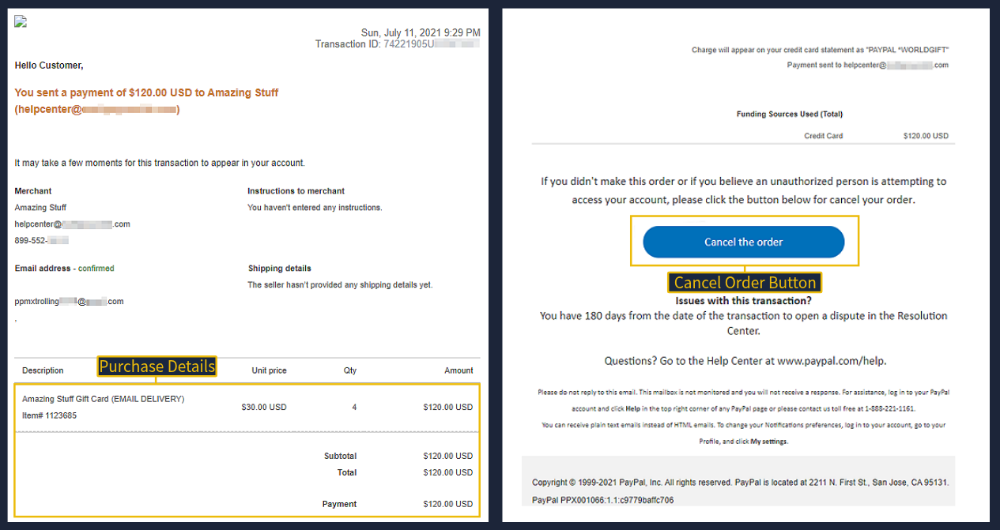
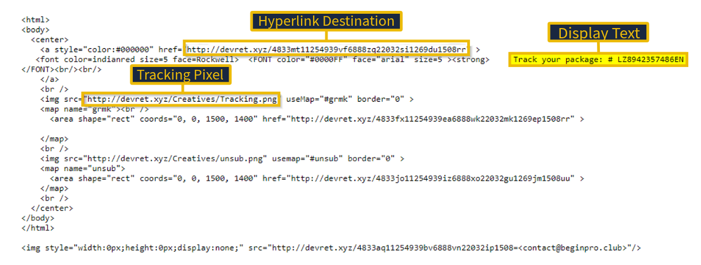
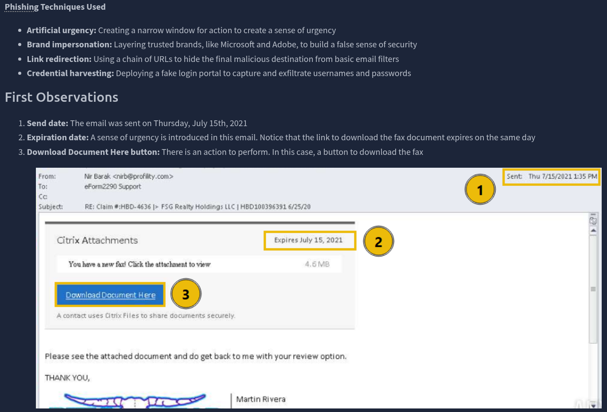
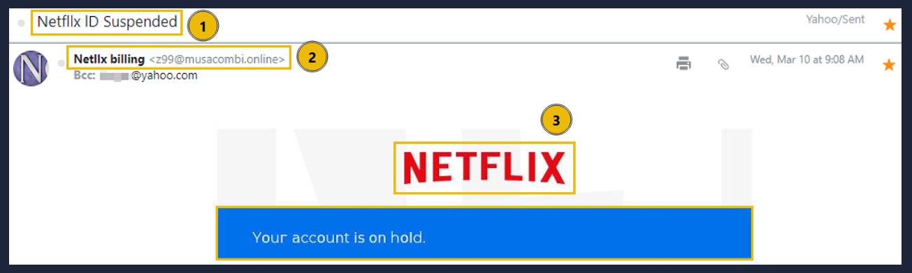
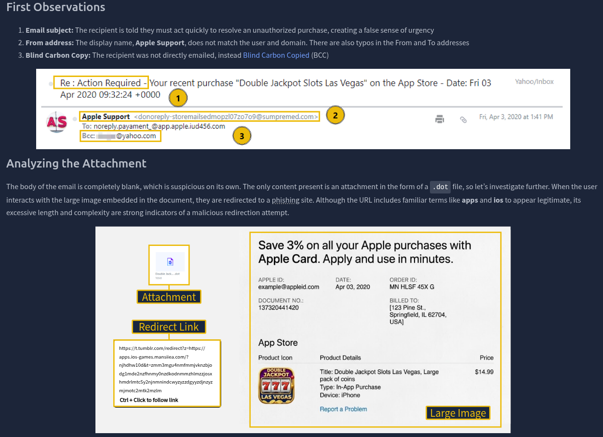
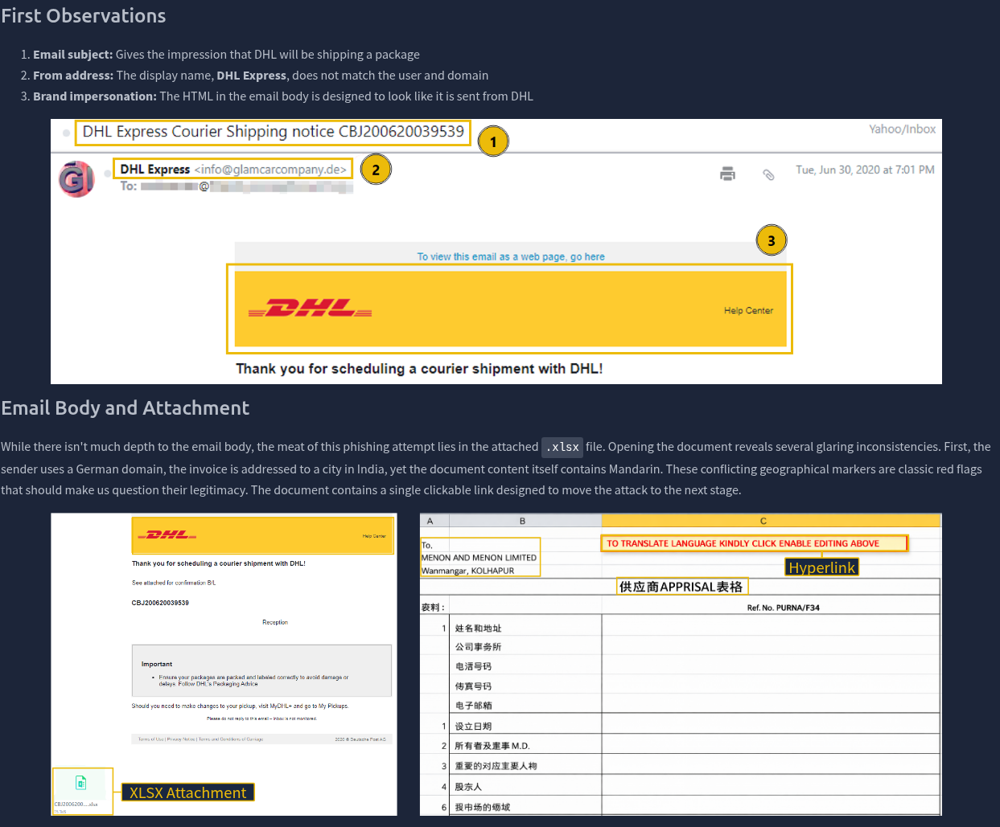
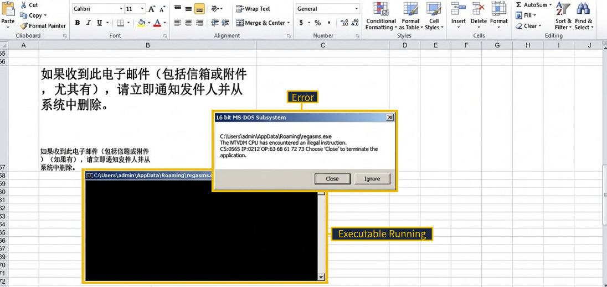

*Write-up by [Miyu7x](https://github.com/Miyu7x) | TryHackMe: [Miyu7](https://tryhackme.com/p/Miyu7)*

---

## Task 1 - Introduction

### Key Concepts

This room transitions from theory into applied analysis by examining real phishing email samples. The focus is on recognizing the subtle differences between a legitimate notification and a crafted attack. Key techniques attackers use include:

- **Spoofed email address** - display name mimics a trusted service while the actual sender domain is unrelated
- **URL shortening** - redirection services like bit.ly obscure the true destination of a malicious link
- **Branded HTML** - corporate logos and email templates used to impersonate legitimate companies
- **Attention-grabbing subject lines** - urgency or fear used to pressure the recipient into acting without thinking

Viewing the **raw source** of an email gives analysts a deeper look at the actual content. Attackers commonly hide malicious links inside HTML buttons such as "Cancel Order" or "Click Here," with URL shortening layered on top to further obscure the destination. Tool introduced: **WhereGoes** - a URL redirect checker that safely traces a shortened URL to its final destination without visiting it.

### Task Questions

1. I am ready to analyze phishing emails!
   - **Answer:**

---

## Task 2 - Cancel Your Order

### Key Concepts

This sample mimics an official PayPal transaction receipt. The attacker leverages a spoofed sender address and a URL shortening service to hide the true destination of the "Cancel the order" button.

- The **From** display name shows `service@paypal.com` but the actual sender domain is `sultanbogor.com` - an immediate red flag
- The **To** address is an unusual recipient, not a standard Yahoo domain
- The **subject line** creates urgency by referencing a fake purchase
- The **Cancel the order** button links to a shortened URL, making the destination impossible to verify at a glance without a tool like WhereGoes

| Technique | Description |
|---|---|
| Spoofed email address | Display name mimics trusted service; actual sender domain is unrelated |
| URL shortening | Redirection service hides true link destination |
| Branded HTML | Corporate imagery used to impersonate legitimate service |

### Task Questions

1. Who is listed as the Merchant in the email body?
   - **Answer: Amazing Stuff**

---

## Task 3 - Track Your Package

### Key Concepts

This sample mimics a shipping notification from a distribution center. Three techniques are layered to compromise the recipient:

- The **From** display name reads "Distribution Center" but the actual sender is `contact@beginpro.club`
- The **subject line** uses a fake tracking number to create urgency
- **Pixel tracking** - invisible images (1x1 px) are embedded in the email and load from the attacker's server when the email is opened, confirming a live inbox and logging metadata such as IP address and timestamp
- Yahoo automatically blocked images in this sample specifically to prevent pixel trackers from firing - a standard protective behavior across most major email providers
- The hyperlink in the email body is tied to the fake tracking number; inspecting the raw source reveals the true destination domain

| Technique | Description |
|---|---|
| Spoofed email address | Display name does not match actual sender domain |
| Pixel tracking | Invisible images embedded to detect when email is opened |
| Link manipulation | Fraudulent tracking number masks malicious URL destination |

### Task Questions

1. What root domain does the hyperlink in the above example point to? Be sure to defang the URL.
   - **Answer: devret[.]xyz**

---

## Task 4 - Download Document Here

### Key Concepts

This sample demonstrates a multi-stage redirection chain designed to harvest credentials while building false trust through layered brand impersonation.

- The email creates **artificial urgency** by setting the fax download link to expire on the same day it was sent (July 15, 2021)
- Clicking "Download Document Here" leads through three sequential redirects, each impersonating a trusted brand to lower the victim's guard
- The final stage is a **credential harvesting portal** that prompts the victim to sign in with their email provider - the credentials are sent directly to the attacker's server, and the victim receives only a generic error message regardless of what they enter
- Note: typos and grammar errors are becoming less reliable as detection signals - AI now allows attackers to generate polished, error-free phishing content at scale

| Redirection Stage | Impersonated Service |
|---|---|
| Stage 1 | OneDrive share landing page |
| Stage 2 | Adobe document portal |
| Stage 3 | Credential harvesting login portal |

### Task Questions

1. The attacker deployed a fake portal to capture and exfiltrate user credentials. What is this type of attack called?
   - **Answer: Credential Harvesting**

---

## Task 5 - Your Account Is on Hold

### Key Concepts

This sample impersonates a Netflix billing notification. Rather than embedding a malicious link directly in the email body, the attacker routes the victim through a PDF attachment to bypass link-scanning filters.

- The **From** display name reads "Netllx billing" - a deliberate misspelling of Netflix and an immediate red flag
- The **subject line** claims the account is suspended, pressuring the recipient to act immediately
- The **HTML template** and Netflix branding are used to build visual credibility
- The **PDF attachment** contains an embedded "Update Payment Account" link pointing to a domain with no affiliation to Netflix
- Additional red flags: atypical phone number format and the use of a legitimate Netflix help center URL to create a false sense of trust

| Technique | Description |
|---|---|
| Spoofed email address | Display name set to "Netllx billing"; does not match actual sender |
| Urgency | Suspended account notification demands immediate action |
| Brand impersonation | HTML and logos mimic Netflix billing communications |
| Attachment | PDF contains embedded link to non-Netflix domain |

### Task Questions

1. What is the actual sender email address hidden behind the `Netllx billing` display name?

   
   - **Answer: z99@musacombi.online**

---

## Task 6 - Your Recent Purchase

### Key Concepts

This sample impersonates Apple Support and relies entirely on an unusual attachment to deliver the malicious payload - the email body is completely blank.

- The **From** display name reads "Apple Support" but the actual sender domain does not match; typos are also present in both the From and To fields
- The victim is **BCCed** (Blind Carbon Copied) rather than directly addressed, concealing the true recipient list and reducing traceability
- The **subject line** references an unauthorized purchase to create urgency
- The **attachment** is a `.dot` file (Microsoft Word Template) - an unusual format for a receipt and a red flag on its own
- Inside the document, a large embedded image acts as a clickable link that redirects the victim to a phishing site; the URL uses terms like `apps` and `ios` to appear legitimate, but its excessive length and complexity expose it as a malicious redirect

| Technique | Description |
|---|---|
| Spoofed email address | Display name "Apple Support" does not match actual sender domain |
| BCC | Victim is blind carbon copied; not a direct recipient |
| Attachment | .dot file (Word Template) contains redirect to phishing site |
| Blank body | No body text; all content is inside the attachment |

### Task Questions

1. What does the acronym BCC stand for?
   - **Answer: Blind Carbon Copy**

2. What is the file extension of the attachment?
   - **Answer: .dot**

---

## Task 7 - Scheduled Shipment

### Key Concepts

This sample impersonates DHL Express and uses a malicious Excel attachment as the primary delivery mechanism for an executable payload.

- The **From** display name reads "DHL Express" but the actual sender domain does not match
- The **HTML template** and DHL branding are used to impersonate the shipping company
- The **attachment** is a `.xlsx` file containing a clickable link that triggers the download of `regasms.exe`
- Red flags within the document itself: German sender domain, invoice addressed to a city in India, document content in Mandarin - conflicting geographic markers are a strong indicator of a malicious or fraudulent file
- If successfully executed, the payload could be used to establish persistence, exfiltrate credentials and sensitive files, or deploy ransomware

| Post-Execution Risk | Description |
|---|---|
| Persistence | Backdoor or scheduled task survives reboot |
| Data exfiltration | Credentials, files, and browser-stored passwords stolen |
| Ransomware | System encrypted; payment demanded for recovery |

### Task Questions

1. What is the name of the executable that the Excel attachment attempts to run?

   
   - **Answer: regasms.exe**

---

## Task 8 - Conclusion

### Key Concepts

This room reinforced that phishing analysis requires attention to detail across every layer of an email - headers, body content, links, and attachments each carry their own signals. Typos and poor grammar used to be reliable red flags, but AI-generated phishing content is making that harder to rely on. The stronger indicators are structural: sender domain mismatches, redirect chains, unusual attachment formats, and anything that creates pressure to act fast without thinking.

### Task Questions

1. Complete the room and continue on your cyber learning journey!
   - **Answer:**
