 
*Write-up by [Miyu7x](https://github.com/Miyu7x) | TryHackMe: [Miyu7](https://tryhackme.com/p/Miyu7)*

---

## Task 1 - Introduction

### Key Concepts

This room builds on the header and body analysis covered in the previous two rooms by introducing the tools that enable deeper, faster investigation. The focus shifts from manual inspection to a structured, tool-assisted workflow: collecting artifacts, running reputation checks, using sandboxes to analyze attachments safely, and applying those skills across three real-world phishing cases.

### Task Questions

1. I am ready to learn about phishing analysis tools!
   - **Answer:**

---

## Task 2 - Identifying Artifacts

### Key Concepts

Before reaching for any tool, the first step in any phishing investigation is artifact collection. Knowing what to look for in the header and body gives the analysis direction.

| Artifact Category | Key Items to Collect |
|---|---|
| Header | Sender email, sender IP, subject line, recipient (To/CC/BCC), Reply-To, date/time |
| Body | URLs/hyperlinks, attachment names, attachment SHA256 hash |

### Task Questions

1. I understand the key indicators to look for when analyzing an email.
   - **Answer:**

---

## Task 3 - Email Header Analysis

### Key Concepts

Some header fields are visible directly in an email client, but others - like the originating IP and Reply-To address - require viewing the raw message source. These tools automate the extraction process:

- **Messageheader** (Google Admin Toolbox) - paste the full header to extract the sender IP, routing path, and any misconfigurations
- **Message Header Analyzer** (mha.azurewebsites.net) - alternative tool with similar functionality

Once the sender IP is identified, reputation and geolocation tools help determine whether the infrastructure is legitimate:

- **IPinfo** - returns geographic location and associated organization for any IP address
- **URLScan.io** - simulates a real browsing session against a submitted URL, records all page activity, and captures a screenshot; allows safe inspection without visiting the site directly
- **Talos IP and Domain Reputation Center** (Cisco) - assesses the reputation of IPs, domains, and networks; returns a classification indicating whether the indicator has been associated with malicious activity

| Tool | Purpose |
|---|---|
| Messageheader | Parse full email headers; extract routing and sender IP |
| Message Header Analyzer | Alternative header parsing tool |
| IPinfo | IP geolocation and organization lookup |
| URLScan.io | Safe URL inspection via simulated browsing session |
| Talos Reputation Center | IP, domain, and network reputation and classification |

### Task Questions

1. Use Talos Reputation Center to look up `malware-test.com`. What is the web reputation assigned to this domain?

   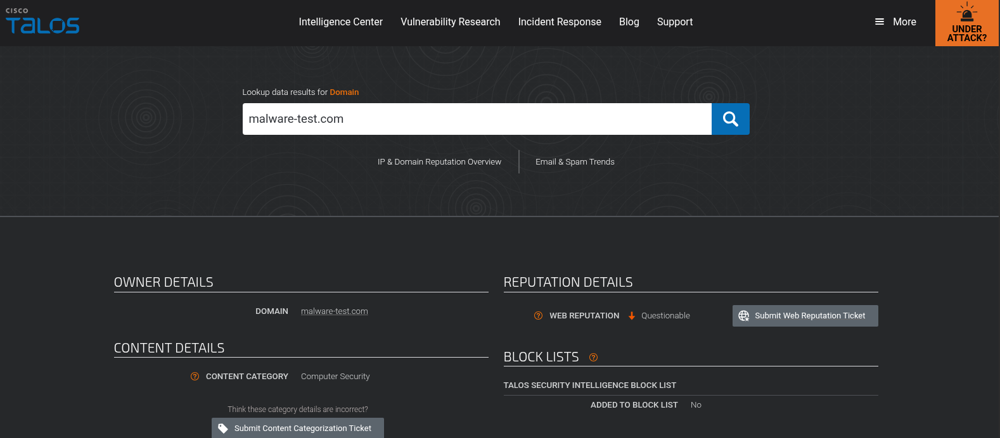

   *Note: the Talos result now shows Questionable, but the answer the room accepts is Neutral.*
   - **Answer: Neutral**

---

## Task 4 - Email Body Analysis

### Key Concepts

The email body is where the malicious payload is delivered - either as a link or an attachment. Key analysis steps:

- URLs can be extracted by right-clicking a link in the email client, or by parsing the raw HTML source
- **URL extraction tools** (e.g. convertcsv.com/url-extractor) auto-parse all embedded links from pasted raw email content
- **CyberChef** can perform the same extraction and supports additional transforms useful during analysis
- Attachments should only be downloaded in a controlled environment such as a VM or sandbox to avoid accidental execution
- Once safely obtained, generate a hash using `sha256sum` in Linux for reputation lookup
- **VirusTotal** checks the reputation of files, URLs, IPs, and domains against dozens of security vendors and returns detailed detection results

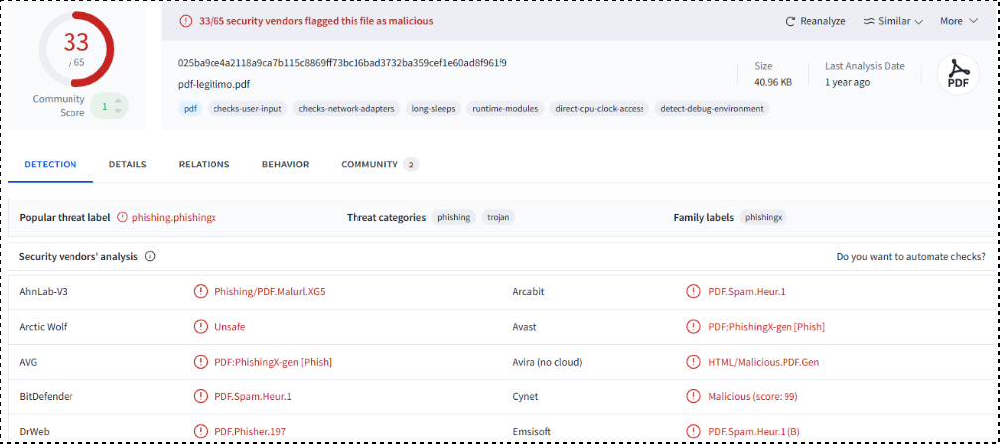

| Tool | Use Case |
|---|---|
| URL extraction tool | Auto-parse all links from raw email content |
| CyberChef | URL extraction and other data transformations |
| sha256sum (Linux) | Generate SHA256 hash of a file |
| Talos Reputation Center | Hash and domain reputation lookup |
| VirusTotal | Multi-vendor file, URL, IP, and domain reputation |

### Task Questions

1. What command can you use in a Linux environment to obtain the `SHA256` hash value of an attachment?
   - **Answer: sha256sum**

---

## Task 5 - Malware Sandboxes

### Key Concepts

Malware sandboxes allow analysts to safely execute and observe suspicious files without risking production systems. They reveal URLs the file attempts to contact, any additional payloads it downloads, system changes, network activity, and other IOCs - no advanced malware analysis skills required.

| Sandbox | Key Feature |
|---|---|
| ANY.RUN | Interactive real-time execution; hands-on environment with live process and network monitoring |
| Hybrid Analysis | Free; detailed behavioral reports including system changes, network activity, and IOCs |
| JOESandbox | Advanced static and dynamic analysis; comprehensive reports with threat classifications |

### Task Questions

1. I understand the available sandbox environments for safely analyzing files and URLs.
   - **Answer:**

---

## Task 6 - Using PhishTool

### Key Concepts

**PhishTool** is a centralized phishing investigation platform that combines threat intelligence, OSINT, email metadata, and automated analysis into a single workflow. On upload it presents the rendered HTML view, raw HTML, and message source side by side.

Key features:
- Tabs for authentication results, transmission paths, and embedded URLs
- Attachment review directly within the platform
- VirusTotal integration - reputation and detection results visible without leaving the tool
- Case resolution workflow: mark the email as malicious, flag artifacts (sender, IP, URLs), add investigation notes, and click Resolve - mirrors real SOC documentation and case closure

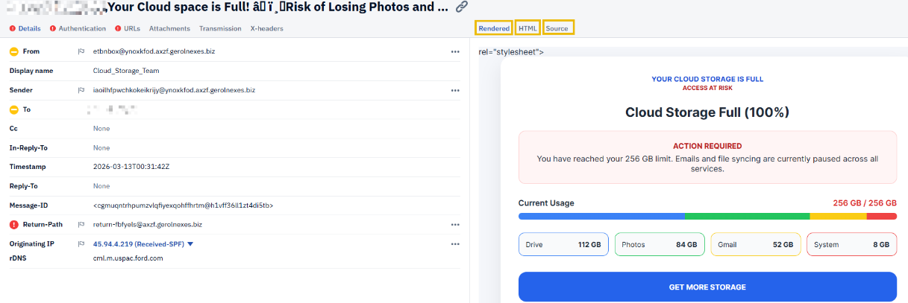

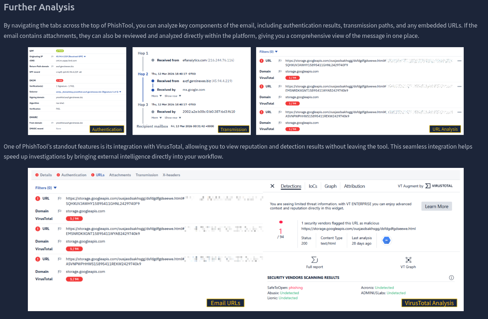

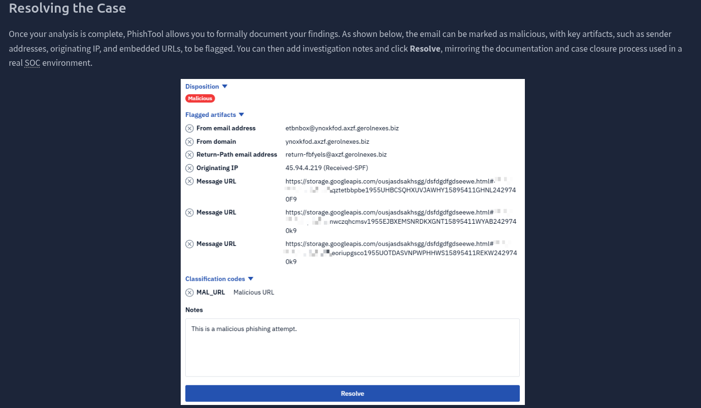

### Task Questions

1. According to the VirusTotal analysis from above, which vendor categorized the URLs as phishing?
   - **Answer: SafeToOpen**

---

## Task 7 - Your Account Is on Hold

### Key Concepts

Scenario: Level 1 SOC analyst triaging a user-reported phishing email. File `Phish3Case1.eml` opened in Thunderbird on the deployed VM. Key workflow: use `View > Message Source` to access the raw header and locate the `Received: from` IP and `Return-Path` domain. Inspect HTML source to find the shortened URL behind the "UPDATE ACCOUNT NOW" button.

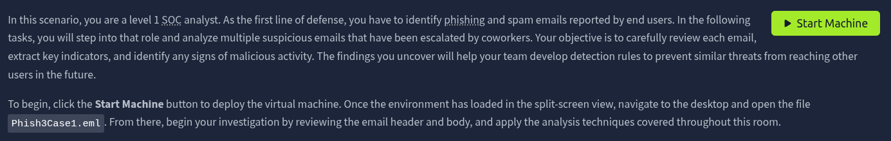

### Task Questions

1. What reputable brand is this email tailored to impersonate?

   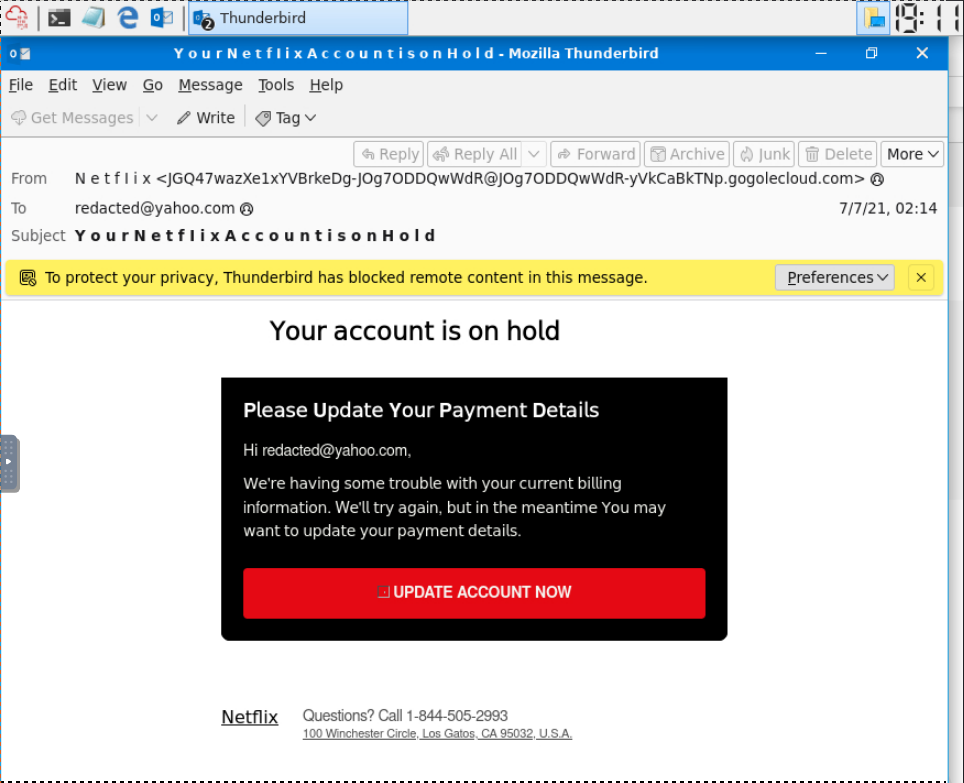
   - **Answer: Netflix**

2. Based on the email headers, who is the intended recipient of this message?
   - **Answer: redacted@yahoo.com**

3. In Thunderbird mail use `View` > `Message Source`. What is the `Received: from` IP address?

   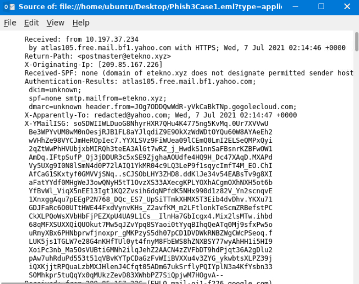
   - **Answer: 10.197.37.234**

4. Check out the `Return-Path` field in the message source. What would you consider a domain of interest based on this field?
   - **Answer: etekno.xyz**

5. Investigate the `UPDATE ACCOUNT NOW` button. What is the shortened URL?

   *Right-click the button in Thunderbird and copy link address, or locate the anchor tag in the raw source.*
   - **Answer: https://t.co/yuxfZm8KPg?amp=1**

---

## Task 8 - Update Payment Details

### Key Concepts

This task uses ANY.RUN to investigate the malicious PDF attachment from a Netflix-themed phishing email. The sandbox session reveals the file's classification, SHA256 hash, network connections, and process behavior.

**Workflow tip: click "Text Report" inside ANY.RUN for a clean, structured view of all activity - much easier to navigate than the interactive view when answering specific questions.**

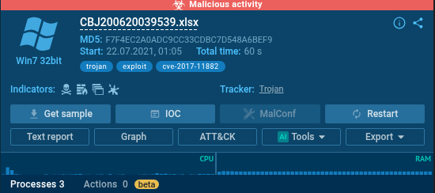

### Task Questions

1. How does ANYRUN classify this suspected phishing email?

   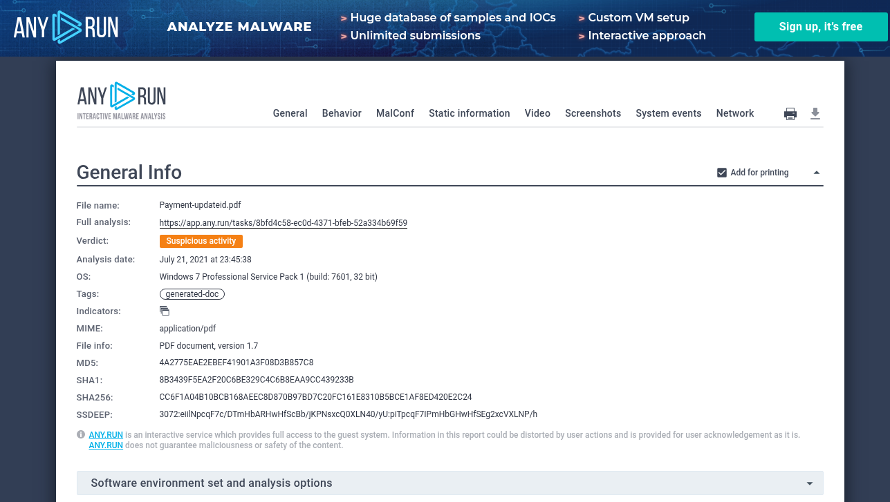
   - **Answer: Suspicious Activity**

2. What is the name of the `PDF` attachment?
   - **Answer: Payment-updateid.pdf**

3. Investigate the email attachment. What is the SHA256 hash of the `PDF` file?
   - **Answer: CC6F1A04B10BCB168AEEC8D870B97BD7C20FC161E8310B5BCE1AF8ED420E2C24**

4. Check out the ANYRUN text report on the phishing email. Which IP address associated with the process `AcroRd32.exe` is flagged as malicious?

   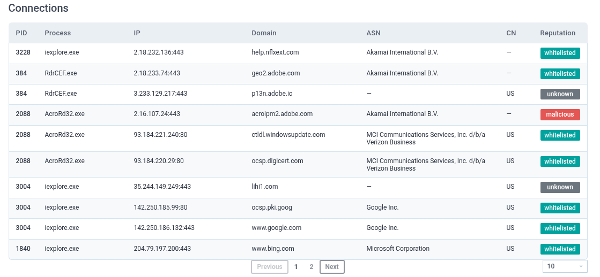
   - **Answer: 2.16.107.24**

5. Continue investigating the text report. Which Windows process is classed as `Potentially Bad Traffic`?

   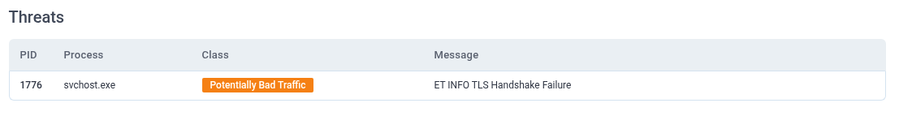
   - **Answer: svchost.exe**

---

## Task 9 - Excel Executable

### Key Concepts

This task analyzes a separate ANY.RUN sandbox session focused on a malicious `.xlsx` attachment. The Excel file contains an embedded link that downloads and attempts to execute a payload. The ANY.RUN text report exposes associated IPs, malicious domains, and the specific vulnerability being exploited.

**Workflow tip: use the Text Report view in ANY.RUN - same as Task 8.**

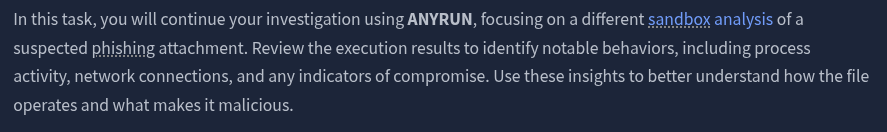

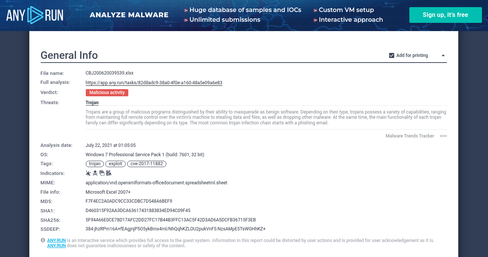

### Task Questions

1. How does ANYRUN classify the `.xlsx` attachment?
   - **Answer: Malicious Activity**

2. What is the file name of the Excel attachment?
   - **Answer: CBJ200620039539.xlsx**

3. Investigate the Excel attachment. What is the `SHA256` hash value?
   - **Answer: 5F94A66E0CE78D17AFC2DD27FC17B44B3FFC13AC5F42D3AD6A5DCFB36715F3EB**

4. Check out the ANYRUN text report. What IP address is associated with the malicious domain `biz9holdings.com`?

   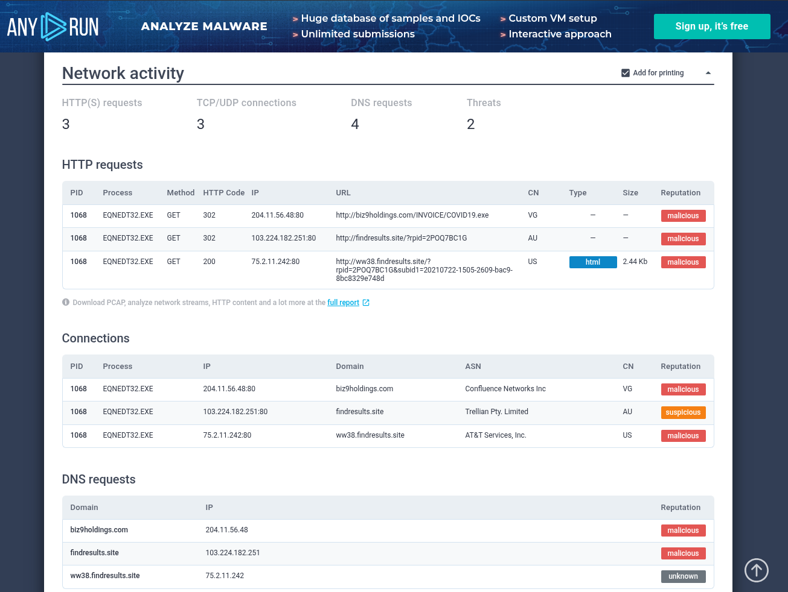
   - **Answer: 217.12.201.99**

5. Which other domain is classified as malicious?
   - **Answer: findresults.site**

6. What vulnerability does this malicious attachment attempt to exploit?

   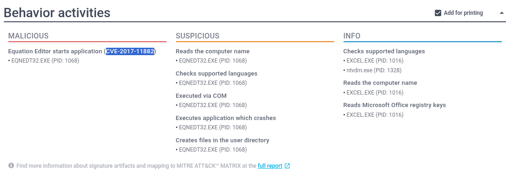

   *Note: the room is looking for the CVE number, not a vulnerability name.*
   - **Answer: CVE-2017-11882**

---

## Task 10 - Conclusion

### Key Concepts

This room tied together artifact collection, header and body analysis, reputation lookups, and sandbox investigation into a full analyst workflow. The standout takeaway is how accessible these tools are - ANY.RUN, Hybrid Analysis, VirusTotal, and PhishTool are all available without specialized equipment, meaning there is no reason to open a suspicious file on a production machine when a sandbox verdict is a URL away.

### Task Questions

1. Complete the room and continue on your cyber learning journey!
   - **Answer:**
