*Write-up by [Miyu7x](https://github.com/Miyu7x) | TryHackMe: [Miyu7](https://tryhackme.com/p/Miyu7)*

---

## Task 1 - Introduction

### Key Concepts

Phishing still remains one of the most used attack vectors by hackers, organization have come up with tools and controls to prevent their employees from interacting with malicious emails.
### Task Questions

**1. I understand the learning objectives and am ready to learn about phishing prevention!**
- **Answer:**

---

## Task 2 - Sender Policy Framework (SPF)

### Key Concepts

**SPF** or Sender Police Framework is a Dmarcian platform that helps protect emails from phishing
	- Authenticates email sender
	- Internet Providers can verify if the mail server is authorized to send email from a specific domain
	- An **SPF record is a DNS TXT record** containing a list of the IP addresses that are allowed to sned emails on behalf of your domain

**Workflow of SPF diagram**

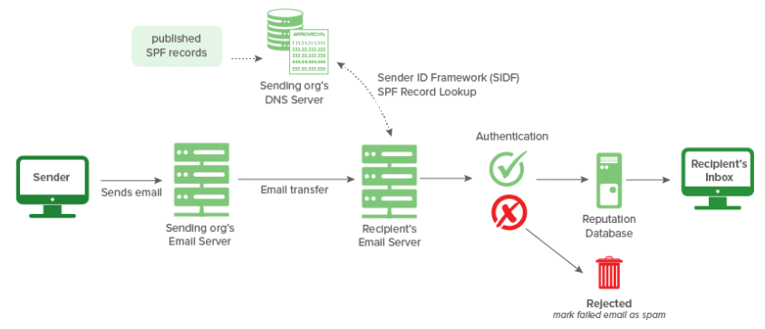

| Verification Result | Intended Action |
|---|---|
| Pass, Neutral, None | Accept |
| SoftFail, PermError | Flag (mark suspicious, allow) |
| Fail, TempError | Reject |

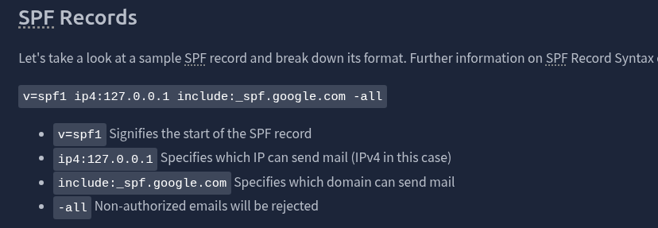

**SPF Surveyor** enables users to visually look at DNS records
	- No IP address will be visible here
	- But all IP addresses authorized will show up as legitimate senders

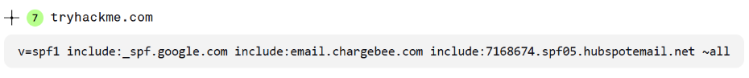

**Google Admin Toolbox Messageheader** will show us the details using an emails full header
- Example shows **SoftFail**
	- Sender is unauthorized but still will receive the email and flag it as suspicious

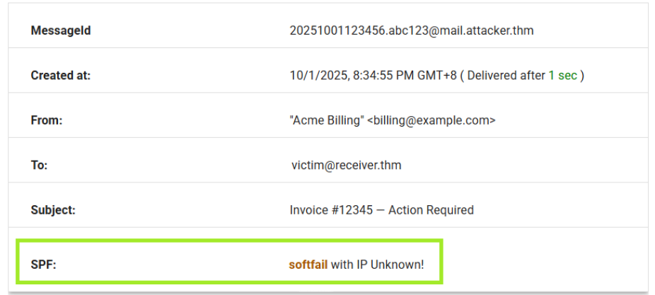

**DKIM Records and Commands**

### Task Questions

**1. Based on TryHackMe's SPF record above, how many domains are authorized to send email on its behalf?**
- **Answer: 3**

**2. What is the intended action of an email that returns a `SoftFail` verification result?**
- **Answer: Flag**

---

## Task 3 - DomainKeys Identified Mail (DKIM)

### Key Concepts

**DKIM** DomainKeys Identified Mail
	- Authentication for an email being sent
	- Record exists in the DNS
	- More complex than SPF
	- Survives forwarding
	
**DMARC** Domain-based Message Authentication Reporting and Conformance
	- Technical standard to protect email from spam, spoofing, phishing

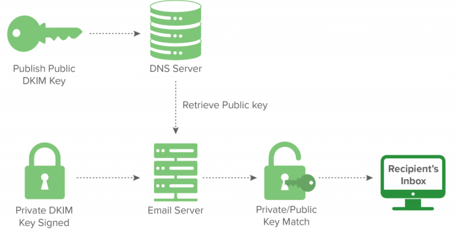

**Visualizing a Sample Spam Email Header**
	- **permerror** a failure in DKIM verification
	- invalid signature, missing or incorrect DNS record
	- forwarding a server making a modification
	- misconfiguration in DKIM setup

### Task Questions

**1. Based on the sample header above, what is the reason for the `permerror`?**
- **Answer: No key for signature**

---

## Task 4 - Domain-Based Message Authentication, Reporting, and Conformance (DMARC)

### Key Concepts

**DMARC** Domain-based Message Authentication Reporting and Conformance
	- Technical standard to protect email from spam, spoofing, phishing
	- 2 open source stances
		-  SPF (a published list of servers that are authorized to send email on behalf of a domain)
		-  DKIM (a tamper-evident domain seal associated with a piece of email), to the content of an email.
	
**Domain Checker Tool** 
- Inspects DMARC. SPF and DKIM records
- Failed emails will be rejected based on p=reject policy tag (policy that provides greatest amount of protection)
			
		  
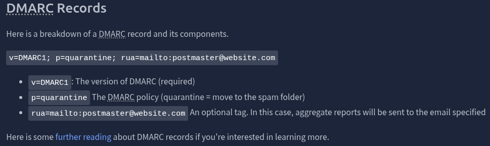

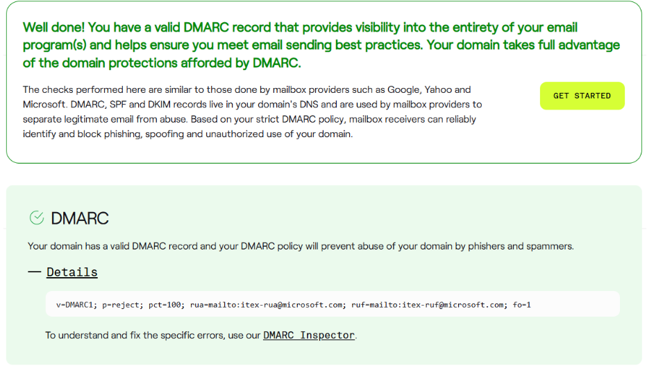
### Task Questions

**1. Which DMARC policy provides the greatest amount of protection by blocking emails that fail the DMARC check?**
- **Answer: p=reject**

---

## Task 5 - Secure/Multipurpose Internet Mail Extensions (S/MIME)

### Key Concepts

**S/MIME Secure/Multipurpose Internet Mail Extensions**
	- standard protocol for sending digitally signed and encrypted messages
	- based only on public key cryptography
	- private key **never shared**
	- public key can be shared
	- digital signature based
	- authentication: confirms sender identity thru digital certificate
	- non repudiation: ensures sender cannot deny the message
	- data integrity: detects any changes made to the message after it is signed

| Component | Mechanism | Security Properties |
|---|---|---|
| Digital Signature | Sender signs with private key; recipient verifies with sender's public key | Authentication, non-repudiation, data integrity |
| Encryption | Sender encrypts with recipient's public key; recipient decrypts with private key | Confidentiality |

### Task Questions

**1. Which S/MIME component ensures that only the intended recipient can read the contents of an email message?**
- **Answer: Encryption**

---

## Task 6 - Analyzing SMTP Responses

### Key Concepts

Analyze PCAP file with SMTP traffic

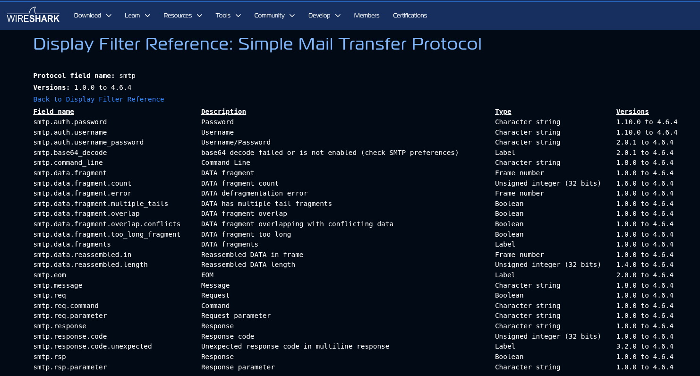
### Task Questions

**1. Which Wireshark filter can you use to narrow down your results based on SMTP response codes?**
- **Answer:**

**2. How many packets in the capture contain the SMTP response code `220 Service ready`?**
*smtp.response.code == 220*

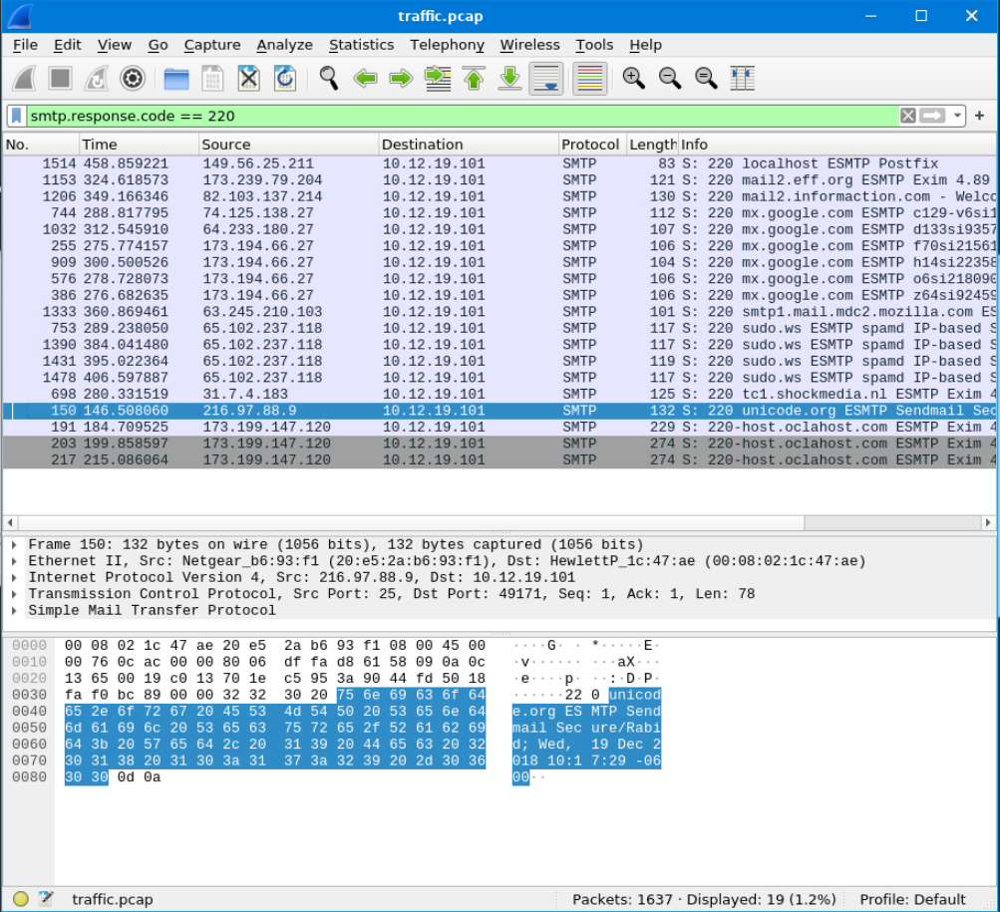
- **Answer: 19**

**3. One SMTP response indicates that an email was blocked by `spamhaus.org`. What response code did the server return?**
*smtp contains "spamhaus"*

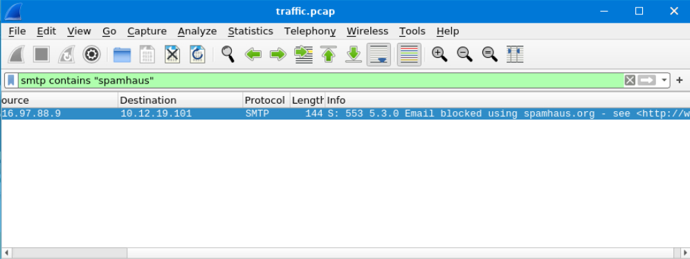
- **Answer: 553**

**4. Based on the packet from the previous question, what is the full `Response code:` message?**

- **Answer: Requested action not taken: mailbox name not allowed (553)**

**5. Search for response code `552`. How many messages were blocked for presenting potential security issues?**
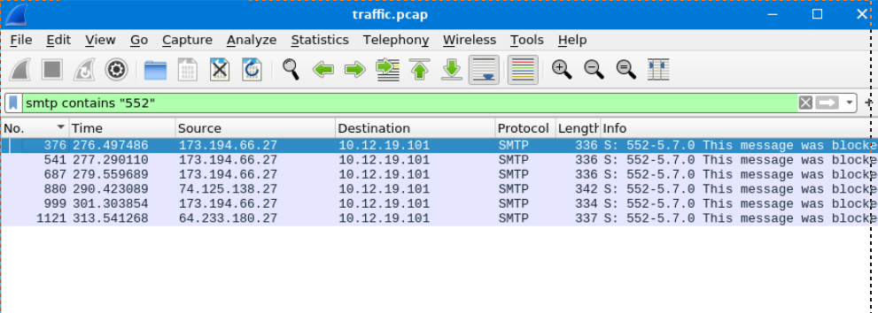
- **Answer: 6**

---

## Task 7 - Inspecting Emails and Attachments

### Key Concepts

**Internet Message Format** IMF
- inner details of emails
  
  

### Task Questions

**1. How many SMTP packets are available for analysis?**
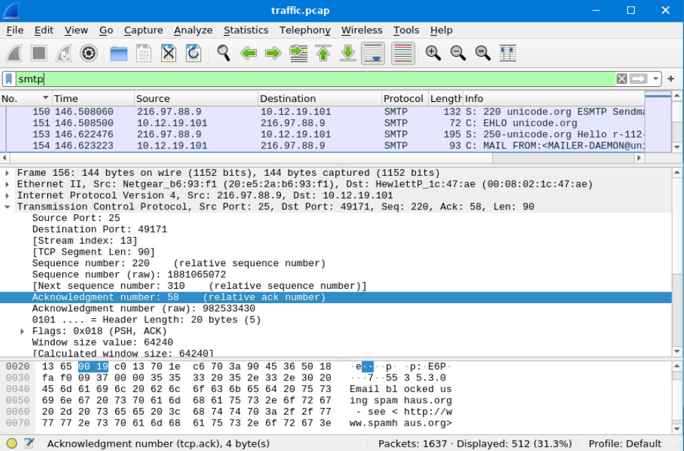
- **Answer: 512**

**2. What is the name of the attachment in packet `270`?**
*Ctrl + G Go to Packet*

- **Answer: document.zip**

**3. According to the message in packet `270`, which Host IP address is not responding, making the message undeliverable?**
- **Answer:**

**4. By filtering for `imf`, which email client was used to send the message containing the attachment `attachment.scr`?**
*Copy Field Name!!*

- **Answer: Microsoft Outlook Express 6.00.2600.0000**

**5. Which type of encoding is used for this potentially malicious attachment?**
- **Answer:**

---

## Task 8 - How Organizations Stop Phishing

### Key Concepts

There a few modern solutions that comapnys use today to filter out phishing email
	- Training is really valuable for any company and its employees

| Defense Type | Control | Purpose |
|---|---|---|
| Technical | Email Filtering | Block/quarantine based on IP and domain reputation |
| Technical | Secure Email Gateways (SEGs) | Detect impersonation, spoofing, and advanced phishing |
| Technical | Link Rewriting | Replace suspicious URLs with scanned redirects |
| Technical | Sandboxing | Safely analyze attachments and links in isolation |
| User-Facing | Trust & Warning Indicators | Visual cues flagging external or suspicious senders |
| User-Facing | Phishing Reporting | In-email reporting for users to flag suspicious messages |
| User-Facing | Awareness Training | Educate on phishing tactics and social engineering |
| User-Facing | Phishing Simulations | Controlled campaigns to test and reinforce training |

### Task Questions

**1. A security team wants to implement a control to detect hidden malware inside email attachments. They need a way to analyze suspicious files without risking infection on real systems. Which protective technique would allow them to observe a file's behavior safely?**
- **Answer: sandboxing**

---

## Task 9 - Conclusion

### Key Concepts
<!-- Full chain covered: SPF + DKIM + DMARC + S/MIME (authentication layer) → SMTP analysis (detection layer) → org-level defenses (prevention layer) -->

### Task Questions

**1. Complete the room and continue on your cyber learning journey!**
- **Answer: Check**