*Write-up by [Miyu7x](https://github.com/Miyu7x) | TryHackMe: [Miyu7](https://tryhackme.com/p/Miyu7)*

---

## Task 1 - A Message That Doesn't Add Up

### Key Concepts

**Analyzing an Email**
- Identify and extract key artifacts
- Investigate the message for source origin and authenticity
- Use tools to analyze email

### Task Questions

**1. What is the `Transfer Reference Number` listed in the email's Subject line?**

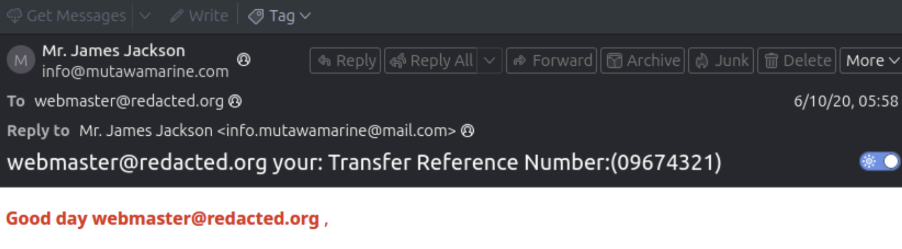

- **Answer:** 09674321

**2. What is the display name of the sender?**

- **Answer:** Mr. James Jackson

**3. Continue investigating the email headers. What is the sender's email address?**

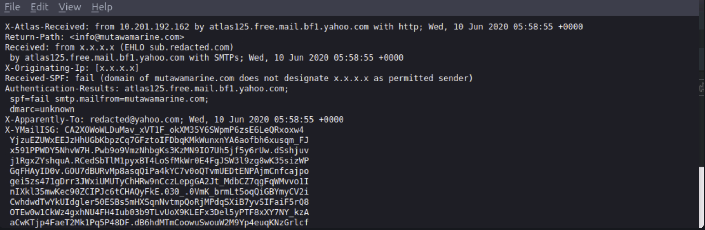

- **Answer:** info@mutawamarine.com

**4. What email address will receive a reply to this email?**

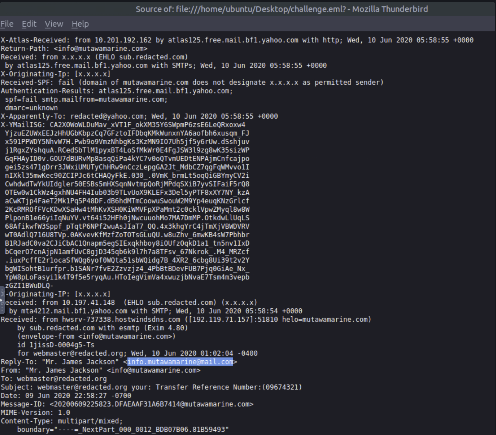

- **Answer:** info.mutawamarine@mail.com

**5. Begin analyzing the message source. What is the originating IP address of this email?**

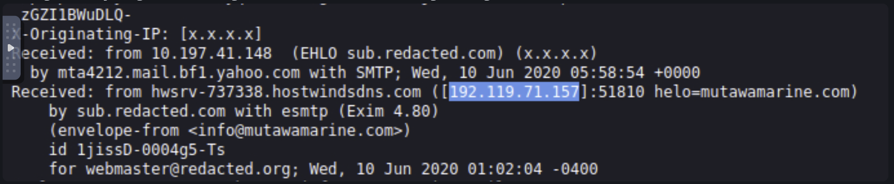

- **Answer:** 192.119.71.157

**6. Investigate the IP address from the previous question. Who is the owner of the originating IP?**

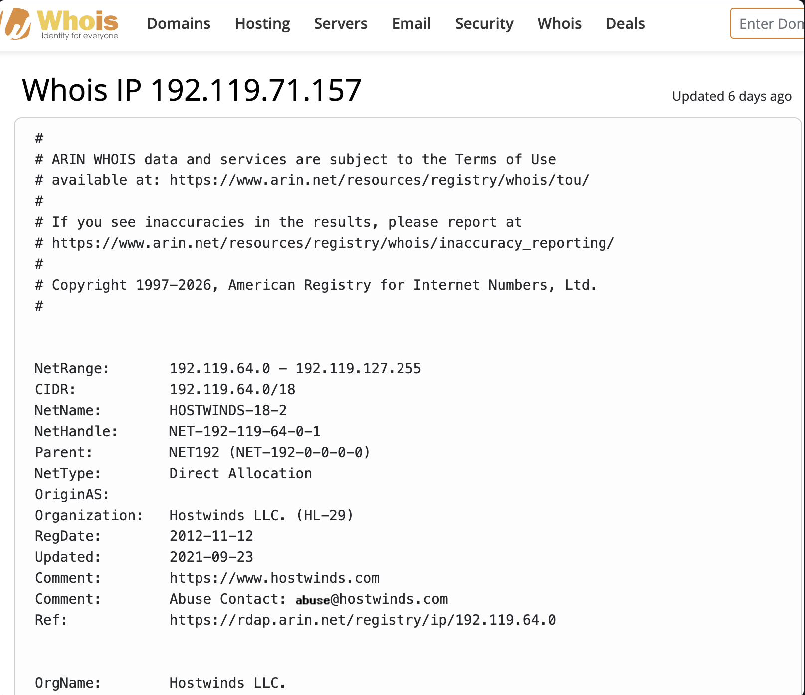

- **Answer:** Hostwinds LLC

**7. Run an SPF record check on the Return-Path domain identified in the email headers. What is the full SPF record for this domain?**

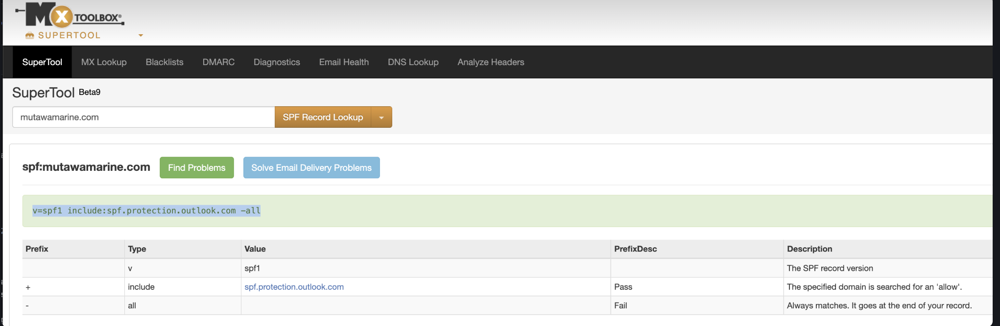

- **Answer:** v=spf1 include:spf.protection.outlook.com -all

**8. Perform a DMARC lookup for the Return-Path domain found in the email headers. What is the complete DMARC record for this domain?**

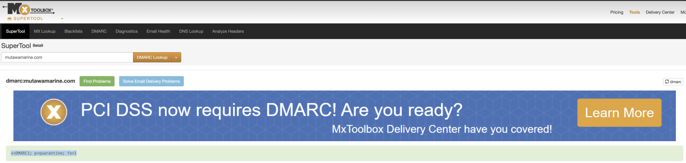

- **Answer:** v=DMARC1; p=quarantine; fo=1

**9. What is the file name of the attachment found in the email?**

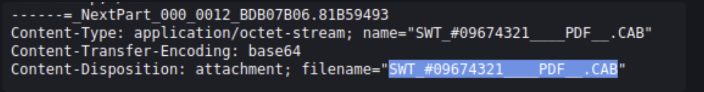

- **Answer:** SWT_#09674321____PDF__.CAB

**10. Download the attachment to your virtual environment. Using the `sha256sum` command, what is the `SHA256` hash of the file?**

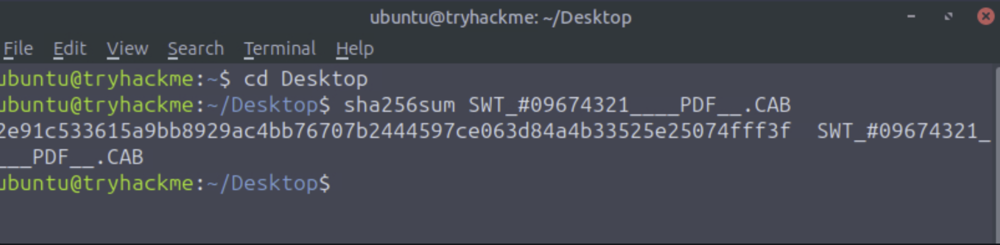

- **Answer:** 2e91c533615a9bb8929ac4bb76707b2444597ce063d84a4b33525e25074fff3f

**11. Investigate the file hash from the previous question using VirusTotal. What is the attachment's file size in `KB` (e.g., `122.31 KB`)?**

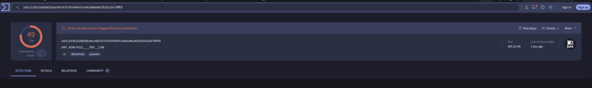

- **Answer:** 400.26 KB

**12. Continue your research on the file. What is the actual file type of the attachment?**

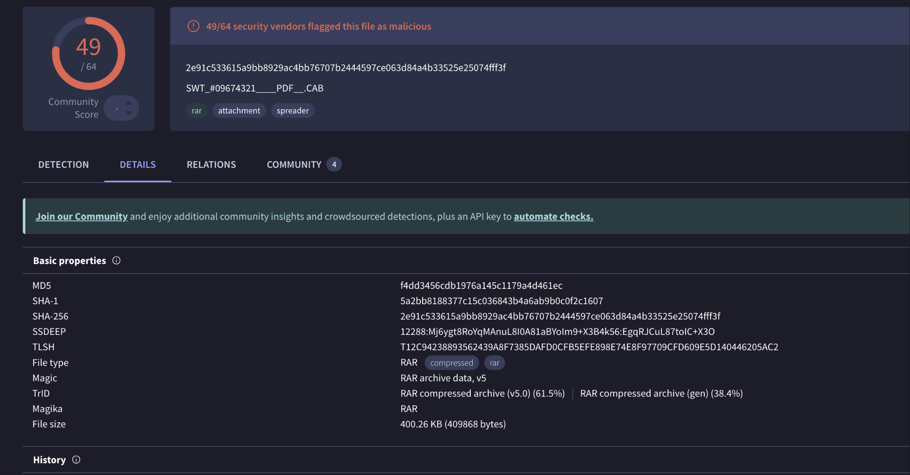

- **Answer:** RAR
