*Write-up by [Miyu7x](https://github.com/Miyu7x) | TryHackMe: [Miyu7](https://tryhackme.com/p/Miyu7)*

---

## Task 1 - A Series of Suspicious Emails

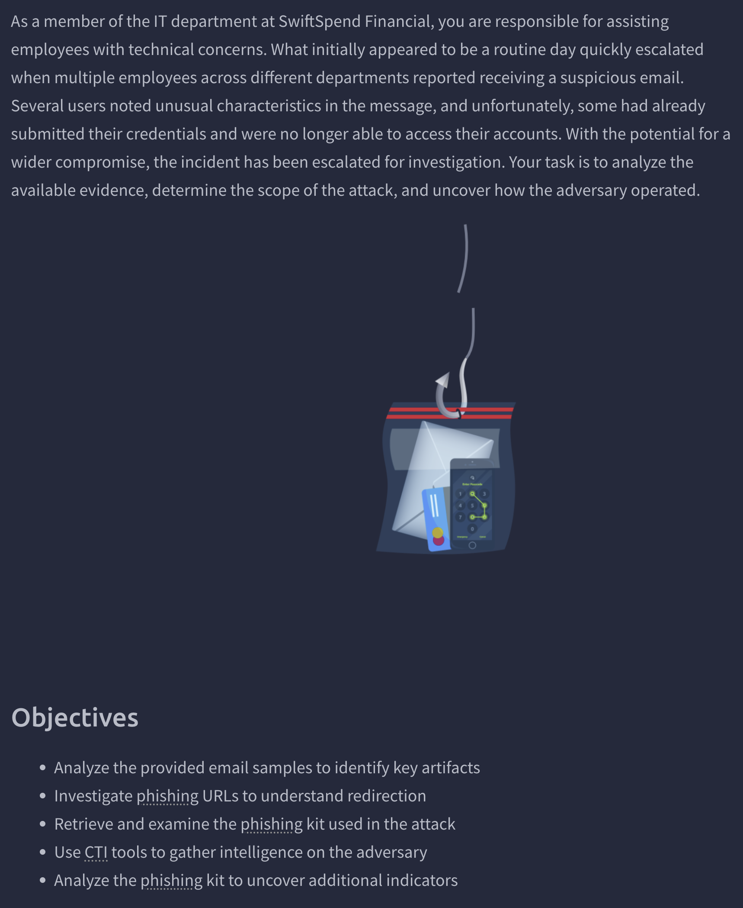

A multi-user phishing incident at SwiftSpend Financial. Multiple employees across departments received suspicious emails, some had already submitted credentials and lost account access by the time it was escalated. The task: analyze the email samples, trace the phishing infrastructure, and identify how the adversary operated.

### Key Concepts

<!-- email artifact analysis: sender address, attachment content, embedded URLs -->
<!-- phishing kit: what it is, how attackers host and reuse them -->
<!-- directory exposure: /data paths left open on attacker-controlled servers -->
<!-- sha256sum: command-line hash verification for file integrity/identification -->
<!-- VirusTotal: file hash lookup, threat categorization, archive file count -->
<!-- credential harvesting logs: what submit.php does and where it exfils data -->
<!-- CyberChef: decoding encoded flags or obfuscated strings -->

### Task Questions

**1. Which individual received the email regarding a Quote for Services Rendered?**

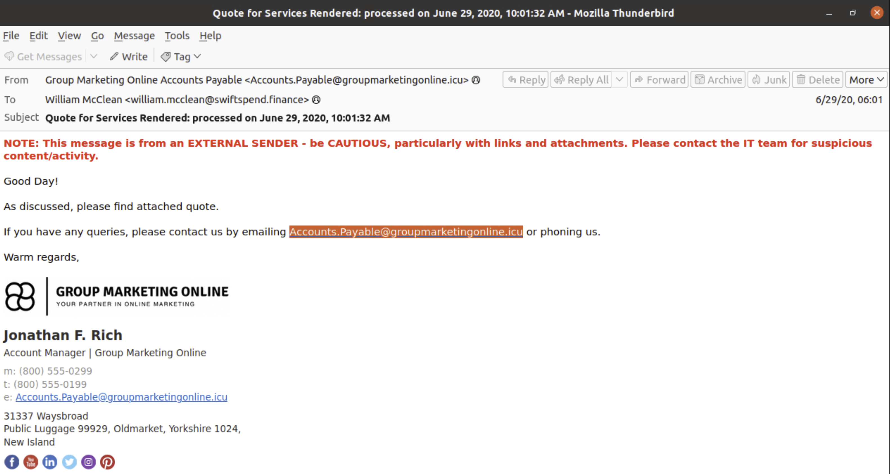

- **Answer:** William McClean

**2. What email address was used by the adversary to send the phishing emails?**

- **Answer:** Accounts.Payable@groupmarketingonline.icu

**3. What is the root domain of the redirection URL found within the attachment in the email addressed to Zoe Duncan?**

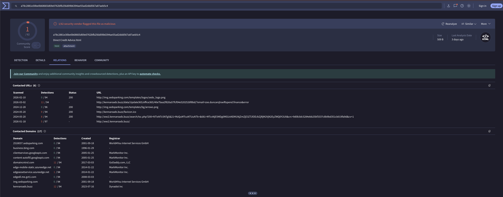

- **Answer:** kennaroads.buzz

**4. Which company is the login page impersonating?**

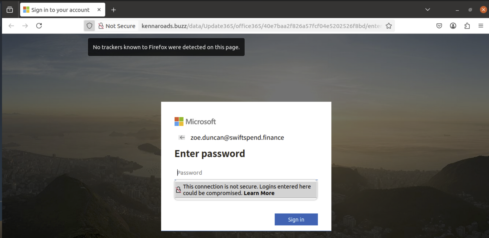

- **Answer:** Microsoft

**5. What is the name of the archive file found in the /data directory?**

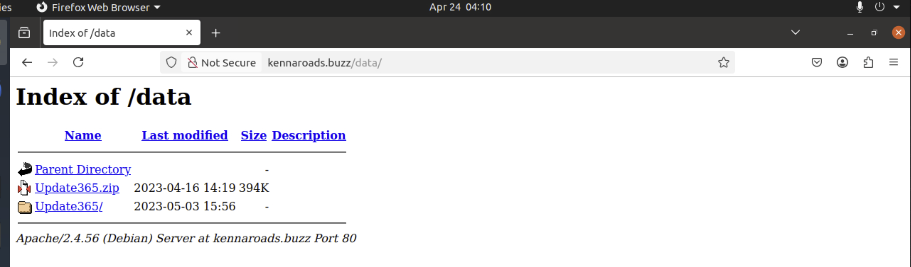

- **Answer:** Update365.zip

**6. What is the SHA256 hash of the phishing kit archive?**

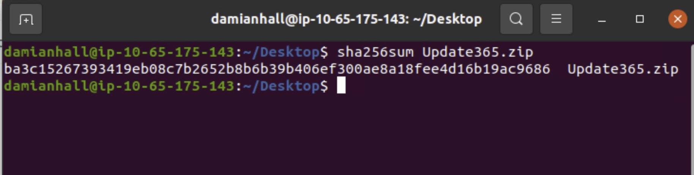

- **Answer:** ba3c15267393419eb08c7b2652b8b6b39b406ef300ae8a18fee4d16b19ac9686

**7. Aside from phishing, what other threat category is assigned to the ZIP archive on VirusTotal?**

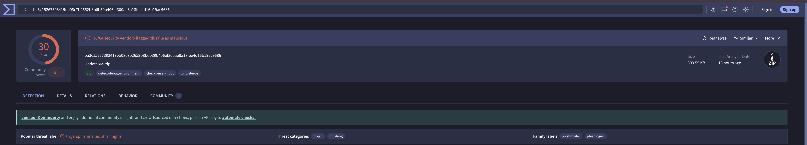

- **Answer:** Trojan

**8. How many files are contained within the archive?**

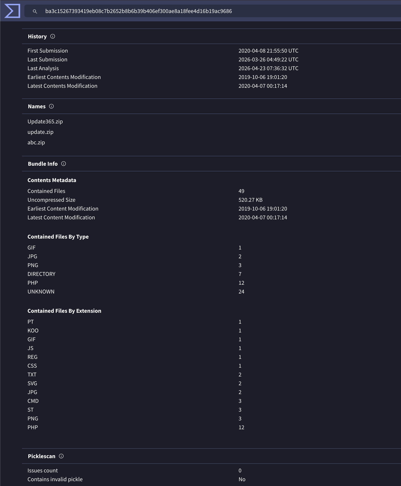

- **Answer:** 49

**9. What is the email address of the user who submitted their credentials more than once?**

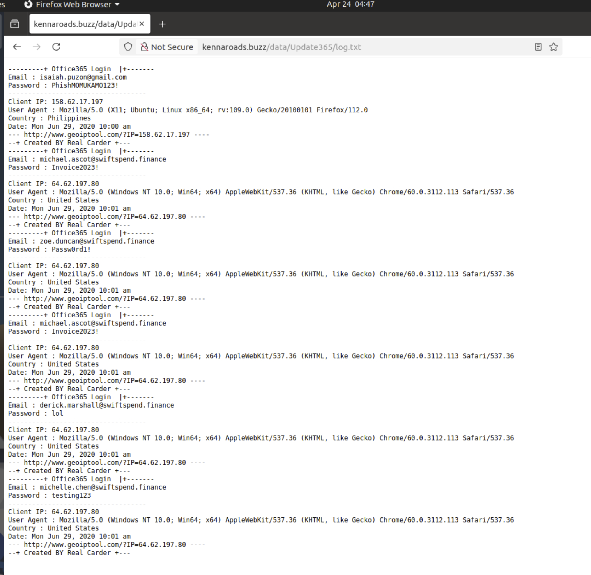

- **Answer:** michael.ascot@swiftspend.finance

**10. What email address is used by the adversary to collect compromised credentials?**

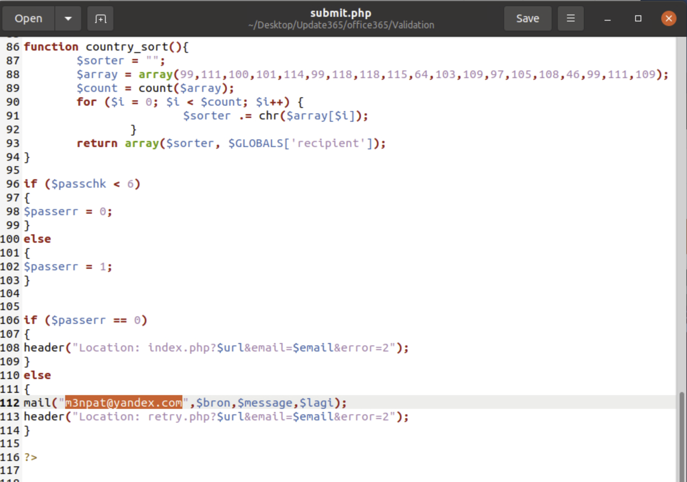

- **Answer:** m3npat@yandex.com

**11. What is the secret value decoded from flag.txt using CyberChef?**

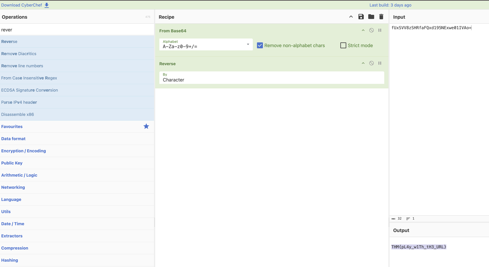

- **Answer:** THM{pL4y_w1Th_tH3_URL}
