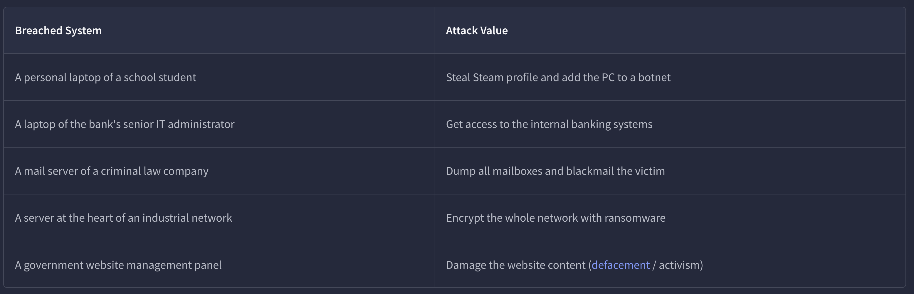

| **title** | Systems_as_Attack_Vectors |
|---|---|
| **tags** | `soc` `blue-team` `tryhackme` `system-security` `attack-vectors` `vulnerabilities` `misconfigurations` |
| **room** | Systems as Attack Vectors (THM) |
| **type** | thm-room |
| **priority** | high |
| **status** | completed |
| **path** | SOC Level 1 |
| **category** | introduction |
| **difficulty** | easy |
| **date_completed** | 2026-03-25 |

## Room 04 - Systems as Attack Vectors

---

### Objective

Understand what systems are, why they are targeted by attackers, and how a SOC analyst protects them by identifying vulnerabilities, misconfigurations, and attack patterns before they are exploited.

---

### Key Concepts

- Data lives on systems: physical servers, virtual machines, or cloud platforms. Each one is a potential target.
- A single compromised mailbox can cascade into a full mail server breach, giving an attacker control over an entire organization's communications.
- SOC analysts are responsible for monitoring and protecting these systems at all times.

---

### The System Element

- Systems include physical servers, virtual machines, and cloud platforms.
- Every system holds value, whether it stores data, runs services, or connects to other systems, making it worth protecting.
  

---

### Common Attack Types

- **Remote Code Execution (RCE):** Attacker runs arbitrary code on a target system
- **Privilege Escalation:** Gaining higher-level access than originally granted
- **Persistence Mechanisms:** Maintaining access after initial compromise (e.g., malicious services, startup entries)
- **Brute-Force:** Repeated login attempts to crack credentials
- **Supply Chain Attack:** Compromising a trusted third-party app to push malware to all its users

---

### Attacker Mindset

- Hackers are goal-driven. The system they target depends on what they want: data theft, ransomware deployment, or destruction.
- Every app installed on a system is a potential entry point into that app's libraries and dependencies.
- Supply chain attacks exploit that trust. If a trusted app is compromised, malware can reach every user on the platform.

---

### Defending Systems

- 81% of breaches involve weak or compromised passwords. Strong password policies are a frontline defense.
- SOC analysts should ensure the organization avoids software from pirated or unverified sources.
- Patch management is critical. Unpatched CVEs are open doors for attackers.
- Misconfigurations cannot be fixed with patches alone. They require audits or Red Team assessments to identify and remediate.

---

### Investigation Mindset (System-Focused)

- SOC analysts must stay current on **Common Vulnerabilities and Exposures (CVEs)**. Every publicly disclosed vulnerability is assigned a CVE number.
- **CVEdetails.com** is a reference for all known published vulnerabilities.
- When a vulnerability is detected, the immediate response is to apply the relevant patch or push a configuration fix.
- IT misconfigurations are a leading cause of vulnerabilities. Human error remains the weakest link.

---

### Scenario Decisions

| Scenario | Decision |
|---|---|
| HQ-MAIL-02: Exchange server affected by CVE-2024-49040, internet-exposed | Ask IT to apply the patch and update Exchange |
| Corporate WordPress admin panel brute-forced, homepage replaced with malware links | Change the admin password to a strong, secure one |
| Neighbor company hit with ransomware via old Cisco firewall exploit | Ensure all corporate firewalls are patched and CVE-free |
| LPT-01518: Trusted 3D design app running malicious CMD commands after recent update | Supply chain attack. Remediate with antivirus protection |

---

### Remediation Plan

| Action | Description |
|---|---|
| Security Training for IT | Regularly train staff on common misconfigurations and how to avoid them |
| Secure Password Policy | Enforce strong, autogenerated passwords for all admin and service accounts |
| Patch Management Policy | Define a clear process for identifying, testing, and applying software patches |
| Antivirus Protection | Install reliable antivirus software on all critical corporate systems |

---

### Commands & Tools

| Command / Tool | What It Did |
|---|---|

---

### Screenshots

---

### Flags

| Flag | Value |
|---|---|
| LPT-01518 Supply Chain Attack | `THM{patch_or_reconfigure?}` |
| Best Systems Defender | `THM{best_systems_defender!}` |

---

### What Stood Out

- Active CVE in the wild as of March 2026: CVE-2026-20963 (SharePoint exploit). Real-world relevance, not just lab theory.
- IT misconfigurations are one of the leading causes of vulnerabilities. Human error is still the weakest link, even on the defending side.

---

### Detection Takeaways

- Detected vulnerability: respond with a patch or configuration fix immediately.
- IT can unknowingly introduce flaws during new system setups. This is why configuration audits matter.
- Misconfigurations require Red Team assessments or penetration testing to find and fix. A software update alone will not catch them.

---

### What Confused Me & How I Resolved It

- Misconfigurations cannot be patched. They need an audit or Red Team engagement to surface and fix.
- The supply chain attack remediation options were vague. Of the four choices given, antivirus protection was the only one that made sense as a practical defense against malicious code executing post-update.

---

### What I Learned

- Misconfigurations are found through Red Team testing and penetration assessments, not automatic updates.
- Periodically running vulnerability scanners and checking for default passwords keeps the organization's attack surface smaller.
- Every layer of a system, apps, services, credentials, configurations, is a potential attack vector.

---

### Skills Practiced

- Reviewed and triaged systems flagged as at risk.
- Applied correct remediation decisions to real-world attack scenarios.
- Built and implemented a corporate Remediation Plan.

---

*Write-up by [Miyu7x](https://github.com/Miyu7x) | TryHackMe: Miyu7*
