*Write-up by [Miyu7x](https://github.com/Miyu7x) | TryHackMe: [Miyu7](https://tryhackme.com/p/Miyu7)*

## Task 1 — Introduction

### Key Concepts

Wireshark is a traffic analysis tool. NTA (Network Traffic Analysis) is a process that combines:
- Logs
- Deep packet inspection
- Network flow statistics

The goal is to have complete visibility of what is communicated inside and outside the network. NTA is not a synonym for Wireshark -- it is a broader discipline.

---

## Task 2 — What is the Purpose of Network Traffic Analysis?

### Key Concepts

DNS Tunneling and Beaconing

Example of a firewall log showing an unusual number of DNS queries from host WIN-016 with IP 192.168.1.16:

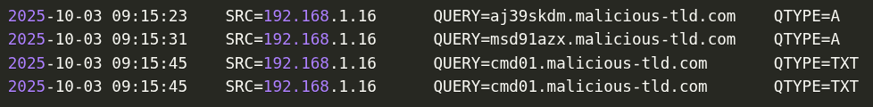

DNS logs include:
- Query and query type
- Subdomain and top-level domain (use AbuseIPDB and VirusTotal to check for malicious domains)
- Host IP -- who is sending out the queries
- Destination IP
- Timestamp -- used to build a timeline

What DNS logs do NOT include: the content of the DNS queries and replies. Threat actors can use TXT records to send C2 instructions to a compromised host. Full packet inspection is needed to see this.

### Task Questions

- **What is the name of the technique used to smuggle C2 commands via DNS?**
  - **Answer: DNS Tunneling**

---

## Task 3 — What Network Traffic Can We Observe?

### Key Concepts

Logs include bits and pieces of the header but not the full packet details.

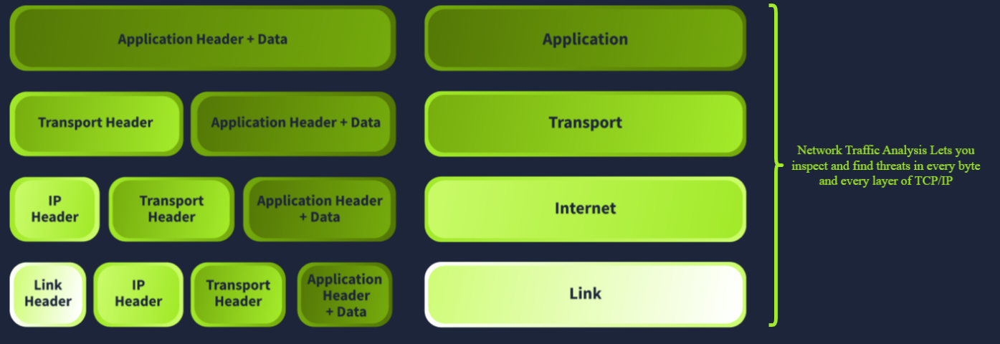

#### TCP/IP Layer Breakdown

| Layer       | What Logs Capture                        | What Logs Miss                              | Attack Detection Use Case             |
| ----------- | ---------------------------------------- | ------------------------------------------- | ------------------------------------- |
| Application | Header information                       | Application data / payload                  | Malicious file downloads, C2 via HTTP |
| Transport   | Source/destination ports, flags          | Sequence numbers, acknowledgment numbers    | Session hijacking                     |
| Internet    | Source/destination IP, TTL               | Fragment offset, total length               | Fragmentation attacks, IDS evasion    |
| Link        | Source/destination MAC addresses         | Gratuitous ARP, MAC appearing on multiple interfaces | ARP poisoning / spoofing     |

**Application**

GET request header -- client is requesting a file named suspicious_package.zip:

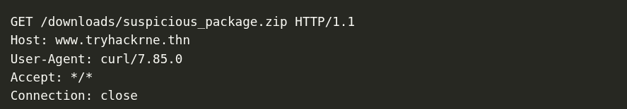

Response shows 200 code (request accepted), shows filename, but not file contents:

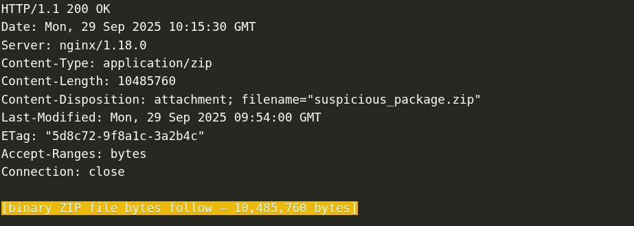

**Transport**

Application data and header are segmented and encapsulated into smaller pieces at the transport layer. Firewall logs typically include source/destination ports and flags:

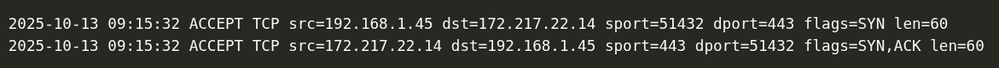

Sequence numbers are also in the TCP header but often not logged. Far-apart sequence numbers warrant immediate investigation. Example of session hijacking via sequence number anomaly:
- First 3 lines: normal TCP 3-way handshake
- Lines 4 and 5: legitimate data transfer
- Line 6: massive jump in sequence number -- another source injecting itself into the session

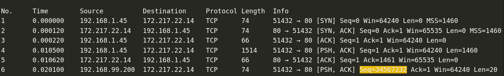

**Internet**

When the transport layer sends down a segment, the internet layer adds its own header. If the segment is larger than the MTU (Maximum Transmission Unit -- commonly 1500 bytes on Ethernet), it is broken into fragments. Each fragment gets a header containing:
- The original packet ID (so the receiver knows which fragments belong together)
- The fragment offset (so the receiver knows the correct reassembly order)
- A "more fragments" flag (so the receiver knows when the last piece has arrived)

Attackers can exploit this by creating tiny fragments to evade the IDS, or by using overlapping byte ranges to corrupt reassembly. This is a fragmentation attack:

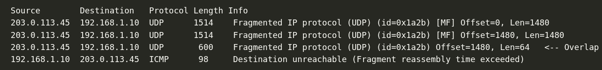

**Link**

Once the internet layer finishes encapsulation, the IP packet is passed to the link layer, which adds its own header containing source and destination MAC addresses. Logs alone are not enough to detect ARP poisoning -- you need the full packet and context to spot a host replying to every ARP request with the same MAC:

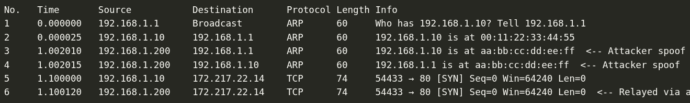

### Task Questions

- **What is the size of the ZIP attachment included in the HTTP response? (in bytes)**
  - **Answer: 10485760**

- **Which attack do attackers use to try to evade an IDS?**
  - **Answer: Fragmentation**

- **What field in the TCP header can we use to detect session hijacking?**
  - **Answer: Sequence Number**

---

## Task 4 — Network Traffic Sources and Flows

### Key Concepts

Two categories of network traffic sources:
- Intermediary
- Endpoint

Two categories of network traffic flows:
- North-South: traffic that exits or enters the LAN and passes through the firewall
- East-West: traffic that stays within the LAN (including LAN extended to the cloud)

#### Sources

| Category     | Description                             | Examples                                                            |
| ------------ | --------------------------------------- | ------------------------------------------------------------------- |
| Intermediary | Devices traffic mostly passes through   | Firewalls, switches, web proxies, IDS, IPS, routers, access points |
| Endpoint     | Where traffic originates and terminates | Servers, hosts, VMs, cloud resources, mobile phones, tablets        |

#### Flows

| Flow Type   | Direction                    | Common Protocols                                                    |
| ----------- | ---------------------------- | ------------------------------------------------------------------- |
| North-South | LAN to WAN and vice versa    | HTTPS, DNS, SSH, VPN, SMTP, RDP                                     |
| East-West   | Within the LAN               | SMB, Kerberos, file shares, application comms, backup, monitoring   |

East-West traffic is often monitored less but is critical -- once inside the network, attackers use these flows to move laterally.

**HTTPS Flow with TLS Inspection**

The web proxy acts as the web server to the client and simultaneously establishes a new session with the actual web server. Two sessions exist: client to proxy, and proxy to web server. The proxy inspects content before forwarding.

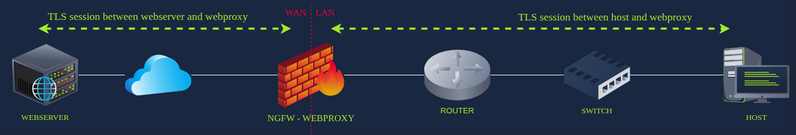

**External DNS Flow**

Host sends query to internal DNS server on port 53. Internal DNS checks cache, then forwards to external DNS via the firewall if needed. Answer returns the same path back to the host.

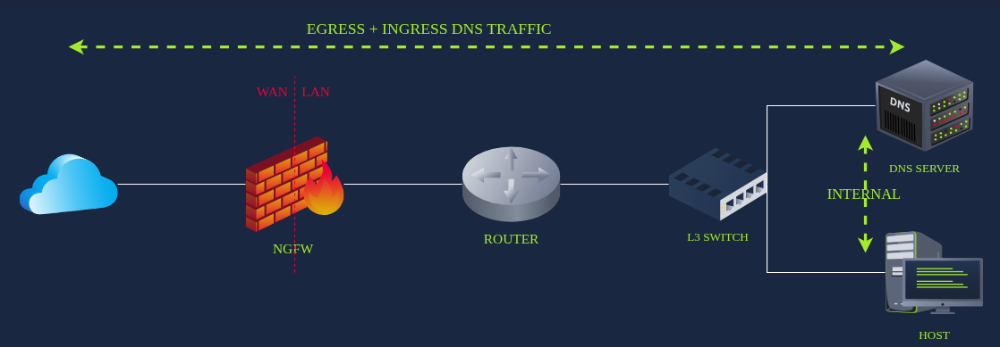

**SMB with Kerberos**

Before an SMB session can open (e.g. `\\FILESERVER\MARKETING`), authentication happens first via Kerberos. The host already holds a Ticket Granting Ticket (TGT) from logging in. It uses that TGT to request a service ticket from the Key Distribution Center (KDC) on the Domain Controller. That service ticket is then used to establish the SMB connection.

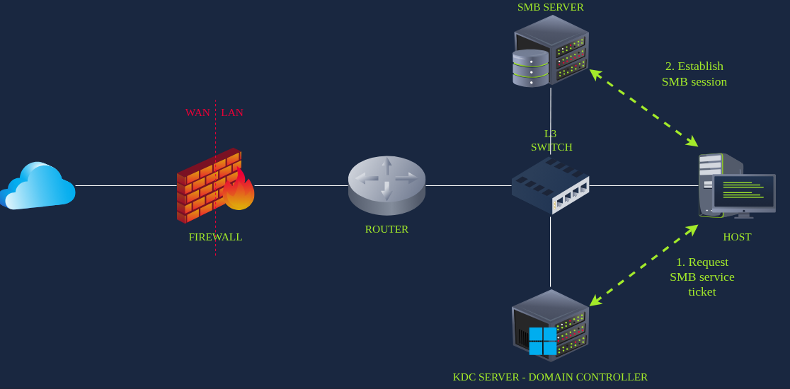

### Task Questions

- **Which category of devices generates the most traffic in a network?**
  - **Answer: Endpoint**

- **Before an SMB session can be established, which service needs to be contacted first for authentication?**
  - **Answer: Kerberos**

- **What does TLS stand for?**
  - **Answer: Transport Layer Security**

---

## Task 5 — How Can We Observe Network Traffic?

### Key Concepts

NTA combines multiple sources of information:
- Logs
- Full packet capture
- Network statistics

#### Collection Methods

| Method               | How It Works                                                             | Performance Impact                          | Notes                                              |
| -------------------- | ------------------------------------------------------------------------ | ------------------------------------------- | -------------------------------------------------- |
| Network TAP          | Physical device placed inline; copies electrical/light signals           | Near zero -- operates at link layer only    | No IP or MAC address needed; dedicated monitor port |
| Port Mirroring (SPAN) | Software-based; duplicates packets from one port to a monitoring port   | Can impact performance under heavy traffic  | Cisco calls it SPAN; also works on vSwitch and AWS VPC Traffic Mirroring |

Full packet capture storage consideration: a 1 Gbps line running for 24 hours requires approximately 10.8 TB of storage.

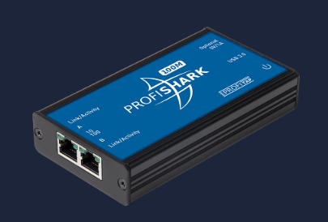

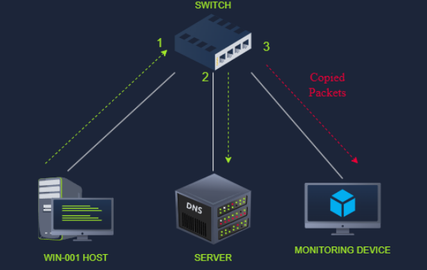

#### Network Statistics Protocols

Network statistics collect metadata about traffic flows rather than individual packets. Useful for detecting:
- C2 traffic
- Data exfiltration
- Lateral movement
- Anomalous DNS request volume

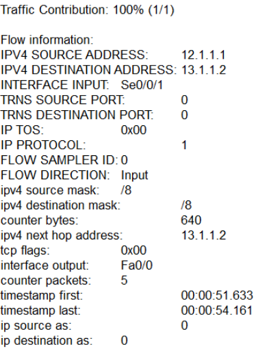

| Protocol | Origin                  | Key Feature                                                                 |
| -------- | ----------------------- | --------------------------------------------------------------------------- |
| NetFlow  | Cisco (proprietary)     | Collects flow metadata; v9 added templating for third-party vendor support  |
| IPFIX    | IETF (vendor-neutral)   | Successor to NetFlow; more flexibility in configuring captured fields       |

#### Analysis Tools

- Wireshark
- TCPdump
- IPS/IDS: Snort, Suricata, Zeek

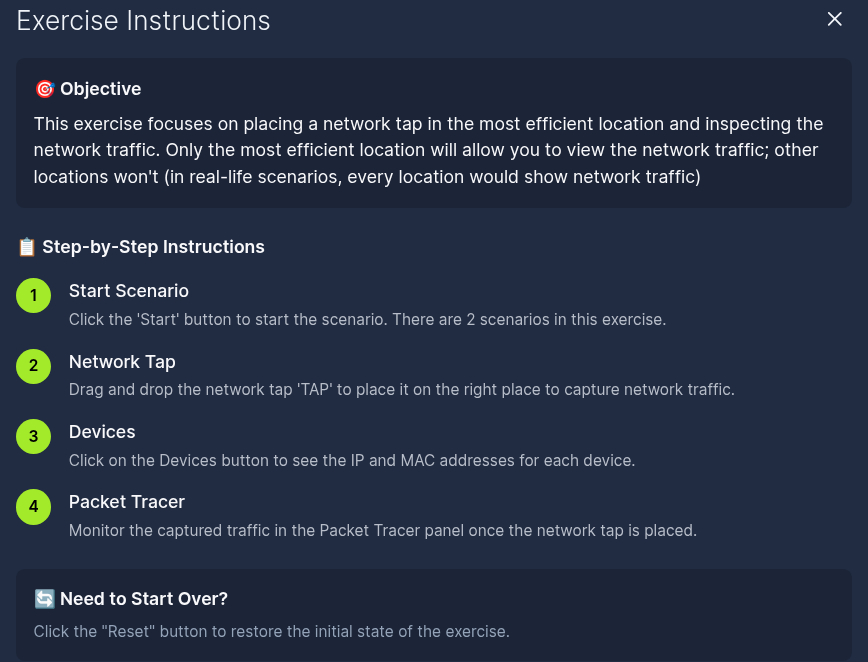

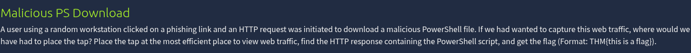

### Task Questions

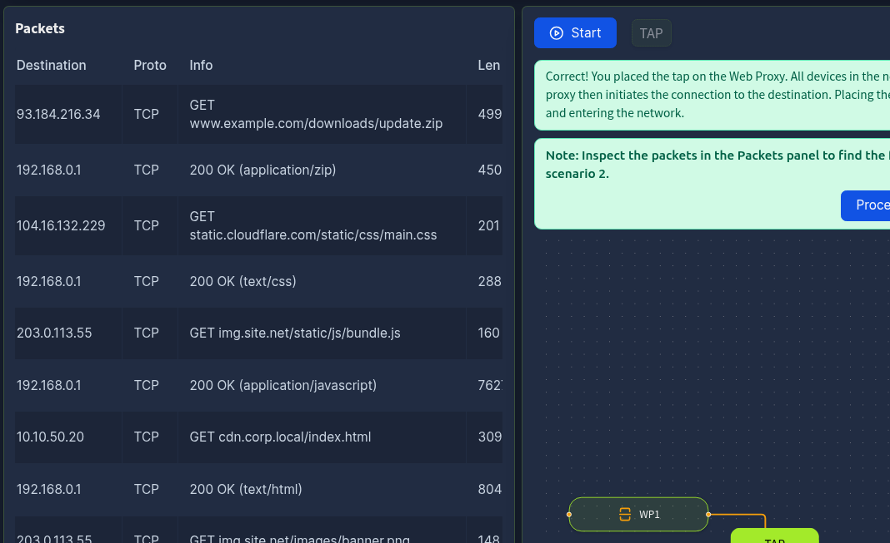

- **What is the flag found in the HTTP traffic in scenario 1?**

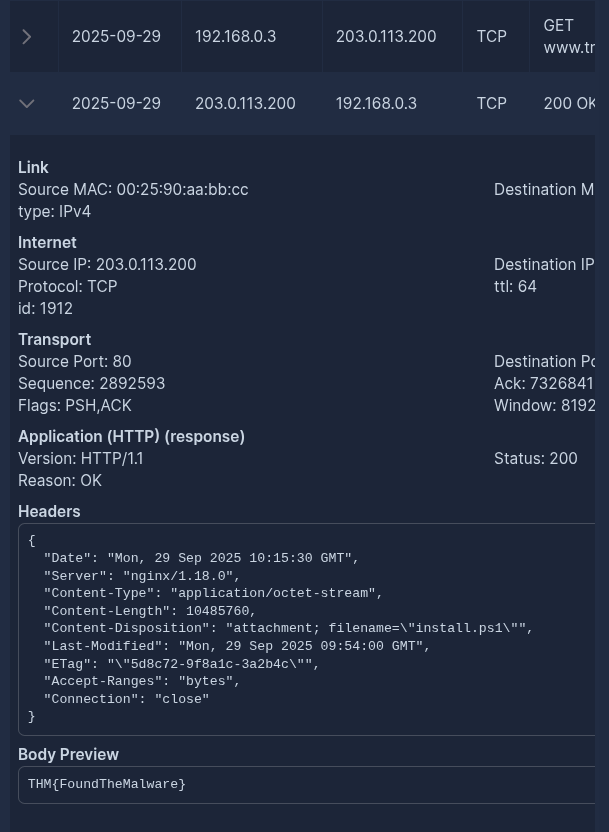

  - **Answer: THM{FoundTheMalware}**

- **What is the flag found in the DNS traffic in scenario 2?**

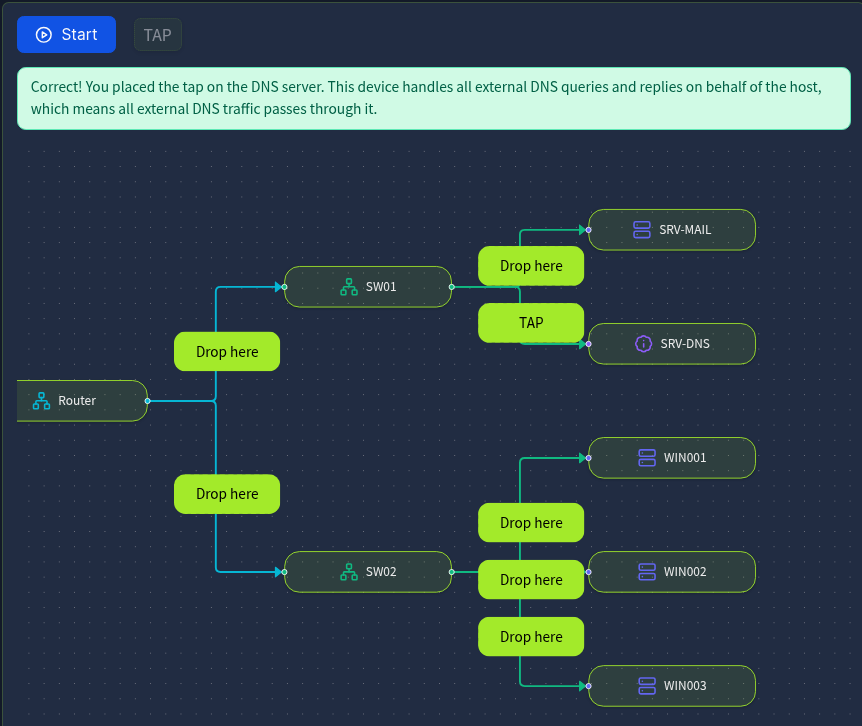

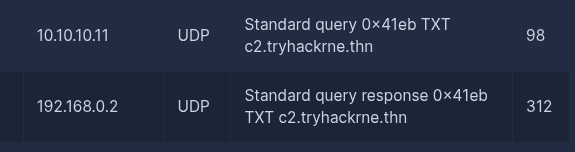

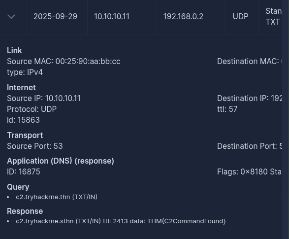

  - **Answer: THM{C2CommandFound}**

---

## Task 6 — Conclusion

### Key Concepts

NTA is a discipline combining log correlation, full packet inspection, and network flow statistics. Next room: Wireshark basics -- putting these concepts into practice with hands-on traffic analysis.

### Task Questions

- **I am ready to do some traffic analysis!**
  - **Answer:** No answer needed
