*Write-up by [Miyu7x](https://github.com/Miyu7x) | TryHackMe: [Miyu7](https://tryhackme.com/p/Miyu7)*

## Task 1 — Introduction

### Key Concepts

Wireshark is an open-source, cross-platform network packet analyser tool capable of sniffing and investigating live traffic and inspecting packet captures (PCAP). It is not an IDS -- it only reads and displays packets, it does not modify them or detect intrusions on its own. Analysis quality depends entirely on the analyst's knowledge.

### Task Questions

- **Which file is used to simulate the screenshots?**
  - **Answer: http1.pcapng**

- **Which file is used to answer the questions?**
  - **Answer: Exercise.pcapng**

---

## Task 2 — Tool Overview

### Key Concepts

Wireshark has three primary use cases as a traffic analyser:
- Detecting and troubleshooting network problems such as congestion and load failure points
- Detecting security anomalies such as rogue hosts, abnormal port usage, and suspicious traffic
- Investigating and learning protocol details such as response codes and payload data

Packet colouring helps analysts quickly spot protocols and anomalies. Two types exist: temporary rules (session only) and permanent rules (saved to the preference profile). Custom colour rules can be created via the right-click menu or View > Coloring Rules.

Traffic sniffing is controlled with three buttons: blue shark button to start, red to stop, green to restart. The status bar shows the active interface and packet count.

PCAPs can be merged via File > Merge. The merged file must be saved before working on it. File details including hash, capture time, and interface stats are found under Statistics > Capture File Properties.

#### Wireshark GUI Sections

| Section | Purpose |
|---|---|
| Toolbar | Menus and shortcuts for sniffing, filtering, sorting, exporting, and merging |
| Display Filter Bar | Main query and filtering input |
| Recent Files | Recently investigated files; double-click to reopen |
| Capture Filter and Interfaces | Available network interfaces and capture filters |
| Status Bar | Tool status, active profile, and packet count |

#### Packet Detail Panes

| Pane | What It Shows |
|---|---|
| Packet List Pane | Summary of each packet: source, destination, protocol, info |
| Packet Details Panel | Full protocol breakdown of the selected packet |
| Packet Bytes Pane | Hex and decoded ASCII of the selected packet; highlights field on click |

### Task Questions

- **Read the "capture file comments". What is the flag?**

*Statistics > Capture File Properties (CTRL+ALT+SHIFT+C)*

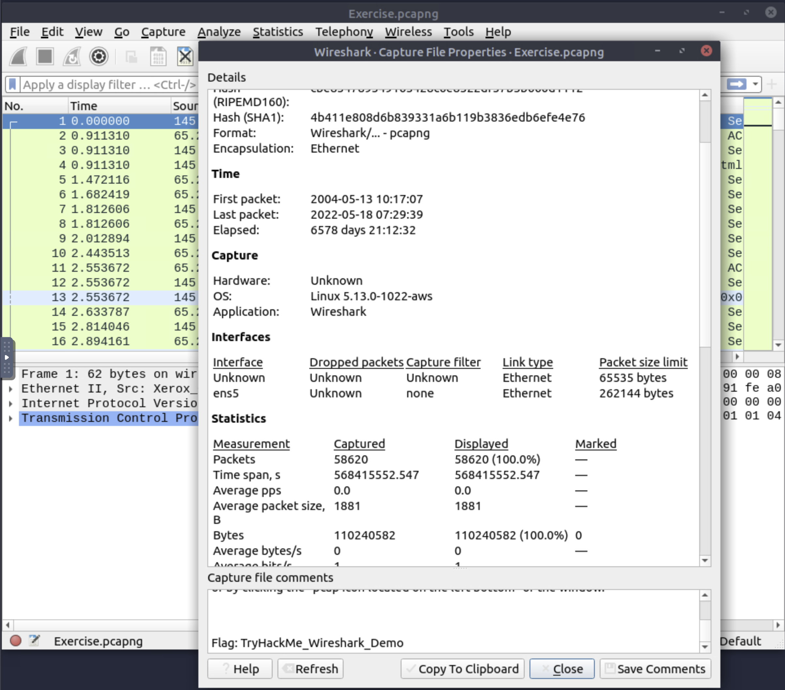
  - **Answer: TryHackMe_Wireshark_Demo**

- **What is the total number of packets?**

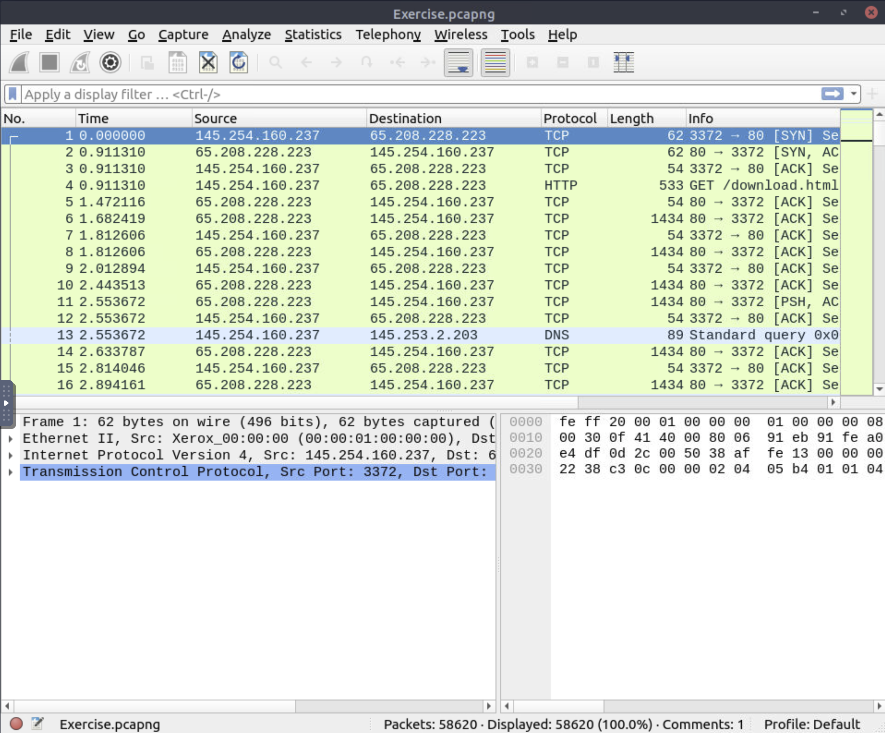
  - **Answer: 58620**

- **What is the SHA256 hash value of the capture file?**

*Statistics > Capture File Properties (CTRL+ALT+SHIFT+C)*
  - **Answer: f446de335565fb0b0ee5e5a3266703c778b2f3dfad7efeaeccb2da5641a6d6eb**

---

## Task 3 — Packet Dissection

### Key Concepts

Packet dissection (also called protocol dissection) investigates packet details by decoding available protocols and fields layer by layer. Packets consist of 5 to 7 layers based on the OSI model. Clicking any field in the details pane highlights the corresponding bytes in the bytes pane.

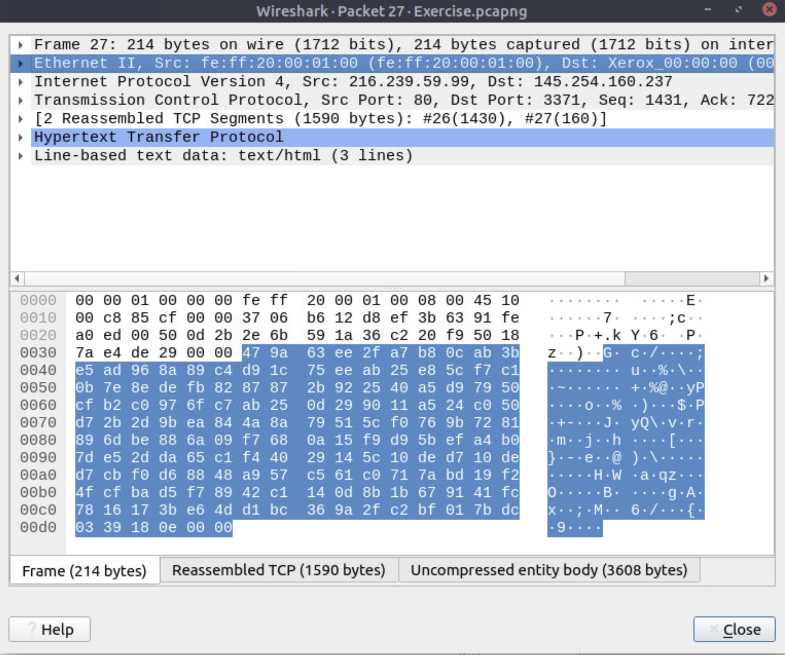

#### OSI Layers in Wireshark Packet Details

| Layer | Wireshark Label | What It Shows |
|---|---|---|
| Layer 1 | Frame / Packet | Physical layer details -- frame number, captured length, timestamps |
| Layer 2 | Source MAC | Source and destination MAC addresses (Data Link layer) |
| Layer 3 | Source IP | Source and destination IPv4 addresses (Network layer) |
| Layer 4 | Protocol | TCP or UDP details, source and destination ports (Transport layer) |
| Layer 4 cont. | Protocol Errors | TCP segments that needed reassembly |
| Layer 5 | Application Protocol | Protocol-specific details such as HTTP, FTP, SMB |
| Layer 5 ext. | Application Data | Application-specific payload data |

### Task Questions

- **View packet number 38. Which markup language is used under the HTTP protocol?**

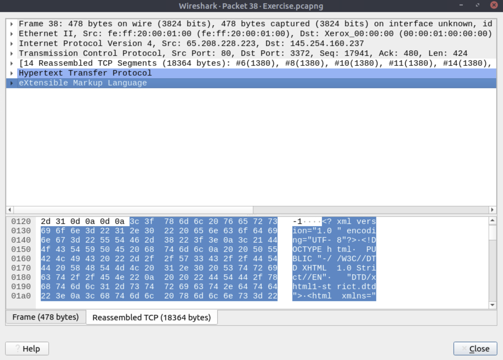
  - **Answer: eXtensible Markup Language**

- **What is the arrival date of the packet? (Month/Day/Year)**

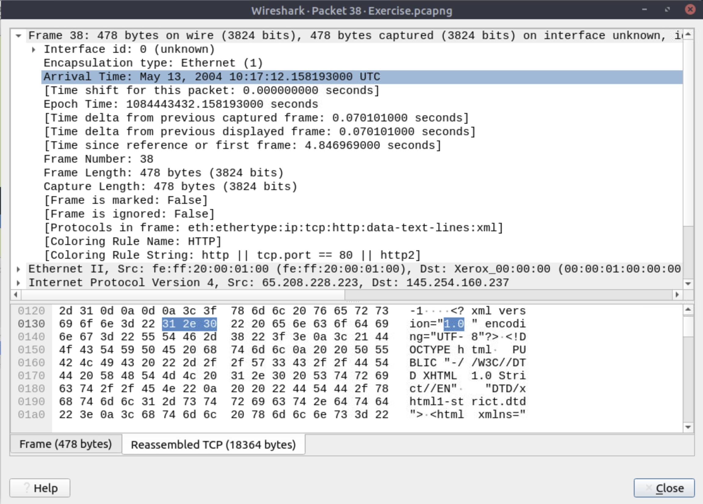
  - **Answer: 05/13/2004**

- **What is the TTL value?**

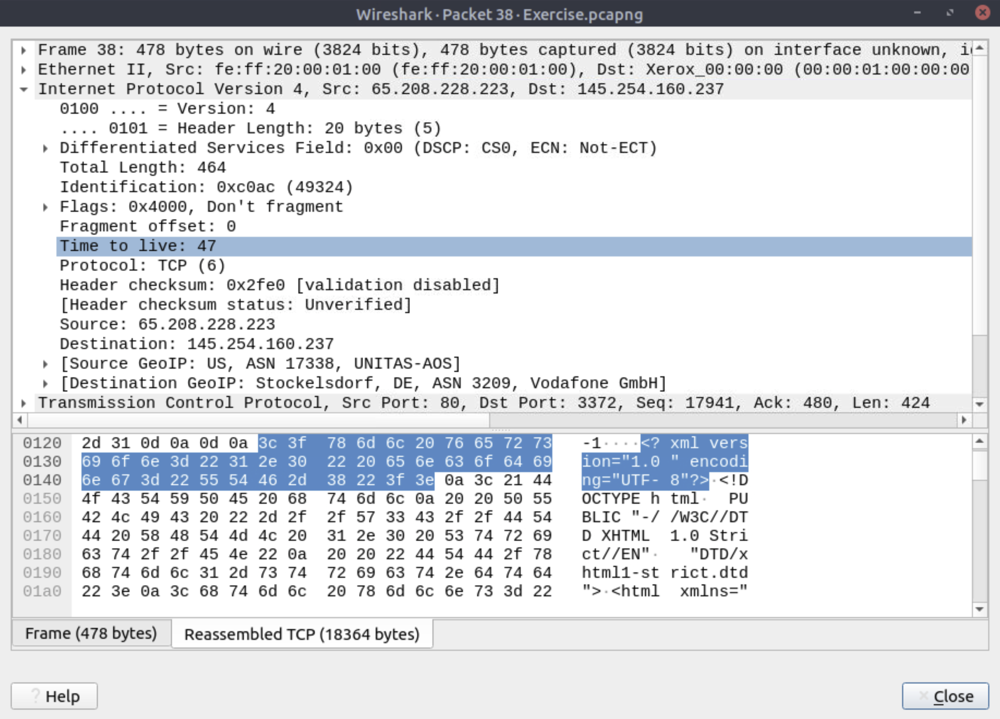
  - **Answer: 47**

- **What is the TCP payload size?**

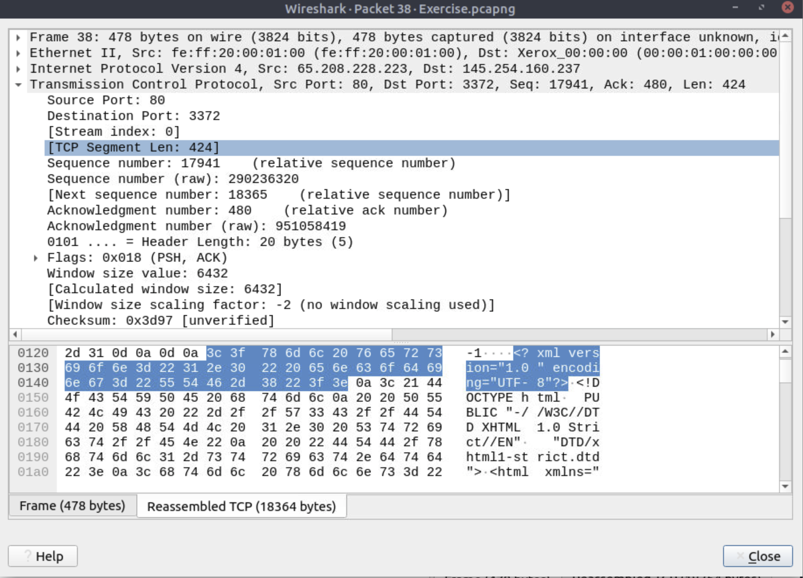
  - **Answer: 424**

- **What is the e-tag value?**
  - **Answer: 9a01a-4696-7e354b00**

---

## Task 4 — Packet Navigation

### Key Concepts

Wireshark assigns a unique number to each packet. Use the Go menu or toolbar to jump directly to a specific packet number. This is essential for navigating large captures efficiently.

Find Packets (Edit > Find Packet) accepts four input types: Display filter, Hex, String, and Regex. The search field matters -- searching in the packet list pane will not find content that only exists in the packet details pane. Choose the correct pane for the data you are looking for.

Marking packets (right-click > Mark/Unmark) highlights them in black for quick reference during investigation. Marked packets are session-only and are lost when the file is closed.

Packet comments persist in the capture file until manually removed. Useful for noting suspicious findings or leaving instructions for other analysts.

Packets can be exported individually via the File menu to share only the relevant scope with other analysts or tools. Files transferred over the wire can be extracted via File > Export Objects. Supported protocols: DICOM, HTTP, IMF, SMB, and TFTP.

Time display format defaults to Seconds Since Beginning of Capture. UTC format is recommended for analysis -- change via View > Time Display Format.

Expert Info (Analyse > Expert Information or the lower-left status bar) surfaces protocol anomalies grouped by severity.

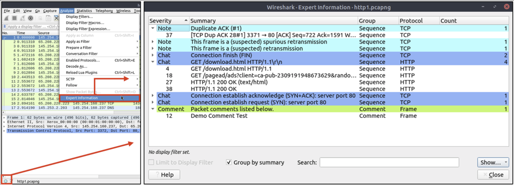

#### Expert Info Severity Levels

| Severity | Colour | Meaning |
|---|---|---|
| Chat | Blue | Normal workflow information |
| Note | Cyan | Notable events such as application error codes |
| Warn | Yellow | Unusual error codes or problem statements |
| Error | Red | Problems such as malformed packets |

#### Expert Info Groups

| Group | Info |
|---|---|
| Checksum | Checksum errors |
| Comment | Packet comment detection |
| Deprecated | Deprecated protocol usage |
| Malformed | Malformed packet detection |

### Task Questions

- **Search the "r4w" string in packet details. What is the name of artist 1?**

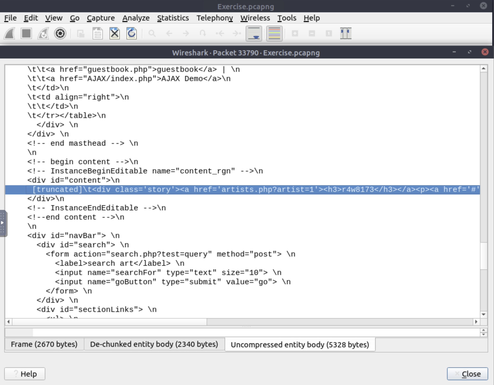
  - **Answer: r4w8173**

- **Go to packet 12 and read the packet comments. What is the answer?**

*Packet 12 comment instructs: go to packet 39765, right-click the JPEG in packet details, export packet bytes, then run md5sum on the exported file.*

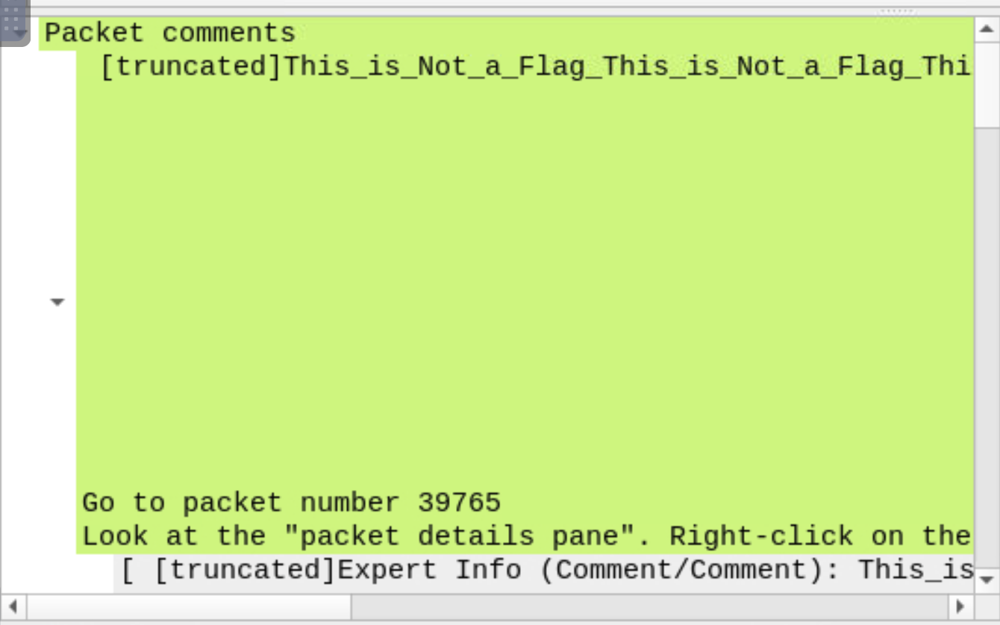

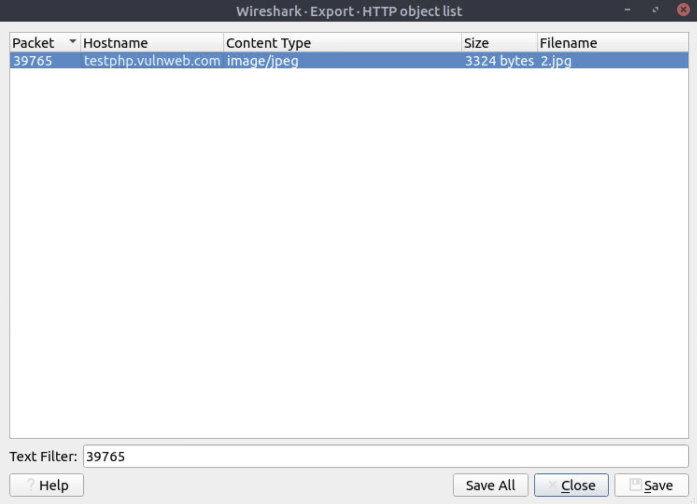

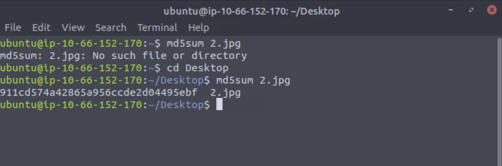
  - **Answer: 911cd574a42865a956ccde2d04495ebf**

- **There is a ".txt" file inside the capture file. Find the file and read it; what is the alien's name?**

*File > Export Objects > HTTP -- locate the .txt file, save it, then cat it in terminal.*

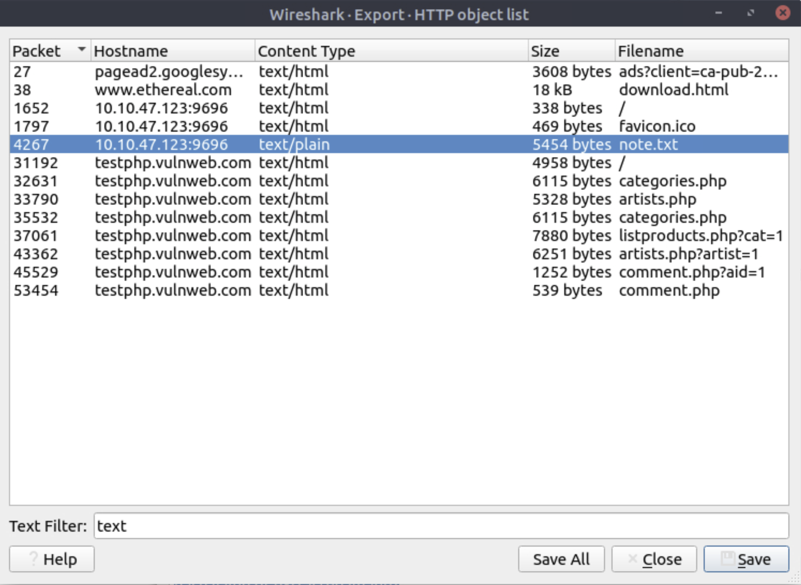

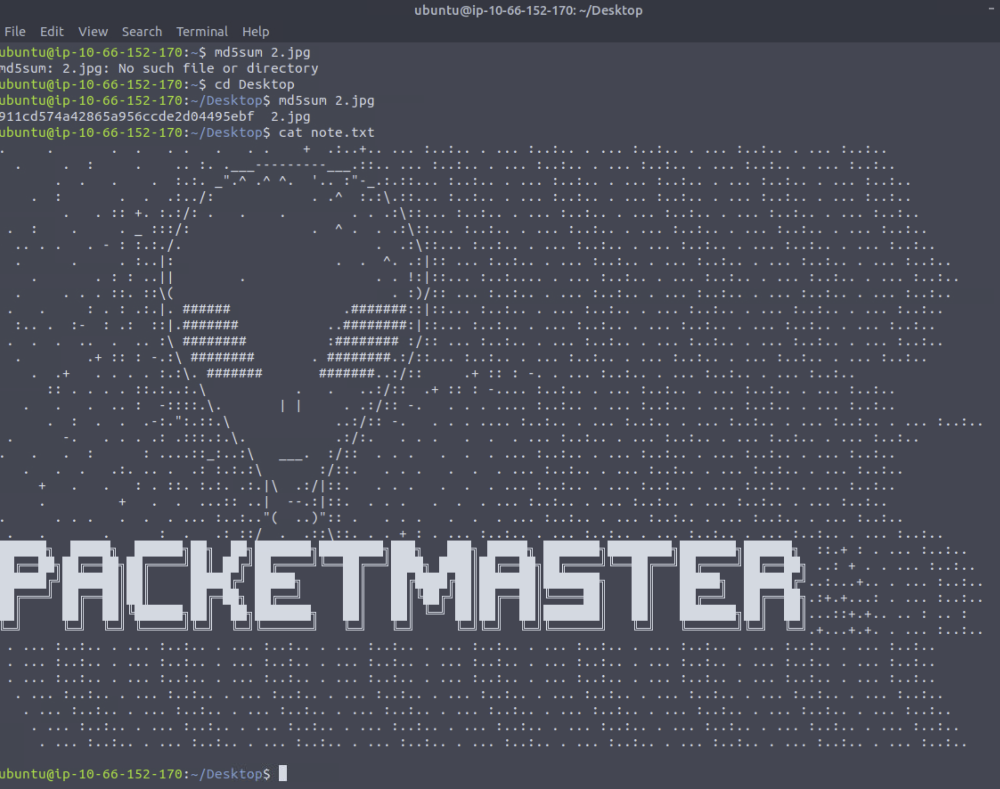
  - **Answer: Packetmaster**

- **Look at the expert info section. What is the number of warnings?**

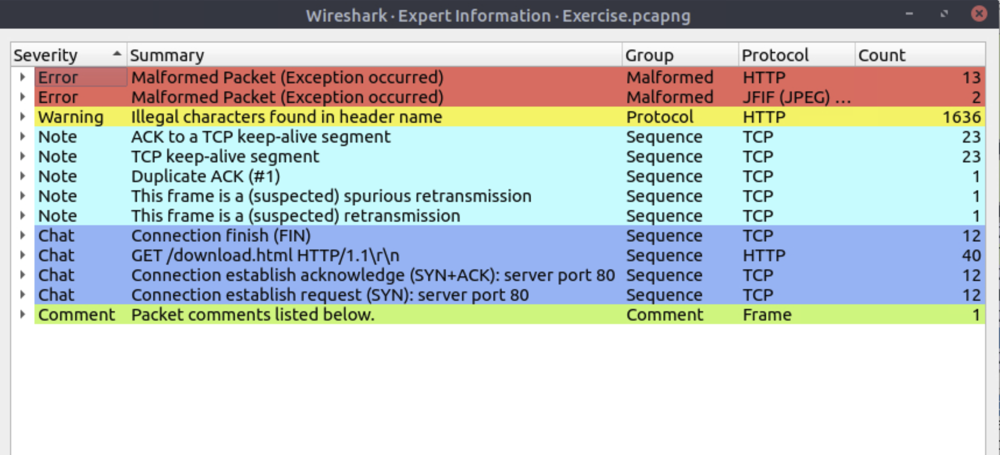
  - **Answer: 1636**

---

## Task 5 — Packet Filtering

### Key Concepts

Wireshark has two filter types: capture filters (limit what gets captured) and display filters (limit what is shown from an existing capture). This room focuses on display filters.

Golden rule: "If you can click on it, you can filter and copy it."

#### Filtering Methods

| Method | How It Works | Use Case |
|---|---|---|
| Apply as Filter | Right-click a field value; filters immediately | Quick single-value filter |
| Conversation Filter | Filters all packets linked by IP and port | Isolate a full conversation |
| Colourise Conversation | Highlights linked packets without reducing packet count | Visual tracking without filtering |
| Prepare as Filter | Adds query to filter bar without applying it | Build complex filters before executing |
| Apply as Column | Adds a field as a visible column in packet list | Track a value across all packets |
| Follow Stream | Reconstructs application-level data from a stream | Read HTTP/TCP/UDP data as it appeared |

Follow Stream opens a separate dialogue. Server traffic is highlighted in blue, client traffic in red. To remove the stream filter after, click the X on the right side of the display filter bar.

#### Common Display Filter Syntax

| Filter | Syntax Example |
|---|---|
| By protocol name | `http` |
| By port (TCP) | `tcp.port == 80` |
| By port (UDP) | `udp.port == 53` |
| By IP address | `ip.addr == 192.168.1.2` |

### Task Questions

- **Go to packet 4. Apply "Hypertext Transfer Protocol" as a filter. What is the filter query?**

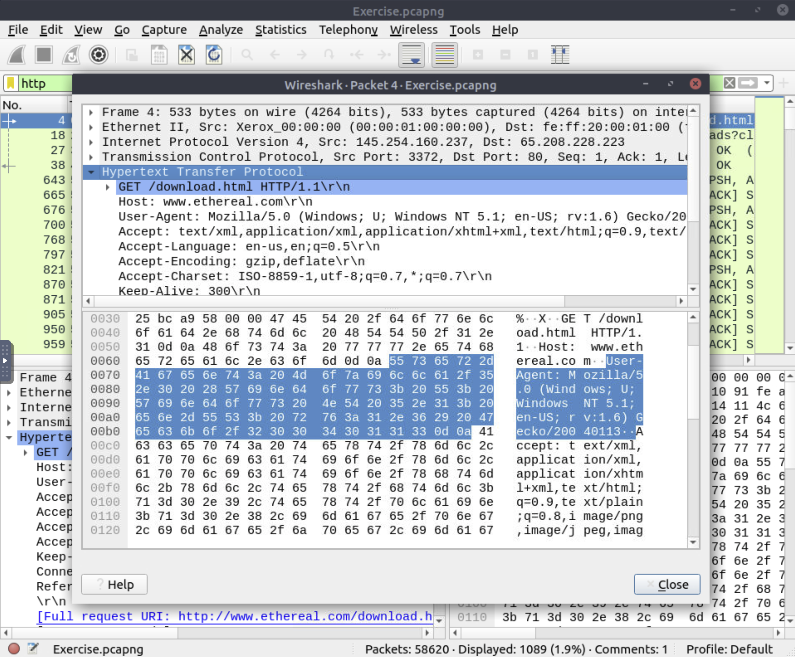
  - **Answer: http**

- **What is the number of displayed packets?**
  - **Answer: 1089**

- **Go to packet 33790, follow the HTTP stream. What is the total number of artists?**

  - **Answer: 3**

- **What is the name of the second artist?**

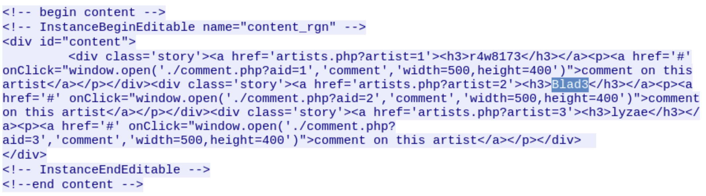
  - **Answer: Blad3**

---

## Task 6 — Conclusion

### Key Concepts

Wireshark basics complete -- GUI navigation, packet dissection across OSI layers, packet navigation and export, and display filtering. Next room: Wireshark Packet Operations for deeper packet-level investigation.

### Task Questions

- **Proceed to the next room and keep learning!**
  - **Answer:** No answer needed
