*Write-up by [Miyu7x](https://github.com/Miyu7x) | TryHackMe: [Miyu7](https://tryhackme.com/p/Miyu7)*

---

## Task 1 – Introduction

### Key Concepts

Deep Packet Analysis shows us the Big Picture in network traffic
  - detecting anomalies
  - malicious activities
  - information is spread in packets

### Task Questions

**1. Read the task above.**

- **Answer:**

---

## Task 2 – Nmap Scans

### Key Concepts

Nmap network mapper
  - identify live hosts and dicscover services
  - network scanner
  - most common scan types: TCP connect scans, SYN, UDP
  - TCP scans usually have windows size larger than 1024 bytes 

| Open TCP Port Example | Open TCP Port |
|-----------------------|---------------|
| SYN > | SYN > |
| < SYN, ACK | < SYN, ACK |
| ACK > | ACK >|
|       | RST, ACK > |
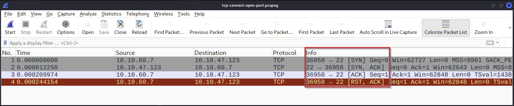

| Closed TCP Port Example |
|-------------------------|
|SYN > |
|< RST, ACK |
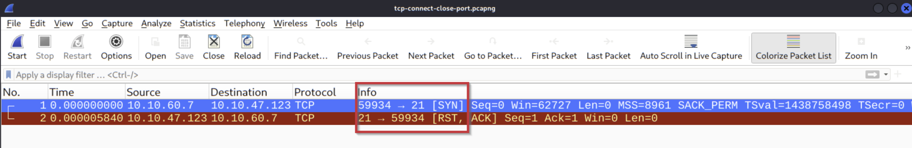

SYN Scans
   - "stealthy" scans
   - window size < 1024 bytes because it dosent have to finsih the 3 handshake size is smaller

Open TCP SYN scan example
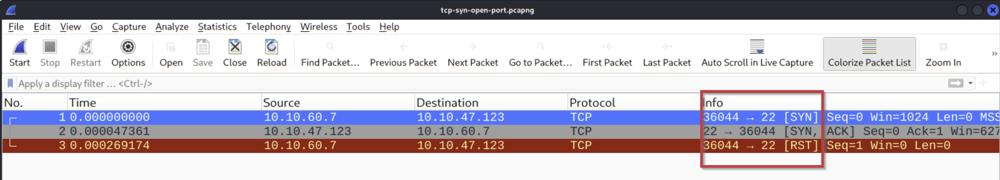

Closed port TCP SYN scan example
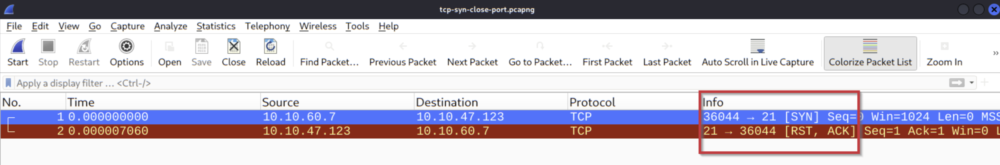

UDP Scans
  - no handshake process
  - no prompt for open ports
  - ICMP error message for closed ports
  - check packets for encapsulated data on ICMP errors

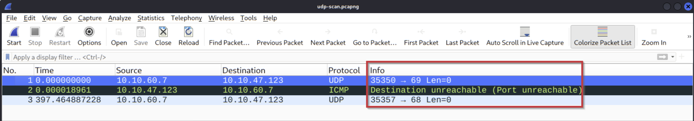

Closed UDP port 69 and open port 68 example

### TCP Flag Filters

| Flag Combination | Filter (Exact) | Filter (Flexible) |
|------------------|---------------|-------------------|
| SYN only | tcp.flags == 2 | tcp.flags.syn == 1 |
| ACK only | tcp.flags == 16 | tcp.flags.ack == 1 |
| SYN + ACK | tcp.flags == 18 | (tcp.flags.syn == 1) and (tcp.flags.ack == 1) |
| RST only | tcp.flags == 4 | tcp.flags.reset == 1 |
| RST + ACK | tcp.flags == 20 | (tcp.flags.reset == 1) and (tcp.flags.ack == 1) |
| FIN only | tcp.flags == 1 | tcp.flags.fin == 1 |

### Scan Type Comparison

| Scan Type | Nmap Command | Privilege | Handshake | Window Size | Open Port Response | Closed Port Response |
|-----------|-------------|-----------|-----------|-------------|-------------------|----------------------|
| TCP Connect | -sT | Non-root | Full 3-way | > 1024 | SYN > SYN-ACK > ACK | SYN > SYN-ACK > ACK > RST-ACK |
| SYN | -sS | Root | Half-open | <= 1024 | SYN > SYN-ACK > RST | SYN > RST-ACK |
| UDP | -sU | Root | None | N/A | No response | ICMP Type 3 Code 3 |

### Scan Detection Filters

| Scan Type | Wireshark Filter |
|-----------|-----------------|
| TCP Connect scan pattern | tcp.flags.syn==1 and tcp.flags.ack==0 and tcp.window_size > 1024 |
| SYN scan pattern | tcp.flags.syn==1 and tcp.flags.ack==0 and tcp.window_size <= 1024 |
| UDP closed port pattern | icmp.type==3 and icmp.code==3 |
| All TCP | tcp |
| All UDP | udp |

### Task Questions

**1. What is the total number of the "TCP Connect" scans?**

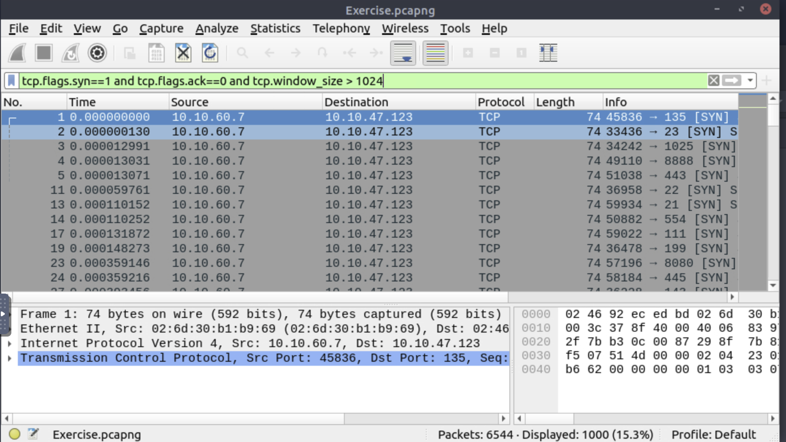
*tcp.flags.syn==1 and tcp.flags.ack==0 and tcp.window_size > 1024*
- **Answer: 1000**

**2. Which scan type is used to scan the TCP port 80?**

- **Answer: TCP Connect**

**3. How many "UDP close port" messages are there?**

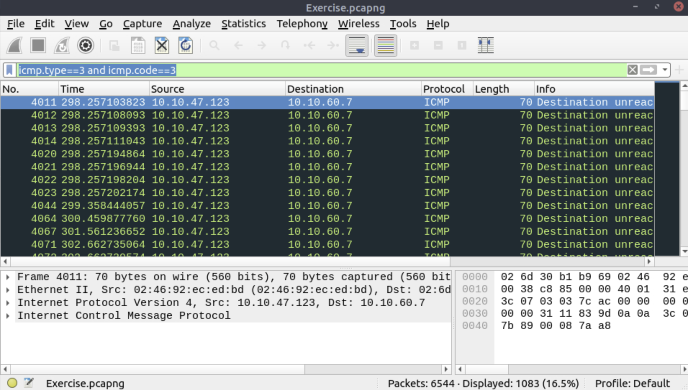
*icmp.type==3 and icmp.code==3*
- **Answer: 1083**

**4. Which UDP port in the 55-70 port range is open?**

*udp.port >=55 and udp.port <=70*
- **Answer: 68**

---

## Task 3 – ARP Poisoning & Man In The Middle

### Key Concepts

ARP Address Resolution Protocol
  - techonology that allows devices to identify themselves on a network
  - easy to detect ARP attacks
  - not a secure protocol
  - not a routable protocol
  - no authentication function

Normal ARP Request Example
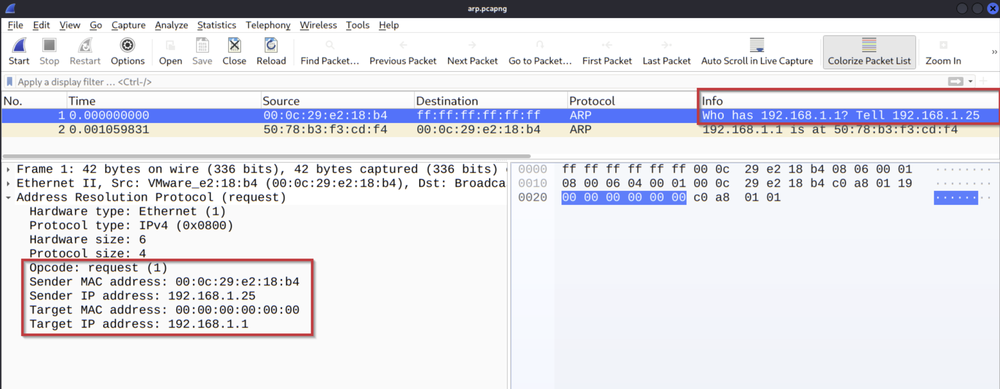

ARP reply
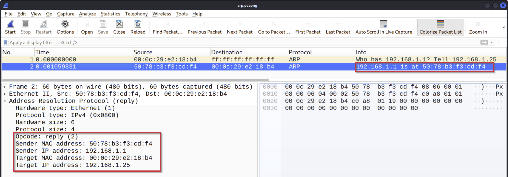

Suspicious ARP response shows conflict in IPs
  - warns analysts of duplicate IPs
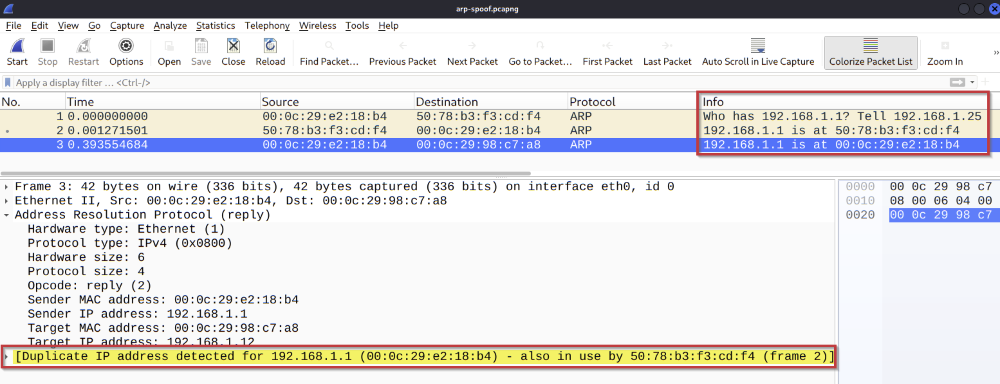

Different IP addresses with the same MAC address is a RED FLAG
  - potential of MITM attack

### ARP Filters

| Purpose | Wireshark Filter |
|---------|-----------------|
| Global ARP search | arp |
| ARP requests (opcode 1) | arp.opcode == 1 |
| ARP responses (opcode 2) | arp.opcode == 2 |
| ARP scanning detection | arp.dst.hw_mac==00:00:00:00:00:00 |
| Duplicate address / poisoning | arp.duplicate-address-detected or arp.duplicate-address-frame |
| ARP flooding from specific MAC | ((arp) && (arp.opcode == 1)) && (arp.src.hw_mac == target-mac-address) |

### IP to MAC Mapping Table (fill during investigation)

| Role | MAC Address | IP Address |
|------|-------------|------------|
| Attacker | | |
| Gateway | | |
| Victim | | |

### Detection Notes Template

| Finding | Detection Note | Details |
|---------|---------------|---------|
| Possible IP address match | 1 IP address announced from a MAC | |
| Possible ARP spoofing | 2 MACs claimed the same IP | |
| Possible ARP flooding | MAC crafted multiple ARP requests across IP range | |
| MITM confirmed | All HTTP traffic routed to attacker MAC | |

### Task Questions

**1. What is the number of ARP requests crafted by the attacker?**

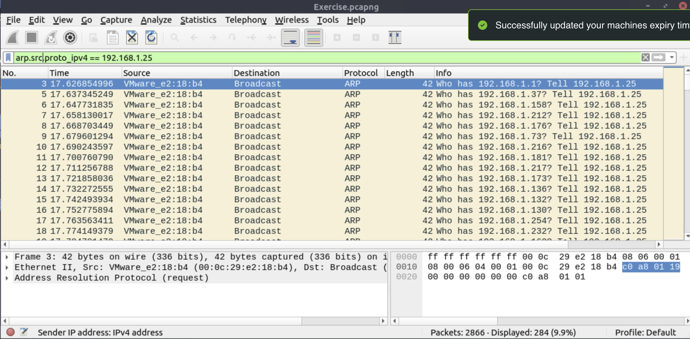
*First I looked for ARP requests arp.opcode == 1 and found many reuqests by the IP 192.168.1.25 so then I searched Google for ARP query filters and found that ic ould search for an IP source so I used the one IP that was making many ARP reuqests*
**arp.src.proto_ipv4 == 192.168.1.25**
- **Answer: 284**

**2. What is the number of HTTP packets received by the attacker?**

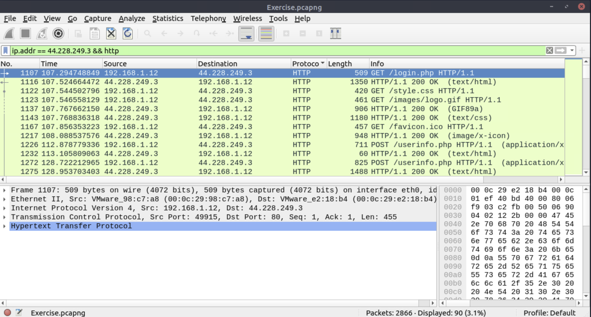
*For this one i filtered by http first saw the matching src IP 192.168.1.12 snedning the requests to IP 44.228.249.3 so now i filtered by **HTTP from specific IP**
**ip.addr == 44.228.249.3 && http**
- **Answer: 90**

**3. What is the number of sniffed username & password entries?**

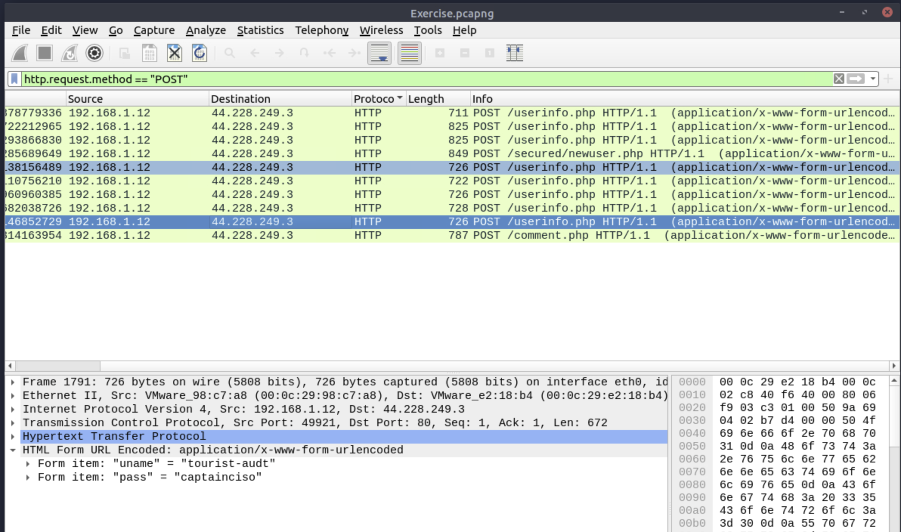
*Filtered by POST reuqest and manually checked and counted the info inside each packet*
**http.request.nethod == "POST"**
- **Answer: 6**

**4. What is the password of the "Client986"?**

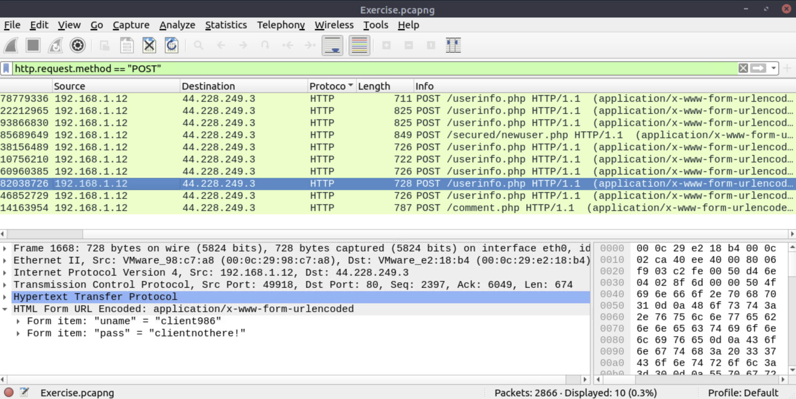
*Still on POST requests*
- **Answer: clientnothere!**

**5. What is the comment provided by the "Client354"?**

*Still on POST reuquests*
- **Answer: Nice Work!**

---

## Task 4 – Identifying Hosts: DHCP, NetBIOS and Kerberos

### Key Concepts

Identifying Hosts is crucial for any analysis
  - provides investigation starting point
  - lists hosts and users associated with any traffic activity

Protocols used for Host and User Identification
  - DHCP Dynamic Host Configuration Protocol (network managements protocol, automatically assigns IP address to devices on a network)
  - NetBIOS Network Basic Input/Output System (allows apps on seperate comp[uters to communicate over LAN)
  - Kerberos Computer Authetication Protocol (based on tickets, allows nodes to securely prove their identity to one another over a non secure network)

### DHCP Filters

| Purpose | Wireshark Filter |
|---------|-----------------|
| Global DHCP search | dhcp or bootp |
| DHCP Request packets | dhcp.option.dhcp == 3 |
| DHCP ACK packets | dhcp.option.dhcp == 5 |
| DHCP NAK packets | dhcp.option.dhcp == 6 |
| Search by hostname | dhcp.option.hostname contains "keyword" |
| Search by domain name | dhcp.option.domain_name contains "keyword" |

### DHCP Options Reference

| Option | Packet Type | Contains |
|--------|------------|---------|
| 12 | Request | Hostname |
| 50 | Request | Requested IP address |
| 51 | Request / ACK | IP lease time |
| 61 | Request | Client MAC address |
| 15 | ACK | Domain name |
| 56 | NAK | Rejection reason message |

### NBNS Filters

| Purpose | Wireshark Filter |
|---------|-----------------|
| Global NBNS search | nbns |
| Search by name | nbns.name contains "keyword" |

### Kerberos Filters

| Purpose | Wireshark Filter |
|---------|-----------------|
| Global Kerberos search | kerberos |
| Search by username | kerberos.CNameString contains "keyword" |
| Usernames only (exclude hostnames) | kerberos.CNameString and !(kerberos.CNameString contains "$") |
| Protocol version | kerberos.pvno == 5 |
| Domain/realm search | kerberos.realm contains ".org" |
| Service name | kerberos.SNameString == "krbtgt" |

### Kerberos Fields Reference

| Field | Contains |
|-------|---------|
| CNameString | Username or hostname (hostnames end with $) |
| pvno | Protocol version |
| realm | Domain name for the generated ticket |
| sname | Service and domain name for the generated ticket |
| addresses | Client IP and NetBIOS name (request packets only) |

### Task Questions

**1. What is the MAC address of the host "Galaxy A30"?**

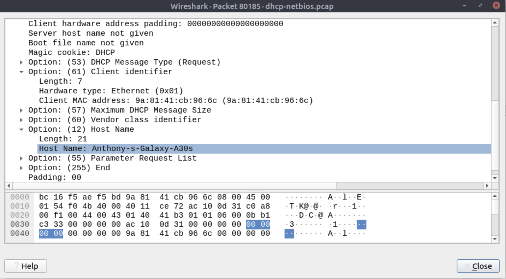
*FIltered out by DHCP hostname*
**dhcp.option.hostname contains "Galaxy"**
- **Answer: 9a:81:41:cb:96:6c**

**2. How many NetBIOS registration requests does the "LIVALJM" workstation have?**

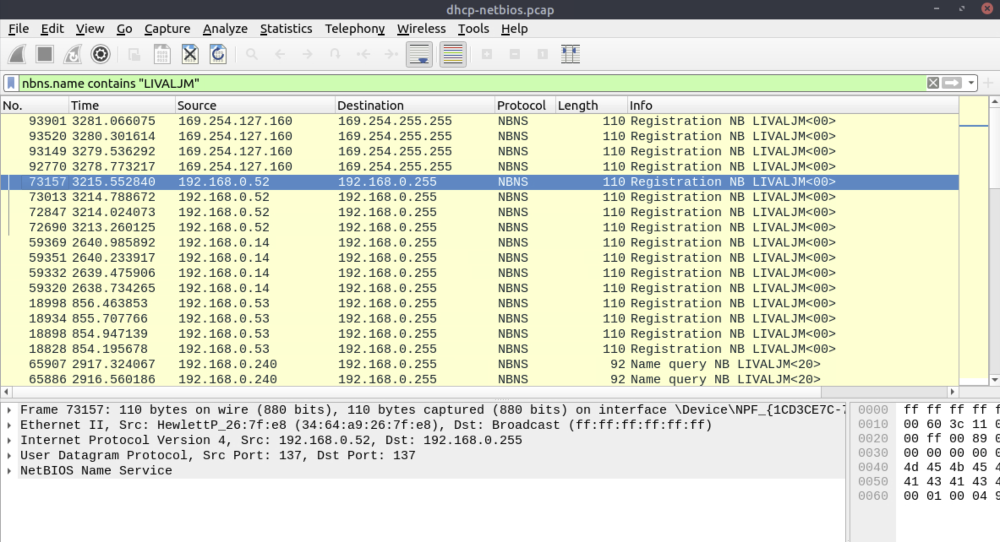
*Performed a full search of NetBIOS results that conatined LIVALJM and manually counted how many were registartions*
**nbns.name contains "LIVALJM"**
- **Answer: 16**

**3. Which host requested the IP address "172.16.13.85"?**

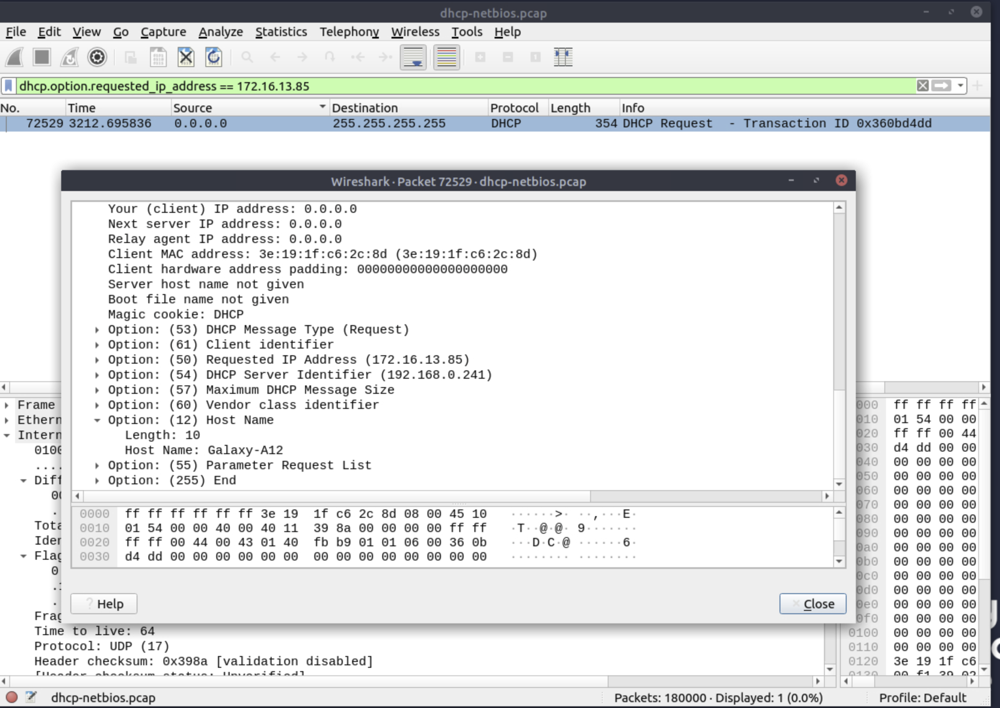
*This one was a big more difficult I had ask for help with the Filter as nothing in the THM instructions pointed in any direction*
**dhcp.option.requested_ip_address == 172.16.13.85**
- **Answer: Galaxy-A12**

**4. What is the IP address of the user "u5"? (Enter the address in defanged format.)**

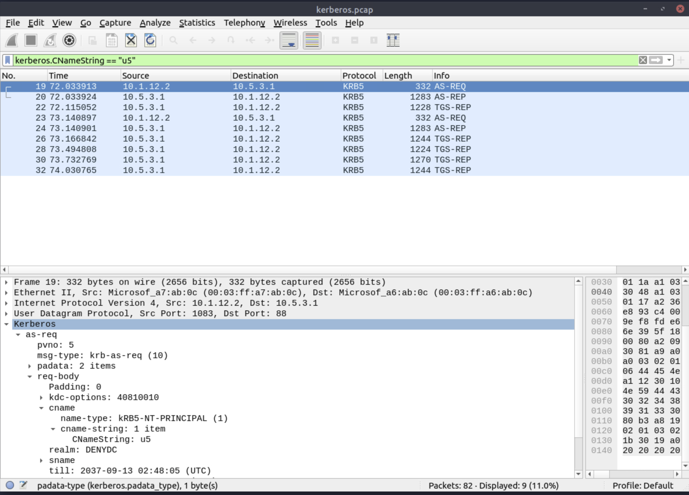
*Used CNameString to filter the username u5*
**kerberos.CNameString == "u5"**
- **Answer: 10[.]1[.]12[.]2**

**5. What is the hostname of the available host in the Kerberos packets?**

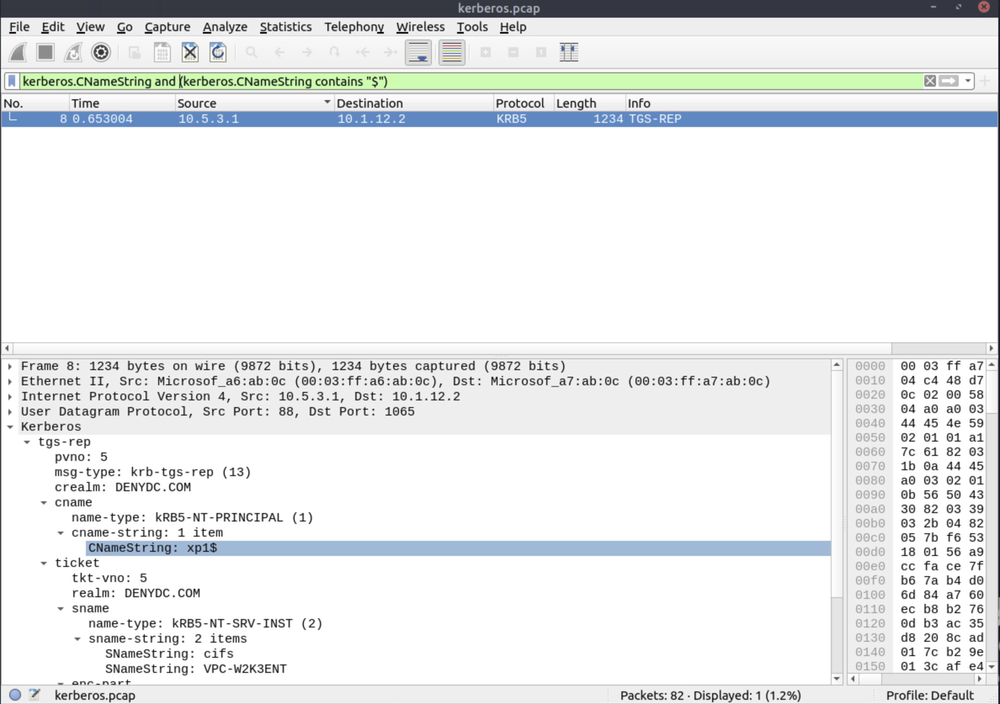
*I was looking for !$ and all i ahd to do was search for "$" instead*
Note: Some packets could provide hostname information in this field. To avoid this confusion, filter the "$"value. The values end with"$"are hostnames, and the ones without it are user names.
**kerberos.CNameString and (kerberos.CNameString contains "$")**
- **Answer: xp1$**

---

## Task 5 – Tunneling Traffic: DNS and ICMP

### Key Concepts

ICMP Internet Control Message Protocol
  - Port Forwarding
  - transfers data resources in a secure method to network segments and zones
  - internet to private networks or private networks to internet directions
  - hides data by encapsulating it
  - tunneling provides anonimity and traffic security
  - offers significant level of data encryption(why attackers use to bypass seucrity perimeters)
  - designed for diagnosing and repoting network communication issues(highly used in error reporting)
  - since its a trusted network layer protocol can be used for DoS attacks, data exfiltration and C2 tunneling activities
  - large volume of ICMP traffic and anomalous packet sizes are indicators of ICMP tunneling (hackers can change packet size)

**Common Exfiltration Protocols**
  - SSH
  - FTP
  - TCP
  - HTTP
  - DNS

DNS Domain Name System
  - attackers can hide C2 commands in subdomain addresses
    **encoded-commands.maliciousdomain.com**
    -converts IP domain addresses to IP addresses
    - phonebook of the internet
    - popular for data exfiltration and C2 

### ICMP Filters

| Purpose | Wireshark Filter |
|---------|-----------------|
| Global ICMP search | icmp |
| Oversized ICMP packets (tunnelling indicator) | data.len > 64 and icmp |
| ICMP destination unreachable | icmp.type == 3 |
| ICMP port unreachable (UDP closed) | icmp.type==3 and icmp.code==3 |
| ICMP echo request | icmp.type == 8 |
| ICMP echo reply | icmp.type == 0 |

### DNS Filters

| Purpose | Wireshark Filter |
|---------|-----------------|
| Global DNS search | dns |
| Known dnscat tunnelling tool | dns contains "dnscat" |
| Long query names (subdomain encoding) | dns.qry.name.len > 15 and !mdns |
| Exclude local link device queries | !mdns |
| DNS query type A | dns.qry.type == 1 |
| DNS response | dns.flags.response == 1 |

### Tunnelling Comparison

| Protocol | Normal Behavior | Tunnelling Indicator | Common Use |
|----------|----------------|----------------------|------------|
| ICMP | 64-byte payload, echo request/reply | data.len > 64, encoded payload in data field | Data exfil, C2 |
| DNS | Short queries, standard domain format | Long subdomains, encoded strings, high query volume to single domain | Data exfil, C2 |

### Task Questions

**1. Use the "Desktop/exercise-pcaps/dns-icmp/icmp-tunnel.pcap" file. Investigate the anomalous packets. Which protocol is used in ICMP tunnelling?**

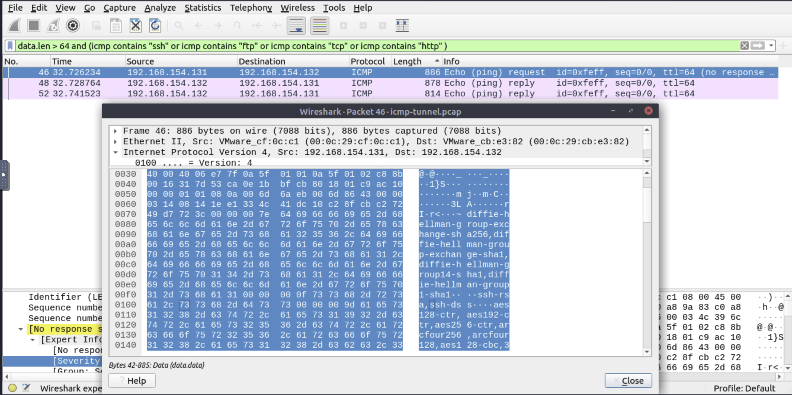
*This was a harder one, I missed the mention of the extra protocols that could be hiding in the packets such as ssh, tcp, dns, ftp so my logic was off and I had to look this opne up*
- **Answer: SSH**

**2. Use the "Desktop/exercise-pcaps/dns-icmp/dns.pcap" file. Investigate the anomalous packets. What is the suspicious main domain address that receives anomalous DNS queries? (Enter the address in defanged format.)**

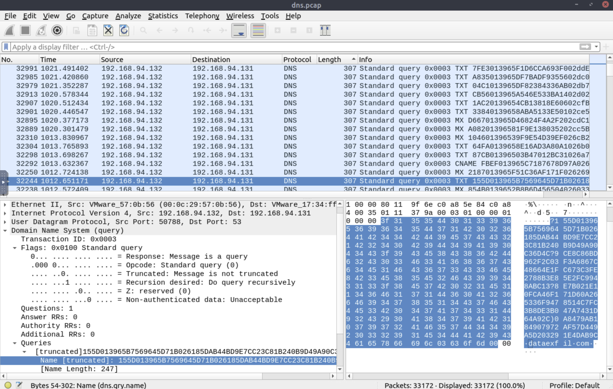
*As i was inspecting the packets i saw Name Truncated and due to the above question I figured it might follow the same format so I looked in the Bytes Panel!"
- **Answer: dataexfil[.]com**

---

## Task 6 – Cleartext Protocol Analysis: FTP

### Key Concepts

FTP File Transfer Protocol 

### FTP Response Code Reference

| Code | Series | Meaning | Detection Use |
|------|--------|---------|---------------|
| 211 | x1x | System status | Info gathering |
| 212 | x1x | Directory status | Info gathering |
| 213 | x1x | File status | File recon |
| 220 | x2x | Service ready | Connection established |
| 227 | x2x | Entering passive mode | Data transfer setup |
| 228 | x2x | Long passive mode | Data transfer setup |
| 229 | x2x | Extended passive mode | Data transfer setup |
| 230 | x3x | User login successful | Confirmed access |
| 231 | x3x | User logout | Session end |
| 331 | x3x | Valid username, need password | Username enumeration |
| 430 | x3x | Invalid username or password | Failed attempt |
| 530 | x3x | No login, invalid password | Brute-force signal |

### FTP Filters

| Purpose | Wireshark Filter |
|---------|-----------------|
| Global FTP search | ftp |
| Successful logins | ftp.response.code == 230 |
| Valid username responses | ftp.response.code == 331 |
| Failed login attempts | ftp.response.code == 530 |
| Invalid user or pass | ftp.response.code == 430 |
| System status | ftp.response.code == 211 |
| Passive mode | ftp.response.code == 227 |
| Filter by username | ftp.request.command == "USER" |
| Filter by password | ftp.request.command == "PASS" |
| Filter by specific password arg | ftp.request.arg == "password" |
| Current working directory | ftp.request.command == "CWD" |
| List directory | ftp.request.command == "LIST" |
| Brute-force signal | ftp.response.code == 530 |
| Brute-force with username target | (ftp.response.code == 530) and (ftp.response.arg contains "username") |
| Password spray signal | (ftp.request.command == "PASS") and (ftp.request.arg == "password") |

### Task Questions

**1. How many incorrect login attempts are there?**

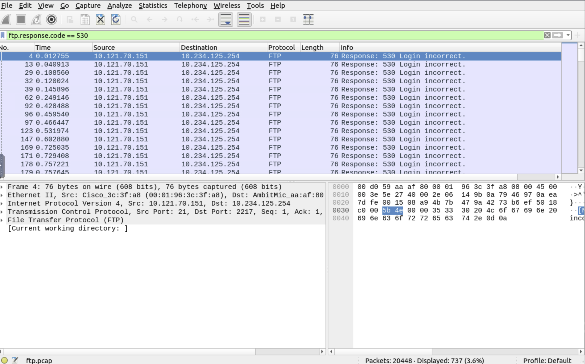
*Searched for code 530 no login, invalid password*
**ftp.response.code == 530**
- **Answer: 737**

**2. What is the size of the file accessed by the "ftp" account?**

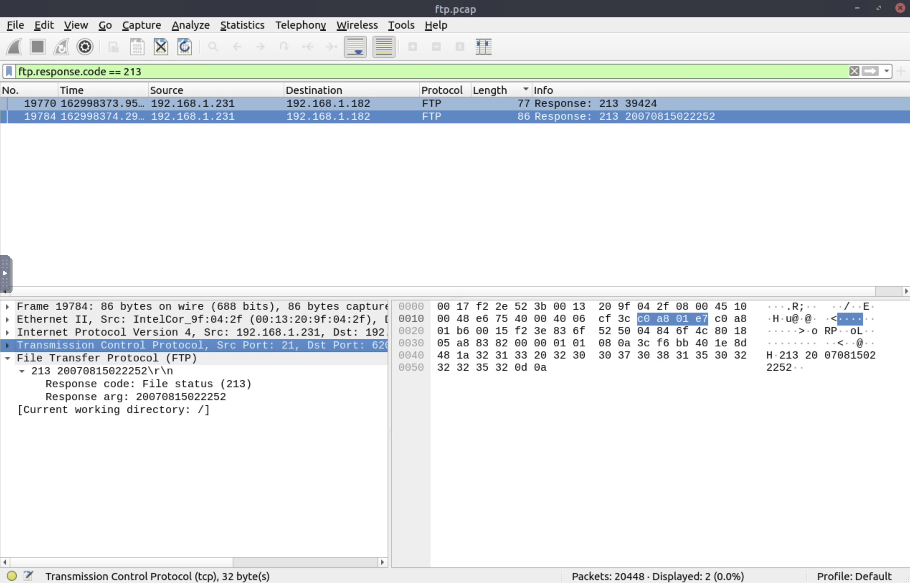
*Searched for FTP Response Code 213 = File Status*
**ftp.response.code==213**
- **Answer: 39424**

**3. The adversary uploaded a document to the FTP server. What is the filename?**

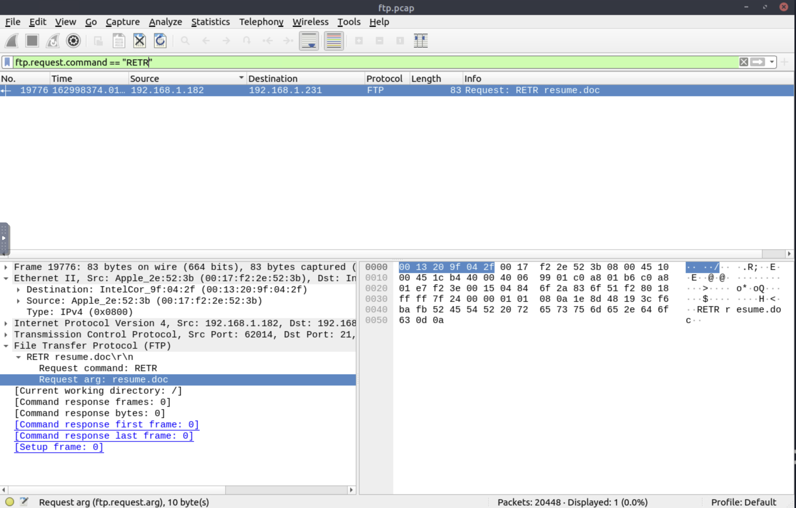
- **Answer: resume.doc**

**4. The adversary tried to assign special flags to change the executing permissions of the uploaded file. What is the command used by the adversary?**

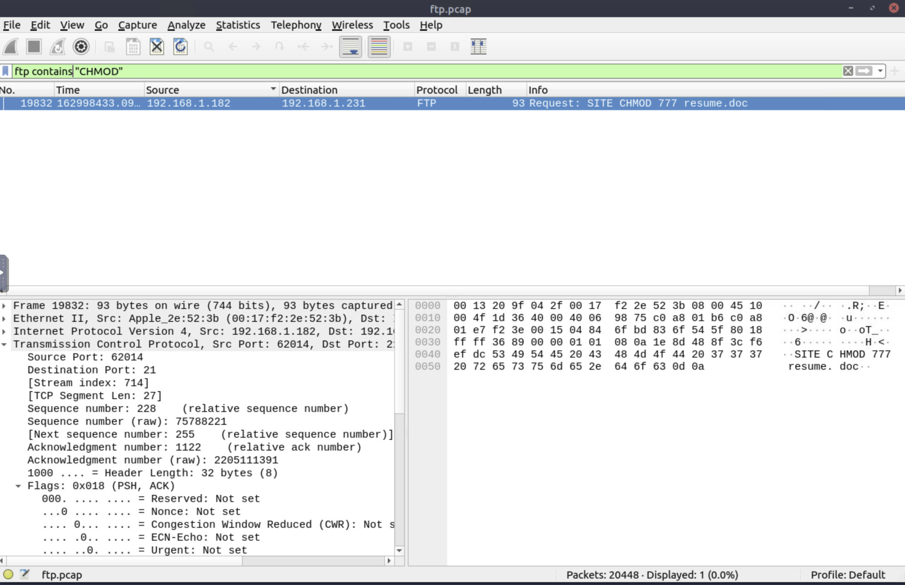
*CHMOD is a terminal command used for modifying file permissions using numeric or symbolic representation*
**ftp contains "CHMOD"**
- **Answer: CHMOD 777**

---

## Task 7 – Cleartext Protocol Analysis: HTTP

### Key Concepts

<!-- HTTP attacks detectable through traffic analysis: phishing, web attacks, exfil, C2 -->
<!-- Key request method and response code filters and what each status code signals -->
<!-- User-agent field: what makes one suspicious and why you cannot whitelist any value -->
<!-- Log4j attack pattern: POST request, jndi:ldap string, Exploit.class, base64 in user-agent -->
<!-- Why HTTP2 matters and how it differs from HTTP -->

### HTTP Request and Response Filters

| Purpose | Wireshark Filter |
|---------|-----------------|
| Global HTTP search | http |
| HTTP2 search | http2 |
| All requests | http.request |
| GET requests | http.request.method == "GET" |
| POST requests | http.request.method == "POST" |
| Response 200 OK | http.response.code == 200 |
| Response 301 Moved Permanently | http.response.code == 301 |
| Response 302 Moved Temporarily | http.response.code == 302 |
| Response 400 Bad Request | http.response.code == 400 |
| Response 401 Unauthorised | http.response.code == 401 |
| Response 403 Forbidden | http.response.code == 403 |
| Response 404 Not Found | http.response.code == 404 |
| Response 405 Method Not Allowed | http.response.code == 405 |
| Response 408 Request Timeout | http.response.code == 408 |
| Response 500 Internal Server Error | http.response.code == 500 |
| Response 503 Service Unavailable | http.response.code == 503 |

### HTTP Parameter Filters

| Purpose | Wireshark Filter |
|---------|-----------------|
| User agent field | http.user_agent |
| Nmap in user agent | http.user_agent contains "nmap" |
| SQLmap in user agent | http.user_agent contains "sqlmap" |
| Wfuzz in user agent | http.user_agent contains "Wfuzz" |
| Nikto in user agent | http.user_agent contains "Nikto" |
| All scanner tools combined | (http.user_agent contains "sqlmap") or (http.user_agent contains "Nmap") or (http.user_agent contains "Wfuzz") or (http.user_agent contains "Nikto") |
| Request URI contains admin | http.request.uri contains "admin" |
| Full URI contains admin | http.request.full_uri contains "admin" |
| Server type | http.server contains "apache" |
| Host search | http.host contains "keyword" |
| Exact host match | http.host == "keyword" |
| Keep-alive connections | http.connection == "Keep-Alive" |
| Cleartext data from server | data-text-lines contains "keyword" |

### Log4j Detection Filters

| Purpose | Wireshark Filter |
|---------|-----------------|
| Log4j initial POST | http.request.method == "POST" |
| jndi string in IP layer | ip contains "jndi" |
| Explo
