*Write-up by [Miyu7x](https://github.com/Miyu7x) | TryHackMe: [Miyu7](https://tryhackme.com/p/Miyu7)*

---

## Task 1 - Room Introduction

### Key Concepts

NetworkMiner is an open-source Network Forensics Analysis Tool (NFAT).

- Available on Windows, Linux, macOS, and FreeBSD
- Two primary use cases: passive sniffer that fingerprints hosts, sessions, and open ports without sending any traffic, or PCAP parser that reassembles files and certificates captured from traffic
- Supported data types: live traffic, traffic captures, log files

---

## Task 2 - NetworkMiner in Forensics

**NetworkMiner** is a great tool to provide quick and useful hints on where to start an investigation.

- Context of captured hosts: IP and MAC addresses, hostnames, and OS information
- List of potential attack indicators: traffic spikes or port scans
- Tools and toolkits used to perform potential attacks

### Key Concepts

Three main data types in network forensics: live traffic, traffic captures, log files. NetworkMiner handles both PCAP files and live traffic.

---

## Task 3 - What is NetworkMiner?

### Key Concepts

NetworkMiner has a sniffing feature but it is not intended to be used as a sniffer.

- Only available on Windows
- Not as reliable as other features
- Not a dedicated sniffer tool like Wireshark or tcpdump

NetworkMiner is best used for quick packet parsing and processing, grabbing the low-hanging fruit before a deep dive.

**Suggested Workflow**

1. Record traffic for offline analysis
2. Quickly overview the PCAP with NetworkMiner
3. Do a deep analysis with Wireshark

**Pros and Cons of NetworkMiner**

| | Pros | Cons |
|---|---|---|
| | OS fingerprinting | Not useful for active sniffing |
| | Easy file extraction | Not useful for large PCAP investigation |
| | Credential grabbing | Limited filtering options |
| | Clear text keyword parsing | Not built for manual traffic investigation |
| | Overall traffic overview | |

### Feature Comparison

| Feature | NetworkMiner | Wireshark |
|---|---|---|
| Purpose | Quick overview, mapping, extraction | In-depth analysis |
| OS Fingerprinting | Yes | No |
| Filtering Options | Limited | Yes |
| Protocol Analysis | No | Yes |
| Payload Analysis | No | Yes |
| Statistical Analysis | No | Yes |
| Host Categorisation | Yes | No |
| Parameter/Keyword Discovery | Yes | Manual |

---

## Task 4 - Tool Overview 1

### Key Concepts

NetworkMiner is considered an initial investigation tool for grabbing low-hanging fruit and getting a traffic overview.

- Drag and drop PCAP files to load them
- Tools menu: clears the dashboard and removes captured data
- Help menu: provides info on the current version and updates
- Case Panel: shows list of investigated PCAP files; right-click to view file metadata
- Hosts tab: IP address, MAC address, OS type, open ports, sent/received packets, incoming/outgoing sessions, and host details
  - OS fingerprinting uses the Satori GitHub repo and p0f
  - MAC address database uses the mac-ages GitHub repo
- Sessions tab: frame number, client and server address, source and destination port, protocol, and start time
  - Search for keywords inside frames using: ExactPhrase, AllWords, AnyWord, RegEx
- DNS tab: frame number, timestamp, client and server, source/destination ports, IP TTL, DNS time, transaction ID and type, DNS query and answer, Alexa Top1M
- Credentials tab: Kerberos hashes and other extracted credentials

### Task Questions - mx-3.pcap

**1. What is the total number of frames?**

*Right-click the file in the Case Panel and select View Metadata*

- **Answer: 460**

**2. How many IP addresses use the same MAC address with host 145.253.2.203?**

- **Answer: 2**

**3. How many packets were sent from host 65.208.228.223?**

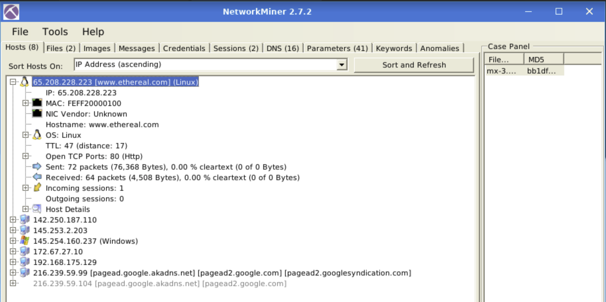

- **Answer: 72**

**4. What is the name of the webserver banner under host 65.208.228.223?**

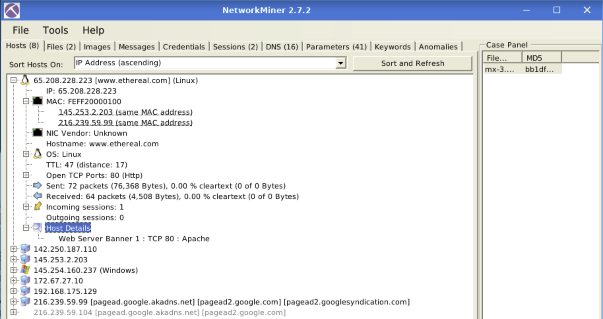

- **Answer: Apache**

### Task Questions - mx-4.pcap

**5. What is the extracted username for the 02694W-WIN10 host?**

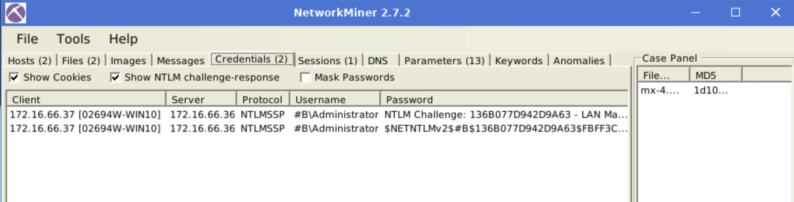
*Found under the Credentials tab*

- **Answer: #B/Administrator**

**6. What is the extracted password for the user logged into the 02694W-WIN10 host? Enter the full NTLM hash.**

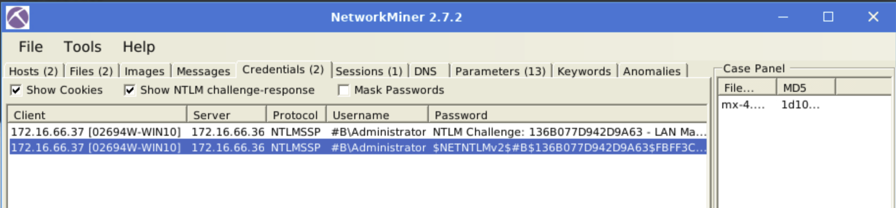
*Right-click the entry to copy the full hash*

- **Answer: $NETNTLMv2$#B$136B077D942D9A63$FBFF3C253926907AAAAD670A9037F2A5$01010000000000000094D71AE38CD60170A8D571127AE49E00000000020004003300420001001E003000310035003600360053002D00570049004E00310036002D004900520004001E0074006800720065006500620065006500730063006F002E0063006F006D0003003E003000310035003600360073002D00770069006E00310036002D00690072002E0074006800720065006500620065006500730063006F002E0063006F006D0005001E0074006800720065006500620065006500730063006F002E0063006F006D00070008000094D71AE38CD601060004000200000008003000300000000000000000000000003000009050B30CECBEBD73F501D6A2B88286851A6E84DDFAE1211D512A6A5A72594D340A001000000000000000000000000000000000000900220063006900660073002F003100370032002E00310036002E00360036002E0033003600000000000000000000000000**

---

## Task 5 - Tool Overview 2

### Key Concepts

Some NetworkMiner features are only available in the premium version.

- OSINT hash lookup and sample submission
- Advanced search bar
- Right-click allows in-depth views of open files and folders
- Messages tab: extracted emails, chats, and messages

### Task Questions - mx-7.pcap

**1. What is the name of the Linux distro mentioned in the file associated with frame 63075?**

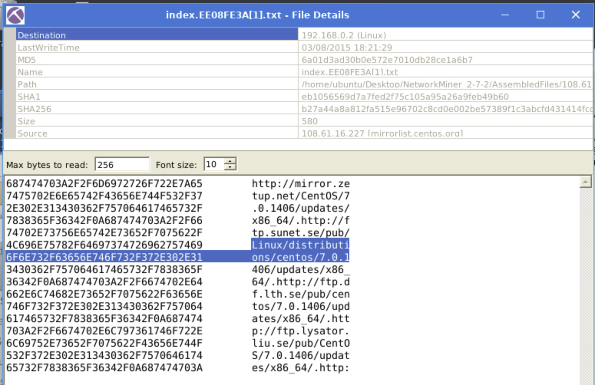
*Filtered for frame number 63075 across multiple tabs; found the answer under the Files tab*

- **Answer: CentOS**

**2. What is the header of the page associated with frame 75942?**

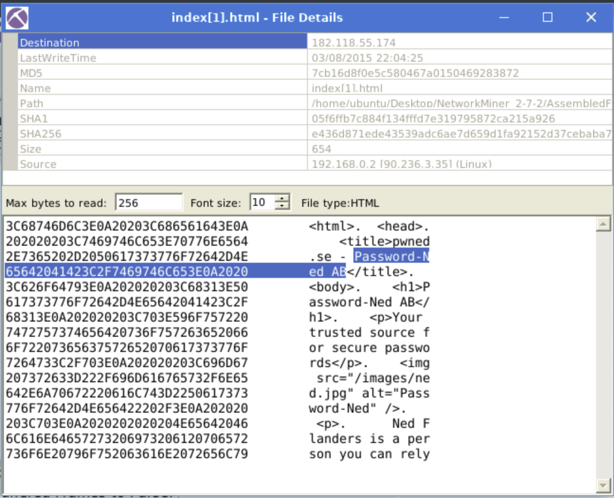

- **Answer: Password-Ned AB**

**3. What is the source address of the image "ads.bmp.2E5F0FD9[1].bmp"?**

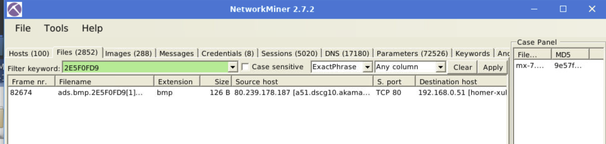
*Searched for the filename in the Files tab filter*

- **Answer: 80.239.178.187**

**4. What is the frame number of the possible TLS anomaly?**

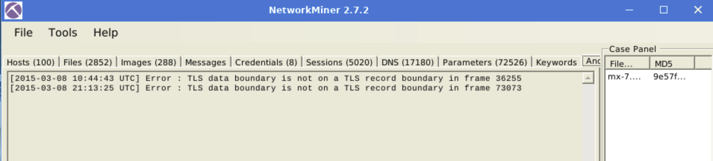

- **Answer: 36255**

### Task Questions - mx-9.pcap

**5. Which platform sent an email with the subject starting with "You have more"?**

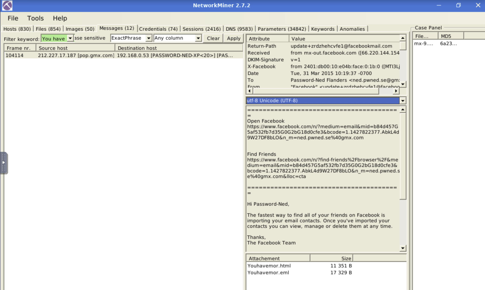

- **Answer: Facebook**

**6. What is the email address of Branson Matheson?**

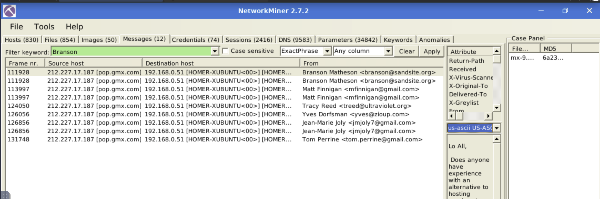

- **Answer: branson@sandsite.org**

---

## Task 6 - Version Differences

### Key Concepts

Two versions of NetworkMiner are installed in the VM: v1.6 and v2.7. Each version has distinct capabilities worth noting for investigation workflows.

- MAC address conflict detection: available in v2.7 only
- Frame processing with detailed frame data: available in v1.6 only
- Cleartext data tab (all extracted cleartext in one view): available in v1.6 only
- Parameter processing is more extensive in v2.7
- Packet details (sent/received breakdown): more detailed in v1.6

### Version Feature Matrix

| Feature | v1.6 | v2.7 |
|---|---|---|
| MAC address conflict detection | No | Yes |
| Frame processing tab | Yes | No |
| Cleartext data tab | Yes | No |
| Extensive parameter processing | No | Yes |
| Detailed packet breakdown | Yes | No |

### Task Questions

**1. Which version can detect duplicate MAC addresses?**

*MAC address conflict detection was used in the duplicate MAC address question earlier in the room*

- **Answer: 2.7**

**2. Which version can handle frames?**

- **Answer: 1.6**

**3. Which version can provide more details on packet details?**

- **Answer: 1.6**

---

## Task 7 - Exercises

### Key Concepts

- Use case1.pcap with v1.6 for frame and packet detail questions
- Use case2.pcap for USB, image, credential, and DNS questions
- OS fingerprinting is visible under the Hosts tab
- Byte counts for specific ports are found in host communication session details
- Sequence numbers are found in the frame detail view in v1.6
- Content types are counted from the Parameters tab filtered by "Content-Type"

### Task Questions - case1.pcap

**1. What is the full OS name of the host 131.151.37.122?**

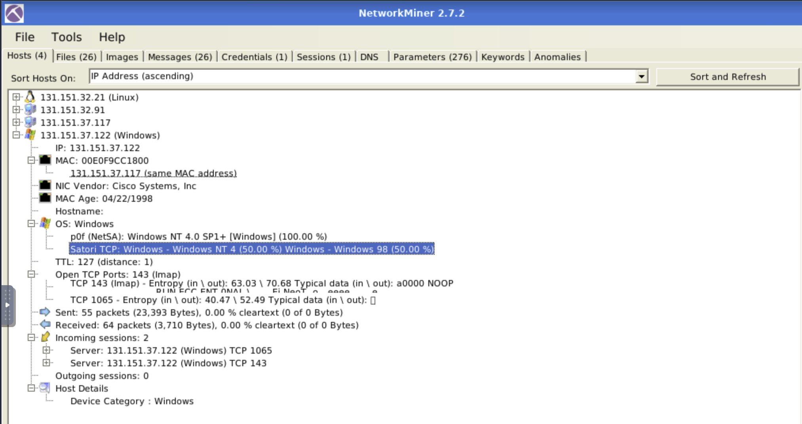
*Found under the Hosts tab; the Satori TCP fingerprinting line provides the full OS string*

- **Answer: Windows - Windows NT 4**

**2. How many bytes were sent by the client (*.32.91) through port 1065?**

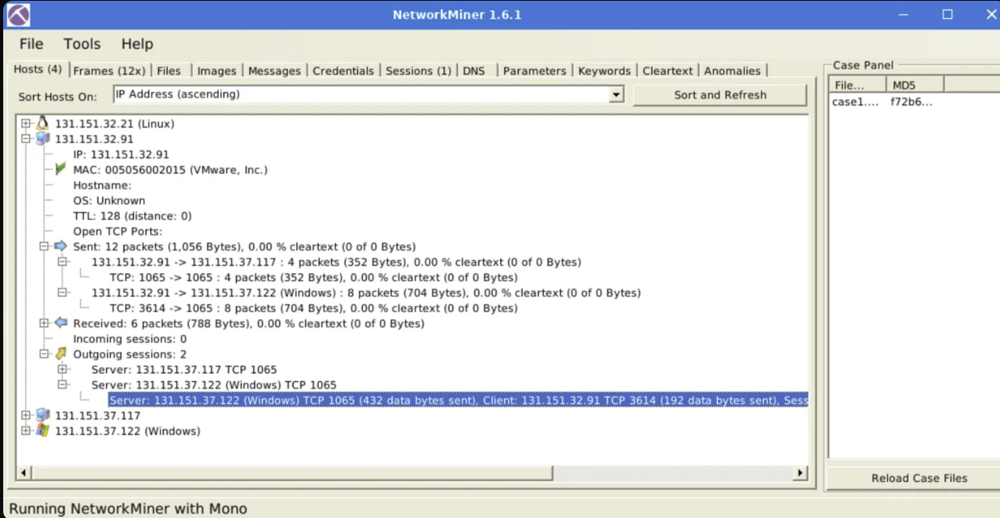
*Expand the host entry under Hosts tab, then expand the outgoing session to 131.151.37.122 to see the per-side data byte breakdown*

- **Answer: 192**

**3. How many bytes were sent back by the server (*.37.122) through port 143?**

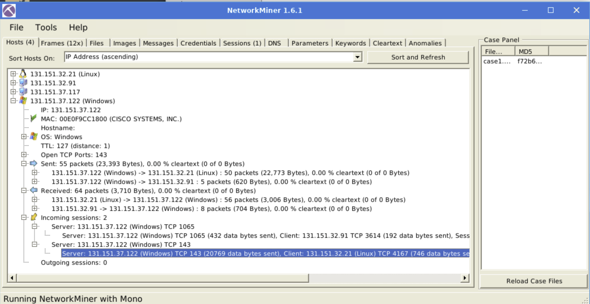

- **Answer: 20769**

**4. What is the sequence number of frame number 9?**

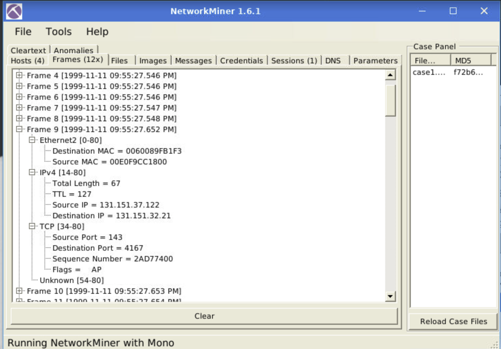

- **Answer: 2AD77400**

**5. What is the number of the detected "content types"?**

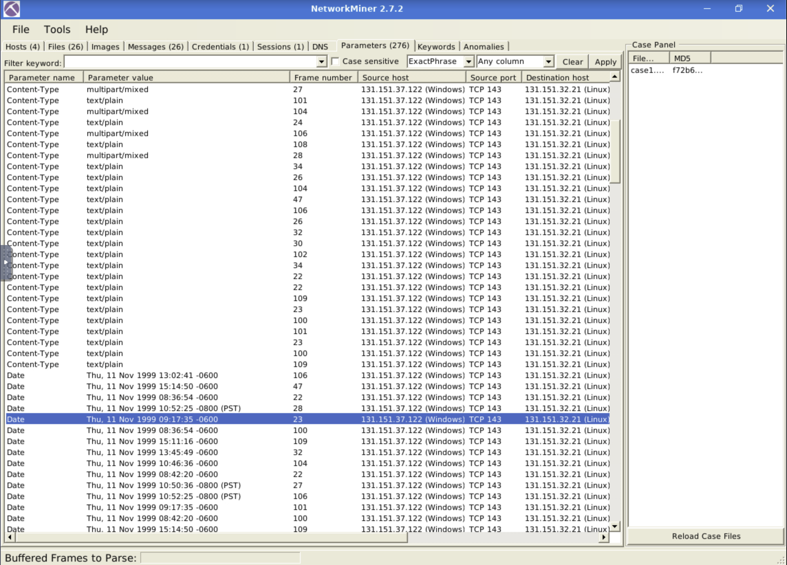
*Go to the Parameters tab, sort by Parameter Name, and count the distinct Content-Type values*

- **Answer: 2**

### Task Questions - case2.pcap

**6. What is the USB product's brand name?**

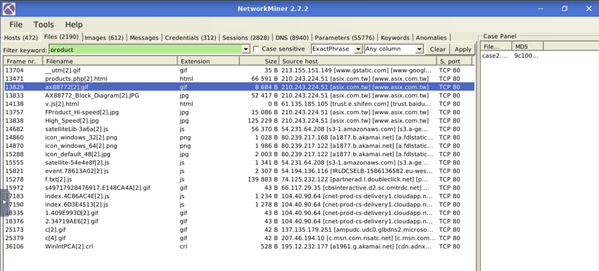

- **Answer: ASIX**

**7. What is the name of the phone model?**

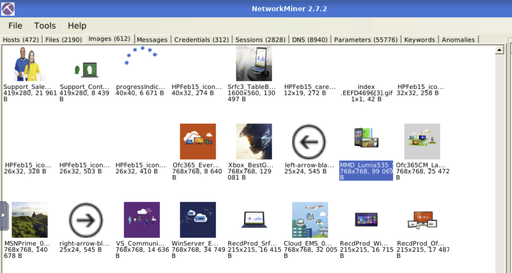
*The question is vague -- the hint says to investigate files and images without external research. Manually checking images reveals multiple Lumia models; the correct one is identified by context*

- **Answer: Lumia 535**

**8. What is the source IP of the fish image?**

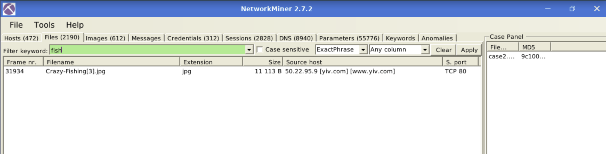

- **Answer: 50.22.95.9**

**9. What is the password of homer.pwned.se@gmx.com?**

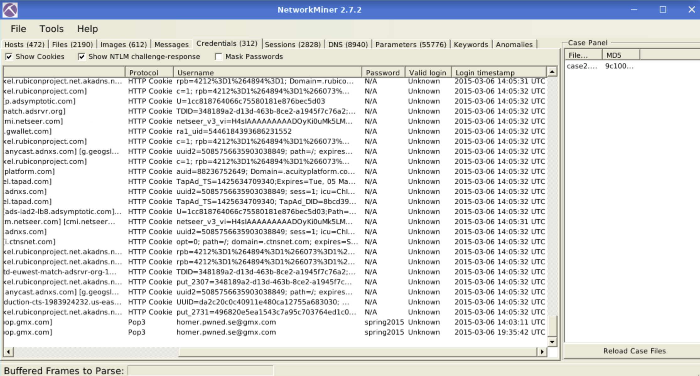

- **Answer: spring2015**

**10. What is the DNS query of frame 62001?**

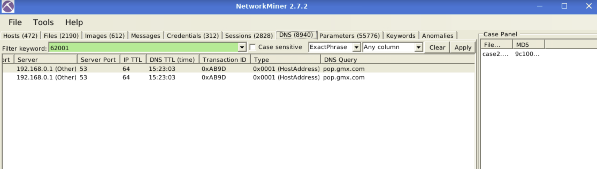

- **Answer: pop.gmx.com**

---

## Task 8 - Conclusion

### Key Concepts

- Do not use NetworkMiner as a primary sniffer
- Use it for a quick traffic overview before moving to Wireshark or tcpdump
- Next rooms in the path: Wireshark, Snort, Brim
