*Write-up by [Miyu7x](https://github.com/Miyu7x) | TryHackMe: [Miyu7](https://tryhackme.com/p/Miyu7)*

---

## Task 1 - Introduction

### Key Concepts

Networks are the backbone of every modern organization, connecting servers, workstations, applications, and security devices.

Key components covered in this room:
- Network perimeter
- Perimeter threats
- Firewall log analysis


### Task Questions

**1. Complete the task.**

- **Answer: N/A**

---

## Task 2 - Getting Started

### Key Concepts

Start the attached machine to begin the lab environment.

### Task Questions

**1. Start the machine.**

- **Answer: N/A**

---

## Task 3 - A Network: Overview

### Key Concepts

A computer network is an organized structure where network assets connect and communicate with each other.

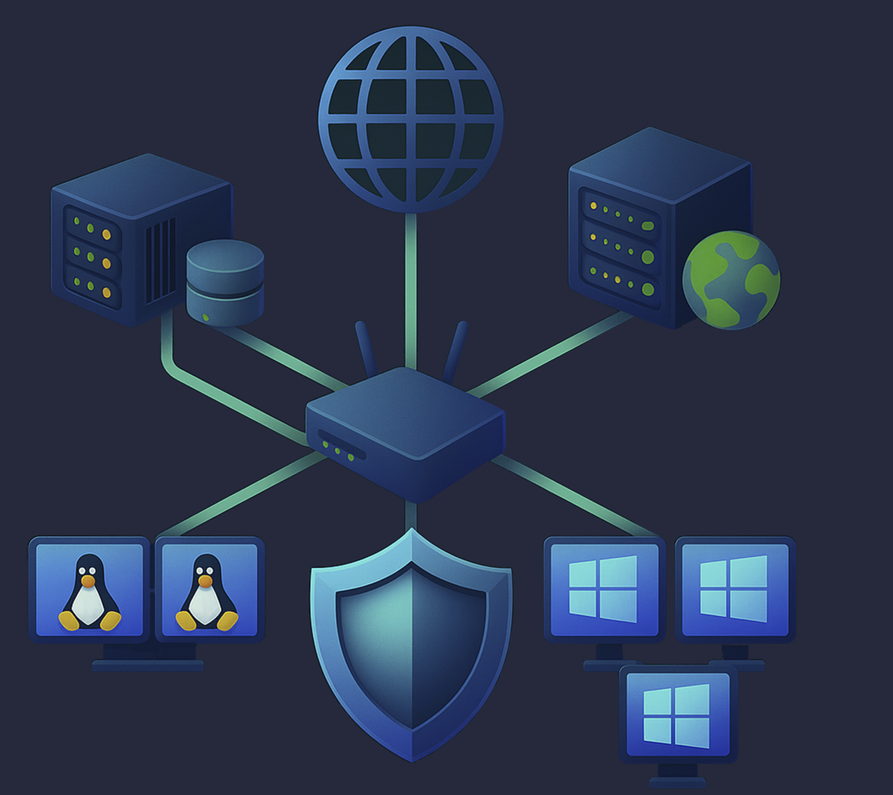

**Small Enterprise Network**

**Working Endpoints**
- Employees carry out their daily work on PCs or laptops
- Most common attacker entry point is phishing or malicious downloads
- Endpoints tend to be less monitored; if an attacker gets in, they can move laterally
  - **Importance:** Endpoint logs reveal malicious processes, while network logs may show C2 connections first

**File and Database Servers**
- Store the organization's most important data and assets
- File servers provide centralized access to valuable or sensitive data
  - **Importance:** These servers are targeted for ransomware; data exfiltration usually originates here

**Application Servers**
- Host web, email, VPN, and other company applications
- External-facing applications make them high-value targets; attackers constantly scan for software vulnerabilities
  - **Importance:** An entry point here typically means gaining a foothold into the internal network
    - SQL injection on web apps
    - Brute-force login on email or VPN
    - Suspicious IPs interacting with sensitive applications

**Active Directory and Authentication Servers**
- AD is the identity backbone of most organizations
- Responsible for managing users, groups, computers, and access rights
- AD credentials are used to access the organization's services
  - **Importance:**
    - AD controls all user accounts and systems within the network
    - Attackers target AD for privilege escalation, persistence, and lateral movement
    - A single compromised domain admin account can bring down the entire organization
    - Authentication logs can reveal multiple failed login attempts, unusual logins from unknown locations at odd hours, and accounts accessing systems they normally should not

**Routers and Switches (Network Infrastructure)**
- Routers connect the organization's LAN to the internet
- Switches connect devices within the same network (PCs to printers, etc.)
- These devices form the circulatory system of the enterprise
  - **Importance:**
    - Routers and switches are not directly exposed
    - If compromised, attackers can manipulate network traffic via MitM attacks
    - Create backdoors for rerouting traffic or open hidden channels to the internet

**Firewalls and Perimeter Devices**
- The firewall is the primary security gateway controlling traffic between the internal trusted network and the untrusted internet
- Inspects incoming and outgoing packets and decides based on security rules whether to allow or block them
- Modern firewalls can inspect applications, prevent intrusions, and detect malware
  - **Importance:**
    - Protects the organization from direct exposure to the internet
    - Prevents unauthorized access to internal services such as databases and RDP
    - Logs every connection attempt
    - Firewall logs are often the earliest indicator of attacks, surfacing port scans, brute-force attempts, and exploitation attempts

#### Network Components Summary

| Component | Primary Role | Security Significance |
|---|---|---|
| User Workstations (Endpoints) | Daily employee work | Most common attacker entry point (phishing, malicious downloads); C2 connections may appear in network logs before host logs |
| File and Database Servers | Store and serve critical business data | Prime ransomware and exfiltration targets |
| Application Servers (Web, Email, VPN) | Host externally facing services | High-value targets due to internet exposure; monitor for SQLi, brute-force, suspicious IPs |
| Active Directory / Auth Servers | Identity and access backbone | Controls all user accounts; targeted for privilege escalation, persistence, lateral movement |
| Routers and Switches | Traffic routing and internal connectivity | If compromised: MitM, backdoors, hidden channels |
| Firewalls / Perimeter Devices | Filter traffic between internal and untrusted networks | Logs are earliest indicators of port scans, brute-force, and exploitation attempts |

<!-- Endpoint logs reveal malicious processes; network logs may show C2 first -->
<!-- AD is the crown jewel -- a single compromised domain admin can bring down the enterprise -->
<!-- Monitor auth logs: failed logins, unusual IPs, off-hours access, accounts accessing unexpected systems -->

### Task Questions

**1. Continue to the next task.**

- **Answer: N/A**

---

## Task 4 - Network Visibility

### Key Concepts

**Network Visibility** is crucial in cybersecurity.
- Monitor and understand what is happening across your network
- As a SOC analyst, the key principle is: **"You can't defend what you can't see"**
- A set of tools that build a bigger picture of incidents


**Host-Centric**
- Generated by individual devices
- Shows what is happening inside the machine

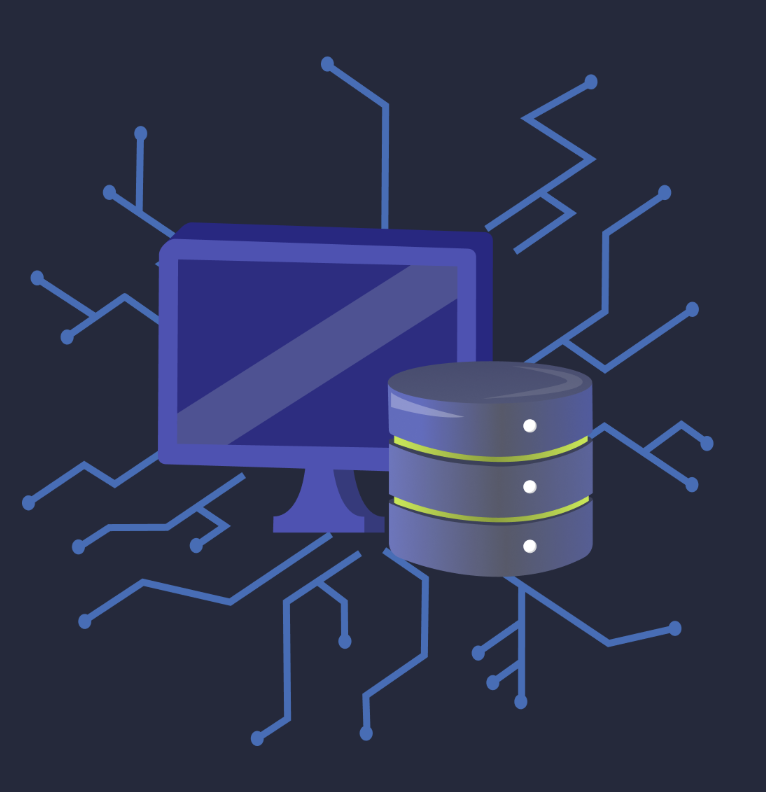

**Network-Centric**
- Generated by network appliances
- Shows what is happening outside the devices
- Sources: firewalls, IDS/IPS, routers and switches, web proxies, VPN

#### Log Source Comparison

| Category | Generated By | What It Shows | Best For |
|---|---|---|---|
| Host-Centric | Endpoints, servers, laptops | Logons, process creation, service starts, failed auth, AV/EDR alerts | Understanding direct impact on a specific machine |
| Network-Centric | Firewalls, IDS/IPS, routers, proxies, VPN | Src/dst IPs, ports, protocols, allow/block actions | Revealing recon, lateral movement, C2, data exfiltration |

<!-- Host logs = what happened inside a room -->
<!-- Network logs = who entered and left the building -->
<!-- Correlation of both = complete incident timeline -->

#### Key Network-Centric Log Sources

| Source | What It Logs | Primary Value |
|---|---|---|
| Firewalls | Every connection allowed or denied | First place to look for unauthorized connection attempts |
| IDS/IPS | Signature matches and behavioral anomalies | Detecting active attacks in real time |
| Routers/Switches | NetFlow / traffic flow summaries | High-level overview: who talked to whom, how much data |
| Web Proxies | Every URL visited by users | Web-based threats, policy violations, exfiltration |
| VPN | Who connected, from where, at what time | Monitoring remote access security |

### Task Questions

**1. Continue to the next task.**

- **Answer: N/A**

---

## Task 5 - Network Perimeter

### Key Concepts

**Network Perimeter**
- The boundary that separates an organization's internal trusted network from the external untrusted zone (the internet)
- Internal: where the organization's business systems live
- External: the internet, full of potential threats
- The perimeter is the controlled checkpoint through which all traffic passes

**The Perimeter**
- Made up of devices on the edge of the network
- Also includes virtual gateways, cloud connections, and remote access points
- Acts as a gatekeeper: controls what goes in and out of the network
- Not a single device but a conjunction of security controls and network components
- First line of defense and where SOC analysts first detect malicious activity
- A weak or misconfigured perimeter can expose services like RDP, MySQL, and SMB to brute-force attacks and exfiltration
  - **Importance:**
    - Reviewing firewall logs
    - Identifying scanning attempts
    - Flagging unusual traffic
    - Understanding what should and should not be exposed at the perimeter

#### Perimeter Components

| Component | Role |
|---|---|
| Firewalls | Filter traffic between internal and external networks |
| Routers / Gateways | Route traffic and enforce access rules |
| DMZ (Demilitarized Zone) | Buffer segment hosting public-facing servers (web, mail, VPN) |
| Remote Access Gateways / VPNs | Secure entry points for remote employees |

<!-- Weak or misconfigured perimeters allow: exposed service exploitation (RDP, MySQL, SMB), recon/scanning, brute-force, data exfiltration -->
<!-- SOC analyst role at the perimeter: review firewall logs, identify scans/brute-force, flag unusual outbound traffic -->

### Task Questions

**1. Continue to the next task.**

- **Answer: N/A**

---

## Task 6 - Network Perimeters: Monitoring and Protecting

### Key Concepts

**Monitoring the Perimeter**
- Firewalls and IDS/IPS
- Detect misconfigurations
- Log analysis

**Example: Port Scanning Blocked by Firewall**
- The same external IP `203.0.113.10` attempts to connect to multiple ports on the same internal machine in quick succession
- Classic example of a port scan

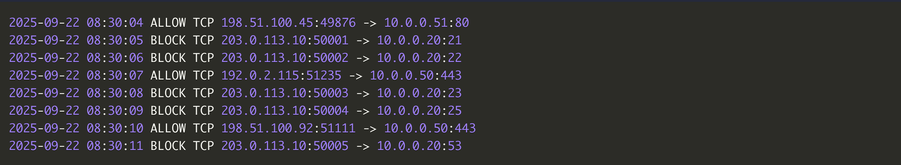

**Example: Web Server Attack via SQL Injection**
- Filter by BLOCK to immediately surface threats
- SQL injection shows the attacker attempting to dump database information
- XSS alert shows an attempt to inject a malicious script
- Directory traversal alert shows an attempt to read sensitive server files
- The WAF successfully identified and blocked multiple web attacks

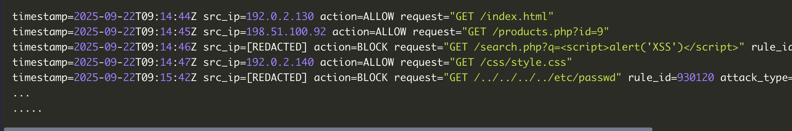

**Example: VPN Brute-Force (Password Guessing)**
- Log is flooded with `FAILED_AUTH` and `SUCCESS_AUTH` entries
- A large volume of failures is a major red flag

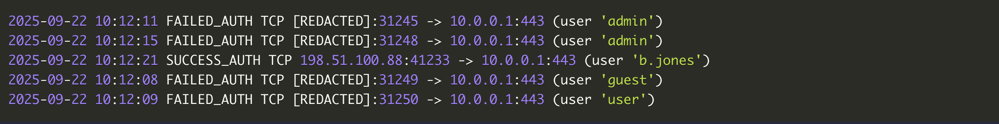

#### Attack Pattern Recognition

| Pattern | What It Looks Like | Attack Type |
|---|---|---|
| Repetition from one source to many destinations | Same IP hitting many ports quickly | Port scanning / reconnaissance |
| Repetition from one source to one destination | Same IP flooding one service with auth attempts | Brute-force |
| Traffic at perfect, regular intervals | Internal host calling out on a schedule | Malware C2 beaconing |

<!-- Context is key: IDS tells you WHY something was flagged, not just that it was blocked -->
<!-- Perimeter logs location: /Perimeter_logs/task6/ on Desktop -->

#### Scenario Summary

| Scenario | Log Source | Key Indicator | Verdict |
|---|---|---|---|
| Port Scanning | Firewall | Same external IP hitting multiple ports on one host in rapid succession | Classic port scan - attacker mapping open services |
| Web Server Attacks | WAF | action=BLOCK entries with attack_type (SQLi, XSS, Directory Traversal) | Active web attack; filter for BLOCK to find threats |
| VPN Brute-Force | VPN Gateway | Mass FAILED_AUTH from single source IP against multiple usernames | Brute-force credential attack against VPN |

### Task Questions

**1. Examine the firewall logs. Which IP address is performing the port scan?**

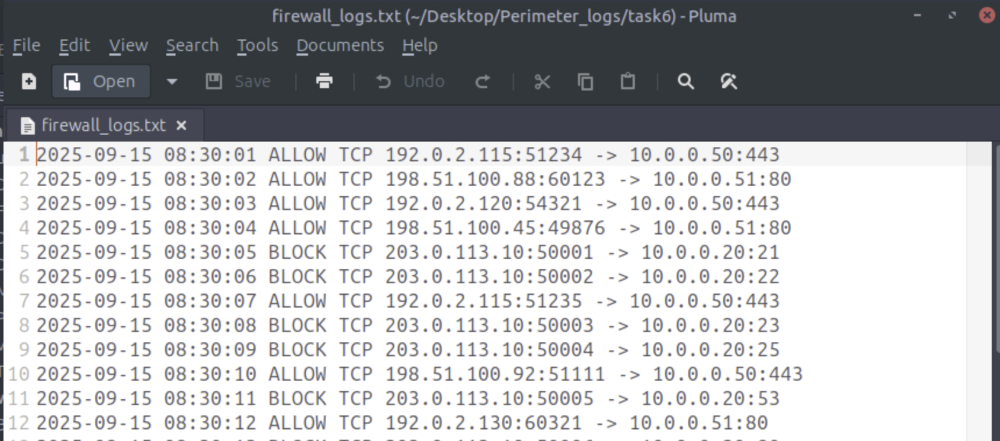

*The IP `203.0.113.10` is scanning multiple ports.*

- **Answer: 203.0.113.10**

---

**2. In the WAF logs, which single source IP is responsible for all the blocked web attacks?**

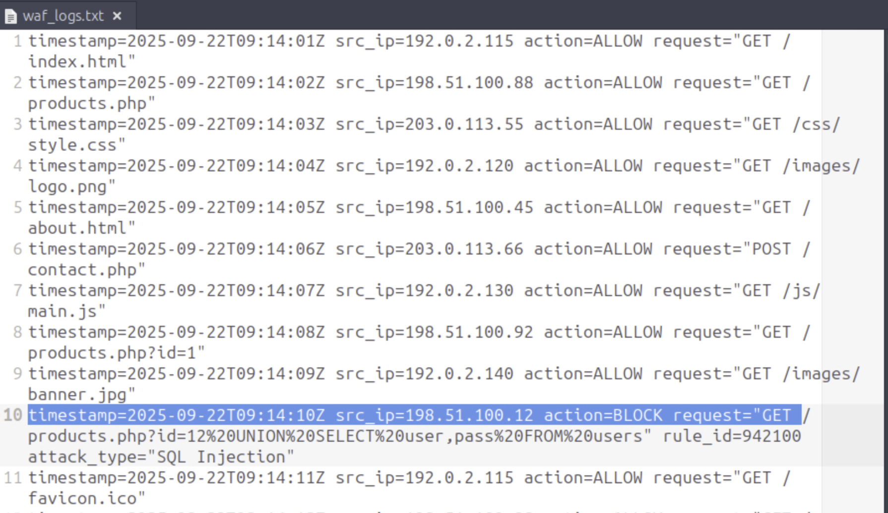

*Searched for BLOCK connections.*

- **Answer: 198.51.100.12**

---

**3. In the VPN logs, how many brute-force attempts failed?**

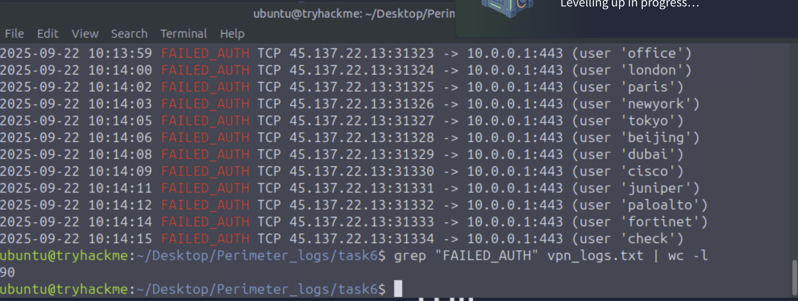

*Used the CLI to filter the logs. The log is long so reading a raw text file is not the appropriate SOC workflow. Navigate to `Desktop/Perimeter_logs/task6` then run:*

```
grep "FAILED_AUTH" vpn_logs.txt | wc -l
```

*Pipe the command to count results by line.*

- **Answer: 90**

---

**4. Which suspicious IP address was found attempting the brute-force attack against the VPN gateway?**

*This is the source IP tied to the `FAILED_AUTH` entries from the question above.*

- **Answer: 45.137.22.13**

---

## Task 7 - Perimeter Logs: Investigating the Breach

### Key Concepts

Incident scenario: Initech Corp, a mid-sized financial services company.
- One month of perimeter logs to review: `firewall.log`, `ids_alerts.log`, `vpn_auth.log`
- Log location: `~/Desktop/Perimeter_logs/challenge/`
- Two analysis methods: manual CLI or Splunk (`index="network_logs"`)

#### Investigation Workflow Summary

| Phase | Log Source | Command / Method | What to Look For |
|---|---|---|---|
| Reconnaissance | firewall.log | grep "BLOCK" then count by source IP | External IP with the most BLOCK hits = scanner |
| Exploitation Confirmation | firewall.log | grep suspicious IP + grep "ALLOW" | ALLOW entries to internal hosts = successful access |
| VPN Brute-Force | vpn_auth.log | grep FAIL, count by source IP | IP with most FAILs followed by SUCCESS = attacker |
| Lateral Movement | firewall.log | grep compromised internal IP + ALLOW | Internal IP scanning SMB/RDP/SSH across other hosts |
| IDS Correlation | ids_alerts.log | grep compromised IP, filter by SMB | ET EXPLOIT MS-SMB Lateral Movement alerts |
| C2 Beaconing | ids_alerts.log | grep C2 | Regular beacons to external IP on port 4444 |
| Data Exfiltration | firewall.log + ids_alerts.log | grep compromised IP, look for outbound HTTP POST | Large POST uploads to external IP on ports 80/8080 |

<!-- Splunk query: index="network_logs" -->
<!-- CLI workflow: grep -> cut -> sort -> uniq -c to count and rank -->

### Task Questions

*Splunk was unavailable via the THM VM so these logs were investigated through the CLI.*

`head example.log` gives us information on the log headers.

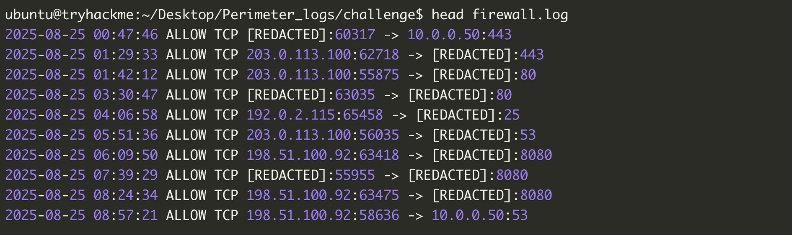

**Reconnaissance** - Search the firewall logs for blocked requests:

```
cat firewall.log | grep "BLOCK" | head
```

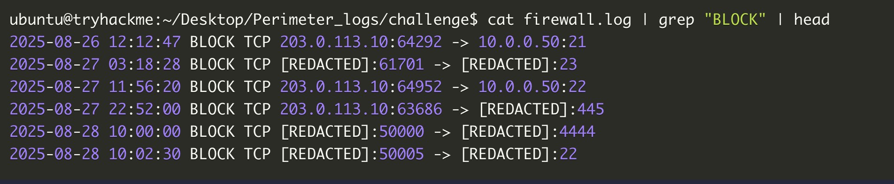

To filter by IP and rank by most BLOCK requests, the `grep -> cut -> sort -> uniq -c` pattern is the standard workflow:

```
cat firewall.log | grep "BLOCK" | cut -d' ' -f5 | cut -d: -f1 | sort -nr | uniq -c
```


**Allowed Requests** - Check whether the firewall has allowed any requests from the suspicious IP:

```
cat firewall.log | grep [REDACTED] | grep "ALLOW"
```

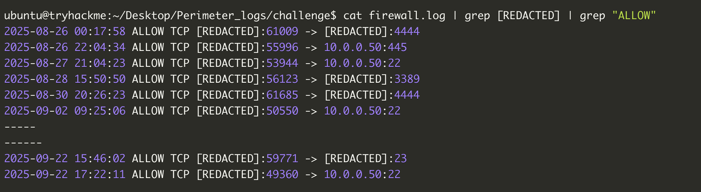

**VPN Brute-Force** - Failed attempts are a red flag:

```
cat vpn_auth.log | grep FAIL | cut -d' ' -f3 | sort -nr | uniq -c
```

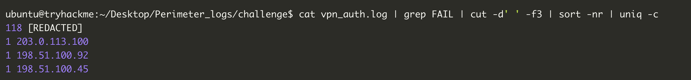

Narrow down by suspicious IP:

```
cat example.log | grep [IP]
```

**Lateral Movement** - Filter to discover lateral movement activity:

```
cat example.log | grep [IP] | grep "ALLOW" | head
```

**C2 Beaconing** - After detecting lateral movement, check for C2 communication:

```
cat example.log | grep C2 | head
```

**Find the IP associated with C2 beaconing:**

```
cat example.log | grep -n [IP] | cut -d' ' -f6,7,8,9,10,19,22,23 | head -n 15
```

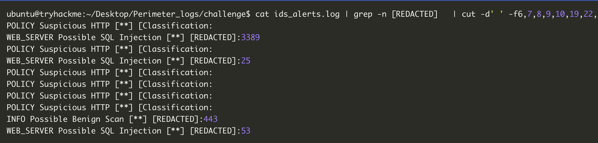

*This shows the infected host performing suspicious outbound activity.*

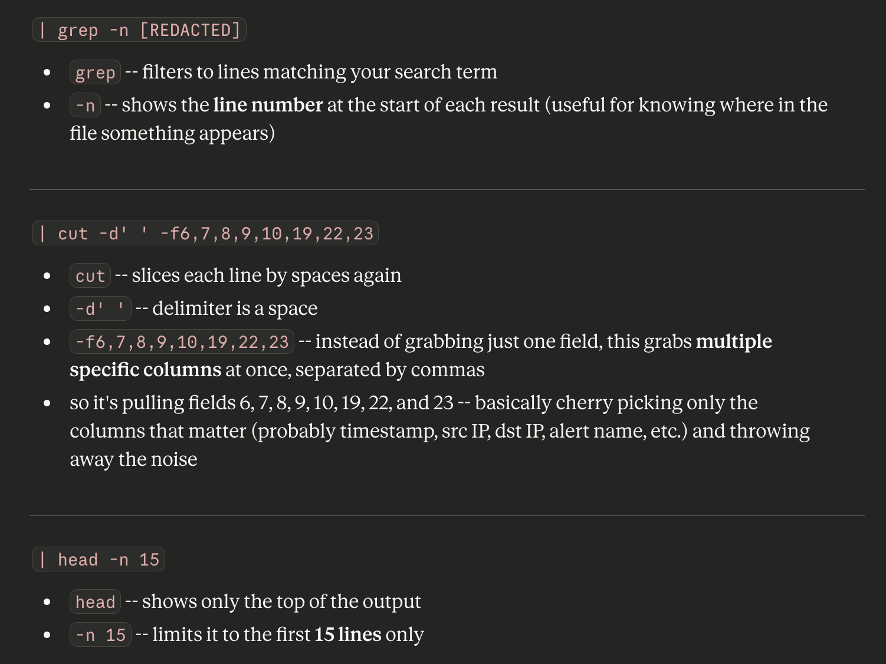

**Confirm full compromise** - The malicious IP is acting as a C2 server receiving data from the victim host:

```
cat example.log | grep -n [IP] | cut -d' ' -f6,7,8,9,10,19,22,23 | uniq -c | sort -nr | head
```

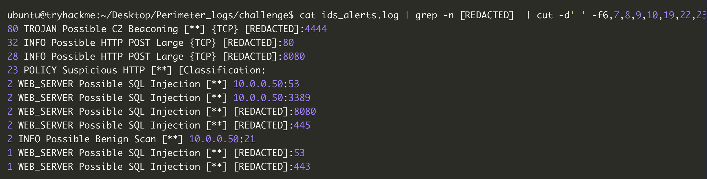

**Data Exfiltration:**

```
cat example.log | grep -n [IP] | cut -d' ' -f5,6,7 | uniq | sort
```

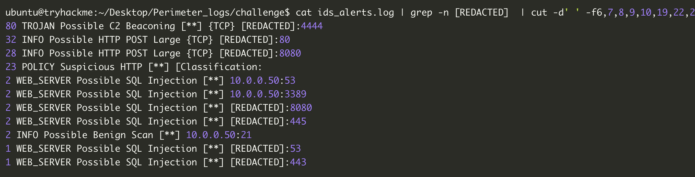

---

**1. Examine the firewall logs. What external IP performed the most reconnaissance?**

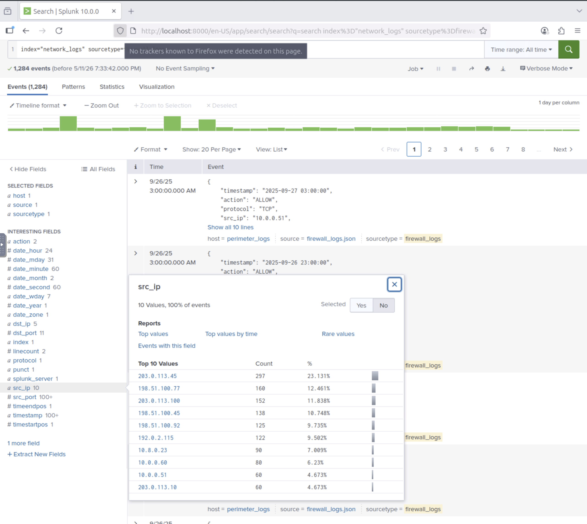

*Filtered by `src_ip` in Splunk to rank by connection volume.*

- **Answer: 203.0.113.45**

---

**2. In the firewall log, which internal host was targeted by scans?**

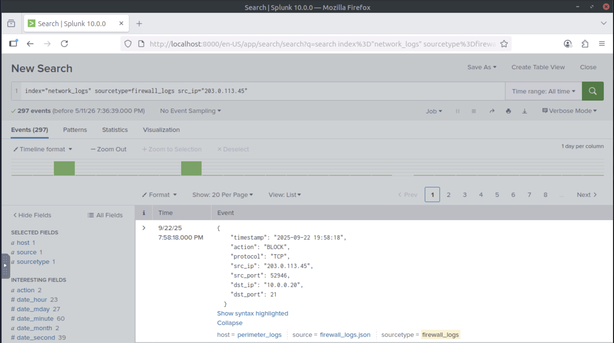

*Selected IP `203.0.113.45` to view its activity and identify the targeted internal host.*

- **Answer: 10.0.0.20**

---

**3. Which username was targeted in the VPN logs?**

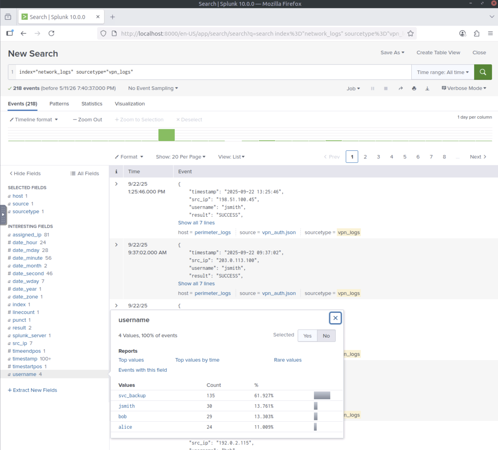

*Filtered by username and identified one with an unusual number of hits.*

- **Answer: svc_backup**

---

**4. What internal IP was assigned after successful VPN login?**

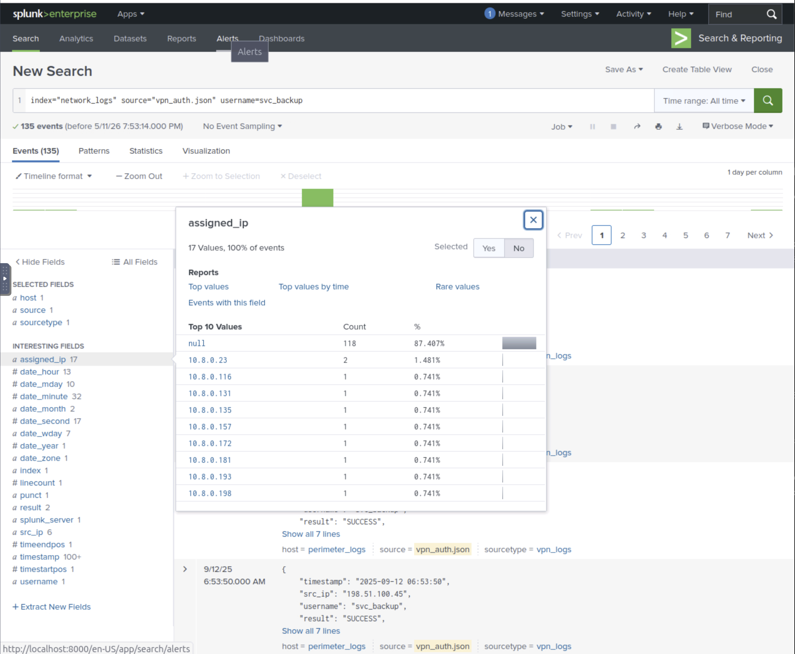

*Filtered by assigned IP; one IP had been assigned twice, standing out as suspicious.*

- **Answer: 10.8.0.23**

---

**5. Which port was used for lateral SMB attempts?**

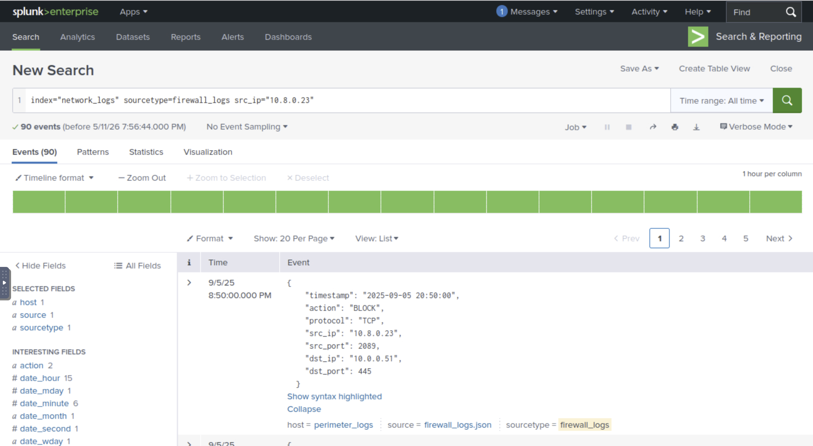

*Filtered the firewall log by the suspicious assigned IP `10.8.0.23` and matched against SMB port 445.*

- **Answer: 445**

---

**6. In the IDS logs, which host beaconed to the C2?**

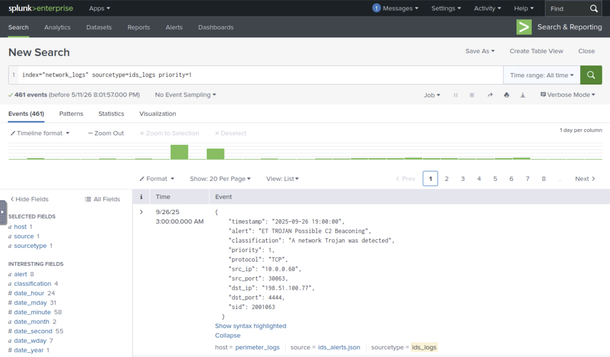

*Filtered by `priority=1`; results surfaced the beaconing host.*

- **Answer: 10.0.0.60**

---

**7. During the investigation, which IP was observed to be associated with C2?**

*The destination IP is visible in the screenshot above showing the full C2 beaconing alert details.*

- **Answer: 198.51.100.77**

---

**8. Which host showed the exfiltration attempts?**

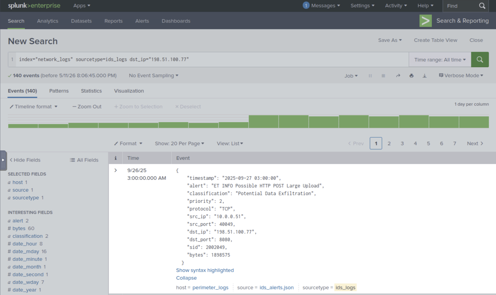

*Filtered by the C2 destination IP to identify the host responsible for outbound exfiltration.*

- **Answer: 10.0.0.51**

---

## Task 8 - Conclusion

### Key Concepts

<!-- Enterprise network = ecosystem: firewalls, AD, app servers, file/DB servers, endpoints, WAPs -->
<!-- Perimeter = boundary between trusted and untrusted networks -->
<!-- Attackers probe perimeter constantly: port scans, brute-force, exploits against exposed services -->
<!-- SOC analyst role: recognize normal vs suspicious traffic, escalate, understand component roles -->

### Task Questions

**1. Complete the room.**

- **Answer: N/A**
