*Write-up by [Miyu7x](https://github.com/Miyu7x) | TryHackMe: [Miyu7](https://tryhackme.com/p/Miyu7)*

---

## Task 1 — Introduction

**Key Concepts:**

**Network Discovery in Detail**
- Why attackers perform network discovery
- What are the different types of network discovery
- How network discovery techniques work, and how to detect them

---

**1. Let's begin!**

- **Answer:** N/A

---

## Task 2 — Network Discovery

**Key Concepts:**

**Attackers and Network Discovery**
- Attackers use publicly available information to map an organization's attack surface
- They look for which assets can be accessed and what services are running on them
  - IP addresses, ports, OS, service versions
  - Any service version with a known vulnerability is a potential entry point
- Attackers are looking for any opening they can find

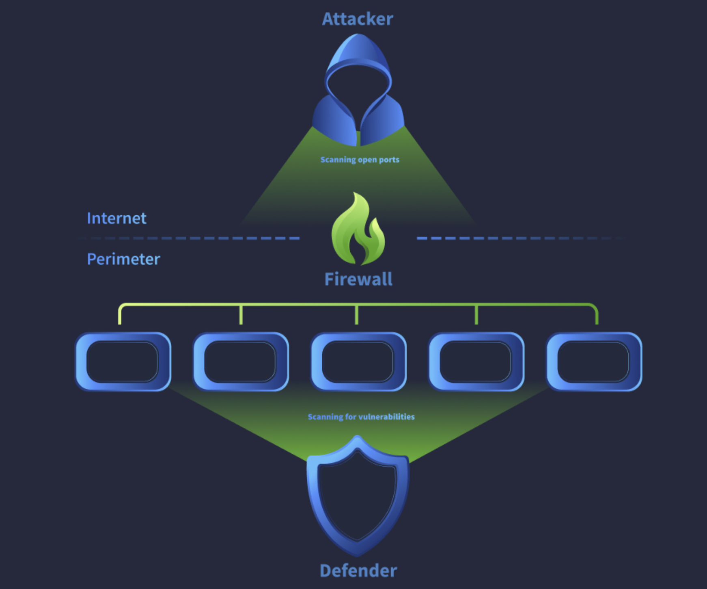

**Defenders and Network Discovery**
- Defenders run network discovery software to inventory assets
- They check for open IPs, ports, or services that have no business reason to be exposed
- They confirm that known vulnerabilities are patched

**Challenges in Detecting Network Discovery**
- Both attackers and defenders perform network discovery, making it hard to distinguish
- SOC teams use several techniques to differentiate good from bad activity:
  - Allowlist known internal and benign external scanners to reduce false positives
  - Integrate threat intelligence to alert on activity from known malicious or suspicious sources

---

**1. What do attackers scan, other than IP addresses, ports, and OS version, in order to identify vulnerabilities in a network?**

*From the notes above, besides IP addresses, ports, and OS version, service versions are also used for recon.*

- **Answer:** Services

---

## Task 3 — External vs Internal Scanning

**Key Concepts:**

When attackers are planning an attack they perform what is called "mapping hosts." There are different investigative methods depending on where the attacker is in the attack lifecycle.

**External Scanning Activity**
- The attacker uses an external IP to scan the organization's public-facing assets on the perimeter
- This is considered the **Reconnaissance** phase of the **MITRE ATT&CK** lifecycle
- SOC response: block the malicious IP at the perimeter firewall, though attackers can rotate IPs

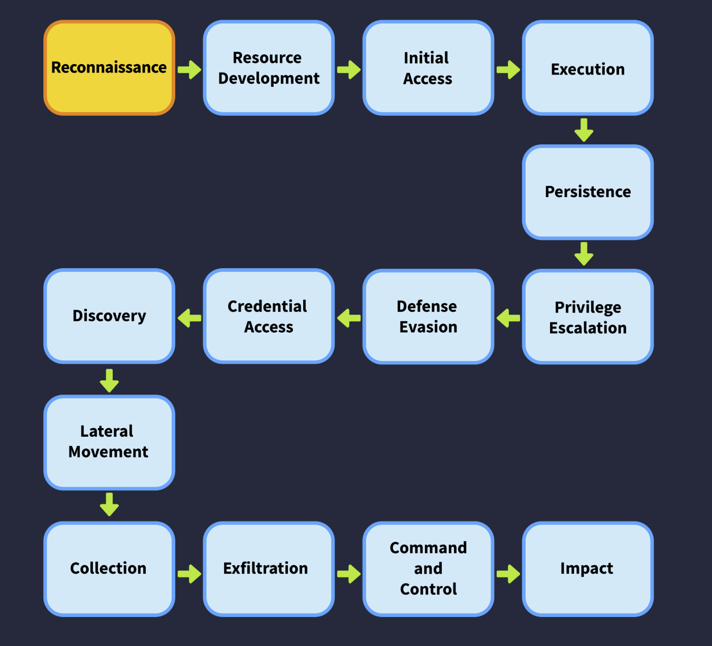

**Internal Scanning Activity**
- Both source and destination IPs are private, meaning the scan is originating from inside the network
- This indicates the attack has progressed to the **Discovery** phase of **MITRE ATT&CK**
- This is high severity since the attacker already has a foothold
- SOC response: escalate and initiate the **Incident Response** process

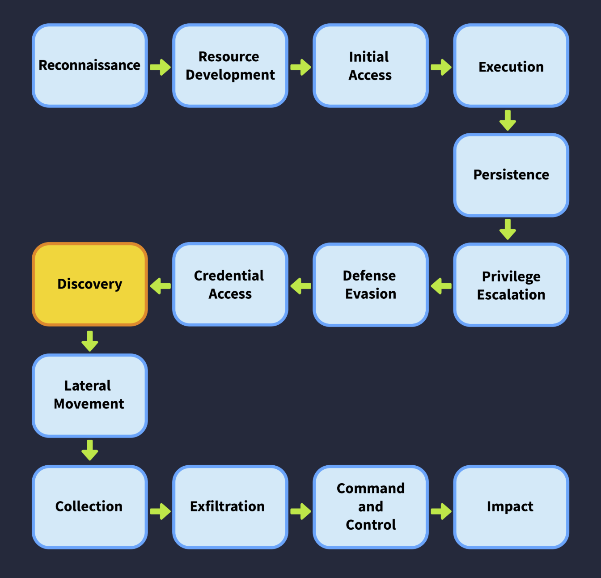

**Reading CSV Logs on the CLI**

Raw logs can be hard to read. To identify columns, first run `head -n2` to preview the header row and one data row:

```bash
head -n2 log-session-1.csv
```

This returns something like:

```
"@timestamp","source.ip","source.port","destination.ip"...
```

Since the timestamp field contains an internal comma, it takes up two columns. That means `source.ip` is column 3, not column 2. Count carefully before running `cut`.

| Scan Type | External Scanning | Internal Scanning |
|---|---|---|
| Source IP | Public/external | Private (RFC 1918) |
| MITRE Phase | Reconnaissance (TA0043) | Discovery (TA0007) |
| Severity | Low | High |
| Response | Block at perimeter firewall | Full IR process, root cause analysis |

---

**1. Which file contains logs that showcase internal scanning activity?**

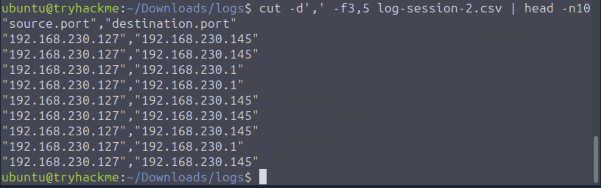

*Both source and destination IPs are private, confirming internal scanning. Filtered using `cut -d',' -f3,5` to isolate source IP and destination IP.*

- **Answer:** log-session-2.csv

---

**2. How many log entries are present for the internal IP performing internal scanning activity?**


- **Answer:** 2276

---

**3. What is the external IP address that is performing external scanning activity?**

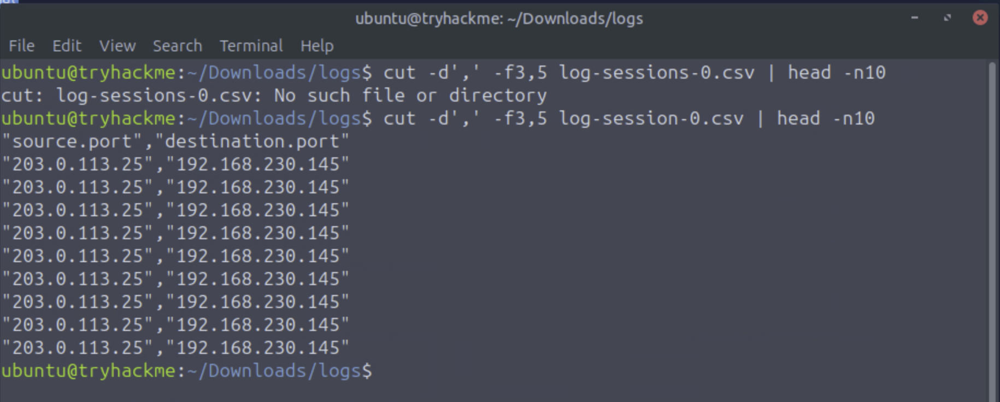

*Same approach as internal scanning. Cut source IP and destination IP and previewed the first 10 lines: `cut -d',' -f3,5 log-session-0.csv | head -n10`*

- **Answer:** 203.0.113.25

---

## Task 4 — Horizontal vs Vertical Scanning

**Key Concepts:**

Once attackers have identified live hosts, they probe for open ports. This is called a **port scan** and comes in two types.

**Horizontal Scanning**
- Same source IP, single destination port, multiple destination IPs
- Goal: find every host on the network exposing a specific port
- Multiple IPs, one port

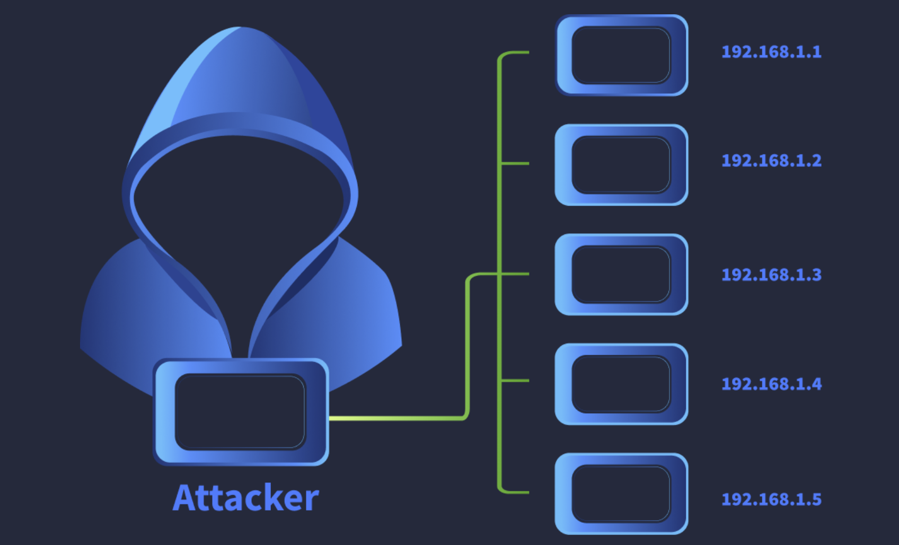

**Vertical Scanning**
- Same source IP, same destination IP, multiple destination ports
- Goal: fully footprint one specific target
- One IP, multiple ports (e.g. 22, 80, 443, 445, 3389)

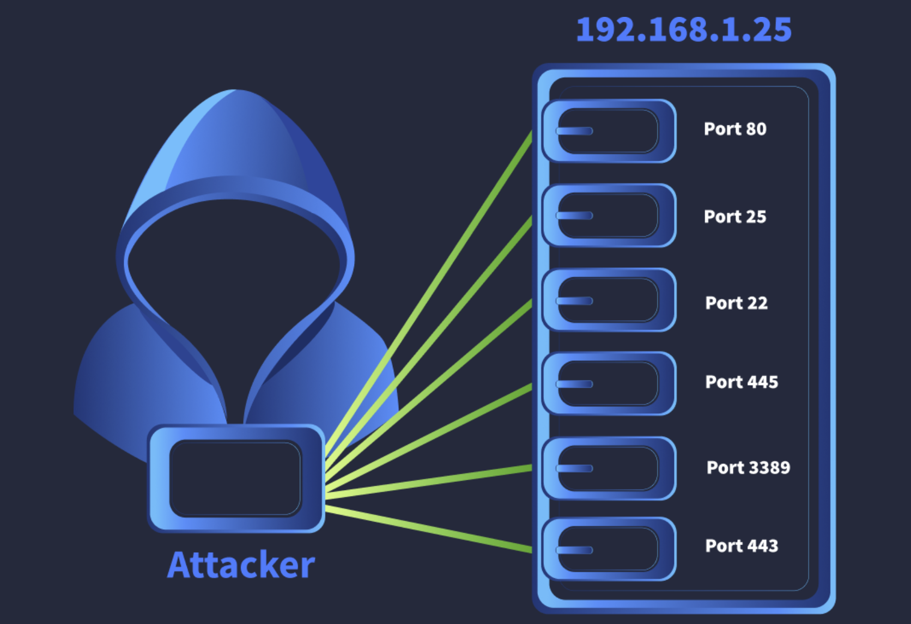

| Scan Type | Destination IP | Destination Port | Purpose |
|---|---|---|---|
| Horizontal | Multiple | Single | Find all hosts with a specific port open |
| Vertical | Single | Multiple | Footprint one host's services |
| Mixed | Multiple | Multiple | Both advantages combined |

---

**1. One of the log files contains evidence of a horizontal scan. Which IP range was scanned? Format X.X.X.X/X**

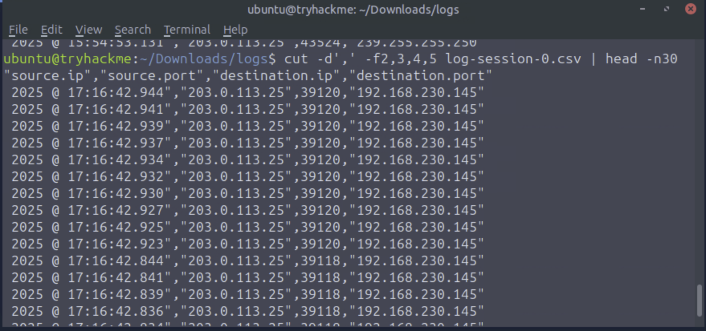

- **Answer:** 203.0.113.0/24

---

**2. In the same log file, there is one IP address on which a vertical scan is performed. Which IP address is this?**

*Visible in the same output as Q1.*

- **Answer:** 192.168.230.145

---

**3. On one of the IP addresses, only a few ports are scanned which host common services. Which are the ports that are scanned on this IP address? Format: port1, port2, port3 in ascending order.**

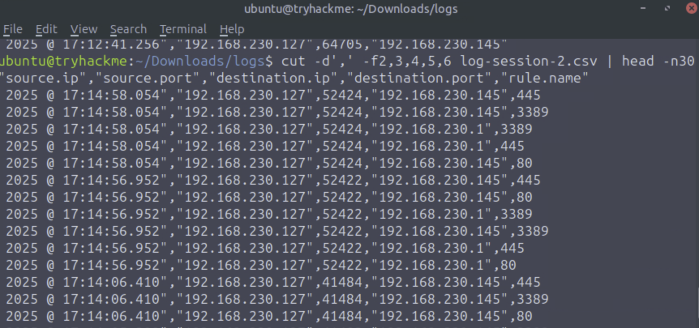

*Expanded the column view with `-f2,3,4,5,6` to get a clearer picture. The same three ports appear repeatedly across the log.*

```bash
cut -d',' -f3,4,5,6 log-session-2.csv | head -n30
```

- **Answer:** 80, 445, 3389

---

## Task 5 — The Mechanics of Scanning

**Key Concepts:**

| Technique | Protocol | How It Works | Detection Signal |
|---|---|---|---|
| Ping Sweep | ICMP | Sends ICMP echo to identify live hosts; host replies if online | High-volume ICMP requests to sequential IPs |
| TCP SYN Scan | TCP | SYN sent; SYN-ACK means port is open; handshake never completes | Mass SYN packets, conn_state S0, no completed handshakes |
| UDP Scan | UDP | Empty UDP packet sent; ICMP port unreachable means closed but host is online | Slow, many timeouts, unreliable signal |

| conn_state | Meaning |
|---|---|
| S0 | SYN sent, no reply |
| S1 | SYN + SYN-ACK, no data |
| REJ | SYN sent, RST received (port closed) |
| SF | Normal full connection established and closed |

---

**1. Which source IP performs a ping sweep attack across a whole subnet?**

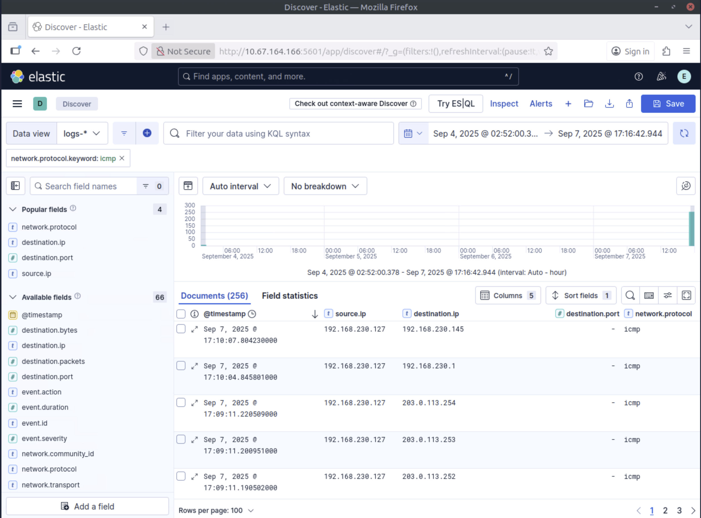

*Filtered by ICMP protocol in Kibana, which is the protocol used for ping sweeps.*

- **Answer:** 192.168.230.127

---

**2. The zeek.conn.conn_state value shows the connection state. Using the information provided by this value, identify the type of scan being performed by 203.0.113.25 against 192.168.230.145**


- **Answer:** TCP SYN Scan

---

**3. Is there any UDP scanning attempt in the logs? Y/N**

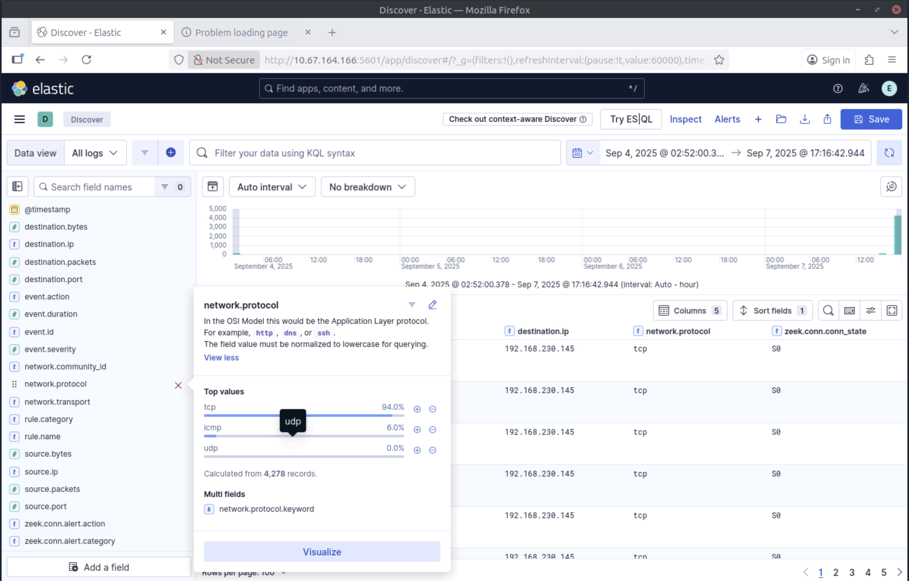

- **Answer:** N

---

## Task 6 — Conclusion

**Key Concepts:**

---

**1. Heading on to the next room!**

- **Answer:** N/A
