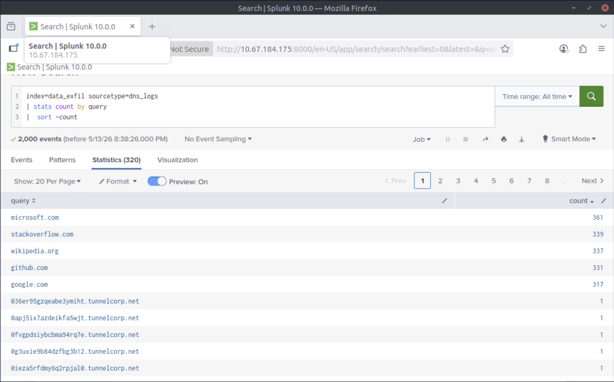
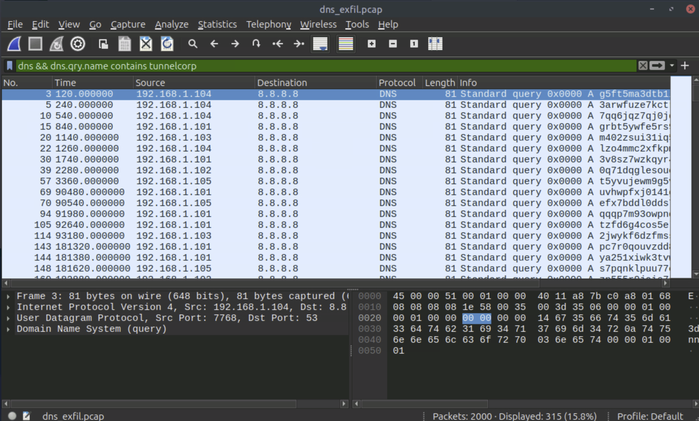
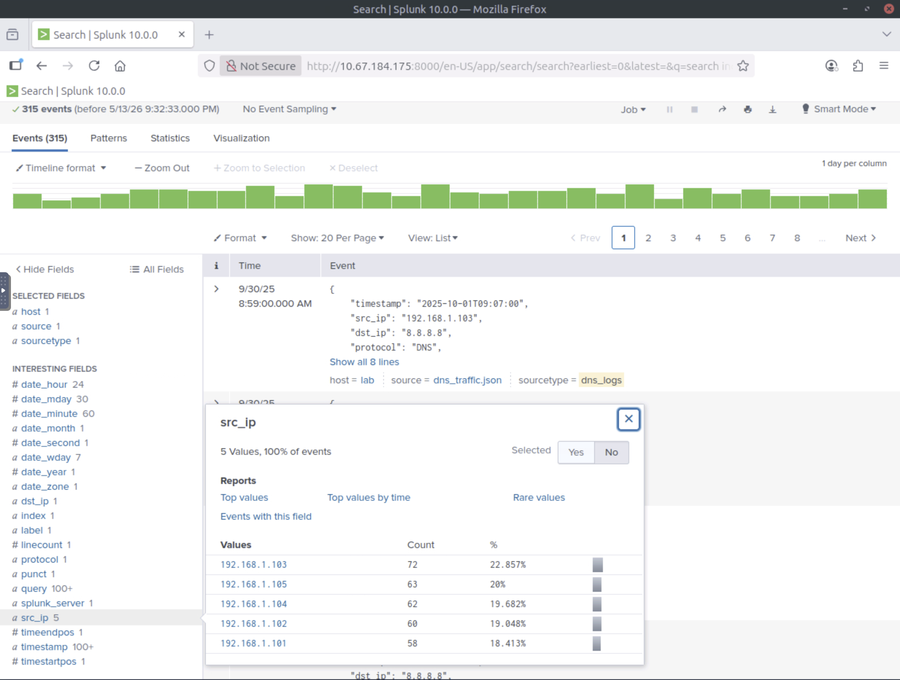
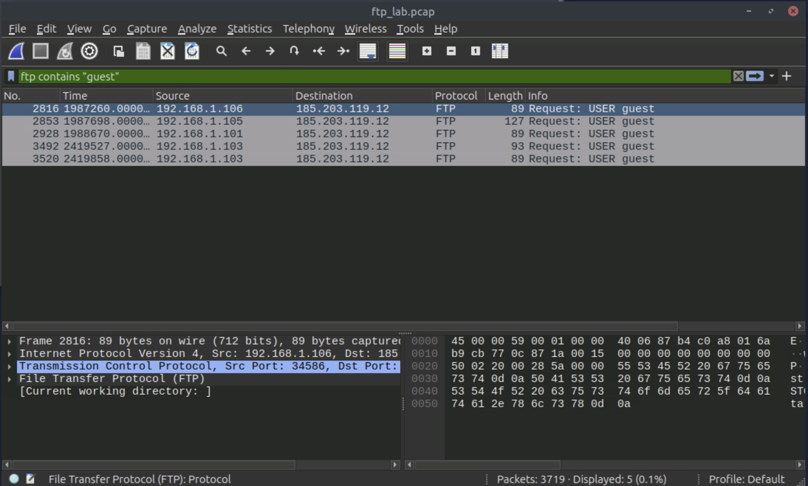
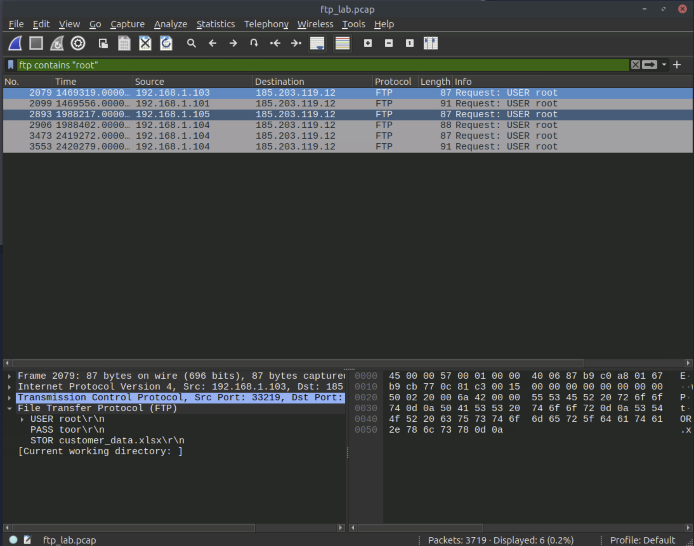
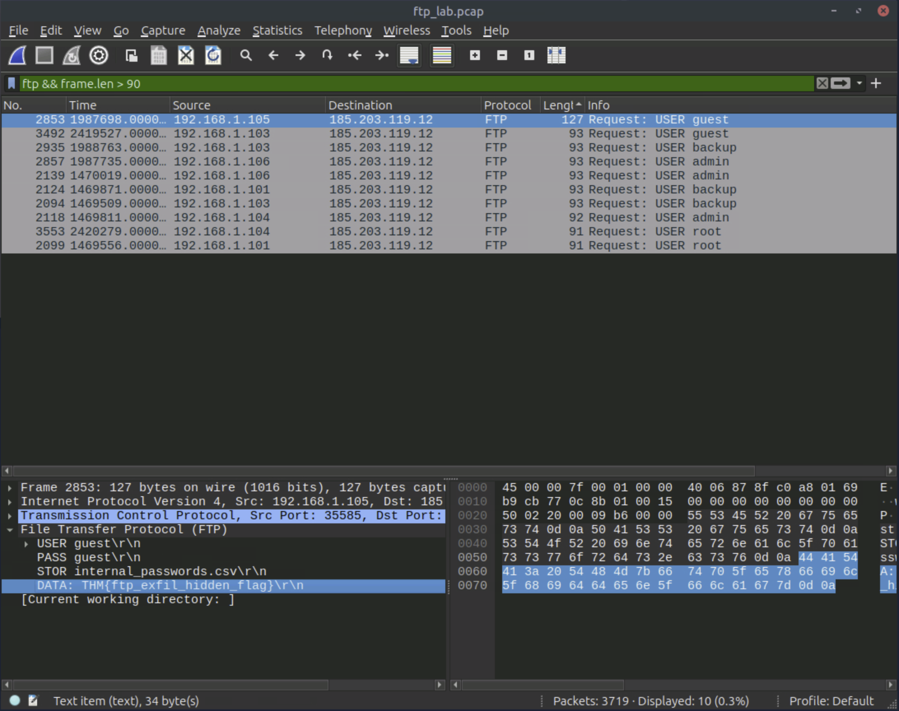
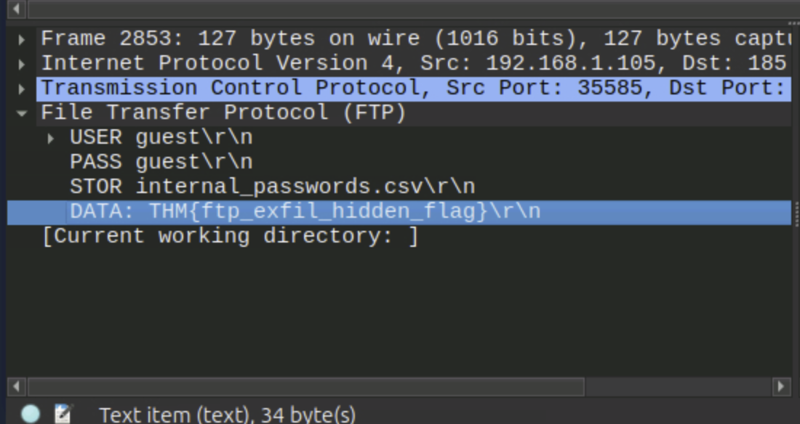
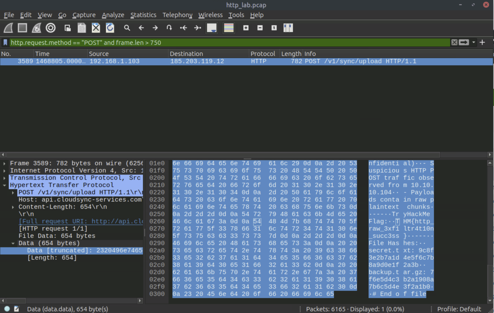
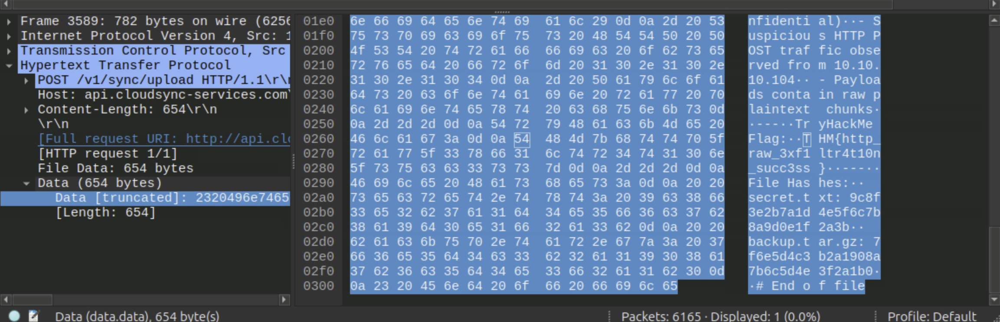
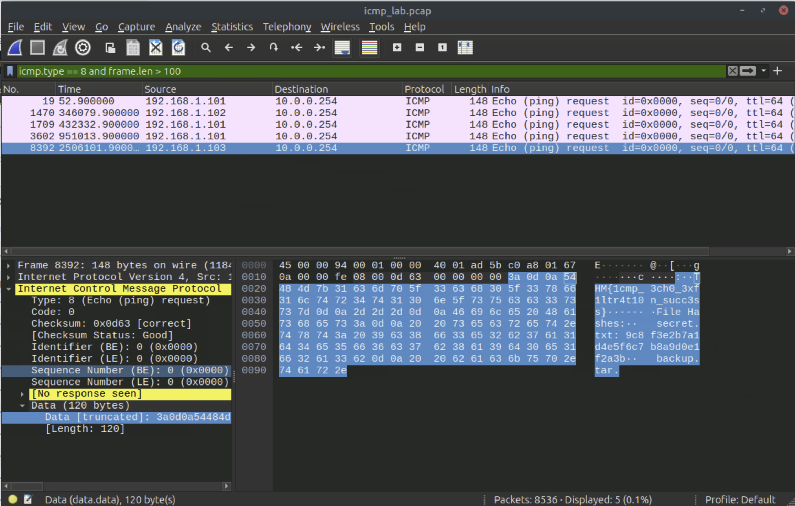

*Write-up by [Miyu7x](https://github.com/Miyu7x) | TryHackMe: [Miyu7](https://tryhackme.com/p/Miyu7)*

---

## Task 1 - Introduction

### Key Concepts

<!-- Q: What is data exfiltration and why is it a primary objective for attackers who have already breached a network? -->
Data exfiltration is the act of stealing sensitive data from a network. Reasons vary: financial gain, political motivation, service disruption, and reconnaissance.

<!-- Q: What are the four things this room will teach you to do as a SOC analyst? -->
SOC analysts are responsible for detecting and stopping attackers before they make off with valuable data. This room covers:
- Understanding common methods of data exfiltration
- Detecting exfiltration attempts through network traffic analysis
- Spotting signs of exfiltration on endpoint devices
- Performing SIEM investigations to uncover hidden exfiltration channels

**1. Continue to the next task.**

**Answer: N/A**

---

## Task 2 - Lab Connection

### Key Concepts

<!-- Q: Where are all the lab files located on the Desktop, and how do you access the Splunk instance? -->
All lab files are in the `data_exfil` folder on the Desktop. The Splunk instance is accessible at `MACHINE_IP:8000`. Base index for all queries is `index=data_exfil`. Always set Time Range to All Time.

<!-- Q: What are the three ways to approach the investigation in this room? -->
Three investigation approaches available in the lab:
- Analyze pcap files directly in Wireshark from the `data_exfil` directory
- Review raw log files in the same folder
- Query pre-ingested logs in the Splunk instance

**1. Connect with the lab.**

**Answer: N/A**

---

## Task 3 - Data Exfil: Overview, Techniques, and Indicators

### Key Concepts

<!-- Q: What are the five reasons adversaries perform data exfiltration? -->
Threat actors exfiltrate data for five main reasons: financial gain, espionage, ransomware and extortion, disruption and sabotage, and persistence and reconnaissance.

<!-- Q: What are the four phases an attacker moves through before data leaves the network? -->
Before data leaves the network, attackers move through four phases:
1. Discovery: locate sensitive files
2. Staging and compression: aggregate, compress, and encode files
3. Exfiltration transport: transfer data out via network, removable media, cloud, or covert channels
4. C2 coordination: orchestrate the transfer and confirm receipt

<!-- Q: Which threat actor used cloud APIs to exfiltrate from managed service providers, and what is that campaign called? -->
APT10, also known as the Cloud Hopper campaign, used cloud APIs to exfiltrate data from managed service providers.

<!-- Q: What log sources would you check for host-based exfiltration indicators, and which Sysmon event IDs are relevant? -->
Host-based exfiltration indicators are found in Sysmon and EDR logs, specifically EventID 1 (Process Create), EventID 3 (Network Connect), and EventID 11 (File Create). Windows Security logs 4663 and 4656 cover object access. Network-based exfiltration is tracked in proxy, firewall, and DNS logs.

<!-- Q: Why is single-point detection not enough, and what does cross-source correlation actually mean in practice? -->
Single-point detection fails because attackers operate across multiple layers of the environment. Cross-source correlation means stacking evidence from host logs, network logs, DNS, and cloud telemetry together until the full picture of who accessed what, how it was staged, and where it was sent becomes clear.

### Threat Actor Reference

| Threat Actor / Campaign | Exfiltration Technique | Description |
|---|---|---|
| APT29 (Cozy Bear) | HTTPS over legitimate domains | Encrypted HTTPS channels used to exfiltrate from government networks |
| FIN7 | HTTP POST to C2 servers | Embedded stolen data in HTTP POST requests to evade detection |
| Lunar Spider (Zloader) | Encrypted C2 channels | Two-month intrusion using encrypted channels and staged exfiltration |
| DarkSide Ransomware | Dual extortion: encryption + exfil | Stole data before encrypting, then threatened public leaks |
| APT10 (Cloud Hopper) | Cloud-to-cloud transfer | Exfiltrated from managed service providers using cloud APIs |

### Techniques and Indicators Reference

| Technique | Examples | Where to Look |
|---|---|---|
| Network-based | HTTP/HTTPS uploads to S3/Azure Blob/webmail, FTP/SFTP/SCP, DNS tunneling, ICMP/covert protocols, custom TCP/UDP | Proxy/web gateway logs (large POSTs), firewall/NGFW flows (high bytes to single IP/ASN), netflow, DNS logs (long hostnames, TXT queries) |
| Host-based | PowerShell/Invoke-WebRequest, rclone, awscli, curl/wget, archive creation (zip/rar/7z), removable USB, ADS/hidden streams | Sysmon/EDR (EventID 1/3/11), Windows Security (4663/4656), auditd/shell history on Linux, removable-media events |
| Cloud exfiltration | S3 PutObject/multipart upload, Azure Blob uploads, GCS objects, Drive/SharePoint external sharing | CloudTrail / Azure Activity / GCP Audit, cloud storage access logs, unusual service-account or IP activity |
| Covert and encoding | DNS tunneling, base64/chunked encoding, steganography into images/audio, low-and-slow file splitting | DNS logs, proxy logs with many small POSTs, correlation of intermittent uploads + suspicious process activity |
| Insider and collaboration tools | Slack/Teams/Dropbox/Google Drive/Box uploads or external sharing, compromised employee accounts | Audit logs (share events, file downloads), mail logs |

**1. Exfiltrating the data through HTTP comes under which technique?**

**Answer: Network-based**

---

## Task 4 - Detection: Data Exfil through DNS Tunneling

### Key Concepts

<!-- Q: Why is DNS an attractive protocol for data exfiltration, and what ports does it use for different traffic types? -->
DNS is attractive for exfiltration because it is an always-on service that firewalls and proxies almost never block. Attackers smuggle data by encoding it inside DNS query subdomains. DNS uses UDP port 53 for standard queries and TCP port 53 for zone transfers or large responses.

<!-- Q: What six indicators in DNS traffic should make you suspicious of tunneling activity? -->
Six indicators of DNS tunneling activity:
- High number of queries sent to a single external domain
- Long subdomain labels or unusually long full query names (> 60-100 characters)
- Base32 or Base64-like patterns in the query name
- Rare record types such as TXT or NULL; large TXT responses
- Frequent NXDOMAIN responses or TCP/large UDP DNS fragments
- Queries at regular intervals (beaconing behavior)

<!-- Q: What two confirmed indicators did this lab use to identify the DNS tunneling attempt? -->
The two confirmed indicators from the lab were a large number of DNS requests with no response and abnormally large query lengths encoding data in the subdomain.

<!-- Q: Walk through the Wireshark filter progression used in this task. What does each filter narrow down? -->
Wireshark filter progression:
- `dns` isolates all DNS traffic
- `dns.flags.response == 0` surfaces queries with no response, a tunneling signal
- `dns && frame.len > 70` narrows to unusually long queries
- `dns && dns.qry.name contains "tunnelcorp"` confirms all traffic going to the suspicious domain

<!-- Q: Which Splunk query actually surfaces the suspicious queries, and why does query length matter? -->
The query `where len(query) > 30` surfaces the suspicious tunneling traffic in Splunk. Query length matters because legitimate DNS lookups use short, readable hostnames. Tunneled data encoded in base64 produces long, high-entropy subdomain strings that stand out clearly once length is filtered.

### DNS Tunneling IoAs

| Indicator | What to Look For |
|---|---|
| Query volume | Many DNS queries to a single external domain, far above baseline |
| Query length | Long subdomain labels or full query names > 60-100 characters |
| Encoding patterns | High-entropy or base64/base32-like patterns (mixed case, digits, `-`, `=`) |
| Record types | Rare types such as TXT or NULL; many large TXT responses |
| Response behavior | Frequent NXDOMAIN; TCP or large UDP fragments for DNS |
| Timing | Evenly spaced queries (beaconing behavior) |

### Wireshark Commands

```
# Isolate all DNS traffic
dns

# Show DNS queries with no response
dns.flags.response == 0

# Find long queries (suspicious subdomain lengths)
dns && frame.len > 70

# Filter on the identified suspicious domain
dns && dns.qry.name contains "<SUSPICIOUS_DOMAIN>"
```

### Splunk Commands

```
# Baseline: all DNS logs
index=data_exfil sourcetype=DNS_logs

# Query count per source IP
index="data_exfil" sourcetype="DNS_logs" | stats count by src_ip

# Query frequency sorted by count
index="data_exfil" sourcetype="dns_logs" | stats count by query | sort -count

# Filter on long query names (> 30 chars) - surfaces tunneling traffic
index="data_exfil" sourcetype="DNS_logs" | where len(query) > 30
```

> Note: The `where len(query) > 30` filter targets suspicious traffic specifically. Total DNS query count and suspicious query count are not the same thing. Always filter to the specific indicator before drawing conclusions about which host is the top offender.

**1. What is the suspicious domain receiving the DNS traffic?**



*Used Splunk with `stats count by query | sort -count` to identify the domain receiving the highest volume of long, encoded queries.*

**Answer: tunnelcorp.net**

---

**2. How many suspicious traffic/logs related to DNS tunneling were observed?**



*Applied `dns && dns.qry.name contains tunnelcorp` in Wireshark on the dns_exfil.pcap to count all traffic going to the suspicious domain.*

**Answer: 315**

---

**3. Which local IP sent the maximum number of suspicious requests?**



*Used `where len(query) > 30` in Splunk to isolate only the tunneling traffic, then counted by src_ip. Note: 192.168.1.104 has higher total DNS traffic but 192.168.1.103 sends more of the specifically suspicious long queries.*

**Answer: 192.168.1.103**

---

## Task 5 - Detection: Data Exfil through FTP

### Key Concepts

<!-- Q: Why is FTP particularly dangerous from a credentials standpoint, and what makes it useful to attackers? -->
FTP is dangerous because it transmits credentials in plaintext. USER and PASS commands are fully visible in any packet capture with no decryption required. Attackers exploit this via compromised credentials, misconfigured servers, and ephemeral guest accounts. Non-standard ports and tunneling help it blend with other traffic.

<!-- Q: What do the FTP commands STOR and RETR each tell you about what the attacker was doing? -->
STOR means the client is uploading a file to the server, which in an exfiltration scenario means data is being sent out to an attacker-controlled destination. RETR means the client is downloading a file from the server, which can indicate staged data being retrieved after initial compromise.

<!-- Q: What filter progression did this task use in Wireshark, and what did each step reveal? -->
Wireshark FTP filter progression:
- `ftp || ftp-data` isolates all FTP control and data traffic
- `ftp.request.command == "USER" || ftp.request.command == "PASS"` reveals cleartext credentials and account names
- `ftp contains "STOR"` surfaces upload commands and file names being transferred
- `ftp contains "csv"` narrows to sensitive file type transfers specifically
- `ftp && frame.len > 90` identifies the largest payloads; Follow TCP Stream reveals file content

<!-- Q: What made the guest account activity suspicious in this lab specifically? -->
The guest account made five connections and was transferring files to an external IP. Guest accounts should have no legitimate reason to be initiating outbound file transfers, especially to unknown external destinations.

### FTP IoAs

| Indicator | What to Look For |
|---|---|
| Credentials | USER and PASS commands in cleartext; weak or guest accounts |
| Upload commands | STOR repeated or with large transfers; RETR for staged data retrieval |
| Data connections | Large payloads on ephemeral PASV ports to unusual external IPs |
| Timing | Transfers outside business hours |
| File types | Sensitive extensions in STOR commands: pdf, csv, txt |

### Wireshark Commands

```
# Isolate all FTP control and data traffic
ftp || ftp-data

# Show only login attempts
ftp.request.command == "USER" || ftp.request.command == "PASS"

# Look for upload commands
ftp contains "STOR"

# Filter on CSV file transfers specifically
ftp contains "csv"

# Identify large payload transfers
ftp && frame.len > 90

# Right-click any packet > Follow > TCP Stream to inspect content in cleartext
```

**1. How many connections were observed from the guest account?**



*Filtered using `ftp contains "guest"` to isolate all sessions initiated by the guest account.*

**Answer: 5**

---

**2. Apply the filter; what is the name of the customer-related file exfiltrated from the root account?**



*Filtered by root account activity and inspected the STOR commands in the TCP stream. Filtering by file type was not viable without knowing the extension in advance, so filtering by account was the more reliable approach.*

**Answer: customer_data.xlsx**

---

**3. Which internal IP was found to be sending the largest payload to an external IP?**



*Applied `ftp && frame.len > 90` and sorted results by frame length highest to lowest.*

**Answer: 192.168.1.105**

---

**4. What is the flag hidden inside the FTP stream transferring the CSV file to the suspicious IP?**



*Followed the TCP stream on the CSV transfer packet to inspect the file content in cleartext.*

**Answer: THM{ftp_exfil_hidden_flag}**

---

## Task 6 - Detection: Data Exfil via HTTP

### Key Concepts

<!-- Q: Why does HTTP exfiltration blend in so well with normal traffic, and what makes it hard to detect? -->
HTTP exfiltration is hard to detect because it looks identical to normal web traffic at a glance. It passes through firewalls and proxies freely and can be further obscured through encoding, encryption, and tunneling. Detection requires filtering on size, destination, and behavioral patterns rather than the protocol itself.

<!-- Q: What are the seven techniques adversaries use to abuse HTTP for exfiltration? -->
Seven HTTP exfiltration techniques:
- POST uploads to external or attacker-controlled servers
- GET requests with data encoded into query strings or path segments (low-and-slow)
- Disguising uploads as traffic to legitimate common services or CDNs
- Custom headers such as `X-Data: <base64>` to bypass string-based DLP
- Chunked or multipart transfers splitting large payloads across multiple requests
- HTTPS and TLS tunneling to hide payload content in encrypted channels
- Staging via cloud services such as Dropbox, GitHub, or Gist for external retrieval

<!-- Q: Why did the task increase the frame.len threshold from 500 to 750 in Wireshark, and what did that achieve? -->
Increasing the threshold from 500 to 750 cut out remaining noise and isolated a single entry matching the suspicious POST identified in Splunk. This confirmed the exfiltration event without ambiguity.

<!-- Q: How did the Splunk investigation and the Wireshark pcap analysis complement each other in this lab? -->
Splunk identified the suspicious domain and the outlier POST request based on bytes_sent statistics. Wireshark then confirmed the same event at the packet level and allowed inspection of the actual exfiltrated content via the HTTP stream. Neither source alone was sufficient for a conclusive finding.

<!-- Q: What is a low-and-slow exfiltration approach and why is it harder to catch than a single large transfer? -->
Low-and-slow exfiltration splits data into many small requests sent over an extended period. Because no single request looks large or unusual, it avoids triggering size-based thresholds and volume alerts. Catching it requires baselining normal behavior and looking for patterns of frequency and destination rather than individual request size.

### HTTP Exfil Techniques

| Technique | Description |
|---|---|
| POST uploads | Bulk data sent to attacker-controlled hosts or cloud storage in POST request bodies |
| GET with encoded data | Small chunks in query strings or path segments (low-and-slow) |
| Common services / CDN | Exfiltration disguised as uploads to popular or attacker-controlled subdomains |
| Custom headers | Data placed in headers (e.g., `X-Data: <base64>`) to bypass string-based DLP |
| Chunked / multipart | Large payloads split across multiple requests to avoid size thresholds |
| HTTPS/TLS tunneling | Encrypted channel hides payload; requires TLS inspection, SNI analysis, or metadata detection |
| Staging via cloud | Attacker uploads to Dropbox/GitHub/Gist and fetches externally |

### HTTP IoAs

| Indicator | What to Look For |
|---|---|
| Request size | Unusually large HTTP POST bodies to external or unexpected hosts |
| Destination reputation | Requests to low-reputation or rarely-seen-in-baseline domains |
| Beaconing + upload pattern | Frequent small requests to same host followed by large uploads |
| Transfer encoding | Chunked or multipart transfers composing a larger file across requests |

### Splunk Commands

```
# Baseline: all HTTP logs
index="data_exfil" sourcetype="http_logs"

# Filter on POST requests only
index="data_exfil" sourcetype="http_logs" method=POST

# Average, max, and min bytes sent per domain, sorted by count
index="data_exfil" sourcetype="http_logs" method=POST | stats count avg(bytes_sent) max(bytes_sent) min(bytes_sent) by domain | sort - count

# Isolate large POST payloads (filter out benign traffic)
index="data_exfil" sourcetype="http_logs" method=POST bytes_sent > 600 | table _time src_ip uri domain dst_ip bytes_sent | sort - bytes_sent
```

### Wireshark Commands

```
# Isolate all HTTP traffic
http

# Filter on POST requests only
http.request.method == "POST"

# Large POST frames (initial threshold)
http.request.method == "POST" and frame.len > 500

# Tighten threshold to isolate the exfil entry
http.request.method == "POST" and frame.len > 750

# Right-click result > Follow > HTTP Stream to inspect exfiltrated content
```

**1. Which internal compromised host was used to exfiltrate this sensitive data?**



*Filtered by `http.request.method == "POST" and frame.len > 750` to isolate the single large exfiltration event. The source IP in the packet details identifies the compromised host.*

**Answer: 192.168.1.103**

---

**2. What's the flag hidden inside the exfiltrated data?**



*Flag was visible in the raw packet bytes when inspecting the HTTP stream of the large POST request.*

**Answer: THM{http_raw_3xf1ltr4t10n_succ3ss}**

---

## Task 7 - Detection: Data Exfiltration via ICMP

### Key Concepts

<!-- Q: Why do attackers use ICMP for exfiltration, and what property of the protocol makes it attractive? -->
ICMP is attractive for exfiltration because it is almost universally allowed through firewalls and receives far less inspection than TCP or UDP traffic. Attackers encode data into ICMP echo request payloads and send them to a remote listener that reassembles the chunks.

<!-- Q: What is the normal frame size of a ping, and at what frame.len does ICMP traffic become suspicious? -->
A normal ping has a total frame length of approximately 74 bytes. Any ICMP echo request with a frame.len over 100 bytes is suspicious and warrants payload inspection.

<!-- Q: What are the four techniques attackers use to abuse ICMP specifically? -->
Four ICMP abuse techniques:
- Echo request and reply tunneling: data encoded in base64 or hex placed inside type 8 ICMP payloads
- Custom ICMP types and codes: using uncommon values to evade signature-based detection
- Fragmentation and reassembly: large payloads split across multiple packets
- Encryption and obfuscation: encoded or encrypted payloads appear as random data in the payload bytes

<!-- Q: Why is ICMP exfiltration detection simpler than DNS or HTTP tunneling detection? -->
ICMP detection is simpler because the primary signal is a single observable anomaly: payload size. Legitimate pings are tiny and uniform. A payload over 100 bytes stands out immediately without requiring complex query analysis or statistical baselining.

### ICMP Tunneling Techniques

| Technique | Description |
|---|---|
| Echo request/reply tunneling | Data encoded (base64/hex) into ICMP type 8 payloads; remote server collects and decodes |
| Custom ICMP types/codes | Uncommon ICMP types or non-zero codes to evade signature-based detection |
| Fragmentation and reassembly | Large payloads split across multiple packets |
| Encryption/obfuscation | Encrypted or base64-encoded payloads appear as random data in payload bytes |

### ICMP IoAs

| Indicator | What to Look For |
|---|---|
| Session persistence | Ongoing ICMP to external host not used for legitimate monitoring |
| Payload size | ICMP payloads > 64 bytes; total frame.len > 100 (normal ping ~74 bytes) |
| Payload content | High-entropy data or base64/hex patterns in the Data field |
| Traffic isolation | Bursts of ICMP immediately followed by no other legitimate app traffic from same host |
| Timing | Evenly spaced ICMP packets with similar payload sizes (beaconing) |

### Wireshark Commands

```
# Isolate all ICMP traffic
icmp

# Filter on echo requests only (type 8)
icmp.type == 8

# Flag unusually large payloads (normal ping ~74 bytes; > 100 is suspicious)
icmp.type == 8 and frame.len > 100

# Inspect payload: select packet > expand ICMP layer in packet details > check Data field
```

**1. What is the flag found in the exfiltrated data through ICMP?**



*Applied `icmp.type == 8 and frame.len > 100` to isolate oversized echo requests. Flag was visible directly in the packet bytes of the payload.*

**Answer: THM{1cmp_3ch0_3xf1ltr4t10n_succ3ss}**

---

## Task 8 - Conclusion

### Key Concepts

<!-- Q: What four areas did this room cover from a defender's perspective? -->
This room covered four areas from a defender's perspective: data exfiltration fundamentals, how exfiltration fits into the Cyber Kill Chain as Actions on Objectives, the common techniques attackers use across FTP, HTTP, DNS, and ICMP, and how to detect those techniques using network traffic analysis and SIEM correlation.

<!-- Q: What does "Actions on Objectives" mean in the context of the Cyber Kill Chain, and where does exfiltration fit? -->
Actions on Objectives is the final stage of the Cyber Kill Chain. It represents the attacker completing their mission after all prior stages (recon, weaponization, delivery, exploitation, installation, C2) are done. Data exfiltration is a primary action at this stage, meaning detection here means the breach has already happened and speed of response is everything.

<!-- Q: What channels and log sources did this room NOT cover that future rooms will expand on? -->
This room focused on network-centric detection across FTP, HTTP, DNS, and ICMP. It did not cover exfiltration via cloud storage APIs, insider threat via collaboration tools, host-based detection using Sysmon or EDR, or email-based exfiltration. Future rooms will expand on additional channels and log sources.

**1. Continue to complete the room.**

**Answer: N/A**

---
